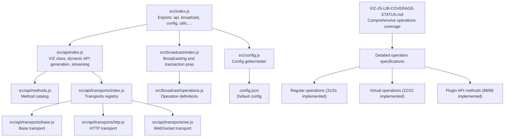
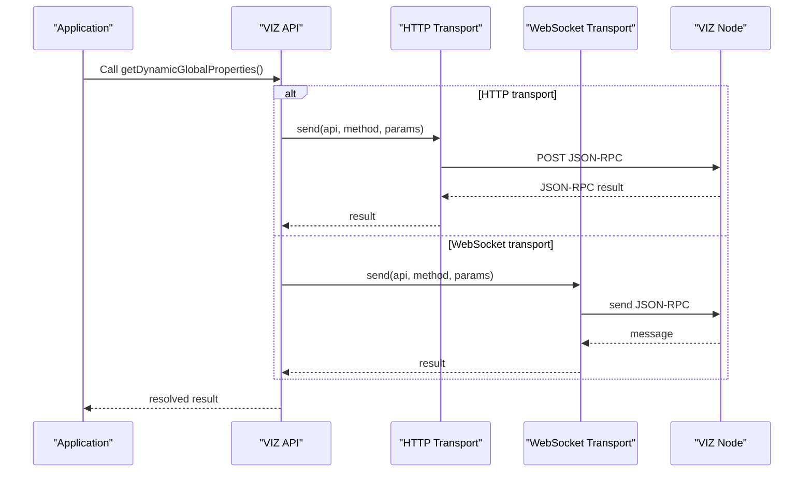
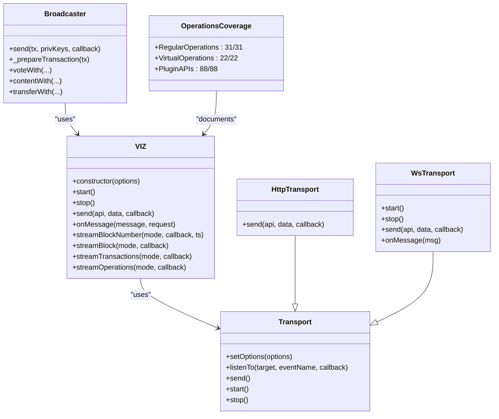
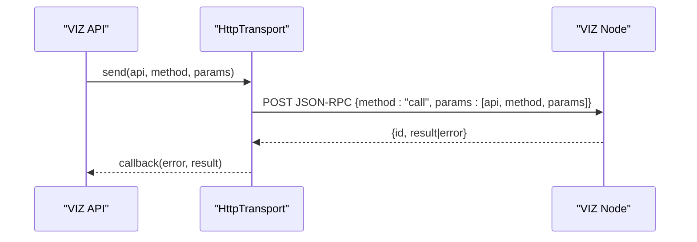
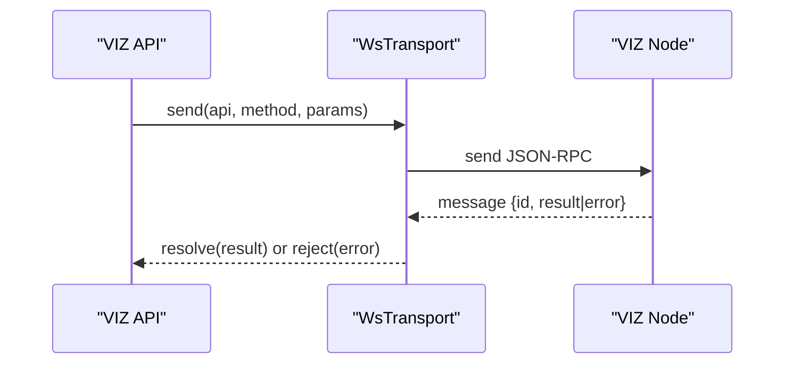
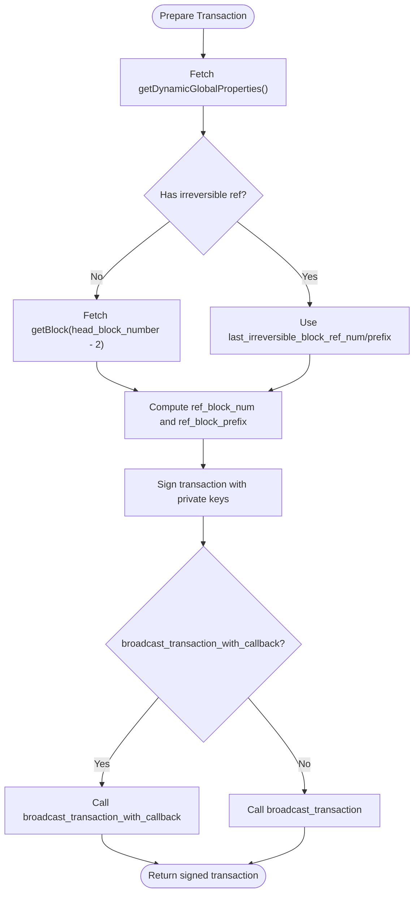
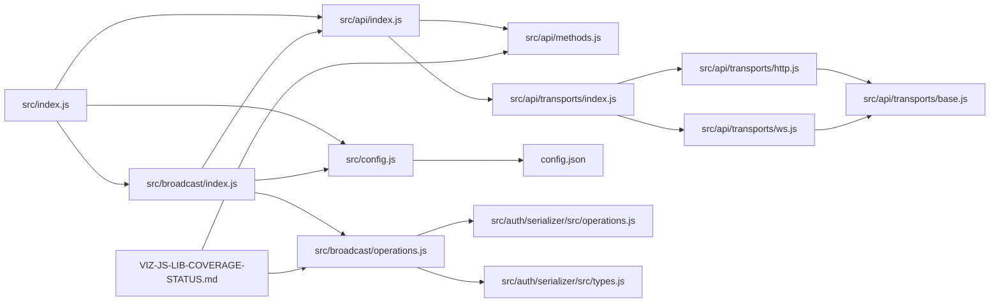
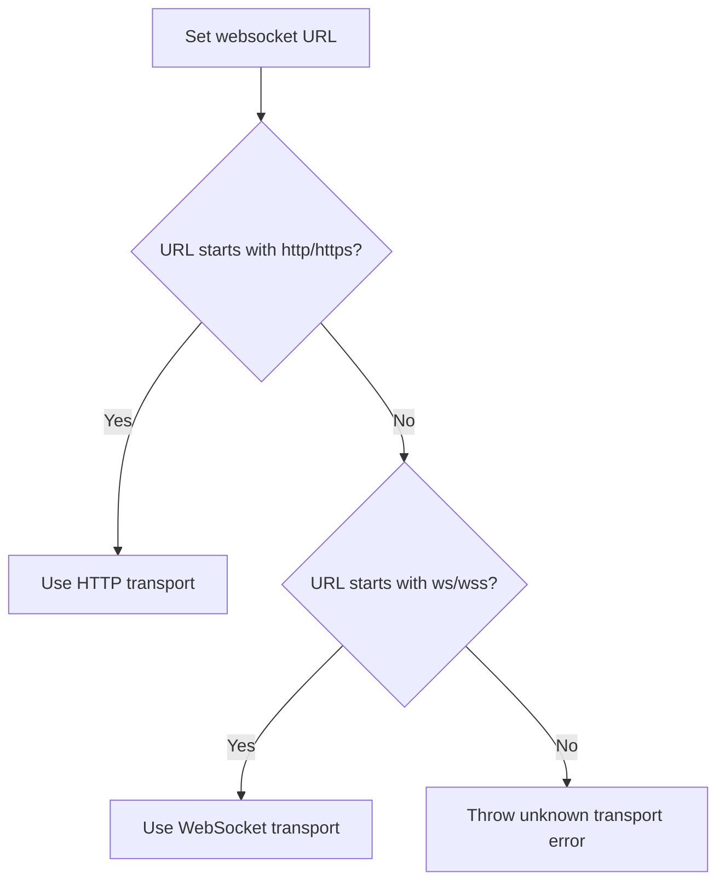

# API Reference

<cite>
**Referenced Files in This Document**
- [src/index.js](file://src/index.js)
- [src/api/index.js](file://src/api/index.js)
- [src/api/methods.js](file://src/api/methods.js)
- [src/api/transports/index.js](file://src/api/transports/index.js)
- [src/api/transports/base.js](file://src/api/transports/base.js)
- [src/api/transports/http.js](file://src/api/transports/http.js)
- [src/api/transports/ws.js](file://src/api/transports/ws.js)
- [src/broadcast/index.js](file://src/broadcast/index.js)
- [src/broadcast/operations.js](file://src/broadcast/operations.js)
- [src/config.js](file://src/config.js)
- [config.json](file://config.json)
- [examples/get-post-content.js](file://examples/get-post-content.js)
- [examples/test-vote.js](file://examples/test-vote.js)
- [test/api.test.js](file://test/api.test.js)
- [test/broadcast.test.js](file://test/broadcast.test.js)
- [VIZ-JS-LIB-COVERAGE-STATUS.md](file://VIZ-JS-LIB-COVERAGE-STATUS.md)
- [src/auth/serializer/src/operations.js](file://src/auth/serializer/src/operations.js)
- [src/auth/serializer/src/types.js](file://src/auth/serializer/src/types.js)
</cite>

## Update Summary
**Changes Made**
- Added comprehensive reference to VIZ-JS-LIB-COVERAGE-STATUS.md for detailed blockchain operations coverage
- Enhanced documentation with complete coverage statistics and operation specifications
- Updated API method index to reflect all supported operations and plugins
- Added detailed coverage status for regular operations, virtual operations, and plugin APIs

## Table of Contents
1. [Introduction](#introduction)
2. [Project Structure](#project-structure)
3. [Core Components](#core-components)
4. [Architecture Overview](#architecture-overview)
5. [Detailed Component Analysis](#detailed-component-analysis)
6. [Comprehensive Operations Coverage](#comprehensive-operations-coverage)
7. [Dependency Analysis](#dependency-analysis)
8. [Performance Considerations](#performance-considerations)
9. [Troubleshooting Guide](#troubleshooting-guide)
10. [Conclusion](#conclusion)
11. [Appendices](#appendices)

## Introduction
This document provides a comprehensive API reference for the VIZ JavaScript library. It covers public API methods for querying blockchain data and broadcasting transactions, transport implementations for HTTP and WebSocket, configuration and connection management, error handling, and best practices. The library maintains **100% coverage** of all VIZ blockchain operations as documented in the comprehensive operations coverage specification.

**Updated** Added reference to the comprehensive VIZ blockchain operations coverage document that provides detailed specifications for all supported blockchain operations and API methods.

## Project Structure
The VIZ library exposes a singleton API client and a broadcaster for signing and submitting transactions. Public APIs are dynamically generated from a method catalog. Transports encapsulate communication over HTTP or WebSocket. Configuration is centralized via a small config module.

**Diagram sources**
- [src/index.js](file://src/index.js#L1-L20)
- [src/api/index.js](file://src/api/index.js#L1-L271)
- [src/api/methods.js](file://src/api/methods.js#L1-L465)
- [src/api/transports/index.js](file://src/api/transports/index.js#L1-L8)
- [src/api/transports/base.js](file://src/api/transports/base.js#L1-L34)
- [src/api/transports/http.js](file://src/api/transports/http.js#L1-L53)
- [src/api/transports/ws.js](file://src/api/transports/ws.js#L1-L136)
- [src/broadcast/index.js](file://src/broadcast/index.js#L1-L137)
- [src/broadcast/operations.js](file://src/broadcast/operations.js#L1-L475)
- [src/config.js](file://src/config.js#L1-L10)
- [config.json](file://config.json#L1-L7)
- [VIZ-JS-LIB-COVERAGE-STATUS.md](file://VIZ-JS-LIB-COVERAGE-STATUS.md#L1-L357)

**Section sources**
- [src/index.js](file://src/index.js#L1-L20)
- [src/api/index.js](file://src/api/index.js#L1-L271)
- [src/api/transports/index.js](file://src/api/transports/index.js#L1-L8)
- [src/config.js](file://src/config.js#L1-L10)
- [config.json](file://config.json#L1-L7)
- [VIZ-JS-LIB-COVERAGE-STATUS.md](file://VIZ-JS-LIB-COVERAGE-STATUS.md#L1-L357)

## Core Components
- VIZ API client: Provides dynamic API methods, transport selection, connection lifecycle, and streaming utilities.
- HTTP transport: Sends JSON-RPC calls over HTTP to the configured endpoint.
- WebSocket transport: Manages a persistent connection for real-time updates and bidirectional messaging.
- Broadcast module: Prepares transactions, signs them, and submits them via the configured broadcast method.
- Config module: Centralized getter/setter for runtime configuration (e.g., websocket URL, chain settings).

Key capabilities:
- Dynamic API method generation from a method catalog.
- Automatic transport selection based on the configured URL scheme.
- Streaming helpers for blocks, transactions, and operations.
- Promise-based and callback-based invocation patterns.

**Section sources**
- [src/api/index.js](file://src/api/index.js#L21-L271)
- [src/api/methods.js](file://src/api/methods.js#L1-L465)
- [src/api/transports/http.js](file://src/api/transports/http.js#L1-L53)
- [src/api/transports/ws.js](file://src/api/transports/ws.js#L1-L136)
- [src/broadcast/index.js](file://src/broadcast/index.js#L1-L137)
- [src/config.js](file://src/config.js#L1-L10)
- [config.json](file://config.json#L1-L7)

## Architecture Overview
The VIZ client composes a transport layer (HTTP or WebSocket) with a method catalog to expose a fluent API. Broadcasting leverages the API client to fetch chain props and block data, then signs and submits transactions.

**Diagram sources**
- [src/api/index.js](file://src/api/index.js#L98-L119)
- [src/api/transports/http.js](file://src/api/transports/http.js#L43-L52)
- [src/api/transports/ws.js](file://src/api/transports/ws.js#L64-L94)

## Detailed Component Analysis

### VIZ API Client
Responsibilities:
- Dynamically generates API methods from the method catalog.
- Selects transport based on the configured websocket URL scheme.
- Starts/stops transport connections and manages in-flight requests.
- Emits performance metrics and handles errors from transport messages.
- Provides streaming helpers for block numbers, blocks, transactions, and operations.

Public methods (selected):
- getAccounts(accountNames): Returns account objects by names.
- getDynamicGlobalProperties(): Returns global chain properties.
- getAccountVotes(voter, from, voteLimit): Returns votes by an account.
- streamBlockNumber(mode, callback, interval): Streams block numbers.
- streamBlock(mode, callback): Streams full blocks.
- streamTransactions(mode, callback): Streams transactions.
- streamOperations(mode, callback): Streams operations.

Usage patterns:
- Callback-based: viz.getAccounts(names, cb)
- Promise-based: viz.getAccountsAsync(names)
- Streaming: viz.streamBlockNumber(cb) with returned release function.

Error handling:
- Transport errors propagate as JavaScript Error instances.
- WebSocket transport rejects inflight requests on close or error.

**Section sources**
- [src/api/index.js](file://src/api/index.js#L21-L271)
- [src/api/methods.js](file://src/api/methods.js#L253-L274)
- [test/api.test.js](file://test/api.test.js#L42-L78)

### HTTP Transport
Behavior:
- Sends JSON-RPC 2.0 calls via POST to the configured websocket URL (used as a generic RPC endpoint).
- Validates response ID and propagates RPC errors.
- Returns results via callback.

Parameters:
- api: API namespace (e.g., database_api).
- method: Method name (e.g., get_accounts).
- params: Array of parameters.

Returns:
- Callback receives (error, result).

Errors:
- Network errors mapped to Error with HTTP status text.
- RPC errors mapped to Error with code/data.

**Section sources**
- [src/api/transports/http.js](file://src/api/transports/http.js#L17-L41)
- [src/api/transports/http.js](file://src/api/transports/http.js#L43-L52)

### WebSocket Transport
Behavior:
- Establishes a WebSocket connection on demand.
- Tracks in-flight requests by message ID.
- Handles open, message, error, and close events.
- Emits performance metrics and resolves/rejects promises accordingly.

Parameters:
- api: API namespace.
- method: Method name.
- params: Array of parameters.

Returns:
- Promise resolving to result or rejecting on error.

Errors:
- Connection close triggers rejection of pending requests.
- RPC errors propagate with payload attached.

**Section sources**
- [src/api/transports/ws.js](file://src/api/transports/ws.js#L18-L136)

### Broadcast Module
Responsibilities:
- Prepares transactions with chain props and expiration.
- Signs transactions using private keys.
- Submits transactions via broadcast_transaction or broadcast_transaction_with_callback depending on config.
- Generates convenience wrappers for operations (e.g., vote, content, transfer).

Key methods:
- send(tx, privKeys, callback): Signs and broadcasts a prepared transaction.
- _prepareTransaction(tx): Injects expiration, ref_block_num, and ref_block_prefix.
- voteWith(wif, options, callback), contentWith(wif, options, callback), transferWith(wif, options, callback), etc.

Parameters:
- privKeys: Object mapping roles to private keys (WIF).
- options: Operation-specific parameters (e.g., voter, author, permlink, weight).

Returns:
- Transaction object with signatures on success.

**Section sources**
- [src/broadcast/index.js](file://src/broadcast/index.js#L24-L84)
- [src/broadcast/index.js](file://src/broadcast/index.js#L97-L129)
- [src/broadcast/operations.js](file://src/broadcast/operations.js#L1-L475)
- [test/broadcast.test.js](file://test/broadcast.test.js#L33-L120)

### Configuration and Connection Management
Configuration:
- websocket: Target endpoint URL (scheme determines transport).
- address_prefix: Chain address prefix.
- chain_id: Chain identifier.
- broadcast_transaction_with_callback: Toggle broadcast mode.

Runtime management:
- setWebSocket(url): Deprecated; sets websocket URL and resets transport.
- start(): Initializes transport based on current websocket URL.
- stop(): Closes transport and clears state.

Defaults:
- config.json provides default values.

**Section sources**
- [src/config.js](file://src/config.js#L1-L10)
- [config.json](file://config.json#L1-L7)
- [src/api/index.js](file://src/api/index.js#L44-L62)
- [src/api/index.js](file://src/api/index.js#L52-L62)

### Relationship Between Endpoints
- getDynamicGlobalProperties is used by the broadcaster to set transaction expiration and reference block fields.
- getAccounts and getAccountVotes are used to validate identities and voting power before broadcasting.
- Streaming endpoints (blocks, transactions, operations) rely on getDynamicGlobalProperties to determine head vs irreversible block modes.

**Section sources**
- [src/broadcast/index.js](file://src/broadcast/index.js#L50-L84)
- [src/api/methods.js](file://src/api/methods.js#L253-L274)
- [src/api/index.js](file://src/api/index.js#L121-L191)

## Comprehensive Operations Coverage

**Updated** The VIZ JavaScript library maintains comprehensive coverage of all VIZ blockchain operations as documented in the detailed operations coverage specification.

### Full Coverage Statistics
The library achieves **100% coverage** across all operation categories:

- **Regular Operations**: 31/31 implemented (100%)
- **Virtual Operations**: 22/22 implemented (100%)
- **Plugin API Methods**: 88/88 implemented (100%)

### Regular Operations (Broadcastable)
All user-broadcastable operations are fully implemented with complete serializer support:

| ID | Operation | Auth | Status | Serializer | Broadcast |
|----|-----------|------|--------|------------|-----------|
| 0 | `vote` *(deprecated)* | regular | ✅ Complete | ✅ | ✅ |
| 1 | `content` *(deprecated)* | regular | ✅ Complete | ✅ | ✅ |
| 2 | `transfer` | active/master | ✅ Complete | ✅ | ✅ |
| 3 | `transfer_to_vesting` | active | ✅ Complete | ✅ | ✅ |
| 4 | `withdraw_vesting` | active | ✅ Complete | ✅ | ✅ |
| 5 | `account_update` | master/active | ✅ Complete | ✅ | ✅ |
| 6 | `witness_update` | active | ✅ Complete | ✅ | ✅ |
| 7 | `account_witness_vote` | active | ✅ Complete | ✅ | ✅ |
| 8 | `account_witness_proxy` | active | ✅ Complete | ✅ | ✅ |
| 9 | `delete_content` *(deprecated)* | regular | ✅ Complete | ✅ | ✅ |
| 10 | `custom` | active/regular | ✅ Complete | ✅ | ✅ |
| 11 | `set_withdraw_vesting_route` | active | ✅ Complete | ✅ | ✅ |
| 12 | `request_account_recovery` | active | ✅ Complete | ✅ | ✅ |
| 13 | `recover_account` | master×2 | ✅ Complete | ✅ | ✅ |
| 14 | `change_recovery_account` | master | ✅ Complete | ✅ | ✅ |
| 15 | `escrow_transfer` | active | ✅ Complete | ✅ | ✅ |
| 16 | `escrow_dispute` | active | ✅ Complete | ✅ | ✅ |
| 17 | `escrow_release` | active | ✅ Complete | ✅ | ✅ |
| 18 | `escrow_approve` | active | ✅ Complete | ✅ | ✅ |
| 19 | `delegate_vesting_shares` | active | ✅ Complete | ✅ | ✅ |
| 20 | `account_create` | active | ✅ Complete | ✅ | ✅ |
| 21 | `account_metadata` | regular | ✅ Complete | ✅ | ✅ |
| 22 | `proposal_create` | active | ✅ Complete | ✅ | ✅ |
| 23 | `proposal_update` | varies | ✅ Complete | ✅ | ✅ |
| 24 | `proposal_delete` | active | ✅ Complete | ✅ | ✅ |
| 25 | `chain_properties_update` | active | ✅ Complete | ✅ | ✅ |
| 35 | `committee_worker_create_request` | regular | ✅ Complete | ✅ | ✅ |
| 36 | `committee_worker_cancel_request` | regular | ✅ Complete | ✅ | ✅ |
| 37 | `committee_vote_request` | regular | ✅ Complete | ✅ | ✅ |
| 43 | `create_invite` | active | ✅ Complete | ✅ | ✅ |
| 44 | `claim_invite_balance` | active | ✅ Complete | ✅ | ✅ |
| 45 | `invite_registration` | active | ✅ Complete | ✅ | ✅ |
| 46 | `versioned_chain_properties_update` | active | ✅ Complete | ✅ | ✅ |
| 47 | `award` | regular | ✅ Complete | ✅ | ✅ |
| 50 | `set_paid_subscription` | active | ✅ Complete | ✅ | ✅ |
| 51 | `paid_subscribe` | active | ✅ Complete | ✅ | ✅ |
| 54 | `set_account_price` | master | ✅ Complete | ✅ | ✅ |
| 55 | `set_subaccount_price` | master | ✅ Complete | ✅ | ✅ |
| 56 | `buy_account` | active | ✅ Complete | ✅ | ✅ |
| 58 | `use_invite_balance` | active | ✅ Complete | ✅ | ✅ |
| 60 | `fixed_award` | regular | ✅ Complete | ✅ | ✅ |
| 61 | `target_account_sale` | master | ✅ Complete | ✅ | ✅ |

### Virtual Operations (Read-Only)
All virtual operations have complete serializer definitions for parsing:

| ID | Operation | Trigger | Status | Serializer |
|----|-----------|---------|--------|------------|
| 26 | `author_reward` | Content payout | ✅ Complete | ✅ |
| 27 | `curation_reward` | Content payout | ✅ Complete | ✅ |
| 28 | `content_reward` | Content payout | ✅ Complete | ✅ |
| 29 | `fill_vesting_withdraw` | Withdrawal interval | ✅ Complete | ✅ |
| 30 | `shutdown_witness` | Witness deactivated | ✅ Complete | ✅ |
| 31 | `hardfork` | Hardfork activation | ✅ Complete | ✅ |
| 32 | `content_payout_update` | Content payout update | ✅ Complete | ✅ |
| 33 | `content_benefactor_reward` | Content payout | ✅ Complete | ✅ |
| 34 | `return_vesting_delegation` | Delegation limbo ends | ✅ Complete | ✅ |
| 38 | `committee_cancel_request` | Request expires | ✅ Complete | ✅ |
| 39 | `committee_approve_request` | Request approved | ✅ Complete | ✅ |
| 40 | `committee_payout_request` | Payout processed | ✅ Complete | ✅ |
| 41 | `committee_pay_request` | Worker paid | ✅ Complete | ✅ |
| 42 | `witness_reward` | Block produced | ✅ Complete | ✅ |
| 48 | `receive_award` | Award given | ✅ Complete | ✅ |
| 49 | `benefactor_award` | Award with beneficiary | ✅ Complete | ✅ |
| 52 | `paid_subscription_action` | Subscription payment | ✅ Complete | ✅ |
| 53 | `cancel_paid_subscription` | Subscription ends | ✅ Complete | ✅ |
| 57 | `account_sale` | Account sold | ✅ Complete | ✅ |
| 59 | `expire_escrow_ratification` | Escrow deadline missed | ✅ Complete | ✅ |
| 62 | `bid` | Bid placed (HF11) | ✅ Complete | ✅ |
| 63 | `outbid` | Outbid (HF11) | ✅ Complete | ✅ |

### Plugin API Coverage
The library provides comprehensive coverage of all VIZ plugin APIs:

#### database_api (Active)
- `get_block_header` ✅
- `get_block` ✅
- `get_irreversible_block_header` ✅
- `get_irreversible_block` ✅
- `set_block_applied_callback` ✅ (WebSocket subscription)
- `get_config` ✅
- `get_dynamic_global_properties` ✅
- `get_chain_properties` ✅
- `get_hardfork_version` ✅
- `get_next_scheduled_hardfork` ✅
- `get_accounts` ✅
- `lookup_account_names` ✅
- `lookup_accounts` ✅
- `get_account_count` ✅
- `get_owner_history` ✅ (Legacy naming)
- `get_master_history` ✅ (Current naming)
- `get_recovery_request` ✅
- `get_escrow` ✅
- `get_withdraw_routes` ✅
- `get_vesting_delegations` ✅
- `get_expiring_vesting_delegations` ✅
- `get_transaction_hex` ✅
- `get_required_signatures` ✅
- `get_potential_signatures` ✅
- `verify_authority` ✅
- `verify_account_authority` ✅
- `get_database_info` ✅
- `get_proposed_transaction` ✅
- `get_proposed_transactions` ✅
- `get_accounts_on_sale` ✅
- `get_accounts_on_auction` ✅
- `get_subaccounts_on_sale` ✅

#### network_broadcast_api (Active)
- `broadcast_transaction` ✅ (Async broadcast)
- `broadcast_transaction_synchronous` ✅ (Wait for inclusion)
- `broadcast_transaction_with_callback` ✅ (Callback on confirm)
- `broadcast_block` ✅ (For witnesses)

#### witness_api (Active)
- `get_active_witnesses` ✅
- `get_witness_schedule` ✅
- `get_witnesses` ✅
- `get_witness_by_account` ✅
- `get_witnesses_by_vote` ✅
- `get_witnesses_by_counted_vote` ✅
- `get_witness_count` ✅
- `lookup_witness_accounts` ✅
- `get_miner_queue` ✅

#### Other Active Plugins
- **account_by_key**: `get_key_references` ✅
- **account_history**: `get_account_history` ✅
- **operation_history**: `get_ops_in_block` ✅, `get_transaction` ✅
- **committee_api**: `get_committee_request` ✅, `get_committee_request_votes` ✅, `get_committee_requests_list` ✅
- **invite_api**: `get_invites_list` ✅, `get_invite_by_id` ✅, `get_invite_by_key` ✅
- **paid_subscription_api**: `get_paid_subscriptions` ✅, `get_paid_subscription_options` ✅, `get_paid_subscription_status` ✅, `get_active_paid_subscriptions` ✅, `get_inactive_paid_subscriptions` ✅
- **custom_protocol_api**: `get_account` ✅
- **auth_util**: `check_authority_signature` ✅
- **block_info**: `get_block_info` ✅, `get_blocks_with_info` ✅
- **raw_block**: `get_raw_block` ✅

#### Deprecated Plugins
- **follow**: 9 methods (Deprecated)
- **tags**: 15 methods (Deprecated)
- **social_network**: 6 methods (Deprecated)
- **private_message**: 0 methods (Deprecated - Not Implemented)

**Section sources**
- [VIZ-JS-LIB-COVERAGE-STATUS.md](file://VIZ-JS-LIB-COVERAGE-STATUS.md#L1-L357)
- [src/broadcast/operations.js](file://src/broadcast/operations.js#L1-L475)
- [src/api/methods.js](file://src/api/methods.js#L1-L465)

## Architecture Overview

**Diagram sources**
- [src/api/index.js](file://src/api/index.js#L21-L271)
- [src/api/transports/base.js](file://src/api/transports/base.js#L4-L31)
- [src/api/transports/http.js](file://src/api/transports/http.js#L43-L52)
- [src/api/transports/ws.js](file://src/api/transports/ws.js#L18-L136)
- [src/broadcast/index.js](file://src/broadcast/index.js#L24-L129)
- [VIZ-JS-LIB-COVERAGE-STATUS.md](file://VIZ-JS-LIB-COVERAGE-STATUS.md#L8-L16)

## Detailed Component Analysis

### API Methods Catalog and Generation
The VIZ client dynamically creates API methods from a catalog. Each entry defines:
- api: API namespace (e.g., database_api).
- method: Method name (e.g., get_accounts).
- params: Ordered parameter names used to build typed method signatures.

Generated methods:
- fooWith(options, callback): Accepts an options object with named parameters.
- foo(...args, callback): Accepts positional arguments matching the method's params.

Examples of generated methods:
- getAccounts(accountNames)
- getDynamicGlobalProperties()
- getAccountVotes(voter, from, voteLimit)

**Section sources**
- [src/api/methods.js](file://src/api/methods.js#L1-L465)
- [src/api/index.js](file://src/api/index.js#L239-L262)

### HTTP Transport Flow

**Diagram sources**
- [src/api/transports/http.js](file://src/api/transports/http.js#L17-L41)
- [src/api/transports/http.js](file://src/api/transports/http.js#L43-L52)

### WebSocket Transport Flow

**Diagram sources**
- [src/api/transports/ws.js](file://src/api/transports/ws.js#L64-L94)
- [src/api/transports/ws.js](file://src/api/transports/ws.js#L111-L134)

### Streaming Utilities
- streamBlockNumber(mode, callback, interval): Periodically queries getDynamicGlobalProperties and emits new block numbers.
- streamBlock(mode, callback): Streams full blocks by polling streamBlockNumber and fetching blocks.
- streamTransactions(mode, callback): Streams transactions from blocks.
- streamOperations(mode, callback): Streams operations from transactions.

Implementation notes:
- mode supports "head" and "irreversible".
- Polling interval defaults to 200 ms.

**Section sources**
- [src/api/index.js](file://src/api/index.js#L121-L191)
- [src/api/index.js](file://src/api/index.js#L193-L235)

### Broadcast Workflow

**Diagram sources**
- [src/broadcast/index.js](file://src/broadcast/index.js#L49-L84)
- [src/broadcast/index.js](file://src/broadcast/index.js#L24-L47)

### Authentication and Keys
- Private keys are provided as WIF strings keyed by role (e.g., regular, active, master).
- Signing is delegated to the auth module; the broadcaster constructs operations and attaches metadata as needed.

**Section sources**
- [src/broadcast/index.js](file://src/broadcast/index.js#L97-L129)
- [src/broadcast/operations.js](file://src/broadcast/operations.js#L1-L475)

### Rate Limiting and Best Practices
- Prefer WebSocket transport for frequent or real-time usage to reduce overhead.
- Batch requests where possible; use streaming helpers for continuous monitoring.
- Respect node rate limits; avoid flooding with rapid successive calls.
- Use irreversible mode for non-critical reads to minimize reorg impact.

## Dependency Analysis

**Diagram sources**
- [src/index.js](file://src/index.js#L1-L20)
- [src/api/index.js](file://src/api/index.js#L1-L271)
- [src/api/methods.js](file://src/api/methods.js#L1-L465)
- [src/api/transports/index.js](file://src/api/transports/index.js#L1-L8)
- [src/api/transports/http.js](file://src/api/transports/http.js#L1-L53)
- [src/api/transports/ws.js](file://src/api/transports/ws.js#L1-L136)
- [src/api/transports/base.js](file://src/api/transports/base.js#L1-L34)
- [src/broadcast/index.js](file://src/broadcast/index.js#L1-L137)
- [src/broadcast/operations.js](file://src/broadcast/operations.js#L1-L475)
- [src/config.js](file://src/config.js#L1-L10)
- [config.json](file://config.json#L1-L7)
- [src/auth/serializer/src/operations.js](file://src/auth/serializer/src/operations.js#L1-L55)
- [src/auth/serializer/src/types.js](file://src/auth/serializer/src/types.js#L478-L719)
- [VIZ-JS-LIB-COVERAGE-STATUS.md](file://VIZ-JS-LIB-COVERAGE-STATUS.md#L1-L357)

**Section sources**
- [src/index.js](file://src/index.js#L1-L20)
- [src/api/transports/index.js](file://src/api/transports/index.js#L1-L8)

## Performance Considerations
- WebSocket transport reduces latency and overhead compared to repeated HTTP requests.
- Streaming utilities poll at fixed intervals; adjust interval based on needs.
- Use Promise-based APIs for easier composition and error handling.
- Cache frequently accessed chain properties locally to minimize round trips.

## Troubleshooting Guide
Common issues and resolutions:
- Unknown transport URL: Ensure the websocket URL starts with http/https for HTTP or ws/wss for WebSocket.
- Connection errors: Verify node availability and network connectivity; WebSocket errors trigger rejections of in-flight requests.
- Missing or invalid credentials: Broadcasting requires valid private keys for the required roles.
- Rate limiting: Reduce request frequency or switch to WebSocket for efficient updates.

Operational checks:
- Confirm websocket URL is set before invoking methods.
- Monitor emitted performance events for slow endpoints.
- Use streaming helpers to validate connectivity and data flow.

**Section sources**
- [src/api/index.js](file://src/api/index.js#L34-L42)
- [src/api/transports/ws.js](file://src/api/transports/ws.js#L96-L109)
- [test/api.test.js](file://test/api.test.js#L168-L200)

## Conclusion
The VIZ JavaScript library offers a robust, transport-agnostic API for querying blockchain data and broadcasting transactions. With **100% coverage** of all VIZ blockchain operations, the library provides comprehensive support for both regular and virtual operations, along with complete plugin API coverage. By leveraging dynamic method generation, configurable transports, and streaming utilities, applications can efficiently integrate with the VIZ blockchain. The comprehensive operations coverage documentation ensures developers have detailed specifications for all supported blockchain operations and API methods.

## Appendices

### API Method Index
- getAccounts(accountNames)
- getDynamicGlobalProperties()
- getAccountVotes(voter, from, voteLimit)
- getContent(author, permlink)
- getFollowers(following, startFollower, followType, limit)
- getBlog(account, entryId, limit)
- getFeed(account, entryId, limit)
- getActiveVotes(author, permlink, voteLimit)
- getBlockHeader(blockNum)
- getBlock(blockNum)
- broadcast_transaction(trx)
- broadcast_transaction_with_callback(confirmationCallback, trx)
- broadcast_transaction_synchronous(trx)
- broadcast_block(block)

**Section sources**
- [src/api/methods.js](file://src/api/methods.js#L253-L274)
- [src/api/methods.js](file://src/api/methods.js#L139-L161)
- [src/api/methods.js](file://src/api/methods.js#L138-L156)
- [src/api/methods.js](file://src/api/methods.js#L163-L181)
- [src/api/methods.js](file://src/api/methods.js#L356-L374)

### Transport Selection Logic

**Diagram sources**
- [src/api/index.js](file://src/api/index.js#L34-L42)

### Practical Examples
- Query post content:
  - See [examples/get-post-content.js](file://examples/get-post-content.js#L1-L5)
- Upvote via broadcast:
  - See [examples/test-vote.js](file://examples/test-vote.js#L1-L19)

**Section sources**
- [examples/get-post-content.js](file://examples/get-post-content.js#L1-L5)
- [examples/test-vote.js](file://examples/test-vote.js#L1-L19)

### Operations Coverage Reference
For detailed specifications of all supported blockchain operations and API methods, refer to the comprehensive operations coverage documentation:

**Section sources**
- [VIZ-JS-LIB-COVERAGE-STATUS.md](file://VIZ-JS-LIB-COVERAGE-STATUS.md#L1-L357)
- [src/broadcast/operations.js](file://src/broadcast/operations.js#L1-L475)
- [src/api/methods.js](file://src/api/methods.js#L1-L465)