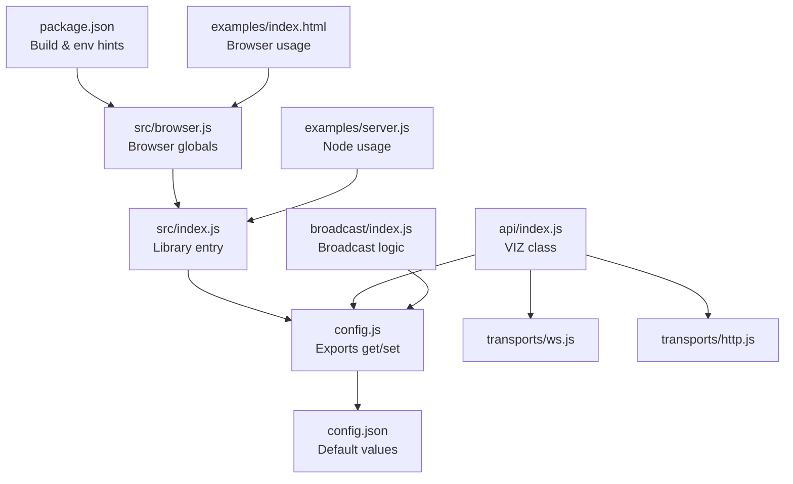
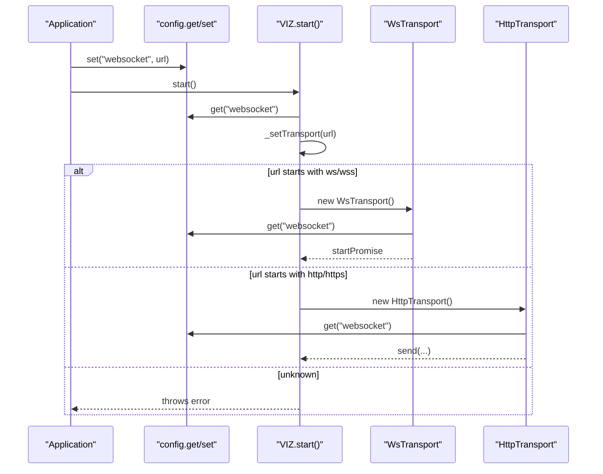
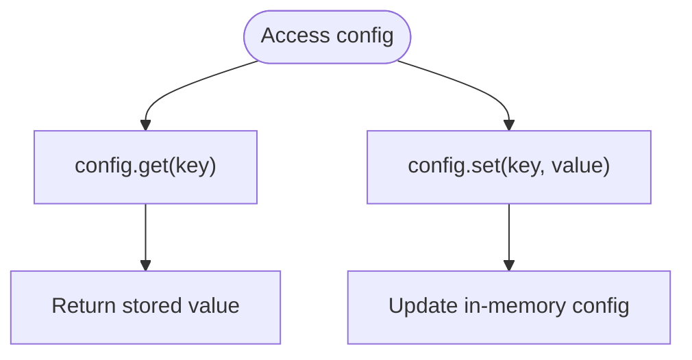
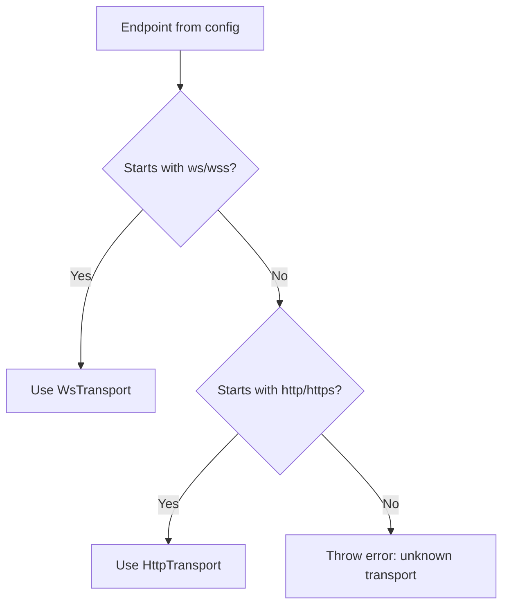
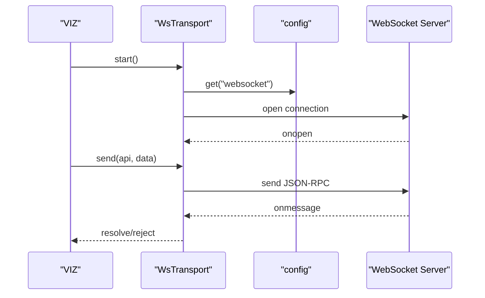
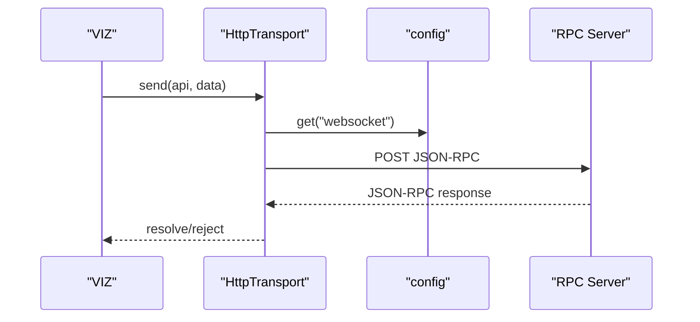
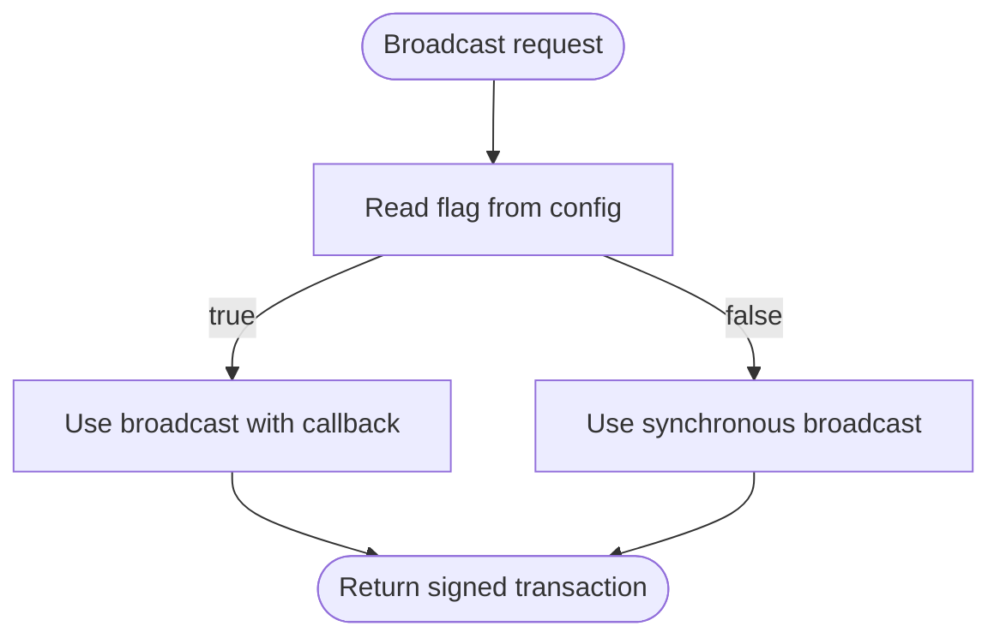
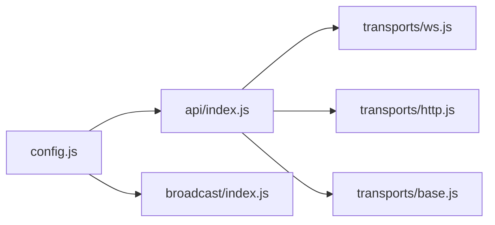

# Configuration Options

<cite>
**Referenced Files in This Document**
- [config.js](file://src/config.js)
- [config.json](file://config.json)
- [index.js](file://src/index.js)
- [browser.js](file://src/browser.js)
- [api/index.js](file://src/api/index.js)
- [api/transports/base.js](file://src/api/transports/base.js)
- [api/transports/ws.js](file://src/api/transports/ws.js)
- [api/transports/http.js](file://src/api/transports/http.js)
- [broadcast/index.js](file://src/broadcast/index.js)
- [package.json](file://package.json)
- [examples/index.html](file://examples/index.html)
- [examples/server.js](file://examples/server.js)
</cite>

## Table of Contents
1. [Introduction](#introduction)
2. [Project Structure](#project-structure)
3. [Core Components](#core-components)
4. [Architecture Overview](#architecture-overview)
5. [Detailed Component Analysis](#detailed-component-analysis)
6. [Dependency Analysis](#dependency-analysis)
7. [Performance Considerations](#performance-considerations)
8. [Troubleshooting Guide](#troubleshooting-guide)
9. [Conclusion](#conclusion)
10. [Appendices](#appendices)

## Introduction
This document explains the configuration system of the VIZ JavaScript library. It covers all configurable parameters, default values, and how they are resolved and applied across transports and broadcasting. It also documents environment-specific behavior (browser vs Node.js), security-related settings, and provides practical guidance for programmatic configuration changes, validation, and performance tuning.

## Project Structure
The configuration system centers around a small, shared configuration module that exposes getter/setter functions. Defaults are loaded from a JSON file and can be overridden at runtime. The API module reads the configured endpoint to select a transport (WebSocket or HTTP), while the broadcaster consults a boolean flag to choose the appropriate broadcast method.

**Diagram sources**
- [config.js](file://src/config.js#L1-L10)
- [config.json](file://config.json#L1-L7)
- [index.js](file://src/index.js#L1-L20)
- [browser.js](file://src/browser.js#L1-L30)
- [package.json](file://package.json#L15-L18)
- [api/index.js](file://src/api/index.js#L1-L271)
- [api/transports/ws.js](file://src/api/transports/ws.js#L1-L136)
- [api/transports/http.js](file://src/api/transports/http.js#L1-L53)
- [broadcast/index.js](file://src/broadcast/index.js#L1-L137)
- [examples/index.html](file://examples/index.html#L1-L23)
- [examples/server.js](file://examples/server.js#L1-L34)

**Section sources**
- [config.js](file://src/config.js#L1-L10)
- [config.json](file://config.json#L1-L7)
- [index.js](file://src/index.js#L1-L20)
- [browser.js](file://src/browser.js#L1-L30)
- [package.json](file://package.json#L15-L18)
- [examples/index.html](file://examples/index.html#L1-L23)
- [examples/server.js](file://examples/server.js#L1-L34)

## Core Components
- Configuration module: Provides a simple key-value store with get and set functions backed by defaults loaded from config.json.
- Defaults: Address prefix, chain ID, and broadcast behavior are defined centrally.
- API module: Reads the configured endpoint to dynamically select a transport (WebSocket or HTTP) and manages lifecycle.
- Transports: WebSocket transport uses the configured endpoint; HTTP transport uses the same endpoint for JSON-RPC calls.
- Broadcast module: Uses a boolean flag to choose synchronous or callback-based broadcast.

Key configuration parameters:
- websocket: Endpoint URL for the node (WebSocket or HTTP). Used by both transports.
- address_prefix: Chain identifier prefix used in address encoding.
- chain_id: Unique chain identifier for signing and verification.
- broadcast_transaction_with_callback: Boolean switch controlling broadcast method selection.

**Section sources**
- [config.js](file://src/config.js#L1-L10)
- [config.json](file://config.json#L1-L7)
- [api/index.js](file://src/api/index.js#L34-L62)
- [api/transports/ws.js](file://src/api/transports/ws.js#L34-L48)
- [api/transports/http.js](file://src/api/transports/http.js#L48-L51)
- [broadcast/index.js](file://src/broadcast/index.js#L41-L43)

## Architecture Overview
The configuration system is intentionally minimal and centralized. Defaults are loaded once and can be overridden at runtime. The API module inspects the configured endpoint to determine the transport type and delegates all communication to the selected transport. Broadcasting logic reads a boolean flag to decide which broadcast method to use.

**Diagram sources**
- [api/index.js](file://src/api/index.js#L34-L62)
- [api/transports/ws.js](file://src/api/transports/ws.js#L34-L48)
- [api/transports/http.js](file://src/api/transports/http.js#L48-L51)

## Detailed Component Analysis

### Configuration Module
- Purpose: Provide a shared configuration store with get and set.
- Behavior: Loads defaults from config.json and exposes functions to read/write keys.
- Scope: Shared across API, transports, and broadcast modules.

**Diagram sources**
- [config.js](file://src/config.js#L3-L9)
- [config.json](file://config.json#L1-L7)

**Section sources**
- [config.js](file://src/config.js#L1-L10)
- [config.json](file://config.json#L1-L7)

### Defaults and Environment
- Defaults are defined in config.json and consumed by the configuration module.
- package.json includes browser field entries indicating that certain Node-specific modules are disabled in the browser bundle, which affects transport availability and behavior.

Environment-specific notes:
- Browser builds disable certain Node-specific modules via the browser field, influencing WebSocket availability and polyfills.
- The WebSocket transport selects the appropriate WebSocket class depending on the environment (Node vs browser).

**Section sources**
- [config.json](file://config.json#L1-L7)
- [package.json](file://package.json#L15-L18)
- [api/transports/ws.js](file://src/api/transports/ws.js#L8-L14)

### API Transport Selection
- The API module determines the transport based on the configured endpoint:
  - If the URL matches WebSocket protocols, it uses the WebSocket transport.
  - If it matches HTTP protocols, it uses the HTTP transport.
  - Otherwise, it throws an error.
- The transport instances read the configured endpoint to connect or issue requests.

**Diagram sources**
- [api/index.js](file://src/api/index.js#L34-L42)
- [api/transports/ws.js](file://src/api/transports/ws.js#L34-L48)
- [api/transports/http.js](file://src/api/transports/http.js#L48-L51)

**Section sources**
- [api/index.js](file://src/api/index.js#L34-L62)
- [api/transports/base.js](file://src/api/transports/base.js#L1-L34)

### WebSocket Transport
- Creates a WebSocket connection using the configured endpoint.
- Manages lifecycle events (open, error, close) and request queuing.
- Sends JSON-RPC messages and handles responses.

**Diagram sources**
- [api/transports/ws.js](file://src/api/transports/ws.js#L27-L94)

**Section sources**
- [api/transports/ws.js](file://src/api/transports/ws.js#L1-L136)

### HTTP Transport
- Issues JSON-RPC POST requests against the configured endpoint.
- Enforces CORS and validates response integrity.

**Diagram sources**
- [api/transports/http.js](file://src/api/transports/http.js#L43-L52)

**Section sources**
- [api/transports/http.js](file://src/api/transports/http.js#L1-L53)

### Broadcast Configuration
- The broadcaster conditionally chooses between two broadcast methods based on a boolean flag.
- The flag is read from configuration, enabling or disabling callback-based broadcasting.

**Diagram sources**
- [broadcast/index.js](file://src/broadcast/index.js#L41-L43)

**Section sources**
- [broadcast/index.js](file://src/broadcast/index.js#L1-L137)

### Programmatic Configuration Changes
- To change the endpoint, use the configuration setter with the key for the endpoint.
- After changing the endpoint, restart the API to apply the new transport selection.
- Example usage patterns are shown in the included examples for browser and Node environments.

Practical steps:
- Set the endpoint: configure the endpoint key to the desired URL.
- Verify transport selection: start the API and observe which transport is used.
- Restart after changes: stop and start the API to reinitialize the transport.

**Section sources**
- [config.js](file://src/config.js#L5-L8)
- [api/index.js](file://src/api/index.js#L44-L62)
- [examples/index.html](file://examples/index.html#L10-L20)
- [examples/server.js](file://examples/server.js#L1-L34)

### Security-Related Settings
- address_prefix and chain_id are part of the default configuration and are used during signing and verification routines elsewhere in the library. They ensure signatures are bound to the correct chain and address format.
- The endpoint configuration itself does not include TLS settings; however, secure variants (wss, https) should be used to protect communications.

**Section sources**
- [config.json](file://config.json#L3-L4)
- [api/transports/ws.js](file://src/api/transports/ws.js#L34-L48)
- [api/transports/http.js](file://src/api/transports/http.js#L19-L27)

### Environment-Specific Behavior (Browser vs Node.js)
- The browser build disables certain Node-specific modules via the browser field in package.json.
- The WebSocket transport selects the appropriate WebSocket class depending on the environment (Node vs browser).
- The HTTP transport relies on cross-fetch, which is designed to work in both environments.

**Section sources**
- [package.json](file://package.json#L15-L18)
- [api/transports/ws.js](file://src/api/transports/ws.js#L8-L14)
- [api/transports/http.js](file://src/api/transports/http.js#L1-L2)

## Dependency Analysis
The configuration module is a thin layer that underpins the API and broadcast modules. The API module depends on configuration for transport selection and lifecycle management. The transport modules depend on configuration for the endpoint. The broadcast module depends on configuration for the broadcast method.

**Diagram sources**
- [config.js](file://src/config.js#L1-L10)
- [api/index.js](file://src/api/index.js#L1-L271)
- [broadcast/index.js](file://src/broadcast/index.js#L1-L137)
- [api/transports/base.js](file://src/api/transports/base.js#L1-L34)
- [api/transports/ws.js](file://src/api/transports/ws.js#L1-L136)
- [api/transports/http.js](file://src/api/transports/http.js#L1-L53)

**Section sources**
- [config.js](file://src/config.js#L1-L10)
- [api/index.js](file://src/api/index.js#L1-L271)
- [broadcast/index.js](file://src/broadcast/index.js#L1-L137)
- [api/transports/base.js](file://src/api/transports/base.js#L1-L34)

## Performance Considerations
- Transport selection: Using WebSocket (wss) can reduce overhead compared to repeated HTTP requests, especially for streaming or frequent polling scenarios.
- Endpoint choice: Prefer endpoints that are geographically closer to clients to minimize latency.
- Request batching: Where applicable, batch operations to reduce round trips.
- Logging and debugging: The API emits performance tracking events; enable only when needed to avoid overhead.
- Browser vs Node: In browsers, ensure the WebSocket class is available; in Node, ensure the ws dependency is present.

[No sources needed since this section provides general guidance]

## Troubleshooting Guide
Common configuration issues and resolutions:
- Unknown transport error: Ensure the configured endpoint uses a supported protocol (ws/wss for WebSocket transport, http/https for HTTP transport).
- Connection failures: Verify the endpoint is reachable and uses secure variants (wss/https) when required by policy.
- Incorrect broadcast behavior: Confirm the broadcast flag is set appropriately for your needs.
- Environment mismatch: In browsers, confirm that Node-specific modules are disabled and that the WebSocket class is available.

Operational checks:
- Validate endpoint format before setting it.
- Restart the API after changing the endpoint to ensure the new transport is initialized.
- Monitor transport logs and performance events to diagnose issues.

**Section sources**
- [api/index.js](file://src/api/index.js#L34-L42)
- [api/transports/ws.js](file://src/api/transports/ws.js#L34-L48)
- [api/transports/http.js](file://src/api/transports/http.js#L48-L51)
- [broadcast/index.js](file://src/broadcast/index.js#L41-L43)

## Conclusion
The VIZ JavaScript library’s configuration system is intentionally simple and centralized. Defaults are loaded from a JSON file and can be overridden at runtime. The API module uses the configured endpoint to select the appropriate transport, while the broadcast module uses a boolean flag to choose the broadcast method. Understanding these mechanisms enables safe and efficient configuration across environments and deployment scenarios.

[No sources needed since this section summarizes without analyzing specific files]

## Appendices

### Configuration Reference
- websocket: Endpoint URL for the node. Supports ws/wss (WebSocket) and http/https (HTTP).
- address_prefix: Chain identifier prefix used in address encoding.
- chain_id: Unique chain identifier for signing and verification.
- broadcast_transaction_with_callback: Boolean flag controlling broadcast method selection.

**Section sources**
- [config.json](file://config.json#L1-L7)
- [broadcast/index.js](file://src/broadcast/index.js#L41-L43)

### Example Usage Patterns
- Browser usage: Initialize the library and call API methods after configuring the endpoint.
- Node.js usage: Require the library and call API methods after configuring the endpoint.

**Section sources**
- [examples/index.html](file://examples/index.html#L10-L20)
- [examples/server.js](file://examples/server.js#L1-L34)