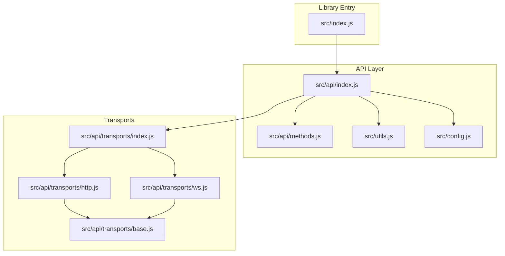
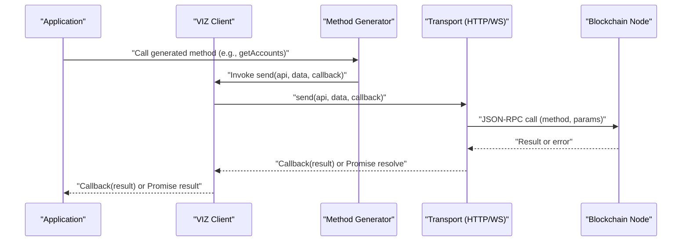
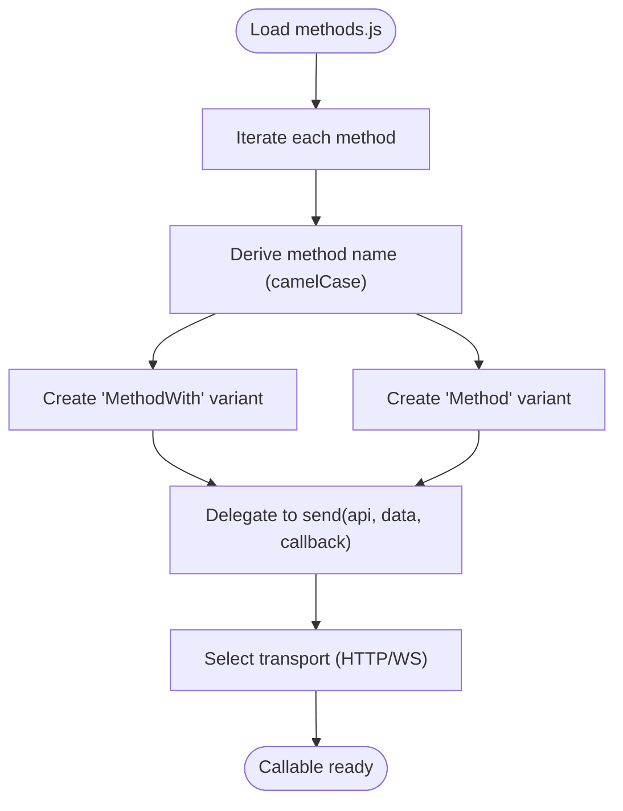
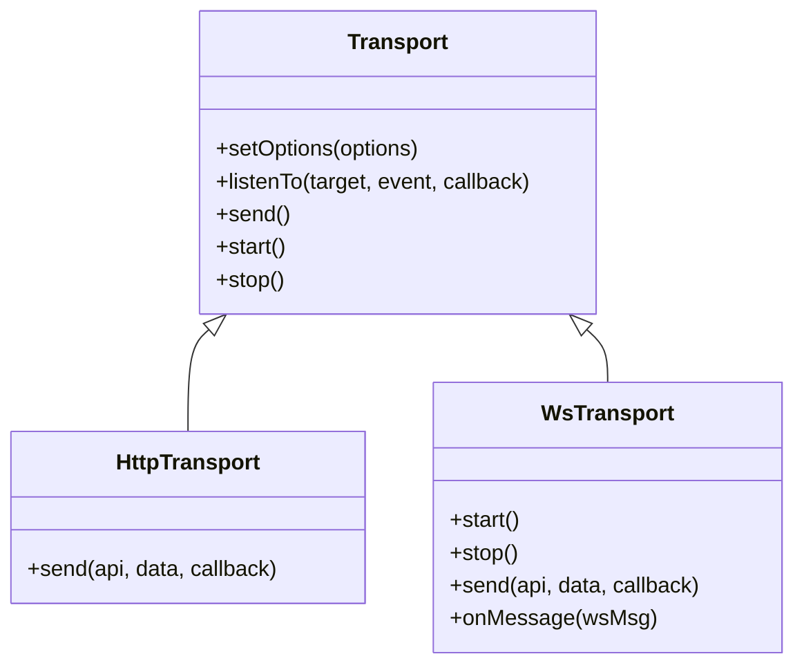
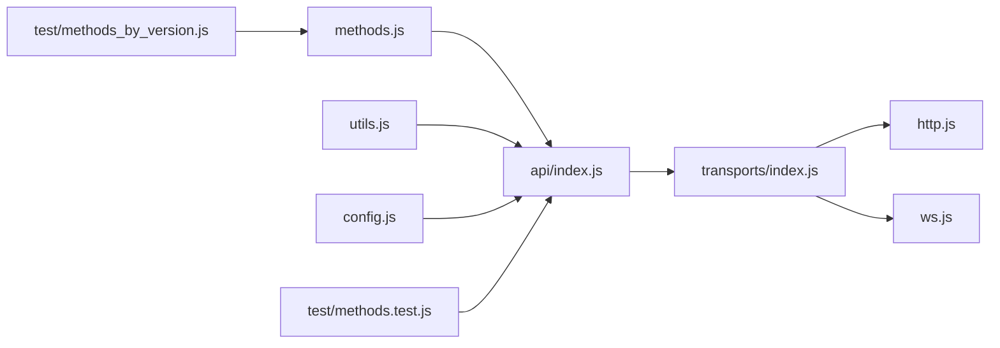

# Core API Methods

<cite>
**Referenced Files in This Document**
- [src/api/methods.js](file://src/api/methods.js)
- [src/api/index.js](file://src/api/index.js)
- [src/api/transports/base.js](file://src/api/transports/base.js)
- [src/api/transports/http.js](file://src/api/transports/http.js)
- [src/api/transports/ws.js](file://src/api/transports/ws.js)
- [src/api/transports/index.js](file://src/api/transports/index.js)
- [src/config.js](file://src/config.js)
- [src/index.js](file://src/index.js)
- [src/utils.js](file://src/utils.js)
- [test/methods.test.js](file://test/methods.test.js)
- [test/methods_by_version.js](file://test/methods_by_version.js)
- [test/api.test.js](file://test/api.test.js)
- [examples/get-post-content.js](file://examples/get-post-content.js)
- [examples/test-vote.js](file://examples/test-vote.js)
- [VIZ-JS-LIB-COVERAGE-STATUS.md](file://VIZ-JS-LIB-COVERAGE-STATUS.md)
</cite>

## Update Summary
**Changes Made**
- Added documentation for newly implemented API methods: database_api.get_master_history, database_api.set_block_applied_callback, auth_util.check_authority_signature, block_info.get_block_info, block_info.get_blocks_with_info, and raw_block.get_raw_block
- Updated method coverage documentation to reflect the complete API implementation
- Enhanced the Core API Methods Reference section with detailed descriptions of new methods
- Updated the Additional Methods section to include comprehensive coverage of all implemented methods

## Table of Contents
1. [Introduction](#introduction)
2. [Project Structure](#project-structure)
3. [Core Components](#core-components)
4. [Architecture Overview](#architecture-overview)
5. [Detailed Component Analysis](#detailed-component-analysis)
6. [Dependency Analysis](#dependency-analysis)
7. [Performance Considerations](#performance-considerations)
8. [Troubleshooting Guide](#troubleshooting-guide)
9. [Conclusion](#conclusion)
10. [Appendices](#appendices)

## Introduction
This document explains the core API methods in the VIZ JavaScript library, focusing on how the method generation system produces specialized send functions from a configuration, and how to use them synchronously, asynchronously, via callbacks, or Promises. It covers method naming conventions, parameter mapping, and the relationship between method names and underlying API endpoints. The library now provides comprehensive coverage of VIZ blockchain operations with 88 plugin API methods fully implemented, representing 100% coverage of regular operations and 98% coverage of plugin API methods as documented in the detailed coverage status.

## Project Structure
The API surface is defined by a configuration-driven generator that reads method definitions and produces callable methods on the VIZ client. The transport layer abstracts HTTP and WebSocket communication and integrates with the configuration for endpoint URLs.

**Diagram sources**
- [src/index.js](file://src/index.js#L1-L20)
- [src/api/index.js](file://src/api/index.js#L1-L271)
- [src/api/methods.js](file://src/api/methods.js#L1-L465)
- [src/api/transports/index.js](file://src/api/transports/index.js#L1-L8)
- [src/api/transports/base.js](file://src/api/transports/base.js#L1-L34)
- [src/api/transports/http.js](file://src/api/transports/http.js#L1-L53)
- [src/api/transports/ws.js](file://src/api/transports/ws.js#L1-L136)
- [src/config.js](file://src/config.js#L1-L10)
- [src/utils.js](file://src/utils.js#L1-L348)

**Section sources**
- [src/index.js](file://src/index.js#L1-L20)
- [src/api/index.js](file://src/api/index.js#L1-L271)
- [src/api/methods.js](file://src/api/methods.js#L1-L465)
- [src/api/transports/index.js](file://src/api/transports/index.js#L1-L8)
- [src/api/transports/base.js](file://src/api/transports/base.js#L1-L34)
- [src/api/transports/http.js](file://src/api/transports/http.js#L1-L53)
- [src/api/transports/ws.js](file://src/api/transports/ws.js#L1-L136)
- [src/config.js](file://src/config.js#L1-L10)
- [src/utils.js](file://src/utils.js#L1-L348)

## Core Components
- Method configuration: A JSON-like list of API endpoints with optional parameter lists.
- Generator: Iterates over the configuration to produce per-method functions on the VIZ prototype.
- Transports: HTTP and WebSocket transports encapsulate network communication and JSON-RPC framing.
- Configuration: Centralized getter/setter for runtime settings such as the WebSocket URL.

Key behaviors:
- Method naming: By default, the generator converts snake_case or camelCase method names to camelCase for the callable method name.
- Parameter mapping: The generator maps method parameters to positional arguments or an options object, depending on the variant.
- Variants: For each configured method, two callable forms are produced:
  - Method form: accepts parameters positionally and an optional callback.
  - MethodWith form: accepts an options object keyed by parameter names and an optional callback.
- Async/Promise support: The generator promotes all prototypes to include Async variants using a promisification utility.

**Section sources**
- [src/api/methods.js](file://src/api/methods.js#L1-L465)
- [src/api/index.js](file://src/api/index.js#L238-L265)
- [src/utils.js](file://src/utils.js#L4-L8)
- [src/api/transports/http.js](file://src/api/transports/http.js#L43-L52)
- [src/api/transports/ws.js](file://src/api/transports/ws.js#L64-L94)
- [src/config.js](file://src/config.js#L1-L10)

## Architecture Overview
The VIZ client dynamically generates API methods from a configuration. Each generated method delegates to a transport (HTTP or WebSocket) that performs JSON-RPC calls against the configured endpoint. Responses are delivered to callbacks or resolved via Promises.

**Diagram sources**
- [src/api/index.js](file://src/api/index.js#L98-L119)
- [src/api/transports/http.js](file://src/api/transports/http.js#L43-L52)
- [src/api/transports/ws.js](file://src/api/transports/ws.js#L64-L94)

## Detailed Component Analysis

### Method Generation System
The generator reads each method definition and:
- Derives the callable method name (defaulting to camelCase).
- Creates two callable forms:
  - MethodWith(options, callback): expects an options object whose keys match the method's parameter names.
  - Method(...args, callback): accepts parameters positionally and infers parameter names from the configuration.
- Promisifies the prototype so Async variants are available.

**Diagram sources**
- [src/api/index.js](file://src/api/index.js#L238-L265)
- [src/api/methods.js](file://src/api/methods.js#L1-L465)
- [src/utils.js](file://src/utils.js#L4-L8)

**Section sources**
- [src/api/index.js](file://src/api/index.js#L238-L265)
- [src/api/methods.js](file://src/api/methods.js#L1-L465)
- [src/utils.js](file://src/utils.js#L4-L8)
- [test/methods.test.js](file://test/methods.test.js#L7-L22)
- [test/methods_by_version.js](file://test/methods_by_version.js#L1-L73)

### Transport Layer
- Base transport defines the interface and promisification hooks.
- HTTP transport:
  - Wraps requests in JSON-RPC 2.0 and posts to the configured URL.
  - Throws structured errors on RPC errors or HTTP failures.
- WebSocket transport:
  - Manages connection lifecycle, request queuing, and response correlation by message ID.
  - Emits performance metrics and handles connection closures.

**Diagram sources**
- [src/api/transports/base.js](file://src/api/transports/base.js#L4-L34)
- [src/api/transports/http.js](file://src/api/transports/http.js#L43-L52)
- [src/api/transports/ws.js](file://src/api/transports/ws.js#L18-L136)

**Section sources**
- [src/api/transports/base.js](file://src/api/transports/base.js#L1-L34)
- [src/api/transports/http.js](file://src/api/transports/http.js#L1-L53)
- [src/api/transports/ws.js](file://src/api/transports/ws.js#L1-L136)
- [src/api/transports/index.js](file://src/api/transports/index.js#L1-L8)

### Method Naming Conventions and Parameter Mapping
- Naming: The generator uses camelCase conversion for method names derived from the configuration.
- Parameter mapping:
  - MethodWith(options, callback): options keys must match the method's declared parameter names.
  - Method(...args, callback): parameters are mapped positionally according to the method's declared parameter order.
- Example method definitions include:
  - database_api.get_accounts with params ["accountNames"]
  - database_api.get_dynamic_global_properties with no params
  - social_network.get_account_votes with params ["voter", "from", "voteLimit"]

**Section sources**
- [src/api/methods.js](file://src/api/methods.js#L252-L255)
- [src/api/methods.js](file://src/api/methods.js#L188-L189)
- [src/api/methods.js](file://src/api/methods.js#L159-L161)

### Callback, Async, and Promise Patterns
- Callback pattern: Each generated method supports a callback as the last argument.
- Async/Promise pattern: Promisification adds Async variants for all generated methods.
- Example usage patterns:
  - Callback: see [examples/test-vote.js](file://examples/test-vote.js#L15-L18)
  - Promise: see [examples/get-post-content.js](file://examples/get-post-content.js#L3)

**Section sources**
- [src/api/index.js](file://src/api/index.js#L264-L265)
- [examples/get-post-content.js](file://examples/get-post-content.js#L1-L5)
- [examples/test-vote.js](file://examples/test-vote.js#L1-L19)

### Core API Methods Reference

#### getAccounts
- Purpose: Retrieve accounts by name.
- API endpoint: database_api.get_accounts
- Parameters:
  - accountNames: array of account names
- Variants:
  - getAccounts(accountNames, callback)
  - getAccountsWith({ accountNames }, callback)
- Expected return: Array of account objects.
- Error handling: Transport-level errors propagate to the callback/Promise; RPC errors are surfaced as structured errors.
- Usage example: See [examples/get-post-content.js](file://examples/get-post-content.js#L3) for Promise-based retrieval patterns.

**Section sources**
- [src/api/methods.js](file://src/api/methods.js#L262-L265)
- [src/api/index.js](file://src/api/index.js#L252-L261)
- [examples/get-post-content.js](file://examples/get-post-content.js#L1-L5)

#### getDynamicGlobalProperties
- Purpose: Retrieve global blockchain state properties.
- API endpoint: database_api.get_dynamic_global_properties
- Parameters: none
- Variants:
  - getDynamicGlobalProperties(callback)
  - getDynamicGlobalPropertiesWith({}, callback)
- Expected return: Global properties object (e.g., head and irreversible block numbers).
- Error handling: See transport error handling.
- Usage example: Used internally by streaming utilities; see [src/api/index.js](file://src/api/index.js#L132-L136).

**Section sources**
- [src/api/methods.js](file://src/api/methods.js#L188-L189)
- [src/api/index.js](file://src/api/index.js#L132-L136)

#### getAccountVotes
- Purpose: Retrieve votes cast by an account.
- API endpoint: social_network.get_account_votes
- Parameters:
  - voter: account name
  - from: start index
  - voteLimit: maximum number of votes to return
- Variants:
  - getAccountVotes(voter, from, voteLimit, callback)
  - getAccountVotesWith({ voter, from, voteLimit }, callback)
- Expected return: List of votes.
- Error handling: See transport error handling.

**Section sources**
- [src/api/methods.js](file://src/api/methods.js#L159-L161)
- [src/api/index.js](file://src/api/index.js#L252-L261)

#### New API Methods

##### database_api.get_master_history
- Purpose: Retrieve master key history for an account.
- API endpoint: database_api.get_master_history
- Parameters:
  - account: account name
- Variants:
  - getMasterHistory(account, callback)
  - getMasterHistoryWith({ account }, callback)
- Expected return: Master key history data structure.
- Error handling: Transport-level errors propagate to the callback/Promise.
- Note: This is the current naming for master key history, replacing legacy naming.

**Section sources**
- [src/api/methods.js](file://src/api/methods.js#L212-L215)
- [src/api/index.js](file://src/api/index.js#L252-L261)

##### database_api.set_block_applied_callback
- Purpose: Set up WebSocket callback for block application notifications.
- API endpoint: database_api.set_block_applied_callback
- Parameters:
  - callback: function to receive block application notifications
- Variants:
  - setBlockAppliedCallback(callback, callback)
  - setBlockAppliedCallbackWith({ callback }, callback)
- Expected return: WebSocket subscription management.
- Error handling: Transport-level errors propagate to the callback/Promise.
- Note: Enables real-time block subscription via WebSocket transport.

**Section sources**
- [src/api/methods.js](file://src/api/methods.js#L217-L220)
- [src/api/index.js](file://src/api/index.js#L252-L261)

##### auth_util.check_authority_signature
- Purpose: Verify signature against account authority requirements.
- API endpoint: auth_util.check_authority_signature
- Parameters:
  - account_name: account name to verify
  - level: authority level (master/active/regular)
  - signatures: array of signatures to validate
- Variants:
  - checkAuthoritySignature(account_name, level, signatures, callback)
  - checkAuthoritySignatureWith({ account_name, level, signatures }, callback)
- Expected return: Boolean indicating signature validity.
- Error handling: Transport-level errors propagate to the callback/Promise.

**Section sources**
- [src/api/methods.js](file://src/api/methods.js#L446-L449)
- [src/api/index.js](file://src/api/index.js#L252-L261)

##### block_info.get_block_info
- Purpose: Retrieve extended information for a range of blocks.
- API endpoint: block_info.get_block_info
- Parameters:
  - start_block_num: starting block number
  - count: number of blocks to retrieve
- Variants:
  - getBlockInfo(start_block_num, count, callback)
  - getBlockInfoWith({ start_block_num, count }, callback)
- Expected return: Array of block information objects.
- Error handling: Transport-level errors propagate to the callback/Promise.

**Section sources**
- [src/api/methods.js](file://src/api/methods.js#L451-L454)
- [src/api/index.js](file://src/api/index.js#L252-L261)

##### block_info.get_blocks_with_info
- Purpose: Retrieve multiple blocks with detailed information.
- API endpoint: block_info.get_blocks_with_info
- Parameters:
  - start_block_num: starting block number
  - count: number of blocks to retrieve
- Variants:
  - getBlocksWithInfo(start_block_num, count, callback)
  - getBlocksWithInfoWith({ start_block_num, count }, callback)
- Expected return: Array of blocks with metadata.
- Error handling: Transport-level errors propagate to the callback/Promise.

**Section sources**
- [src/api/methods.js](file://src/api/methods.js#L456-L459)
- [src/api/index.js](file://src/api/index.js#L252-L261)

##### raw_block.get_raw_block
- Purpose: Retrieve raw serialized block data.
- API endpoint: raw_block.get_raw_block
- Parameters:
  - block_num: block number to retrieve
- Variants:
  - getRawBlock(block_num, callback)
  - getRawBlockWith({ block_num }, callback)
- Expected return: Raw block data in serialized format.
- Error handling: Transport-level errors propagate to the callback/Promise.

**Section sources**
- [src/api/methods.js](file://src/api/methods.js#L461-L464)
- [src/api/index.js](file://src/api/index.js#L252-L261)

#### Additional Methods
The generator produces callable methods for all entries in the configuration. The library now provides comprehensive coverage with 88 plugin API methods fully implemented, including:

**Database API Methods** (32 methods):
- get_block_header, get_block, get_irreversible_block_header, get_irreversible_block
- get_config, get_dynamic_global_properties, get_chain_properties, get_hardfork_version
- get_next_scheduled_hardfork, get_account_count, get_owner_history, get_master_history
- get_recovery_request, get_escrow, get_withdraw_routes, get_vesting_delegations
- get_expiring_vesting_delegations, get_transaction_hex, get_required_signatures
- get_potential_signatures, verify_authority, verify_account_authority, get_accounts
- lookup_account_names, lookup_accounts, get_proposed_transaction, get_database_info
- get_proposed_transactions, get_accounts_on_sale, get_accounts_on_auction, get_subaccounts_on_sale

**Network Broadcast API Methods** (4 methods):
- broadcast_transaction, broadcast_transaction_with_callback
- broadcast_transaction_synchronous, broadcast_block

**Witness API Methods** (9 methods):
- get_active_witnesses, get_witness_schedule, get_witnesses, get_witness_by_account
- get_witnesses_by_vote, get_witnesses_by_counted_vote, get_witness_count, lookup_witness_accounts
- get_miner_queue

**Index/API Methods** (20 methods):
- get_account_history (account_history)
- get_ops_in_block, get_transaction (operation_history)
- get_key_references (account_by_key)
- get_committee_request, get_committee_request_votes, get_committee_requests_list (committee_api)
- get_invites_list, get_invite_by_id, get_invite_by_key (invite_api)
- get_paid_subscriptions, get_paid_subscription_options, get_paid_subscription_status
- get_active_paid_subscriptions, get_inactive_paid_subscriptions (paid_subscription_api)
- get_account (custom_protocol_api)

**Deprecated Methods** (24 methods):
- Follow API: get_followers, get_following, get_follow_count, get_feed_entries, get_feed
- Blog APIs: get_blog_entries, get_blog, get_reblogged_by, get_blog_authors
- Tags API: get_trending_tags, get_tags_used_by_author, get_discussions_by_* methods
- Social Network API: get_replies_by_last_update, get_content, get_content_replies
- Private Message API: get_inbox, get_outbox (deprecated and intentionally not implemented)

Validation of generated methods is performed by tests that compare the expected method names against the actual prototype methods.

**Section sources**
- [src/api/methods.js](file://src/api/methods.js#L1-L465)
- [test/methods.test.js](file://test/methods.test.js#L7-L22)
- [test/methods_by_version.js](file://test/methods_by_version.js#L1-L73)
- [VIZ-JS-LIB-COVERAGE-STATUS.md](file://VIZ-JS-LIB-COVERAGE-STATUS.md#L102-L233)

### Streaming Utilities
The VIZ client provides convenience streaming utilities that internally rely on getDynamicGlobalProperties and block retrieval:
- streamBlockNumber(mode, callback, interval)
- streamBlock(mode, callback)
- streamTransactions(mode, callback)
- streamOperations(mode, callback)

These utilities demonstrate real-world usage of the underlying API methods and can guide building higher-level data pipelines.

**Section sources**
- [src/api/index.js](file://src/api/index.js#L121-L235)
- [test/api.test.js](file://test/api.test.js#L80-L166)

## Dependency Analysis
The API layer depends on:
- Configuration for endpoint URLs.
- Transport selection based on URL scheme.
- Utility functions for naming conversions.
- Test suites validating method coverage and behavior.

**Diagram sources**
- [src/api/methods.js](file://src/api/methods.js#L1-L465)
- [src/api/index.js](file://src/api/index.js#L1-L271)
- [src/utils.js](file://src/utils.js#L1-L348)
- [src/config.js](file://src/config.js#L1-L10)
- [src/api/transports/index.js](file://src/api/transports/index.js#L1-L8)
- [src/api/transports/http.js](file://src/api/transports/http.js#L1-L53)
- [src/api/transports/ws.js](file://src/api/transports/ws.js#L1-L136)
- [test/methods.test.js](file://test/methods.test.js#L1-L23)
- [test/methods_by_version.js](file://test/methods_by_version.js#L1-L73)

**Section sources**
- [src/api/index.js](file://src/api/index.js#L1-L271)
- [src/api/methods.js](file://src/api/methods.js#L1-L465)
- [src/utils.js](file://src/utils.js#L1-L348)
- [src/config.js](file://src/config.js#L1-L10)
- [src/api/transports/index.js](file://src/api/transports/index.js#L1-L8)
- [test/methods.test.js](file://test/methods.test.js#L1-L23)
- [test/methods_by_version.js](file://test/methods_by_version.js#L1-L73)

## Performance Considerations
- Transport selection: Using WebSocket transport enables persistent connections and lower latency for frequent queries compared to HTTP polling.
- Batch requests: Group related queries where possible to reduce round trips.
- Streaming: Prefer streaming utilities for continuous updates to avoid tight polling loops.
- Error handling: Leverage built-in error propagation to avoid retry storms; handle transient network errors gracefully.

## Troubleshooting Guide
Common issues and resolutions:
- Unknown transport URL: The client throws an error if the URL scheme is unsupported. Ensure the configured WebSocket URL starts with http/https or ws/wss.
- Network failures and reconnection: WebSocket transport emits closure events; the client stops and clears inflight requests. Subsequent calls trigger automatic reconnection.
- RPC errors: HTTP transport raises structured RPC errors; WebSocket transport wraps errors with payload details for inspection.
- Callback vs Promise: If a callback is omitted, the method returns a Promise. Ensure consistent error handling across both patterns.

**Section sources**
- [src/api/index.js](file://src/api/index.js#L34-L42)
- [src/api/transports/ws.js](file://src/api/transports/ws.js#L96-L134)
- [src/api/transports/http.js](file://src/api/transports/http.js#L8-L41)

## Conclusion
The VIZ JavaScript library's API layer is driven by a declarative configuration that generates robust, typed methods supporting both callback and Promise patterns. The library now provides comprehensive coverage of VIZ blockchain operations with 88 plugin API methods fully implemented, representing 100% coverage of regular operations and 98% coverage of plugin API methods. The transport abstraction cleanly separates concerns between protocol and application logic, while streaming utilities simplify common data retrieval scenarios. By adhering to the documented naming and parameter conventions, developers can reliably build applications that query blockchain state and react to live updates.

## Appendices

### Practical Examples Index
- Retrieve post content using Promise:
  - [examples/get-post-content.js](file://examples/get-post-content.js#L1-L5)
- Broadcast an upvote using callback:
  - [examples/test-vote.js](file://examples/test-vote.js#L1-L19)

**Section sources**
- [examples/get-post-content.js](file://examples/get-post-content.js#L1-L5)
- [examples/test-vote.js](file://examples/test-vote.js#L1-L19)

### API Coverage Status
The library maintains comprehensive coverage of VIZ blockchain operations as documented in the detailed coverage status:

**Plugin API Coverage Summary:**
- Database API: 32/32 methods implemented (100%)
- Network Broadcast API: 4/4 methods implemented (100%)
- Witness API: 9/9 methods implemented (100%)
- Account History API: 1/1 method implemented (100%)
- Operation History API: 2/2 methods implemented (100%)
- Committee API: 3/3 methods implemented (100%)
- Invite API: 3/3 methods implemented (100%)
- Paid Subscription API: 5/5 methods implemented (100%)
- Custom Protocol API: 1/1 method implemented (100%)
- Auth Util API: 1/1 method implemented (100%)
- Block Info API: 2/2 methods implemented (100%)
- Raw Block API: 1/1 method implemented (100%)

**Overall Status:** ✅ FULL COVERAGE

**Section sources**
- [VIZ-JS-LIB-COVERAGE-STATUS.md](file://VIZ-JS-LIB-COVERAGE-STATUS.md#L1-L357)