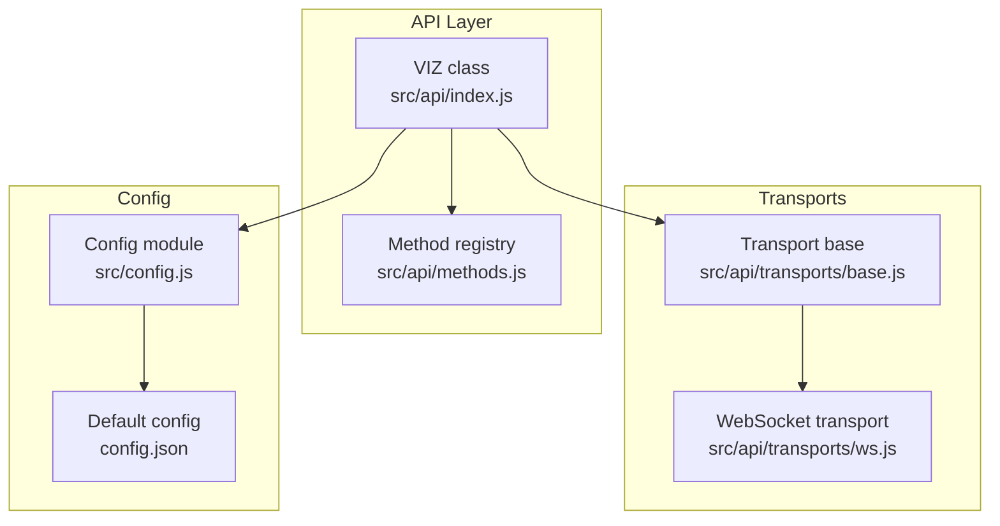
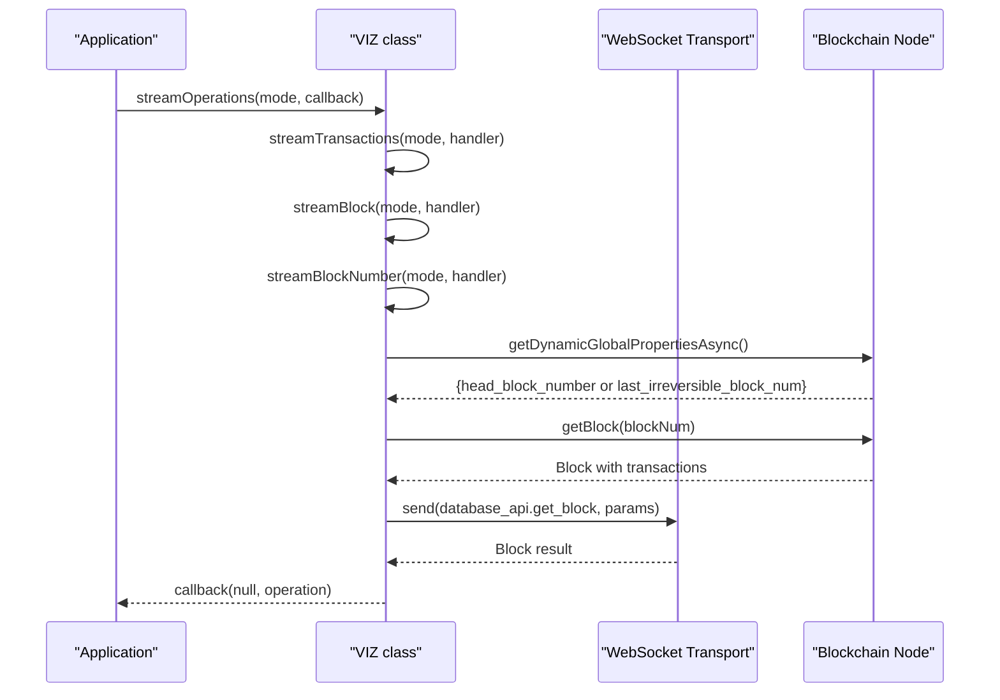
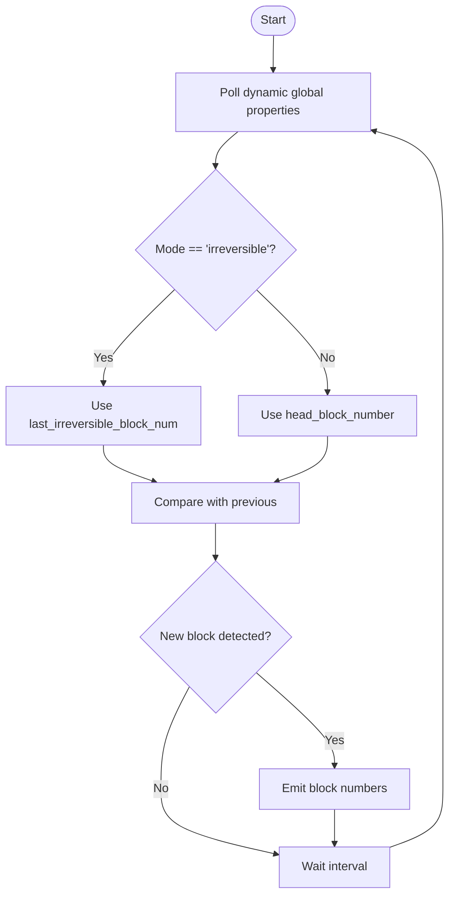
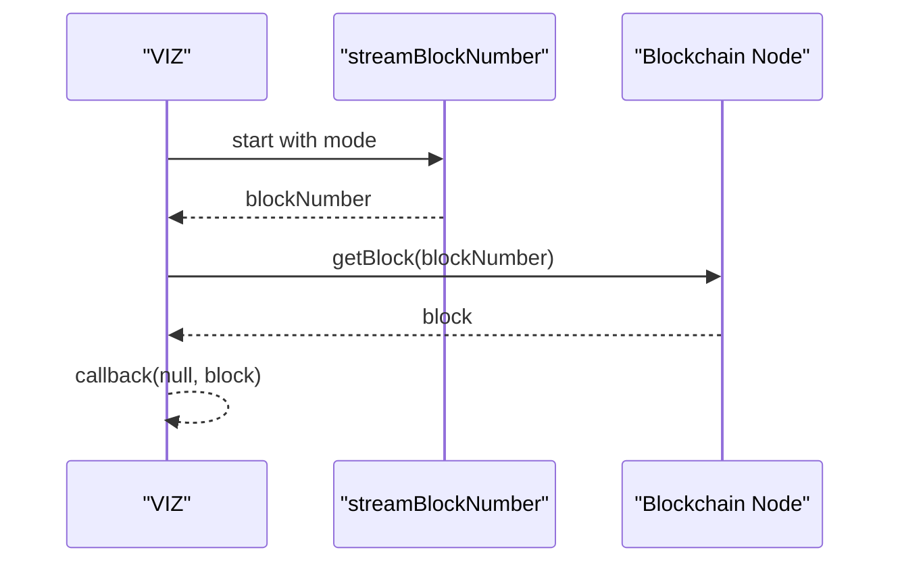
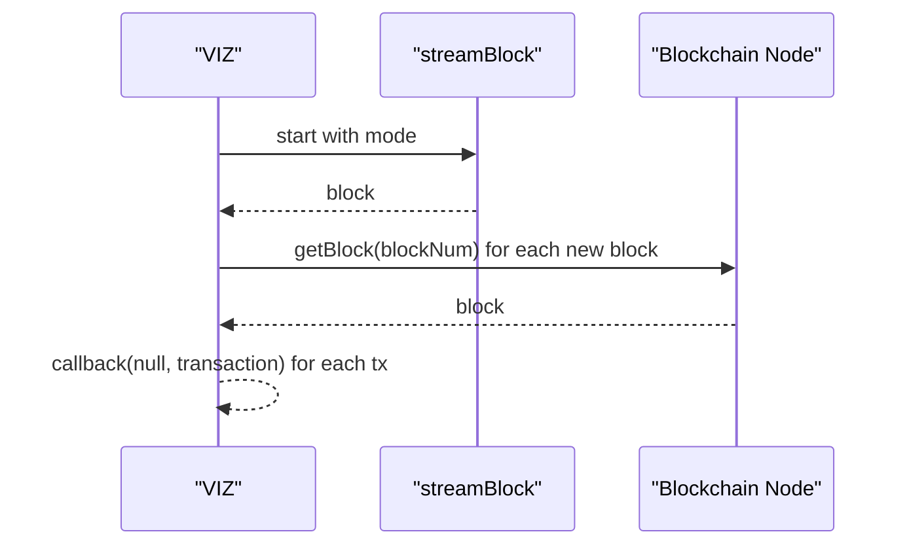
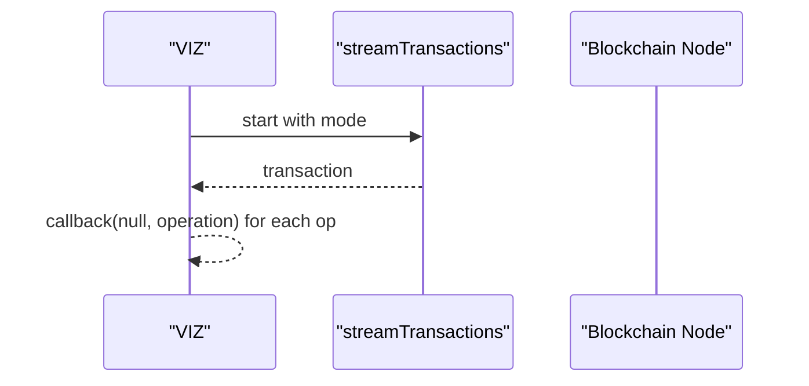
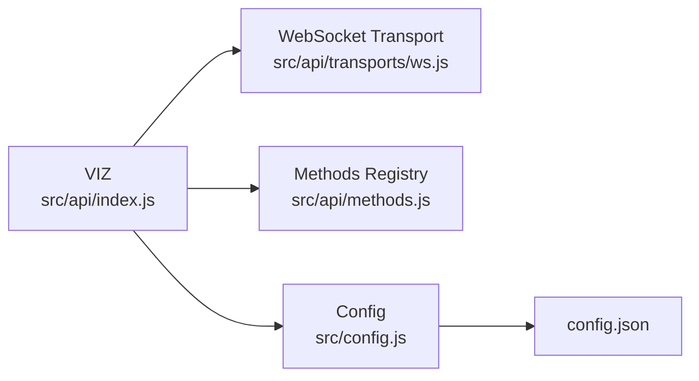

# Streaming APIs

<cite>
**Referenced Files in This Document**
- [src/api/index.js](file://src/api/index.js)
- [src/api/methods.js](file://src/api/methods.js)
- [src/api/transports/ws.js](file://src/api/transports/ws.js)
- [src/api/transports/base.js](file://src/api/transports/base.js)
- [src/config.js](file://src/config.js)
- [config.json](file://config.json)
- [examples/stream.html](file://examples/stream.html)
- [test/api.test.js](file://test/api.test.js)
</cite>

## Table of Contents
1. [Introduction](#introduction)
2. [Project Structure](#project-structure)
3. [Core Components](#core-components)
4. [Architecture Overview](#architecture-overview)
5. [Detailed Component Analysis](#detailed-component-analysis)
6. [Dependency Analysis](#dependency-analysis)
7. [Performance Considerations](#performance-considerations)
8. [Troubleshooting Guide](#troubleshooting-guide)
9. [Conclusion](#conclusion)
10. [Appendices](#appendices)

## Introduction
This document explains the streaming APIs provided by the VIZ JavaScript library. It focuses on block streaming, transaction streaming, and operation streaming, covering the streamBlockNumber, streamBlock, streamTransactions, and streamOperations methods. It also documents parameters, callback patterns, cleanup mechanisms, differences between head and irreversible block modes, performance and memory considerations, and practical guidance for real-time data processing, event-driven architectures, and reactive programming patterns. Finally, it provides strategies for handling stream interruptions, resuming streams, and building custom streaming logic.

## Project Structure
The streaming functionality is implemented in the API module and its transport layer:
- The public API surface resides in the VIZ class, which exposes streaming methods and delegates transport-specific operations to the underlying transport.
- The WebSocket transport manages the persistent connection and request lifecycle.
- Configuration is centralized via a small configuration module and a JSON-backed defaults file.

**Diagram sources**
- [src/api/index.js](file://src/api/index.js#L21-L271)
- [src/api/methods.js](file://src/api/methods.js#L1-L475)
- [src/api/transports/base.js](file://src/api/transports/base.js#L1-L34)
- [src/api/transports/ws.js](file://src/api/transports/ws.js#L1-L136)
- [src/config.js](file://src/config.js#L1-L10)
- [config.json](file://config.json#L1-L7)

**Section sources**
- [src/api/index.js](file://src/api/index.js#L1-L271)
- [src/api/transports/base.js](file://src/api/transports/base.js#L1-L34)
- [src/api/transports/ws.js](file://src/api/transports/ws.js#L1-L136)
- [src/config.js](file://src/config.js#L1-L10)
- [config.json](file://config.json#L1-L7)

## Core Components
- VIZ class: Provides streaming methods and integrates with transports. It manages lifecycle, emits performance metrics, and exposes convenience methods for asynchronous operations.
- WebSocket transport: Manages the WebSocket connection, request queuing, and response handling. It supports start, stop, and send operations and handles connection errors and closures.
- Method registry: Defines available RPC methods and parameters, enabling dynamic generation of typed API methods.
- Configuration: Centralizes runtime configuration such as the WebSocket endpoint.

Key streaming methods:
- streamBlockNumber(mode, callback): Streams numeric block identifiers based on either head or irreversible mode.
- streamBlock(mode, callback): Streams full block objects by delegating to streamBlockNumber and fetching blocks.
- streamTransactions(mode, callback): Streams individual transactions embedded in blocks.
- streamOperations(mode, callback): Streams individual operations from transactions.

Cleanup mechanism:
- Each streaming method returns a release function that stops the stream by canceling polling loops and releasing resources.

**Section sources**
- [src/api/index.js](file://src/api/index.js#L121-L235)
- [src/api/transports/ws.js](file://src/api/transports/ws.js#L27-L62)
- [src/api/methods.js](file://src/api/methods.js#L163-L189)
- [src/config.js](file://src/config.js#L1-L10)
- [config.json](file://config.json#L1-L7)

## Architecture Overview
The streaming pipeline is event-driven and layered:
- VIZ orchestrates streaming by periodically polling dynamic global properties and converting block numbers into block data and transactions.
- The transport layer abstracts WebSocket connectivity and request/response handling.
- Callbacks receive streamed data, enabling event-driven architectures and reactive patterns.

**Diagram sources**
- [src/api/index.js](file://src/api/index.js#L121-L235)
- [src/api/transports/ws.js](file://src/api/transports/ws.js#L64-L94)
- [src/api/methods.js](file://src/api/methods.js#L163-L189)

## Detailed Component Analysis

### Stream Modes: Head vs Irreversible
- Head mode: Uses the latest head block number, reflecting potentially reversible blocks. Suitable for near-real-time processing with higher throughput but potential reorg risk.
- Irreversible mode: Uses the last irreversible block number, ensuring immutability at the cost of latency. Ideal for audit trails and immutable analytics.

Behavioral differences:
- streamBlockNumber selects the appropriate property from dynamic global properties based on mode.
- Subsequent streams (blocks, transactions, operations) operate on the selected block numbers.

**Section sources**
- [src/api/index.js](file://src/api/index.js#L132-L136)
- [src/api/methods.js](file://src/api/methods.js#L186-L189)

### streamBlockNumber
Purpose:
- Periodically polls dynamic global properties and invokes the callback for each newly observed block number.

Parameters:
- mode: "head" or "irreversible".
- callback(err, blockNumber): Receives errors or numeric block identifiers.

Implementation highlights:
- Polling loop with configurable interval.
- Compares current and previous block numbers to emit incremental updates.
- Returns a release function to cancel the loop.

**Diagram sources**
- [src/api/index.js](file://src/api/index.js#L121-L165)

**Section sources**
- [src/api/index.js](file://src/api/index.js#L121-L165)

### streamBlock
Purpose:
- Streams full block objects by delegating to streamBlockNumber and fetching blocks.

Parameters:
- mode: "head" or "irreversible".
- callback(err, block): Receives block objects with header, transactions, timestamps, etc.

Implementation highlights:
- Uses streamBlockNumber internally.
- Fetches each new block number and invokes the callback with the full block.
- Returns a release function to stop the stream.

**Diagram sources**
- [src/api/index.js](file://src/api/index.js#L167-L191)
- [src/api/methods.js](file://src/api/methods.js#L167-L171)

**Section sources**
- [src/api/index.js](file://src/api/index.js#L167-L191)
- [src/api/methods.js](file://src/api/methods.js#L167-L171)

### streamTransactions
Purpose:
- Streams individual transactions contained within blocks.

Parameters:
- mode: "head" or "irreversible".
- callback(err, transaction): Receives transaction objects.

Implementation highlights:
- Delegates to streamBlock.
- Iterates over block.transactions and emits each transaction.
- Returns a release function to stop the stream.

**Diagram sources**
- [src/api/index.js](file://src/api/index.js#L193-L214)
- [src/api/methods.js](file://src/api/methods.js#L167-L171)

**Section sources**
- [src/api/index.js](file://src/api/index.js#L193-L214)

### streamOperations
Purpose:
- Streams individual operations from transactions.

Parameters:
- mode: "head" or "irreversible".
- callback(err, operation): Receives operation objects.

Implementation highlights:
- Delegates to streamTransactions.
- Iterates over transaction.operations and emits each operation.
- Returns a release function to stop the stream.

**Diagram sources**
- [src/api/index.js](file://src/api/index.js#L216-L235)

**Section sources**
- [src/api/index.js](file://src/api/index.js#L216-L235)

### Cleanup Mechanisms
- Each streaming method returns a release function that cancels polling loops and releases resources.
- The WebSocket transport’s stop method clears in-flight requests and closes the connection gracefully.

Best practices:
- Always capture and invoke the release function when stopping streams.
- Ensure release is called on unhandled errors to prevent resource leaks.

**Section sources**
- [src/api/index.js](file://src/api/index.js#L121-L165)
- [src/api/index.js](file://src/api/index.js#L167-L191)
- [src/api/index.js](file://src/api/index.js#L193-L214)
- [src/api/index.js](file://src/api/index.js#L216-L235)
- [src/api/transports/ws.js](file://src/api/transports/ws.js#L50-L62)

### Example Usage
- See the example page that streams operations and logs them to the console.

**Section sources**
- [examples/stream.html](file://examples/stream.html#L10-L16)

## Dependency Analysis
The streaming layer depends on:
- VIZ class for orchestration and method generation.
- WebSocket transport for connectivity and request/response handling.
- Configuration module for the WebSocket endpoint.
- Method registry for database API methods used by streaming.

**Diagram sources**
- [src/api/index.js](file://src/api/index.js#L1-L271)
- [src/api/transports/ws.js](file://src/api/transports/ws.js#L1-L136)
- [src/api/methods.js](file://src/api/methods.js#L1-L475)
- [src/config.js](file://src/config.js#L1-L10)
- [config.json](file://config.json#L1-L7)

**Section sources**
- [src/api/index.js](file://src/api/index.js#L1-L271)
- [src/api/transports/ws.js](file://src/api/transports/ws.js#L1-L136)
- [src/api/methods.js](file://src/api/methods.js#L1-L475)
- [src/config.js](file://src/config.js#L1-L10)
- [config.json](file://config.json#L1-L7)

## Performance Considerations
- Polling interval: streamBlockNumber uses a configurable delay between polls. Lower intervals increase CPU/network load; higher intervals reduce responsiveness.
- Throughput: head mode typically yields higher throughput but may require handling reorganizations.
- Memory: Streaming methods accumulate minimal state; however, callbacks and downstream consumers must avoid retaining large datasets unnecessarily.
- Backpressure: Consumers should process events promptly to avoid buildup. Consider batching or debouncing in high-volume scenarios.
- Network reliability: The transport layer handles connection errors and closures; streams will stop on disconnections and require manual restart.

[No sources needed since this section provides general guidance]

## Troubleshooting Guide
Common issues and resolutions:
- No data received:
  - Verify the WebSocket URL is configured and reachable.
  - Ensure the streaming method is invoked and the release function is not prematurely called.
- Frequent disconnections:
  - Reconnection is handled automatically for subsequent RPC calls; streams themselves require manual restart.
  - Restart the stream by calling the streaming method again and re-subscribing to callbacks.
- Resource leaks:
  - Always call the returned release function when stopping streams.
  - Ensure error handlers invoke release to clean up resources.
- Testing behavior:
  - Tests demonstrate that streams emit expected shapes and can be stopped after a few events.

**Section sources**
- [src/api/index.js](file://src/api/index.js#L121-L235)
- [src/api/transports/ws.js](file://src/api/transports/ws.js#L50-L62)
- [test/api.test.js](file://test/api.test.js#L80-L166)

## Conclusion
The VIZ JavaScript library provides a robust, event-driven streaming stack built on top of a WebSocket transport. Developers can choose between head and irreversible block modes, stop and resume streams cleanly, and integrate with reactive patterns. Properly managing the release function and handling disconnections ensures reliable, low-latency real-time applications.

[No sources needed since this section summarizes without analyzing specific files]

## Appendices

### API Reference Summary
- streamBlockNumber(mode = "head", callback)
  - Emits numeric block numbers; mode selects head or irreversible.
  - Returns release function to stop the stream.
- streamBlock(mode = "head", callback)
  - Emits full block objects; delegates to streamBlockNumber.
  - Returns release function to stop the stream.
- streamTransactions(mode = "head", callback)
  - Emits individual transactions from blocks.
  - Returns release function to stop the stream.
- streamOperations(mode = "head", callback)
  - Emits individual operations from transactions.
  - Returns release function to stop the stream.

**Section sources**
- [src/api/index.js](file://src/api/index.js#L121-L235)

### Reactive Programming Patterns
- Event-driven: Subscribe to streams and process events as they arrive.
- Backpressure: Throttle or buffer in consumers to avoid overload.
- Composition: Combine streams using higher-order operators (e.g., map, filter, scan) in reactive libraries.
- Error handling: Wrap callbacks to centralize error logging and recovery.

[No sources needed since this section provides general guidance]

### Real-Time Data Processing Examples
- Logging operations to the console (example page).
- Building dashboards that update on each emitted operation.
- Aggregating per-block metrics or per-operation counts.

**Section sources**
- [examples/stream.html](file://examples/stream.html#L10-L16)