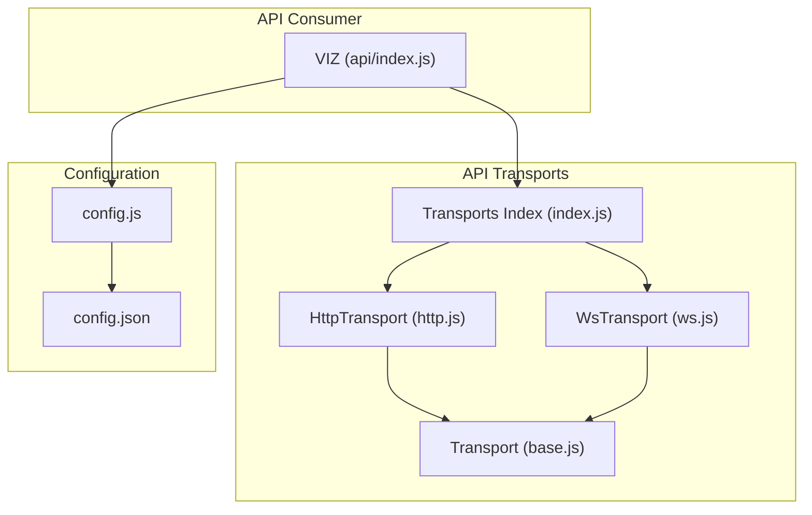
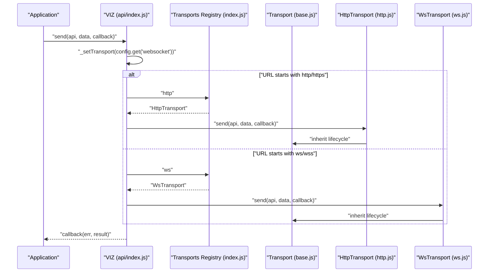
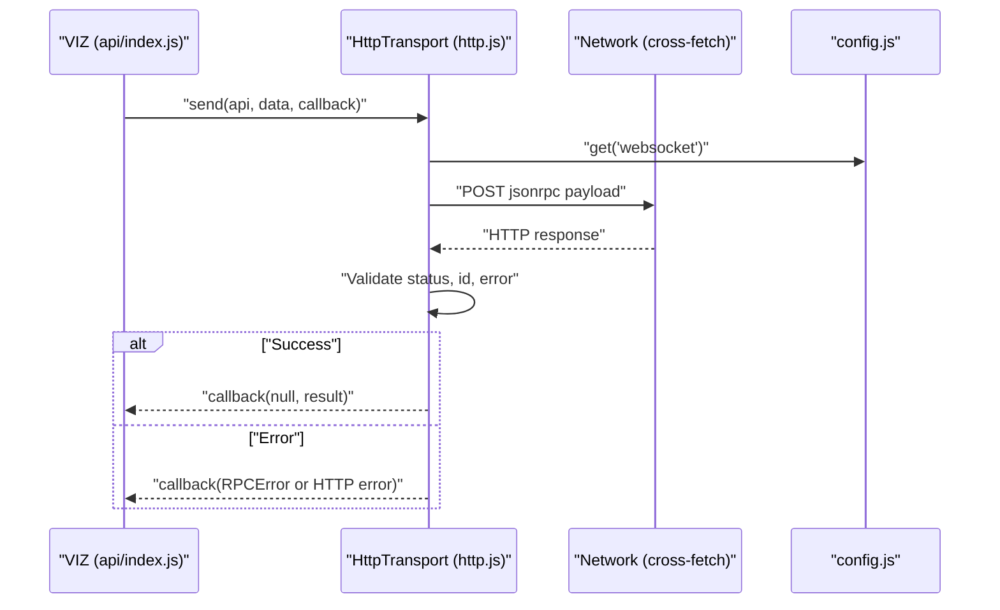
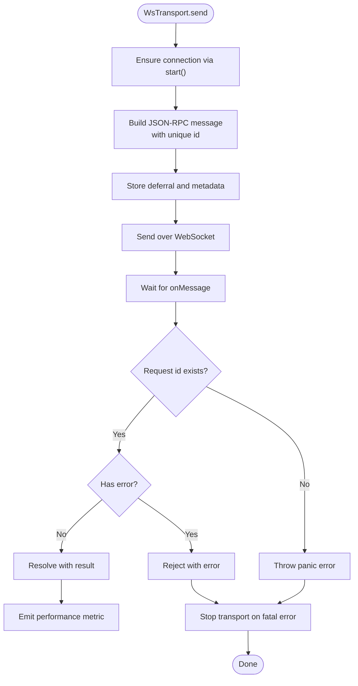
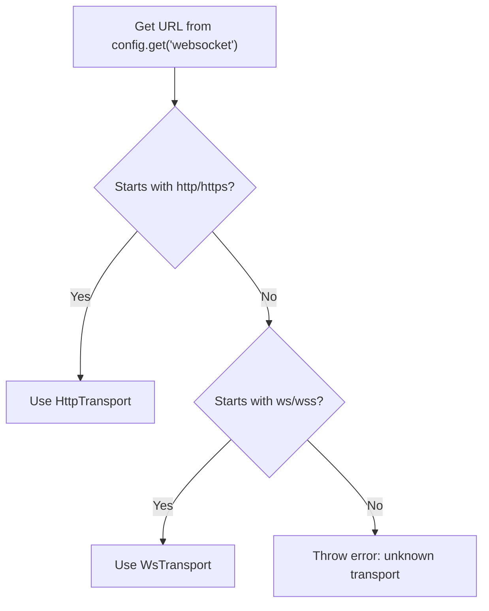
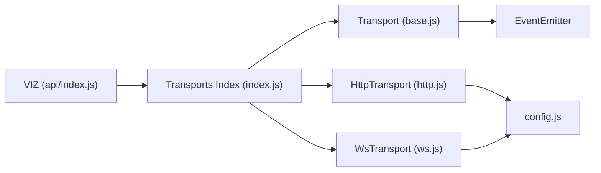

# Transport Layer

<cite>
**Referenced Files in This Document**
- [base.js](file://src/api/transports/base.js)
- [http.js](file://src/api/transports/http.js)
- [ws.js](file://src/api/transports/ws.js)
- [index.js](file://src/api/transports/index.js)
- [index.js](file://src/api/index.js)
- [config.js](file://src/config.js)
- [config.json](file://config.json)
- [index.html](file://examples/index.html)
- [api.test.js](file://test/api.test.js)
</cite>

## Table of Contents
1. [Introduction](#introduction)
2. [Project Structure](#project-structure)
3. [Core Components](#core-components)
4. [Architecture Overview](#architecture-overview)
5. [Detailed Component Analysis](#detailed-component-analysis)
6. [Dependency Analysis](#dependency-analysis)
7. [Performance Considerations](#performance-considerations)
8. [Troubleshooting Guide](#troubleshooting-guide)
9. [Conclusion](#conclusion)
10. [Appendices](#appendices)

## Introduction
This document describes the transport layer of the VIZ JavaScript library. It explains the base transport interface and how HTTP and WebSocket transports inherit from it. It covers transport selection logic, connection management, lifecycle handling, request/response processing, error propagation, and retry mechanisms. It also documents configuration options, performance tuning, usage patterns, and troubleshooting steps for common connection issues.

## Project Structure
The transport layer resides under the API module and is organized by protocol:
- Base transport interface
- HTTP transport
- WebSocket transport
- Transport registry for selection

**Diagram sources**
- [base.js](file://src/api/transports/base.js#L1-L34)
- [http.js](file://src/api/transports/http.js#L1-L53)
- [ws.js](file://src/api/transports/ws.js#L1-L136)
- [index.js](file://src/api/transports/index.js#L1-L8)
- [index.js](file://src/api/index.js#L1-L271)
- [config.js](file://src/config.js#L1-L10)
- [config.json](file://config.json#L1-L7)

**Section sources**
- [base.js](file://src/api/transports/base.js#L1-L34)
- [http.js](file://src/api/transports/http.js#L1-L53)
- [ws.js](file://src/api/transports/ws.js#L1-L136)
- [index.js](file://src/api/transports/index.js#L1-L8)
- [index.js](file://src/api/index.js#L1-L271)
- [config.js](file://src/config.js#L1-L10)
- [config.json](file://config.json#L1-L7)

## Core Components
- Transport (base): Defines the common interface for all transports, including lifecycle hooks and helper utilities.
- HttpTransport: Implements JSON-RPC over HTTP using cross-fetch.
- WsTransport: Implements JSON-RPC over WebSocket with request queuing, message routing, and lifecycle events.
- Transports registry: Exposes HTTP and WebSocket constructors for selection.
- VIZ consumer: Selects transport based on configured URL and forwards requests.

Key responsibilities:
- Transport selection: VIZ selects HTTP or WebSocket depending on the configured URL scheme.
- Lifecycle: start/stop controls connection state; setOptions triggers stop to apply changes safely.
- Request routing: VIZ delegates send to the active transport; transport handles retries and error propagation.

**Section sources**
- [base.js](file://src/api/transports/base.js#L4-L31)
- [http.js](file://src/api/transports/http.js#L43-L52)
- [ws.js](file://src/api/transports/ws.js#L18-L136)
- [index.js](file://src/api/transports/index.js#L4-L7)
- [index.js](file://src/api/index.js#L34-L62)

## Architecture Overview
The transport layer sits between the VIZ API client and the backend. VIZ decides the transport based on the configured websocket URL and delegates all send operations to the selected transport. Both HTTP and WebSocket transports normalize JSON-RPC semantics and propagate errors to the caller.

**Diagram sources**
- [index.js](file://src/api/index.js#L34-L62)
- [index.js](file://src/api/transports/index.js#L4-L7)
- [base.js](file://src/api/transports/base.js#L4-L31)
- [http.js](file://src/api/transports/http.js#L43-L52)
- [ws.js](file://src/api/transports/ws.js#L18-L136)

## Detailed Component Analysis

### Base Transport Interface
The base class defines the contract and shared utilities:
- Lifecycle: start(), stop(), setOptions().
- Helpers: listenTo() for DOM/node event binding.
- Asynchronous promisification via Bluebird.

Design notes:
- setOptions() calls stop() to safely apply configuration changes.
- listenTo() abstracts event subscription across environments.

**Section sources**
- [base.js](file://src/api/transports/base.js#L4-L31)

### HTTP Transport
Responsibilities:
- Build JSON-RPC payload and issue HTTP POST via cross-fetch.
- Validate response shape and propagate RPC errors.
- Use the configured websocket URL endpoint for HTTP calls.

Request/Response handling:
- Payload composition: jsonrpc 2.0, method "call", params [api, method, params].
- Response validation: HTTP OK, matching id, absence of error field.
- Error propagation: HTTP errors, invalid id, RPC error objects.

Retry mechanisms:
- Not implemented in HTTP transport. Retries should be handled by the caller or higher-level logic.

**Diagram sources**
- [http.js](file://src/api/transports/http.js#L17-L41)
- [http.js](file://src/api/transports/http.js#L43-L52)
- [config.js](file://src/config.js#L5-L8)

**Section sources**
- [http.js](file://src/api/transports/http.js#L1-L53)

### WebSocket Transport
Responsibilities:
- Establish and manage a persistent WebSocket connection.
- Queue outgoing requests and correlate responses by id.
- Emit performance metrics and handle lifecycle events.

Connection management:
- start(): Creates WebSocket, resolves on open, wires error/message/close handlers.
- stop(): Clears state, closes socket, clears queues.

Message handling:
- send(): Ensures connection, creates request with unique id, stores deferral, sends JSON, tracks inflight.
- onMessage(): Parses response, validates id presence, resolves/rejects deferral, emits performance metric.
- onError/onClose: Rejects pending requests and stops transport.

Real-time streaming:
- The transport itself does not implement streaming; it routes messages by id. Streaming is achieved by issuing repeated calls or using higher-level streams built on top of VIZ.

Automatic reconnection:
- The tests demonstrate that VIZ restarts the transport after a close event, enabling transparent reconnection for subsequent calls.

**Diagram sources**
- [ws.js](file://src/api/transports/ws.js#L64-L94)
- [ws.js](file://src/api/transports/ws.js#L111-L134)
- [ws.js](file://src/api/transports/ws.js#L96-L109)

**Section sources**
- [ws.js](file://src/api/transports/ws.js#L1-L136)

### Transport Selection Logic
VIZ selects the transport based on the configured websocket URL:
- If URL matches http/https, select HTTP transport.
- If URL matches ws/wss, select WebSocket transport.
- Otherwise, throw an error indicating unknown transport.

This selection occurs during start() and when explicitly setting the WebSocket URL.

**Diagram sources**
- [index.js](file://src/api/index.js#L34-L42)

**Section sources**
- [index.js](file://src/api/index.js#L34-L42)

## Dependency Analysis
- VIZ depends on the transports registry to instantiate the appropriate transport.
- HttpTransport depends on cross-fetch and the configuration module.
- WsTransport depends on detect-node to choose the WebSocket implementation and the configuration module.
- Base transport is a shared dependency for both HTTP and WebSocket.

**Diagram sources**
- [index.js](file://src/api/index.js#L1-L271)
- [index.js](file://src/api/transports/index.js#L1-L8)
- [base.js](file://src/api/transports/base.js#L1-L34)
- [http.js](file://src/api/transports/http.js#L1-L53)
- [ws.js](file://src/api/transports/ws.js#L1-L136)
- [config.js](file://src/config.js#L1-L10)

**Section sources**
- [index.js](file://src/api/index.js#L1-L271)
- [index.js](file://src/api/transports/index.js#L1-L8)
- [base.js](file://src/api/transports/base.js#L1-L34)
- [http.js](file://src/api/transports/http.js#L1-L53)
- [ws.js](file://src/api/transports/ws.js#L1-L136)
- [config.js](file://src/config.js#L1-L10)

## Performance Considerations
- WebSocket transport emits performance metrics for resolved requests, enabling monitoring of round-trip latency per method.
- HTTP transport does not implement retries; callers should implement retry policies if needed.
- Connection reuse: WebSocket transport maintains a single persistent connection, reducing overhead compared to frequent HTTP connections.
- Backpressure: WsTransport tracks inflight requests and queues responses by id; avoid excessive concurrent requests to prevent memory pressure.

[No sources needed since this section provides general guidance]

## Troubleshooting Guide
Common issues and resolutions:
- Unknown transport error: Ensure the configured websocket URL uses a supported scheme (http/https for HTTP transport; ws/wss for WebSocket transport).
- WebSocket connection failures: Verify the backend endpoint is reachable and supports WebSocket upgrades. Inspect network tab for handshake errors.
- No response after send: Confirm the transport is started and the connection is open. For WebSocket, check that the socket is not closed unexpectedly.
- RPC errors: HTTP transport throws structured RPC errors; inspect error code and data fields for diagnostics.
- Reconnection behavior: The tests show that VIZ restarts the transport after a close event. If you observe repeated failures, validate server-side keepalive and firewall/NAT configurations.

**Section sources**
- [index.js](file://src/api/index.js#L34-L42)
- [http.js](file://src/api/transports/http.js#L8-L15)
- [api.test.js](file://test/api.test.js#L168-L200)

## Conclusion
The VIZ transport layer provides a clean abstraction over HTTP and WebSocket protocols. VIZ selects the transport based on configuration, and both transports adhere to JSON-RPC semantics. WebSocket transport offers persistent connections and performance metrics, while HTTP transport provides a straightforward request/response model. Proper configuration and awareness of lifecycle events are essential for robust connectivity.

[No sources needed since this section summarizes without analyzing specific files]

## Appendices

### Configuration Options
- websocket: Endpoint URL used to select transport and for HTTP calls. Supported schemes:
  - http/https for HTTP transport
  - ws/wss for WebSocket transport
- address_prefix: Chain-specific address prefix.
- chain_id: Chain identifier.
- broadcast_transaction_with_callback: Boolean flag controlling broadcast behavior.

**Section sources**
- [config.json](file://config.json#L1-L7)
- [config.js](file://src/config.js#L1-L10)

### Usage Patterns
- Basic usage with preconfigured endpoint:
  - See example HTML invoking API methods.
- Transport selection:
  - VIZ automatically selects transport based on the configured websocket URL.
- Real-time streaming:
  - The library exposes streaming helpers built on top of the transport layer; consult the API methods and examples for usage.

**Section sources**
- [index.html](file://examples/index.html#L10-L20)
- [index.js](file://src/api/index.js#L121-L235)