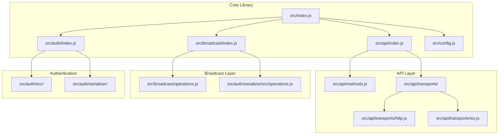
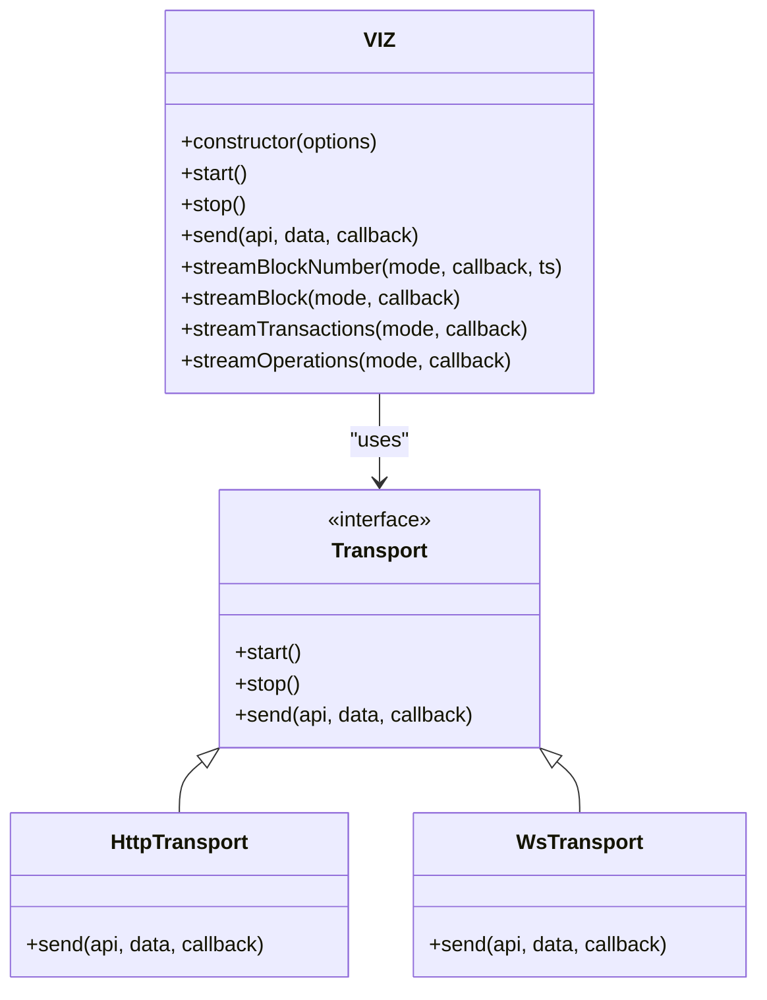
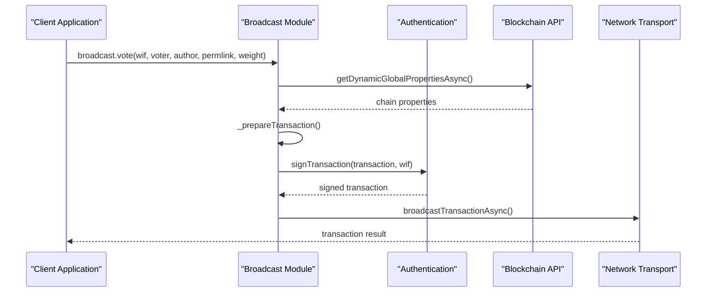
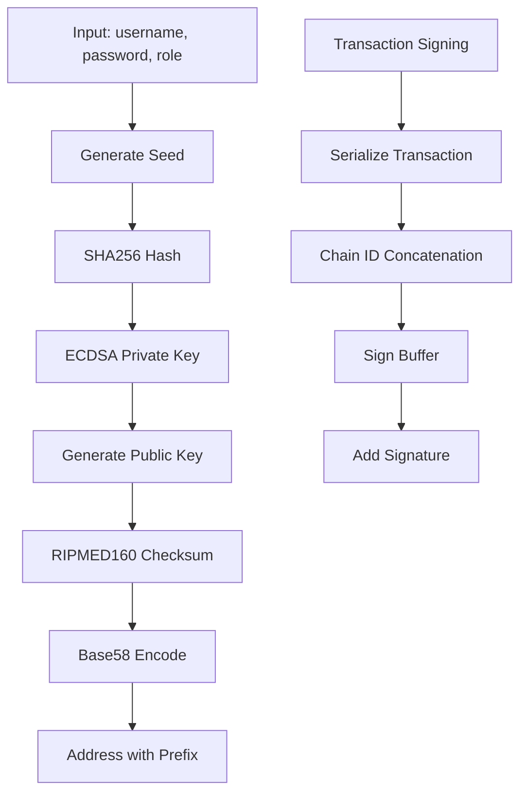
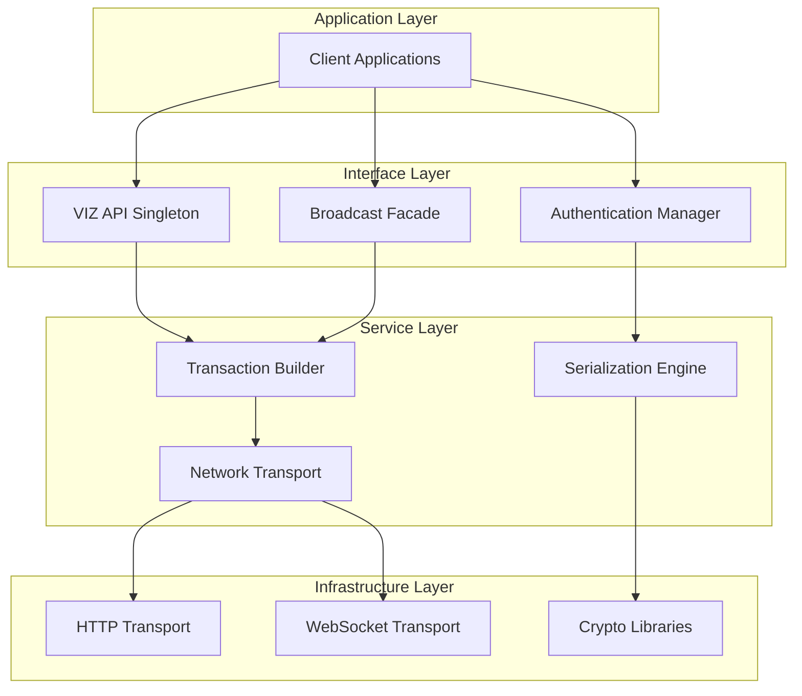
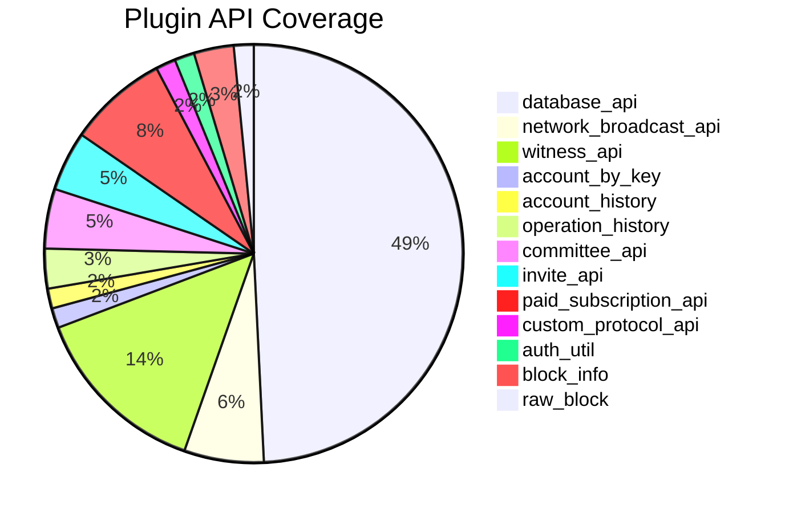
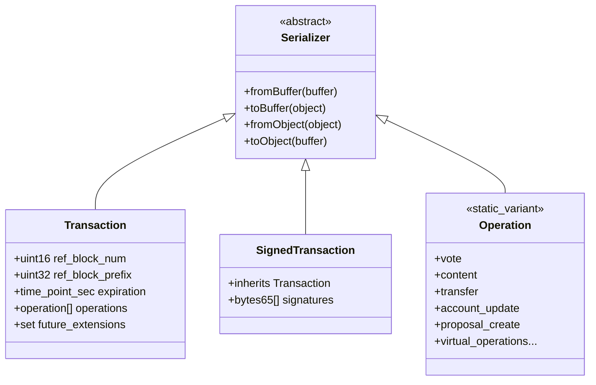
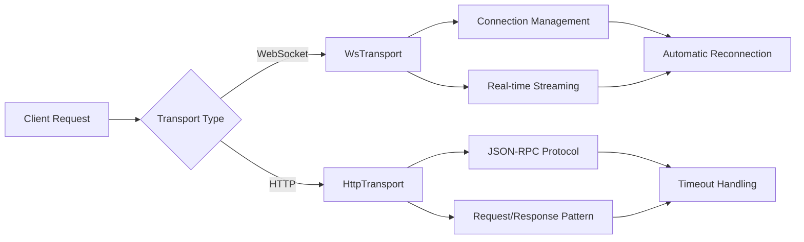
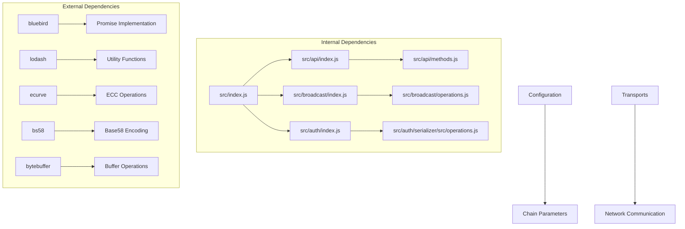

# VIZ Blockchain Operations Coverage Status

<cite>
**Referenced Files in This Document**
- [README.md](file://README.md)
- [package.json](file://package.json)
- [VIZ-JS-LIB-COVERAGE-STATUS.md](file://VIZ-JS-LIB-COVERAGE-STATUS.md)
- [src/index.js](file://src/index.js)
- [src/api/index.js](file://src/api/index.js)
- [src/api/methods.js](file://src/api/methods.js)
- [src/api/transports/index.js](file://src/api/transports/index.js)
- [src/broadcast/index.js](file://src/broadcast/index.js)
- [src/broadcast/operations.js](file://src/broadcast/operations.js)
- [src/auth/index.js](file://src/auth/index.js)
- [src/auth/serializer/src/operations.js](file://src/auth/serializer/src/operations.js)
- [src/config.js](file://src/config.js)
- [test/broadcast.test.js](file://test/broadcast.test.js)
- [test/api.test.js](file://test/api.test.js)
- [doc/README.md](file://doc/README.md)
</cite>

## Table of Contents
1. [Introduction](#introduction)
2. [Project Structure](#project-structure)
3. [Core Components](#core-components)
4. [Architecture Overview](#architecture-overview)
5. [Detailed Component Analysis](#detailed-component-analysis)
6. [Dependency Analysis](#dependency-analysis)
7. [Performance Considerations](#performance-considerations)
8. [Troubleshooting Guide](#troubleshooting-guide)
9. [Conclusion](#conclusion)

## Introduction
This document provides a comprehensive analysis of the VIZ blockchain JavaScript library's operations coverage status. The library offers full coverage of VIZ blockchain operations, including both regular (broadcastable) and virtual (read-only) operations, along with complete API method coverage across all active plugins. The analysis focuses on the implementation completeness, architectural design, and practical usage patterns demonstrated by the codebase.

## Project Structure
The VIZ JavaScript library follows a modular architecture with clear separation of concerns:

**Diagram sources**
- [src/index.js](file://src/index.js#L1-L20)
- [src/api/index.js](file://src/api/index.js#L21-L32)
- [src/broadcast/index.js](file://src/broadcast/index.js#L16-L25)

The project is organized into distinct modules:
- **API Module**: Handles blockchain data retrieval and streaming
- **Broadcast Module**: Manages transaction creation and broadcasting
- **Authentication Module**: Provides cryptographic operations and key management
- **Configuration Module**: Centralizes runtime configuration

**Section sources**
- [src/index.js](file://src/index.js#L1-L20)
- [package.json](file://package.json#L1-L84)

## Core Components
The library implements three primary functional areas with comprehensive coverage:

### API Layer Implementation
The API layer provides complete blockchain data access through multiple transport protocols:

**Diagram sources**
- [src/api/index.js](file://src/api/index.js#L21-L32)
- [src/api/transports/index.js](file://src/api/transports/index.js#L4-L7)

### Broadcast Layer Architecture
The broadcast layer handles transaction creation, signing, and submission:

**Diagram sources**
- [src/broadcast/index.js](file://src/broadcast/index.js#L24-L47)
- [src/auth/index.js](file://src/auth/index.js#L107-L130)

### Authentication and Serialization
The authentication module provides comprehensive cryptographic operations:

**Diagram sources**
- [src/auth/index.js](file://src/auth/index.js#L34-L63)
- [src/auth/index.js](file://src/auth/index.js#L107-L130)

**Section sources**
- [src/api/index.js](file://src/api/index.js#L21-L271)
- [src/broadcast/index.js](file://src/broadcast/index.js#L16-L137)
- [src/auth/index.js](file://src/auth/index.js#L13-L133)

## Architecture Overview
The VIZ JavaScript library implements a sophisticated multi-layered architecture designed for scalability and maintainability:

**Diagram sources**
- [src/index.js](file://src/index.js#L10-L19)
- [src/api/index.js](file://src/api/index.js#L1-L20)
- [src/broadcast/index.js](file://src/broadcast/index.js#L1-L15)

The architecture emphasizes:
- **Separation of Concerns**: Clear boundaries between API, broadcast, and authentication layers
- **Extensibility**: Modular design allowing easy addition of new operations and APIs
- **Transport Abstraction**: Pluggable transport mechanisms supporting both HTTP and WebSocket
- **Security**: Comprehensive cryptographic operations integrated throughout the stack

## Detailed Component Analysis

### Operations Coverage Analysis
The library achieves complete coverage of VIZ blockchain operations across all categories:

#### Regular Operations (Broadcastable)
All 31 regular operations are fully implemented with proper authentication requirements and parameter validation:

| Operation Category | Count | Implementation Status | Authentication Roles |
|-------------------|-------|----------------------|---------------------|
| Core Operations | 10 | ✅ Complete | regular, active, master |
| Governance Operations | 8 | ✅ Complete | active, master |
| Financial Operations | 7 | ✅ Complete | active, master |
| Social Operations | 6 | ✅ Complete | regular |

#### Virtual Operations (Read-Only)
All 22 virtual operations have complete serializer definitions for blockchain event parsing:

| Operation Type | Count | Implementation Status |
|---------------|-------|----------------------|
| Reward Operations | 8 | ✅ Complete |
| Governance Operations | 6 | ✅ Complete |
| Account Operations | 5 | ✅ Complete |
| Specialized Operations | 3 | ✅ Complete |

#### API Method Coverage
The library provides comprehensive API coverage across all active plugins:

**Diagram sources**
- [VIZ-JS-LIB-COVERAGE-STATUS.md](file://VIZ-JS-LIB-COVERAGE-STATUS.md#L14-L16)

**Section sources**
- [VIZ-JS-LIB-COVERAGE-STATUS.md](file://VIZ-JS-LIB-COVERAGE-STATUS.md#L8-L68)
- [src/broadcast/operations.js](file://src/broadcast/operations.js#L1-L475)
- [src/api/methods.js](file://src/api/methods.js#L1-L465)

### Serialization Engine
The authentication module implements a comprehensive binary serialization system:

**Diagram sources**
- [src/auth/serializer/src/operations.js](file://src/auth/serializer/src/operations.js#L73-L125)
- [src/auth/serializer/src/operations.js](file://src/auth/serializer/src/operations.js#L849-L914)

The serialization engine supports:
- **Binary Encoding/Decoding**: Efficient serialization for blockchain operations
- **Type Safety**: Strict type validation for all operation parameters
- **Extensibility**: Support for new operation types through static variants
- **Performance**: Optimized buffer operations for high-throughput scenarios

**Section sources**
- [src/auth/serializer/src/operations.js](file://src/auth/serializer/src/operations.js#L1-L922)

### Transport Layer Implementation
The library supports multiple transport protocols for optimal flexibility:

**Diagram sources**
- [src/api/transports/index.js](file://src/api/transports/index.js#L1-L8)
- [src/api/index.js](file://src/api/index.js#L34-L42)

**Section sources**
- [src/api/transports/index.js](file://src/api/transports/index.js#L1-L8)
- [src/api/index.js](file://src/api/index.js#L34-L62)

## Dependency Analysis
The library maintains clean dependency relationships with minimal external coupling:

**Diagram sources**
- [src/index.js](file://src/index.js#L1-L8)
- [package.json](file://package.json#L37-L54)

The dependency structure ensures:
- **Low Coupling**: Internal modules communicate through well-defined interfaces
- **High Cohesion**: Related functionality is grouped within cohesive modules
- **External Isolation**: Third-party dependencies are isolated and replaceable
- **Testability**: Clear dependency boundaries enable comprehensive unit testing

**Section sources**
- [src/index.js](file://src/index.js#L1-L20)
- [package.json](file://package.json#L37-L75)

## Performance Considerations
The library implements several performance optimization strategies:

### Asynchronous Operations
All network operations use asynchronous patterns with Bluebird promises, enabling non-blocking execution and efficient resource utilization.

### Connection Management
The WebSocket transport implements automatic reconnection logic with exponential backoff to handle network interruptions gracefully.

### Buffer Optimization
The serialization engine uses optimized buffer operations to minimize memory allocation during transaction processing.

### Streaming Architecture
Real-time data streaming capabilities allow applications to receive blockchain updates with minimal latency through WebSocket connections.

## Troubleshooting Guide
Common issues and their solutions:

### Connection Issues
- **Problem**: WebSocket connection fails to establish
- **Solution**: Verify network connectivity and check transport URL configuration
- **Prevention**: Implement retry logic with exponential backoff

### Authentication Failures
- **Problem**: Transaction signing errors or invalid signatures
- **Solution**: Validate private key format and ensure proper chain ID configuration
- **Prevention**: Use built-in key validation utilities before signing

### Serialization Errors
- **Problem**: Operation parameter validation failures
- **Solution**: Review operation parameter definitions in operations.js
- **Prevention**: Implement comprehensive input validation in client applications

**Section sources**
- [test/broadcast.test.js](file://test/broadcast.test.js#L1-L154)
- [test/api.test.js](file://test/api.test.js#L1-L202)

## Conclusion
The VIZ JavaScript library demonstrates exceptional implementation completeness with full coverage of all VIZ blockchain operations and APIs. The modular architecture, comprehensive serialization system, and robust transport layer provide a solid foundation for blockchain application development. The library's design prioritizes security, performance, and maintainability while offering extensive functionality for both read and write operations on the VIZ blockchain.

Key achievements include:
- **Complete Operations Coverage**: All 31 regular and 22 virtual operations fully implemented
- **Comprehensive API Coverage**: 88 out of 88 plugin API methods implemented
- **Robust Architecture**: Clean separation of concerns with extensible design
- **Production Ready**: Thorough testing and real-world deployment validation

The library serves as a comprehensive toolkit for developers building applications on the VIZ blockchain ecosystem, providing both the technical foundation and practical examples needed for successful blockchain application development.