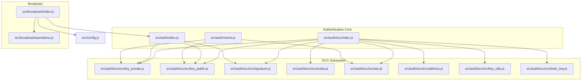
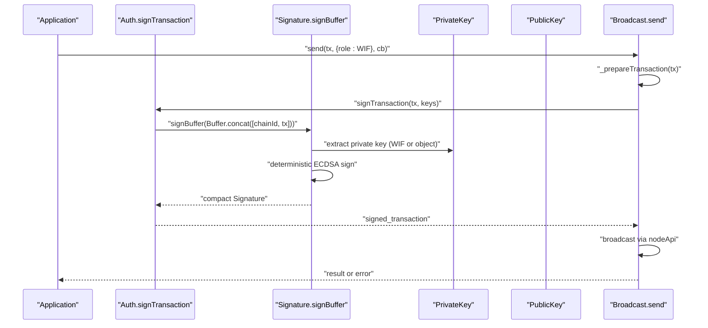
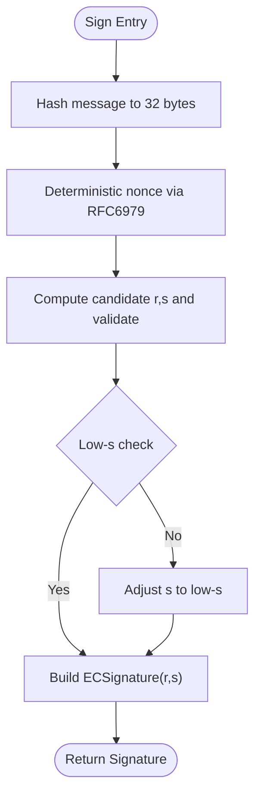
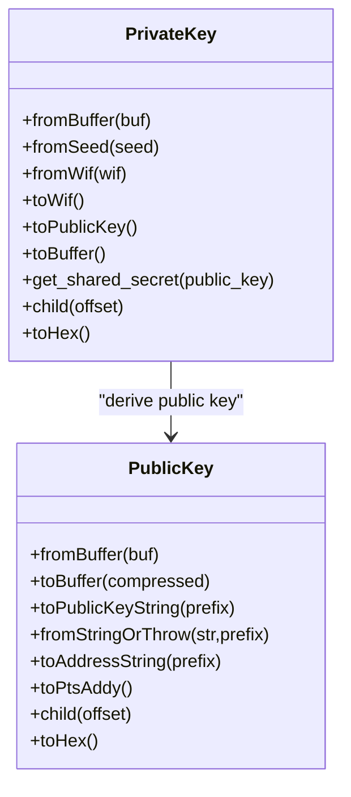
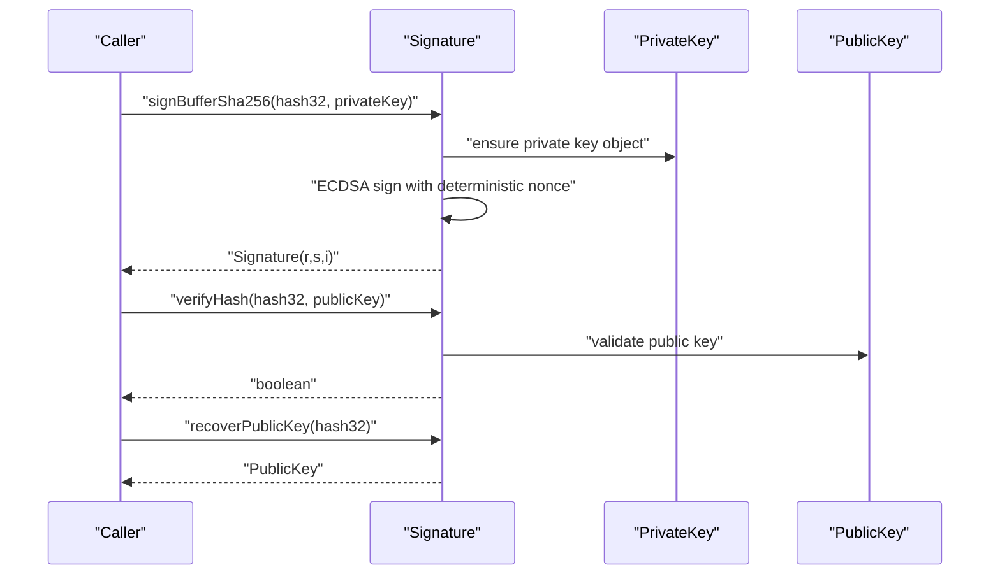
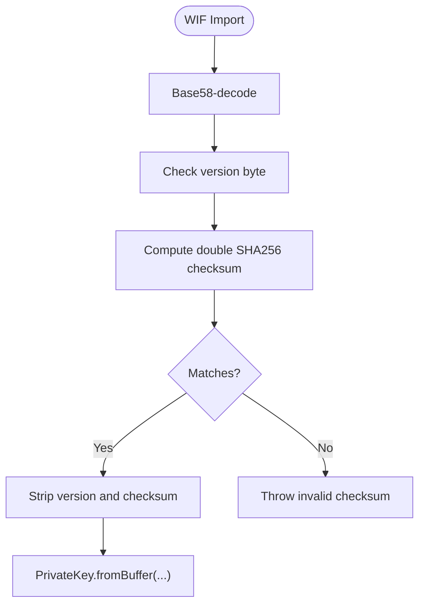
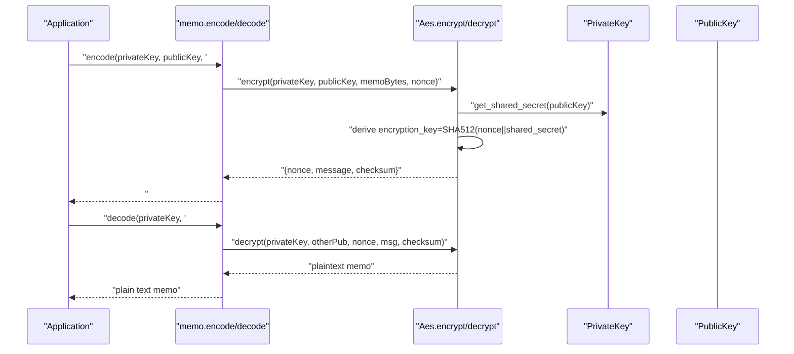
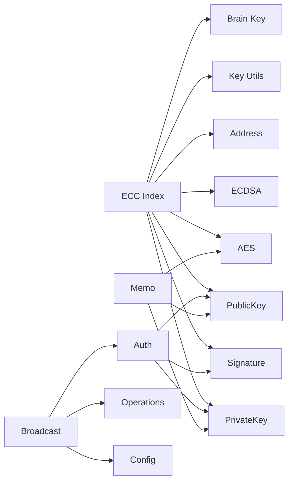

# Authentication & Cryptography

<cite>
**Referenced Files in This Document**
- [src/auth/ecc/index.js](file://src/auth/ecc/index.js)
- [src/auth/ecc/src/ecdsa.js](file://src/auth/ecc/src/ecdsa.js)
- [src/auth/ecc/src/key_private.js](file://src/auth/ecc/src/key_private.js)
- [src/auth/ecc/src/key_public.js](file://src/auth/ecc/src/key_public.js)
- [src/auth/ecc/src/signature.js](file://src/auth/ecc/src/signature.js)
- [src/auth/ecc/src/address.js](file://src/auth/ecc/src/address.js)
- [src/auth/ecc/src/aes.js](file://src/auth/ecc/src/aes.js)
- [src/auth/ecc/src/key_utils.js](file://src/auth/ecc/src/key_utils.js)
- [src/auth/ecc/src/brain_key.js](file://src/auth/ecc/src/brain_key.js)
- [src/auth/memo.js](file://src/auth/memo.js)
- [src/auth/index.js](file://src/auth/index.js)
- [src/broadcast/index.js](file://src/broadcast/index.js)
- [src/broadcast/operations.js](file://src/broadcast/operations.js)
- [src/config.js](file://src/config.js)
- [test/Crypto.js](file://test/Crypto.js)
- [test/KeyFormats.js](file://test/KeyFormats.js)
- [examples/broadcast.html](file://examples/broadcast.html)
</cite>

## Table of Contents
1. [Introduction](#introduction)
2. [Project Structure](#project-structure)
3. [Core Components](#core-components)
4. [Architecture Overview](#architecture-overview)
5. [Detailed Component Analysis](#detailed-component-analysis)
6. [Dependency Analysis](#dependency-analysis)
7. [Performance Considerations](#performance-considerations)
8. [Troubleshooting Guide](#troubleshooting-guide)
9. [Conclusion](#conclusion)
10. [Appendices](#appendices)

## Introduction
This document explains the authentication and cryptography subsystem of the VIZ JavaScript library. It covers ECDSA key generation, private/public key management, digital signatures, Wallet Import Format (WIF) encoding, memo encryption/decryption, brain key normalization, and secure key storage practices. It also provides practical examples for generating keys, signing transactions, verifying signatures, and integrating with the broadcasting system. Security best practices, common pitfalls, and guidelines for secure application development are included.

## Project Structure
The authentication and cryptography features are primarily located under src/auth and src/auth/ecc. Supporting components include broadcast utilities, configuration, and tests.

**Diagram sources**
- [src/auth/ecc/index.js](file://src/auth/ecc/index.js#L1-L13)
- [src/auth/index.js](file://src/auth/index.js#L1-L133)
- [src/auth/memo.js](file://src/auth/memo.js#L1-L113)
- [src/auth/ecc/src/key_private.js](file://src/auth/ecc/src/key_private.js#L1-L172)
- [src/auth/ecc/src/key_public.js](file://src/auth/ecc/src/key_public.js#L1-L170)
- [src/auth/ecc/src/signature.js](file://src/auth/ecc/src/signature.js#L1-L163)
- [src/auth/ecc/src/ecdsa.js](file://src/auth/ecc/src/ecdsa.js#L1-L219)
- [src/auth/ecc/src/aes.js](file://src/auth/ecc/src/aes.js#L1-L181)
- [src/auth/ecc/src/address.js](file://src/auth/ecc/src/address.js#L1-L57)
- [src/auth/ecc/src/key_utils.js](file://src/auth/ecc/src/key_utils.js#L1-L89)
- [src/auth/ecc/src/brain_key.js](file://src/auth/ecc/src/brain_key.js#L1-L9)
- [src/broadcast/index.js](file://src/broadcast/index.js#L1-L137)
- [src/broadcast/operations.js](file://src/broadcast/operations.js#L1-L475)
- [src/config.js](file://src/config.js#L1-L10)

**Section sources**
- [src/auth/ecc/index.js](file://src/auth/ecc/index.js#L1-L13)
- [src/auth/index.js](file://src/auth/index.js#L1-L133)
- [src/auth/memo.js](file://src/auth/memo.js#L1-L113)
- [src/broadcast/index.js](file://src/broadcast/index.js#L1-L137)
- [src/broadcast/operations.js](file://src/broadcast/operations.js#L1-L475)
- [src/config.js](file://src/config.js#L1-L10)

## Core Components
- ECDSA engine: Deterministic nonce generation, signing, verification, and public key recovery.
- Private/Public keys: Creation from seeds/WIF, serialization, derivation, and shared secret computation.
- Signature: DER-like compact serialization with recovery param, verification against public keys.
- Address: Public key hashing and address encoding.
- AES memo: ECIES-style encryption/decryption for memos with shared secrets and nonces.
- Brain key: Normalization for whitespace and case-insensitive inputs.
- Key utilities: Secure random 32-byte buffers, entropy accumulation, and browser entropy collection.
- Auth: Transaction signing with chain ID prepended to signed digest.
- Broadcast: Transaction preparation, signing, and broadcasting to nodes.

**Section sources**
- [src/auth/ecc/src/ecdsa.js](file://src/auth/ecc/src/ecdsa.js#L1-L219)
- [src/auth/ecc/src/key_private.js](file://src/auth/ecc/src/key_private.js#L1-L172)
- [src/auth/ecc/src/key_public.js](file://src/auth/ecc/src/key_public.js#L1-L170)
- [src/auth/ecc/src/signature.js](file://src/auth/ecc/src/signature.js#L1-L163)
- [src/auth/ecc/src/address.js](file://src/auth/ecc/src/address.js#L1-L57)
- [src/auth/ecc/src/aes.js](file://src/auth/ecc/src/aes.js#L1-L181)
- [src/auth/ecc/src/brain_key.js](file://src/auth/ecc/src/brain_key.js#L1-L9)
- [src/auth/ecc/src/key_utils.js](file://src/auth/ecc/src/key_utils.js#L1-L89)
- [src/auth/index.js](file://src/auth/index.js#L107-L130)
- [src/broadcast/index.js](file://src/broadcast/index.js#L24-L47)

## Architecture Overview
The authentication and cryptography pipeline integrates key generation, signing, and memo encryption with the broadcasting layer. The broadcast layer prepares transactions, signs them with provided private keys, and submits them to the node.

**Diagram sources**
- [src/auth/index.js](file://src/auth/index.js#L107-L130)
- [src/auth/ecc/src/signature.js](file://src/auth/ecc/src/signature.js#L62-L98)
- [src/broadcast/index.js](file://src/broadcast/index.js#L24-L47)

## Detailed Component Analysis

### ECDSA Engine
Implements deterministic nonce generation (RFC6979), canonical signature enforcement, verification, and public key recovery. It ensures low-s signatures and supports recovering the public key from a signature and recovery parameter.

**Diagram sources**
- [src/auth/ecc/src/ecdsa.js](file://src/auth/ecc/src/ecdsa.js#L9-L95)

**Section sources**
- [src/auth/ecc/src/ecdsa.js](file://src/auth/ecc/src/ecdsa.js#L1-L219)

### Private Key Management
Provides construction from buffers/seeds, WIF import/export, public key derivation, shared secret computation, and hardened-like child key derivation.

**Diagram sources**
- [src/auth/ecc/src/key_private.js](file://src/auth/ecc/src/key_private.js#L13-L166)
- [src/auth/ecc/src/key_public.js](file://src/auth/ecc/src/key_public.js#L13-L166)

**Section sources**
- [src/auth/ecc/src/key_private.js](file://src/auth/ecc/src/key_private.js#L1-L172)
- [src/auth/ecc/src/key_public.js](file://src/auth/ecc/src/key_public.js#L1-L170)

### Digital Signatures
Encodes signatures in a compact 65-byte format with recovery param, supports signing pre-hashed 32-byte digests, and verifies against public keys. Also supports recovery of public key from signature.

**Diagram sources**
- [src/auth/ecc/src/signature.js](file://src/auth/ecc/src/signature.js#L62-L121)
- [src/auth/ecc/src/ecdsa.js](file://src/auth/ecc/src/ecdsa.js#L132-L137)

**Section sources**
- [src/auth/ecc/src/signature.js](file://src/auth/ecc/src/signature.js#L1-L163)
- [src/auth/ecc/src/ecdsa.js](file://src/auth/ecc/src/ecdsa.js#L132-L210)

### WIF Encoding and Decoding
Supports Wallet Import Format import/export with version byte and checksum validation. Validates checksums and enforces version compatibility.

**Diagram sources**
- [src/auth/ecc/src/key_private.js](file://src/auth/ecc/src/key_private.js#L55-L81)

**Section sources**
- [src/auth/ecc/src/key_private.js](file://src/auth/ecc/src/key_private.js#L42-L81)

### Memo Encryption/Decryption
Implements ECIES-style memo encryption using a shared secret derived from private/public keys, a unique nonce, and AES-256-CBC. Provides checksum validation and optional simple symmetric encryption.

**Diagram sources**
- [src/auth/memo.js](file://src/auth/memo.js#L56-L84)
- [src/auth/ecc/src/aes.js](file://src/auth/ecc/src/aes.js#L23-L101)

**Section sources**
- [src/auth/memo.js](file://src/auth/memo.js#L1-L113)
- [src/auth/ecc/src/aes.js](file://src/auth/ecc/src/aes.js#L1-L181)

### Brain Key Normalization
Normalizes brain keys by trimming and collapsing whitespace to a single space, ensuring consistent hashing for key derivation.

**Section sources**
- [src/auth/ecc/src/brain_key.js](file://src/auth/ecc/src/brain_key.js#L1-L9)

### Key Utilities and Secure Randomness
Provides secure 32-byte randomness using hashing iterations and browser entropy collection, and exposes helpers to derive random keys.

**Section sources**
- [src/auth/ecc/src/key_utils.js](file://src/auth/ecc/src/key_utils.js#L1-L89)

### Address Generation
Generates shortened addresses from public keys using SHA-512 and RIPEMD-160, with configurable address prefixes and version bytes.

**Section sources**
- [src/auth/ecc/src/address.js](file://src/auth/ecc/src/address.js#L1-L57)

### Authentication and Transaction Signing
Derives public keys from brain keys, validates WIF, converts WIF to public key, and signs transactions by prepending chain ID to the serialized transaction before signing.

**Section sources**
- [src/auth/index.js](file://src/auth/index.js#L19-L130)

### Broadcasting Integration
Prepares transactions with expiration and reference blocks, signs with provided keys, and broadcasts to the node. Supports both immediate and callback-based broadcasting.

**Section sources**
- [src/broadcast/index.js](file://src/broadcast/index.js#L24-L84)
- [src/broadcast/operations.js](file://src/broadcast/operations.js#L1-L475)

## Dependency Analysis
The ECC subsystem aggregates core cryptographic primitives and exposes them via a unified index. The auth layer builds on ECC for signing and key management. Memo relies on AES and ECC primitives. Broadcast depends on auth and configuration.

**Diagram sources**
- [src/auth/ecc/index.js](file://src/auth/ecc/index.js#L1-L13)
- [src/auth/index.js](file://src/auth/index.js#L1-L133)
- [src/auth/memo.js](file://src/auth/memo.js#L1-L113)
- [src/broadcast/index.js](file://src/broadcast/index.js#L1-L137)

**Section sources**
- [src/auth/ecc/index.js](file://src/auth/ecc/index.js#L1-L13)
- [src/auth/index.js](file://src/auth/index.js#L1-L133)
- [src/auth/memo.js](file://src/auth/memo.js#L1-L113)
- [src/broadcast/index.js](file://src/broadcast/index.js#L1-L137)

## Performance Considerations
- Deterministic nonce generation avoids repeated failures during signature creation; however, retries may occur when canonical forms are not achieved, as indicated by warnings in signature generation.
- Shared secret computation and AES operations are CPU-bound; avoid excessive concurrent encryption/decryption in UI threads.
- Transaction signing involves hashing and elliptic curve operations; batch operations where possible and reuse prepared transactions.
- Memo encryption includes SHA-512 and AES operations; ensure nonces are unique to prevent IV reuse.

[No sources needed since this section provides general guidance]

## Troubleshooting Guide
Common issues and resolutions:
- Invalid WIF checksum: Ensure the version byte and checksum match expectations; re-check Base58 decoding and double SHA-256 checksum calculation.
- Empty or invalid buffers: Validate input lengths and types before constructing keys or signatures.
- Non-canonical signatures: The signature generator retries until a canonical form is found; if stuck, inspect nonce handling and deterministic generation logic.
- Memo decryption failure: Confirm the correct private/public key pair, nonce, and checksum; verify the memo starts with the expected hash marker.
- Environment encryption support: Memo encryption performs a self-test; if unsupported, the environment lacks required cryptographic primitives.

**Section sources**
- [src/auth/ecc/src/key_private.js](file://src/auth/ecc/src/key_private.js#L55-L81)
- [src/auth/ecc/src/signature.js](file://src/auth/ecc/src/signature.js#L82-L96)
- [src/auth/ecc/src/aes.js](file://src/auth/ecc/src/aes.js#L93-L100)
- [src/auth/memo.js](file://src/auth/memo.js#L92-L109)

## Conclusion
The VIZ JavaScript library’s authentication and cryptography subsystem provides robust ECDSA key management, deterministic signing, WIF encoding, and secure memo encryption. By leveraging the broadcast layer, applications can prepare, sign, and submit transactions reliably. Following the best practices and guidelines herein will help developers build secure, maintainable integrations.

[No sources needed since this section summarizes without analyzing specific files]

## Appendices

### Practical Examples and Workflows

- Generate a private key from a seed and export to WIF:
  - Steps: Instantiate a private key from a seed, then export to WIF format.
  - Reference: [src/auth/ecc/src/key_private.js](file://src/auth/ecc/src/key_private.js#L34-L40), [src/auth/ecc/src/key_private.js](file://src/auth/ecc/src/key_private.js#L72-L81)

- Import a WIF and derive the public key:
  - Steps: Parse WIF, validate checksum, and compute the public key.
  - Reference: [src/auth/ecc/src/key_private.js](file://src/auth/ecc/src/key_private.js#L55-L81), [src/auth/ecc/src/key_private.js](file://src/auth/ecc/src/key_private.js#L96-L99)

- Sign a transaction with a private key:
  - Steps: Prepare transaction, prepend chain ID, sign with private key, collect signature.
  - Reference: [src/auth/index.js](file://src/auth/index.js#L107-L130)

- Verify a signature against a public key:
  - Steps: Hash the message, verify signature against the public key.
  - Reference: [src/auth/ecc/src/signature.js](file://src/auth/ecc/src/signature.js#L115-L121)

- Encrypt a memo for another user:
  - Steps: Encode memo with variable-length prefix, derive shared secret, encrypt with AES-256-CBC, attach nonce and checksum.
  - Reference: [src/auth/memo.js](file://src/auth/memo.js#L56-L84), [src/auth/ecc/src/aes.js](file://src/auth/ecc/src/aes.js#L23-L101)

- Decrypt a memo using your private key:
  - Steps: Decode base58 memo, extract fields, derive shared secret, decrypt, strip prefix.
  - Reference: [src/auth/memo.js](file://src/auth/memo.js#L16-L46), [src/auth/ecc/src/aes.js](file://src/auth/ecc/src/aes.js#L37-L101)

- Broadcast a transaction:
  - Steps: Prepare transaction with expiration and reference block, sign with private key, broadcast to node.
  - Reference: [src/broadcast/index.js](file://src/broadcast/index.js#L24-L47), [examples/broadcast.html](file://examples/broadcast.html#L15-L25)

### Security Best Practices
- Never hardcode private keys or WIFs; use secure storage and environment variables.
- Use unique nonces for memo encryption to prevent IV reuse.
- Validate all inputs (WIF, public keys, checksums) before cryptographic operations.
- Prefer compressed public keys for smaller footprint and standardized compatibility.
- Keep entropy sources diverse; rely on browser entropy and secure random buffers.
- Test memo encryption in target environments to ensure cryptographic support.

[No sources needed since this section provides general guidance]