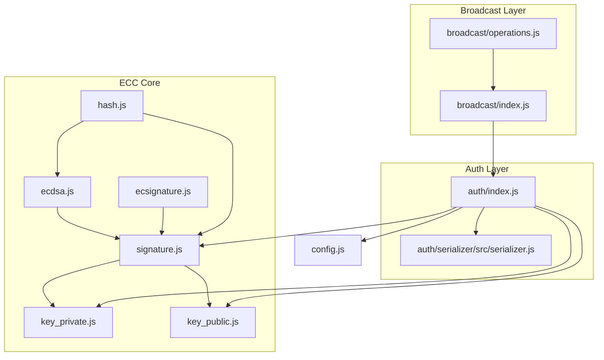
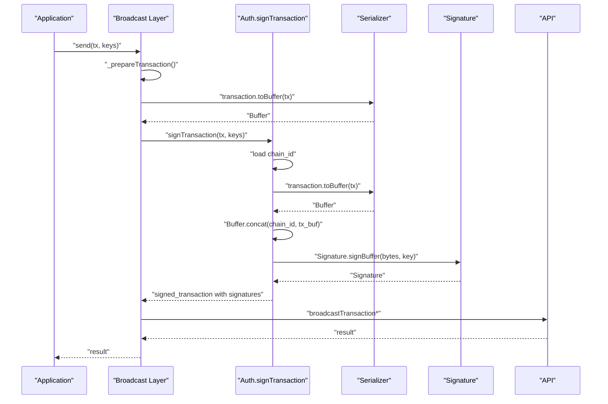
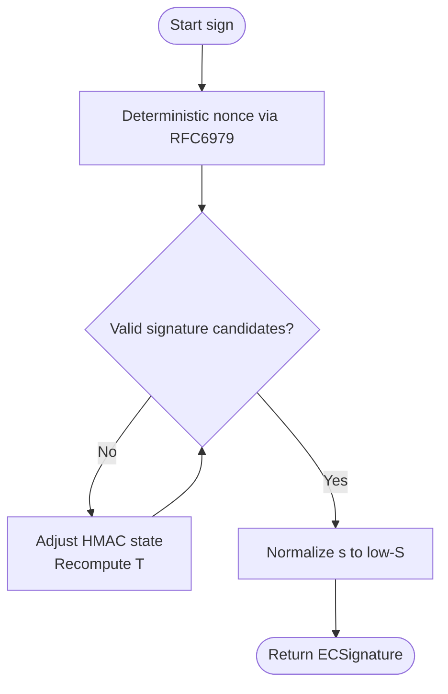
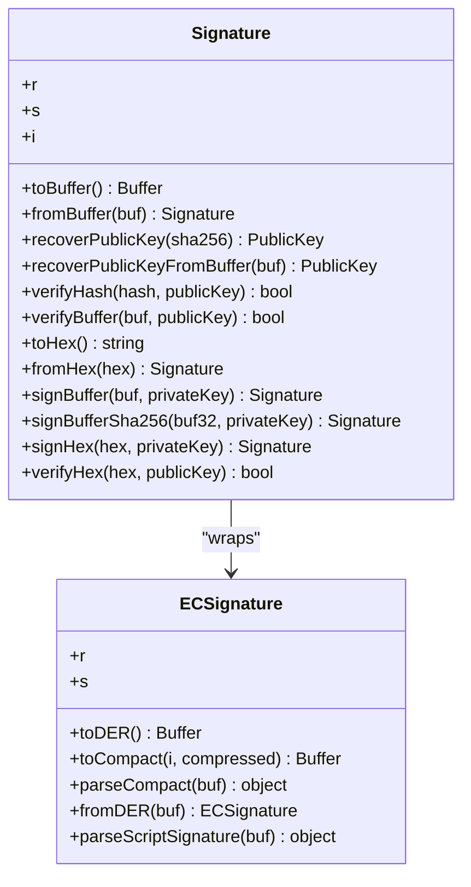
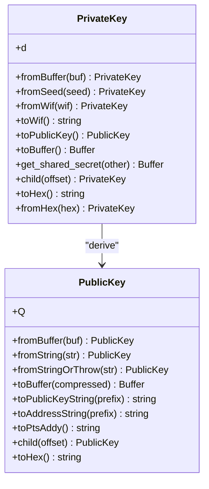
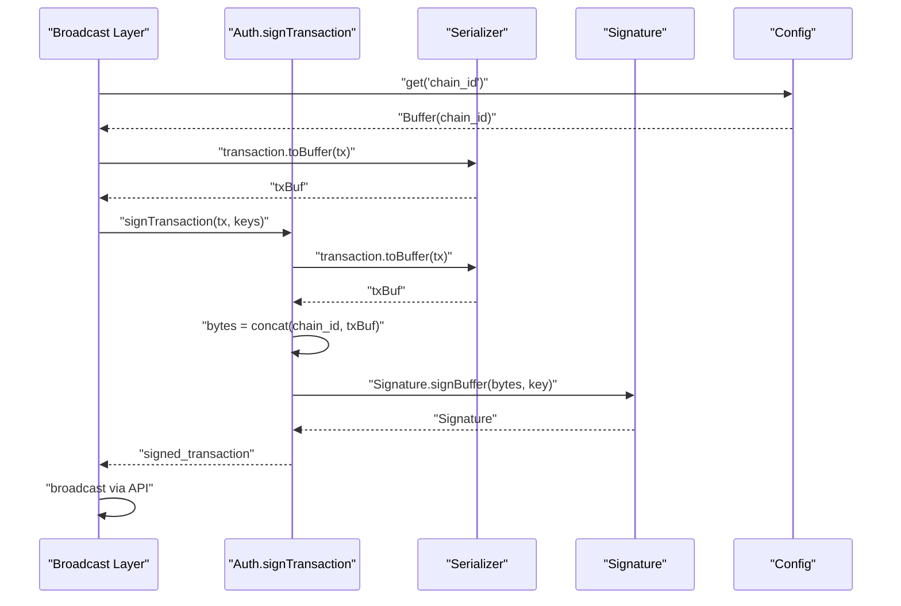
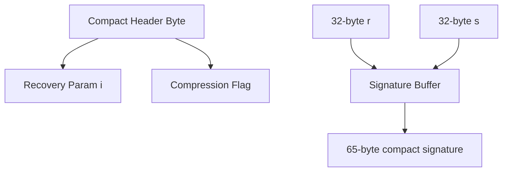
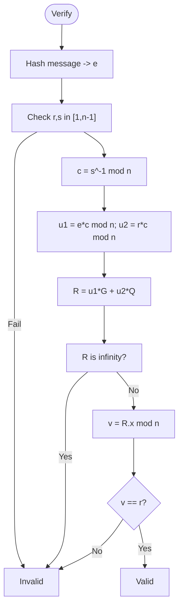
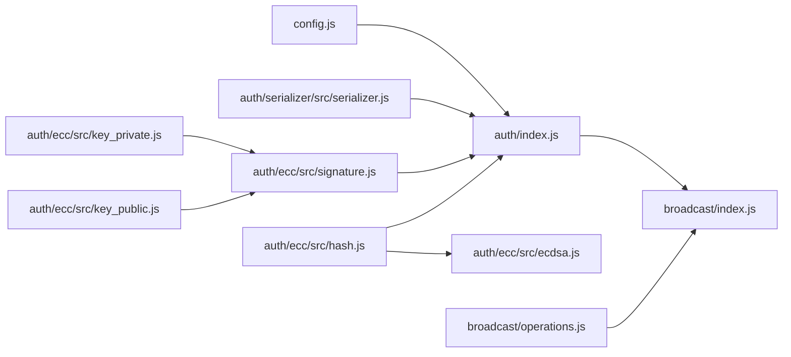

# Digital Signatures

<cite>
**Referenced Files in This Document**
- [ecdsa.js](file://src/auth/ecc/src/ecdsa.js)
- [signature.js](file://src/auth/ecc/src/signature.js)
- [key_private.js](file://src/auth/ecc/src/key_private.js)
- [key_public.js](file://src/auth/ecc/src/key_public.js)
- [ecsignature.js](file://src/auth/ecc/src/ecsignature.js)
- [hash.js](file://src/auth/ecc/src/hash.js)
- [auth_index.js](file://src/auth/index.js)
- [broadcast_index.js](file://src/broadcast/index.js)
- [operations.js](file://src/broadcast/operations.js)
- [serializer.js](file://src/auth/serializer/src/serializer.js)
- [config.js](file://src/config.js)
- [Crypto.js](file://test/Crypto.js)
- [broadcast.html](file://examples/broadcast.html)
</cite>

## Table of Contents
1. [Introduction](#introduction)
2. [Project Structure](#project-structure)
3. [Core Components](#core-components)
4. [Architecture Overview](#architecture-overview)
5. [Detailed Component Analysis](#detailed-component-analysis)
6. [Dependency Analysis](#dependency-analysis)
7. [Performance Considerations](#performance-considerations)
8. [Troubleshooting Guide](#troubleshooting-guide)
9. [Conclusion](#conclusion)
10. [Appendices](#appendices)

## Introduction
This document explains the digital signature functionality in the VIZ JavaScript library with a focus on ECDSA signature generation, verification, and buffer handling. It covers how signatures are created for blockchain transactions, including chain ID integration and signature serialization, as well as validation workflows and integration with the broadcasting system. Practical examples demonstrate signing transactions, verifying signatures, and handling signature errors. Security considerations and performance optimization techniques are also addressed.

## Project Structure
The signature subsystem is primarily located under src/auth/ecc and integrates with the authentication and broadcasting layers. Key areas:
- ECC primitives and ECDSA implementation
- Signature class and compact DER encoding
- Private/Public key management
- Transaction signing and broadcasting pipeline
- Serializer for transaction buffers
- Configuration for chain ID and prefixes

**Diagram sources**
- [ecdsa.js](file://src/auth/ecc/src/ecdsa.js#L1-L219)
- [signature.js](file://src/auth/ecc/src/signature.js#L1-L163)
- [key_private.js](file://src/auth/ecc/src/key_private.js#L1-L172)
- [key_public.js](file://src/auth/ecc/src/key_public.js#L1-L170)
- [ecsignature.js](file://src/auth/ecc/src/ecsignature.js#L1-L127)
- [hash.js](file://src/auth/ecc/src/hash.js#L1-L59)
- [auth_index.js](file://src/auth/index.js#L1-L133)
- [serializer.js](file://src/auth/serializer/src/serializer.js#L1-L195)
- [broadcast_index.js](file://src/broadcast/index.js#L1-L137)
- [operations.js](file://src/broadcast/operations.js#L1-L475)
- [config.js](file://src/config.js#L1-L10)

**Section sources**
- [ecdsa.js](file://src/auth/ecc/src/ecdsa.js#L1-L219)
- [signature.js](file://src/auth/ecc/src/signature.js#L1-L163)
- [key_private.js](file://src/auth/ecc/src/key_private.js#L1-L172)
- [key_public.js](file://src/auth/ecc/src/key_public.js#L1-L170)
- [ecsignature.js](file://src/auth/ecc/src/ecsignature.js#L1-L127)
- [hash.js](file://src/auth/ecc/src/hash.js#L1-L59)
- [auth_index.js](file://src/auth/index.js#L1-L133)
- [serializer.js](file://src/auth/serializer/src/serializer.js#L1-L195)
- [broadcast_index.js](file://src/broadcast/index.js#L1-L137)
- [operations.js](file://src/broadcast/operations.js#L1-L475)
- [config.js](file://src/config.js#L1-L10)

## Core Components
- ECDSA engine: deterministic nonce generation, signature computation, verification, and public key recovery.
- Signature class: compact 65-byte encoding, DER conversion, hashing, and recovery of public keys from signatures.
- Private/Public keys: WIF encoding/decoding, shared secret derivation, and point arithmetic.
- Transaction signing: chain ID concatenation, transaction serialization, and signature aggregation.
- Broadcasting: transaction preparation, signing orchestration, and API broadcast.

**Section sources**
- [ecdsa.js](file://src/auth/ecc/src/ecdsa.js#L65-L137)
- [signature.js](file://src/auth/ecc/src/signature.js#L9-L163)
- [key_private.js](file://src/auth/ecc/src/key_private.js#L13-L168)
- [key_public.js](file://src/auth/ecc/src/key_public.js#L13-L170)
- [auth_index.js](file://src/auth/index.js#L107-L130)

## Architecture Overview
The signing pipeline integrates hashing, ECDSA, and serialization to produce a signed transaction ready for broadcast. Chain ID is prepended to the serialized transaction bytes prior to signing. The broadcaster prepares reference blocks and expiration, signs with provided keys, and submits to the API.

**Diagram sources**
- [broadcast_index.js](file://src/broadcast/index.js#L24-L47)
- [broadcast_index.js](file://src/broadcast/index.js#L49-L84)
- [auth_index.js](file://src/auth/index.js#L107-L130)
- [serializer.js](file://src/auth/serializer/src/serializer.js#L184-L192)
- [signature.js](file://src/auth/ecc/src/signature.js#L62-L98)

## Detailed Component Analysis

### ECDSA Engine
Implements deterministic nonce generation (RFC6979), signature computation with low-S normalization, raw verification, and public key recovery with recovery parameter calculation.

**Diagram sources**
- [ecdsa.js](file://src/auth/ecc/src/ecdsa.js#L9-L63)
- [ecdsa.js](file://src/auth/ecc/src/ecdsa.js#L65-L95)

**Section sources**
- [ecdsa.js](file://src/auth/ecc/src/ecdsa.js#L65-L137)
- [ecdsa.js](file://src/auth/ecc/src/ecdsa.js#L147-L209)

### Signature Class
Provides compact 65-byte encoding (including recovery parameter), DER conversion, SHA-256 hashing, public key recovery, and convenience methods for buffers, hex, and strings.

**Diagram sources**
- [signature.js](file://src/auth/ecc/src/signature.js#L9-L163)
- [ecsignature.js](file://src/auth/ecc/src/ecsignature.js#L6-L127)

**Section sources**
- [signature.js](file://src/auth/ecc/src/signature.js#L20-L163)
- [ecsignature.js](file://src/auth/ecc/src/ecsignature.js#L14-L127)

### Private and Public Keys
Manage key material, WIF encoding/decoding, public key derivation from private key, shared secrets, and hierarchical derivation.

**Diagram sources**
- [key_private.js](file://src/auth/ecc/src/key_private.js#L13-L168)
- [key_public.js](file://src/auth/ecc/src/key_public.js#L13-L170)

**Section sources**
- [key_private.js](file://src/auth/ecc/src/key_private.js#L21-L168)
- [key_public.js](file://src/auth/ecc/src/key_public.js#L22-L170)

### Transaction Signing and Broadcasting
- Chain ID is loaded from configuration and concatenated with the serialized transaction.
- The transaction is signed with the provided private key(s), producing compact signatures appended to the signed transaction.
- The broadcaster prepares reference blocks and expiration, then broadcasts the signed transaction.

**Diagram sources**
- [broadcast_index.js](file://src/broadcast/index.js#L24-L47)
- [broadcast_index.js](file://src/broadcast/index.js#L49-L84)
- [auth_index.js](file://src/auth/index.js#L107-L130)
- [config.js](file://src/config.js#L1-L10)

**Section sources**
- [auth_index.js](file://src/auth/index.js#L107-L130)
- [broadcast_index.js](file://src/broadcast/index.js#L24-L84)
- [operations.js](file://src/broadcast/operations.js#L1-L475)

### Signature Buffer Encoding/Decoding and Standards
- Compact encoding: 65-byte buffer with a header byte indicating recovery parameter and compression, followed by r and s as 32-byte big-endian integers.
- DER encoding: standard ASN.1 DER integer sequences for r and s.
- Recovery parameter: embedded in the compact header to allow public key reconstruction.

**Diagram sources**
- [signature.js](file://src/auth/ecc/src/signature.js#L20-L54)
- [ecsignature.js](file://src/auth/ecc/src/ecsignature.js#L86-L97)

**Section sources**
- [signature.js](file://src/auth/ecc/src/signature.js#L20-L54)
- [ecsignature.js](file://src/auth/ecc/src/ecsignature.js#L14-L97)

### Verification Workflows
- Raw verification: compute u1, u2, point multiplication, and compare affine X coordinate modulo n with r.
- Public key recovery: reconstruct candidate public keys from signature and message hash, then validate against expected public key.

**Diagram sources**
- [ecdsa.js](file://src/auth/ecc/src/ecdsa.js#L97-L137)
- [ecdsa.js](file://src/auth/ecc/src/ecdsa.js#L147-L209)

**Section sources**
- [ecdsa.js](file://src/auth/ecc/src/ecdsa.js#L97-L137)
- [ecdsa.js](file://src/auth/ecc/src/ecdsa.js#L147-L209)

### Practical Examples
- Signing a transaction with a WIF key and broadcasting a vote:
  - See example usage in the HTML example invoking broadcast methods.
- Verifying a signature against a public key:
  - Use Signature.verifyBuffer or Signature.verifyHash in tests.

**Section sources**
- [broadcast.html](file://examples/broadcast.html#L15-L25)
- [Crypto.js](file://test/Crypto.js#L15-L25)

## Dependency Analysis
- Auth.signTransaction depends on:
  - Serializer for transaction.toBuffer
  - Signature.signBuffer for signing
  - Config for chain_id
- Broadcast Layer depends on:
  - Auth.signTransaction
  - API for broadcasting
  - Operations metadata for wrappers
- ECC components depend on:
  - BigInteger and ecurve for curve math
  - Hash utilities for SHA-256, RIPEMD-160, HMAC-SHA256

**Diagram sources**
- [auth_index.js](file://src/auth/index.js#L107-L130)
- [broadcast_index.js](file://src/broadcast/index.js#L24-L47)
- [operations.js](file://src/broadcast/operations.js#L1-L475)
- [config.js](file://src/config.js#L1-L10)
- [serializer.js](file://src/auth/serializer/src/serializer.js#L184-L192)
- [signature.js](file://src/auth/ecc/src/signature.js#L62-L98)
- [hash.js](file://src/auth/ecc/src/hash.js#L16-L34)
- [ecdsa.js](file://src/auth/ecc/src/ecdsa.js#L1-L219)
- [key_private.js](file://src/auth/ecc/src/key_private.js#L1-L172)
- [key_public.js](file://src/auth/ecc/src/key_public.js#L1-L170)

**Section sources**
- [auth_index.js](file://src/auth/index.js#L107-L130)
- [broadcast_index.js](file://src/broadcast/index.js#L24-L47)
- [operations.js](file://src/broadcast/operations.js#L1-L475)
- [config.js](file://src/config.js#L1-L10)
- [serializer.js](file://src/auth/serializer/src/serializer.js#L184-L192)
- [signature.js](file://src/auth/ecc/src/signature.js#L62-L98)
- [hash.js](file://src/auth/ecc/src/hash.js#L16-L34)
- [ecdsa.js](file://src/auth/ecc/src/ecdsa.js#L1-L219)
- [key_private.js](file://src/auth/ecc/src/key_private.js#L1-L172)
- [key_public.js](file://src/auth/ecc/src/key_public.js#L1-L170)

## Performance Considerations
- Deterministic nonce generation avoids repeated attempts in typical cases; however, the implementation retries until canonical signatures are produced. This is bounded and logged periodically.
- Low-S normalization reduces signature size and improves compatibility.
- Efficient buffer operations:
  - Use Buffer.concat judiciously; pre-allocate buffers when possible.
  - Prefer SHA-256 hashing once per message and reuse results.
- Serialization:
  - Reuse ByteBuffer instances where feasible to reduce allocations.
- Broadcasting:
  - Batch operations when possible to minimize round trips.

[No sources needed since this section provides general guidance]

## Troubleshooting Guide
Common issues and resolutions:
- Invalid signature length or malformed compact header:
  - Ensure signatures are 65 bytes and header byte is valid.
- Signature verification fails:
  - Confirm message hash matches the one used during signing.
  - Verify the correct public key is used for verification.
- WIF decoding errors:
  - Validate checksum and version byte.
- Chain ID mismatch:
  - Ensure the configured chain_id matches the target network.
- Transaction not accepted:
  - Check reference block numbers and expiration.
  - Confirm required signatures are present.

**Section sources**
- [signature.js](file://src/auth/ecc/src/signature.js#L20-L28)
- [signature.js](file://src/auth/ecc/src/signature.js#L115-L121)
- [key_private.js](file://src/auth/ecc/src/key_private.js#L55-L70)
- [auth_index.js](file://src/auth/index.js#L113-L122)
- [broadcast_index.js](file://src/broadcast/index.js#L49-L84)

## Conclusion
The VIZ JavaScript library’s signature subsystem provides a robust, standards-compliant implementation of ECDSA with compact encoding, deterministic nonce generation, and seamless integration with transaction serialization and broadcasting. By adhering to the outlined workflows and best practices, developers can reliably sign and verify transactions while maintaining security and performance.

[No sources needed since this section summarizes without analyzing specific files]

## Appendices

### Security Considerations
- Use deterministic nonce generation to prevent nonce reuse vulnerabilities.
- Normalize s-values to low-S to avoid signature malleability.
- Validate all inputs: signatures, public keys, and chain IDs.
- Protect private keys and WIFs; prefer hardware or secure enclaves when possible.

[No sources needed since this section provides general guidance]

### Example References
- Signing and broadcasting a vote:
  - [broadcast.html](file://examples/broadcast.html#L15-L25)
- Signature verification tests:
  - [Crypto.js](file://test/Crypto.js#L15-L25)

[No sources needed since this section aggregates references]