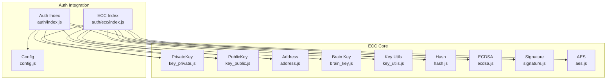
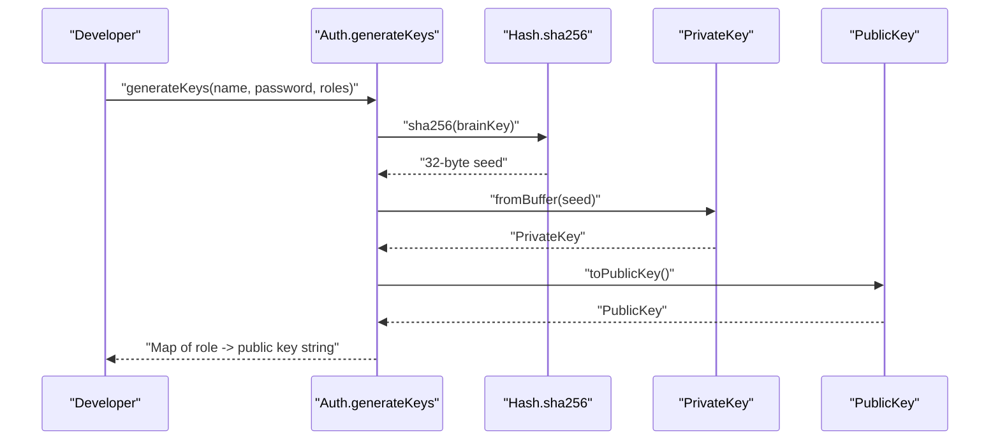
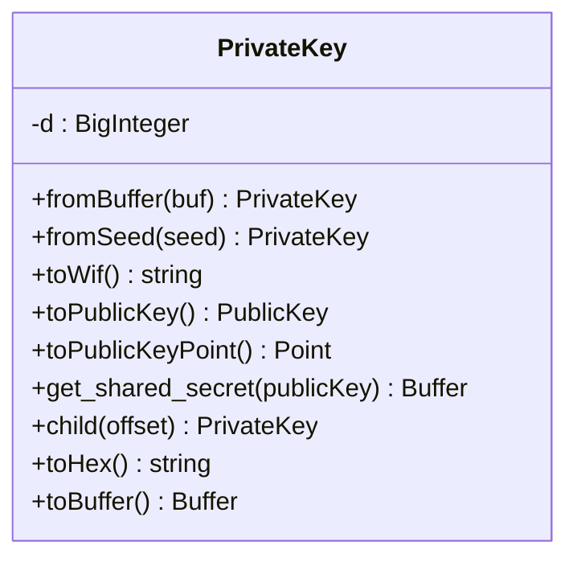
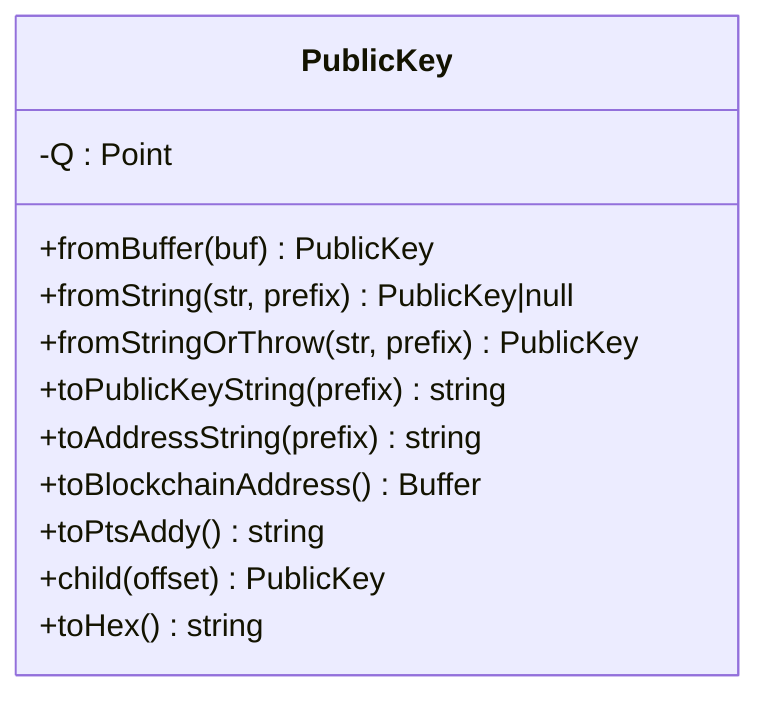
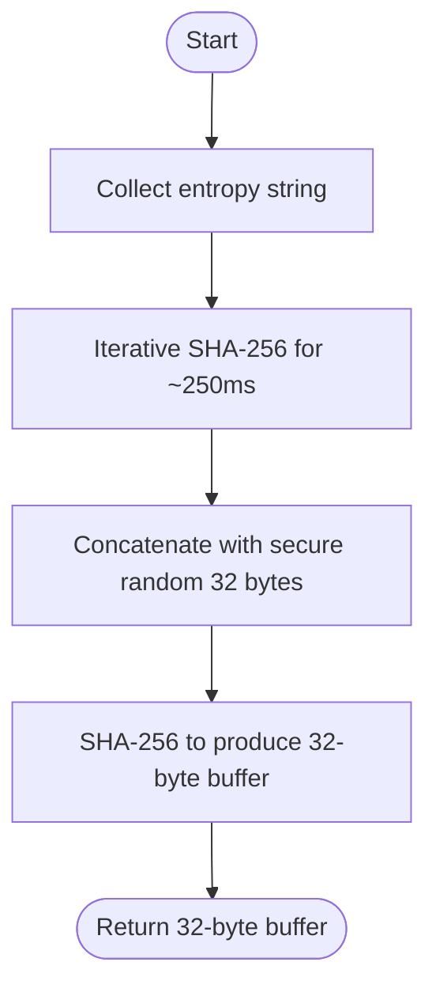
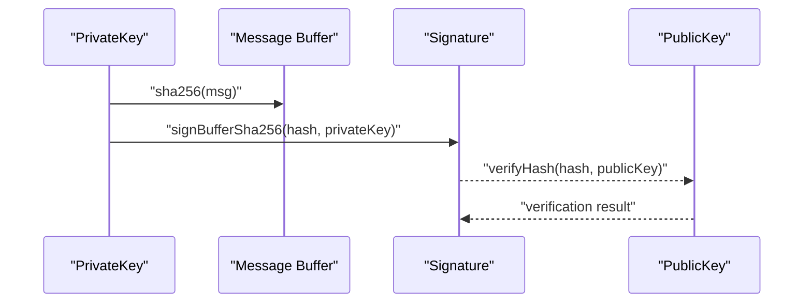
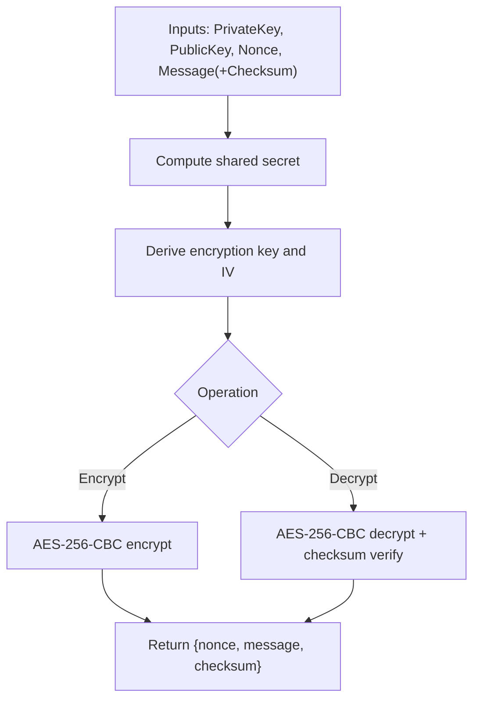
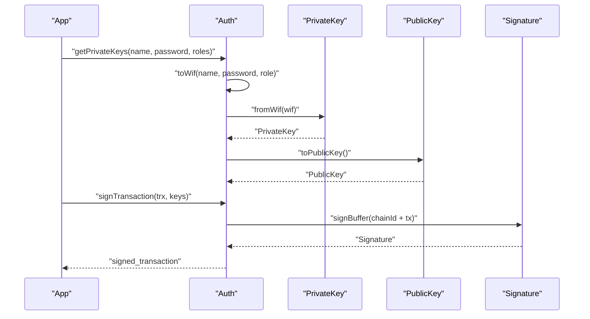
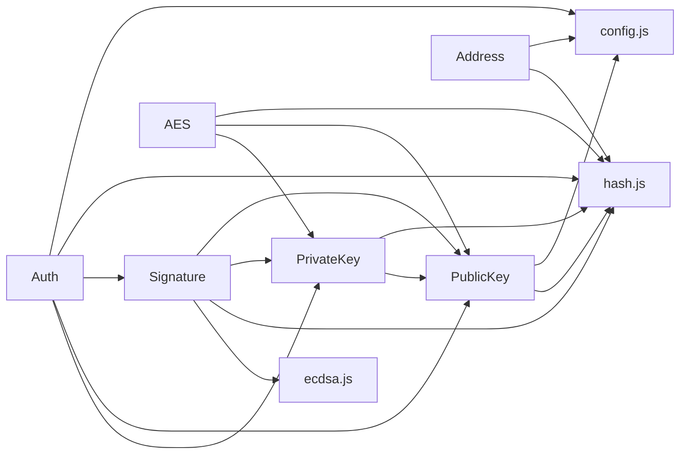

# Key Management

<cite>
**Referenced Files in This Document**
- [src/auth/ecc/index.js](file://src/auth/ecc/index.js)
- [src/auth/ecc/src/key_private.js](file://src/auth/ecc/src/key_private.js)
- [src/auth/ecc/src/key_public.js](file://src/auth/ecc/src/key_public.js)
- [src/auth/ecc/src/brain_key.js](file://src/auth/ecc/src/brain_key.js)
- [src/auth/ecc/src/key_utils.js](file://src/auth/ecc/src/key_utils.js)
- [src/auth/ecc/src/hash.js](file://src/auth/ecc/src/hash.js)
- [src/auth/ecc/src/address.js](file://src/auth/ecc/src/address.js)
- [src/auth/ecc/src/ecdsa.js](file://src/auth/ecc/src/ecdsa.js)
- [src/auth/ecc/src/signature.js](file://src/auth/ecc/src/signature.js)
- [src/auth/ecc/src/aes.js](file://src/auth/ecc/src/aes.js)
- [src/auth/index.js](file://src/auth/index.js)
- [src/config.js](file://src/config.js)
- [test/KeyFormats.js](file://test/KeyFormats.js)
- [test/Crypto.js](file://test/Crypto.js)
- [examples/broadcast.html](file://examples/broadcast.html)
</cite>

## Table of Contents
1. [Introduction](#introduction)
2. [Project Structure](#project-structure)
3. [Core Components](#core-components)
4. [Architecture Overview](#architecture-overview)
5. [Detailed Component Analysis](#detailed-component-analysis)
6. [Dependency Analysis](#dependency-analysis)
7. [Performance Considerations](#performance-considerations)
8. [Troubleshooting Guide](#troubleshooting-guide)
9. [Conclusion](#conclusion)
10. [Appendices](#appendices)

## Introduction
This document explains the key management functionality in the VIZ JavaScript library. It covers private key generation, public key derivation, Wallet Import Format (WIF) encoding and decoding, and key validation. It also documents the relationship between brain keys, private keys, and public keys, and provides practical examples for generating keys from account names and passwords, converting between formats, and validating key authenticity. Security best practices for key storage, WIF handling, and integration with the authentication system are included, along with common workflows and troubleshooting guidance.

## Project Structure
The key management system resides under the ECC (Elliptic Curve Cryptography) module within the authentication subsystem. The primary building blocks are:
- Private key and public key classes
- Brain key normalization
- Key utilities for secure randomness and entropy
- Hash functions for SHA-256, SHA-512, RIPEMD-160, and HMAC-SHA256
- Address utilities for public key-derived addresses
- ECDSA signing and verification
- Signature recovery
- AES-based memo encryption/decryption
- Authentication helpers for brain key-based key derivation and WIF handling

**Diagram sources**
- [src/auth/ecc/index.js](file://src/auth/ecc/index.js#L1-L13)
- [src/auth/ecc/src/key_private.js](file://src/auth/ecc/src/key_private.js#L1-L172)
- [src/auth/ecc/src/key_public.js](file://src/auth/ecc/src/key_public.js#L1-L170)
- [src/auth/ecc/src/address.js](file://src/auth/ecc/src/address.js#L1-L57)
- [src/auth/ecc/src/brain_key.js](file://src/auth/ecc/src/brain_key.js#L1-L9)
- [src/auth/ecc/src/key_utils.js](file://src/auth/ecc/src/key_utils.js#L1-L89)
- [src/auth/ecc/src/hash.js](file://src/auth/ecc/src/hash.js#L1-L59)
- [src/auth/ecc/src/ecdsa.js](file://src/auth/ecc/src/ecdsa.js#L1-L219)
- [src/auth/ecc/src/signature.js](file://src/auth/ecc/src/signature.js#L1-L163)
- [src/auth/ecc/src/aes.js](file://src/auth/ecc/src/aes.js#L1-L181)
- [src/auth/index.js](file://src/auth/index.js#L1-L133)
- [src/config.js](file://src/config.js#L1-L10)

**Section sources**
- [src/auth/ecc/index.js](file://src/auth/ecc/index.js#L1-L13)
- [src/auth/index.js](file://src/auth/index.js#L1-L133)

## Core Components
- PrivateKey: Generates private keys from seeds or buffers, supports WIF encode/decode, public key derivation, shared secret computation, and hierarchical derivation.
- PublicKey: Encodes/decodes public keys, computes blockchain addresses, validates public key strings, and supports hierarchical derivation.
- BrainKey: Normalizes brain keys by trimming and collapsing whitespace.
- KeyUtils: Provides secure 32-byte entropy generation and random key creation.
- Hash: Implements SHA-256, SHA-512, RIPEMD-160, and HMAC-SHA256.
- Address: Derives shortened addresses from public keys with checksums.
- ECDSA: Deterministic signature generation and verification, public key recovery.
- Signature: Wraps ECDSA signatures, supports recovery from signed data.
- AES: Memo encryption/decryption using shared secrets and nonces.
- Auth: Brain key-based key derivation, WIF generation/validation, public key extraction from WIF, and transaction signing.

**Section sources**
- [src/auth/ecc/src/key_private.js](file://src/auth/ecc/src/key_private.js#L1-L172)
- [src/auth/ecc/src/key_public.js](file://src/auth/ecc/src/key_public.js#L1-L170)
- [src/auth/ecc/src/brain_key.js](file://src/auth/ecc/src/brain_key.js#L1-L9)
- [src/auth/ecc/src/key_utils.js](file://src/auth/ecc/src/key_utils.js#L1-L89)
- [src/auth/ecc/src/hash.js](file://src/auth/ecc/src/hash.js#L1-L59)
- [src/auth/ecc/src/address.js](file://src/auth/ecc/src/address.js#L1-L57)
- [src/auth/ecc/src/ecdsa.js](file://src/auth/ecc/src/ecdsa.js#L1-L219)
- [src/auth/ecc/src/signature.js](file://src/auth/ecc/src/signature.js#L1-L163)
- [src/auth/ecc/src/aes.js](file://src/auth/ecc/src/aes.js#L1-L181)
- [src/auth/index.js](file://src/auth/index.js#L1-L133)

## Architecture Overview
The key management architecture centers around secp256k1 elliptic curve primitives and standardized cryptographic hashing. Private keys are scalar values on the curve; public keys are curve points derived by multiplying the generator point by the private key. WIF is a Base58Check-encoded representation of a private key with a version byte and checksum. Public key-derived addresses are constructed using RIPEMD-160 over SHA-512 of the public key. Signing uses deterministic RFC6979 generation of ephemeral nonce, and signatures support recovery of the signer’s public key.

**Diagram sources**
- [src/auth/index.js](file://src/auth/index.js#L34-L49)
- [src/auth/ecc/src/key_private.js](file://src/auth/ecc/src/key_private.js#L21-L40)
- [src/auth/ecc/src/key_public.js](file://src/auth/ecc/src/key_public.js#L96-L100)
- [src/auth/ecc/src/hash.js](file://src/auth/ecc/src/hash.js#L16-L26)

## Detailed Component Analysis

### PrivateKey
Responsibilities:
- Construct from buffer or seed
- WIF encode/decode with version byte and checksum
- Derive public key point and PublicKey
- Compute shared secrets via ECDH
- Child derivation using SHA-256 of concatenated public key and offset
- Hex/base58 conversions

**Diagram sources**
- [src/auth/ecc/src/key_private.js](file://src/auth/ecc/src/key_private.js#L13-L172)

**Section sources**
- [src/auth/ecc/src/key_private.js](file://src/auth/ecc/src/key_private.js#L21-L103)
- [src/auth/ecc/src/key_private.js](file://src/auth/ecc/src/key_private.js#L131-L145)

### PublicKey
Responsibilities:
- Decode/encode from/to buffers and strings
- Compute blockchain address and PTS-style addresses
- Validate public key strings with checksums
- Child derivation using SHA-256 of concatenated public key and offset
- Hex conversions

**Diagram sources**
- [src/auth/ecc/src/key_public.js](file://src/auth/ecc/src/key_public.js#L13-L166)

**Section sources**
- [src/auth/ecc/src/key_public.js](file://src/auth/ecc/src/key_public.js#L22-L100)
- [src/auth/ecc/src/key_public.js](file://src/auth/ecc/src/key_public.js#L124-L145)

### Brain Key Normalization
- Trims and collapses whitespace into single spaces to normalize user-provided brain keys.

**Section sources**
- [src/auth/ecc/src/brain_key.js](file://src/auth/ecc/src/brain_key.js#L2-L8)

### Key Utilities and Entropy
- Secure 32-byte entropy generation with iterative hashing over a time window
- Random key creation from entropy
- Browser entropy collection using DOM and timing data

**Diagram sources**
- [src/auth/ecc/src/key_utils.js](file://src/auth/ecc/src/key_utils.js#L29-L51)

**Section sources**
- [src/auth/ecc/src/key_utils.js](file://src/auth/ecc/src/key_utils.js#L29-L51)
- [src/auth/ecc/src/key_utils.js](file://src/auth/ecc/src/key_utils.js#L66-L86)

### Hash Functions
- SHA-256, SHA-512, RIPEMD-160, HMAC-SHA256 used across key derivation, checksums, and address construction.

**Section sources**
- [src/auth/ecc/src/hash.js](file://src/auth/ecc/src/hash.js#L8-L34)

### Address Utilities
- Public key-derived addresses with configurable version and checksums
- Support for compressed/uncompressed encodings and multiple address formats

**Section sources**
- [src/auth/ecc/src/address.js](file://src/auth/ecc/src/address.js#L13-L53)

### ECDSA and Signature
- Deterministic nonce generation using RFC6979
- Canonical signature enforcement
- Public key recovery from signature + recovery param
- Verification against hashed messages

**Diagram sources**
- [src/auth/ecc/src/signature.js](file://src/auth/ecc/src/signature.js#L62-L98)
- [src/auth/ecc/src/ecdsa.js](file://src/auth/ecc/src/ecdsa.js#L65-L95)
- [src/auth/ecc/src/ecdsa.js](file://src/auth/ecc/src/ecdsa.js#L132-L137)

**Section sources**
- [src/auth/ecc/src/ecdsa.js](file://src/auth/ecc/src/ecdsa.js#L9-L63)
- [src/auth/ecc/src/ecdsa.js](file://src/auth/ecc/src/ecdsa.js#L147-L185)
- [src/auth/ecc/src/signature.js](file://src/auth/ecc/src/signature.js#L115-L121)

### AES-Based Memo Encryption
- Derives a shared secret from private/public keys
- Constructs encryption key and IV from shared secret
- Encrypts/decrypts memo payloads with checksum validation

**Diagram sources**
- [src/auth/ecc/src/aes.js](file://src/auth/ecc/src/aes.js#L45-L101)

**Section sources**
- [src/auth/ecc/src/aes.js](file://src/auth/ecc/src/aes.js#L23-L101)

### Authentication Helpers (Brain Keys, WIF, Signing)
- generateKeys: Derives public keys from account name, password, and roles using normalized brain keys and SHA-256
- getPrivateKeys: Produces WIFs and corresponding public keys for roles
- toWif: Converts name/password/role to WIF
- wifToPublic: Extracts public key string from WIF
- wifIsValid: Validates WIF checksum
- signTransaction: Signs transactions using chain ID + serialized transaction

**Diagram sources**
- [src/auth/index.js](file://src/auth/index.js#L56-L63)
- [src/auth/index.js](file://src/auth/index.js#L81-L91)
- [src/auth/index.js](file://src/auth/index.js#L97-L101)
- [src/auth/index.js](file://src/auth/index.js#L107-L130)

**Section sources**
- [src/auth/index.js](file://src/auth/index.js#L19-L49)
- [src/auth/index.js](file://src/auth/index.js#L56-L101)
- [src/auth/index.js](file://src/auth/index.js#L107-L130)

## Dependency Analysis
- PrivateKey depends on ecurve/secp256k1, BigInteger, base58, hash, and PublicKey
- PublicKey depends on ecurve/secp256k1, BigInteger, base58, hash, and config
- Auth integrates PrivateKey, PublicKey, Signature, and hash
- Address depends on hash and base58
- Signature depends on ecdsa, hash, and PublicKey/PrivateKey
- AES depends on secure-random, crypto, and shared secret from PrivateKey

**Diagram sources**
- [src/auth/ecc/src/key_private.js](file://src/auth/ecc/src/key_private.js#L1-L12)
- [src/auth/ecc/src/key_public.js](file://src/auth/ecc/src/key_public.js#L1-L12)
- [src/auth/ecc/src/address.js](file://src/auth/ecc/src/address.js#L1-L5)
- [src/auth/ecc/src/signature.js](file://src/auth/ecc/src/signature.js#L1-L8)
- [src/auth/ecc/src/aes.js](file://src/auth/ecc/src/aes.js#L1-L8)
- [src/auth/index.js](file://src/auth/index.js#L1-L12)
- [src/config.js](file://src/config.js#L1-L10)

**Section sources**
- [src/auth/ecc/src/key_private.js](file://src/auth/ecc/src/key_private.js#L1-L12)
- [src/auth/ecc/src/key_public.js](file://src/auth/ecc/src/key_public.js#L1-L12)
- [src/auth/ecc/src/address.js](file://src/auth/ecc/src/address.js#L1-L5)
- [src/auth/ecc/src/signature.js](file://src/auth/ecc/src/signature.js#L1-L8)
- [src/auth/ecc/src/aes.js](file://src/auth/ecc/src/aes.js#L1-L8)
- [src/auth/index.js](file://src/auth/index.js#L1-L12)
- [src/config.js](file://src/config.js#L1-L10)

## Performance Considerations
- Deterministic signature generation iterates until a canonical signature is found; this is bounded and logs warnings for visibility.
- Entropy hardening hashes the entropy for a minimum duration to mitigate low-entropy environments.
- WIF encode/decode and address computations are constant-time per operation; avoid repeated unnecessary conversions.
- Shared secret computation uses ECDH; cache results when deriving multiple children.

[No sources needed since this section provides general guidance]

## Troubleshooting Guide
Common issues and resolutions:
- Invalid WIF checksum: Ensure the version byte and checksum match expectations; verify Base58Check decoding.
- Empty or wrong-length buffer during PrivateKey.fromBuffer: Provide exactly 32-byte buffer.
- Invalid public key string: Confirm address prefix matches network configuration and checksum validation passes.
- Child derivation out of bounds: Retry with a different offset; avoid zero derived scalars.
- Signature verification fails: Ensure the correct hash was signed and the public key matches the private key used to sign.
- Memo decryption fails: Verify the shared secret checksum and that the same private/public keys and nonce were used.

**Section sources**
- [src/auth/ecc/src/key_private.js](file://src/auth/ecc/src/key_private.js#L55-L70)
- [src/auth/ecc/src/key_public.js](file://src/auth/ecc/src/key_public.js#L86-L100)
- [src/auth/ecc/src/key_private.js](file://src/auth/ecc/src/key_private.js#L131-L145)
- [src/auth/ecc/src/signature.js](file://src/auth/ecc/src/signature.js#L115-L121)
- [src/auth/ecc/src/aes.js](file://src/auth/ecc/src/aes.js#L93-L96)

## Conclusion
The VIZ JavaScript library’s key management provides a robust, standards-compliant implementation of secp256k1 cryptography. It supports secure private key generation, deterministic WIF handling, public key derivation, hierarchical derivation, and signature verification. Integration with the authentication system enables brain key-based key derivation and transaction signing. Following the best practices outlined here ensures secure key handling and reliable operation across applications.

[No sources needed since this section summarizes without analyzing specific files]

## Appendices

### Practical Workflows and Examples

- Generate keys from account name and password
  - Use the authentication helper to derive public keys for roles.
  - Reference: [src/auth/index.js](file://src/auth/index.js#L34-L49)

- Convert between WIF and hex/private key
  - Encode private key to WIF and decode WIF back to private key.
  - Reference: [src/auth/ecc/src/key_private.js](file://src/auth/ecc/src/key_private.js#L72-L81), [src/auth/ecc/src/key_private.js](file://src/auth/ecc/src/key_private.js#L55-L70)

- Validate key authenticity
  - Check WIF validity and public key string validity.
  - Reference: [src/auth/index.js](file://src/auth/index.js#L65-L79), [src/auth/ecc/src/key_public.js](file://src/auth/ecc/src/key_public.js#L86-L100)

- Derive child keys
  - Derive child private key from parent private key and child offset.
  - Reference: [src/auth/ecc/src/key_private.js](file://src/auth/ecc/src/key_private.js#L131-L145)

- Sign a transaction
  - Sign using chain ID concatenated with serialized transaction.
  - Reference: [src/auth/index.js](file://src/auth/index.js#L107-L130)

- Example usage in browser
  - Broadcasting operations with posting WIF.
  - Reference: [examples/broadcast.html](file://examples/broadcast.html#L13-L25)

- Test coverage for key formats and conversions
  - Cross-check public key, WIF, and address derivations.
  - Reference: [test/KeyFormats.js](file://test/KeyFormats.js#L7-L73)

- Test coverage for derived keys and shared secrets
  - Child derivation from public and private keys.
  - Reference: [test/Crypto.js](file://test/Crypto.js#L29-L84)