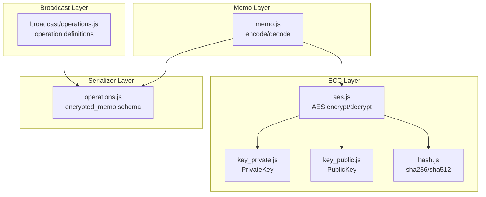
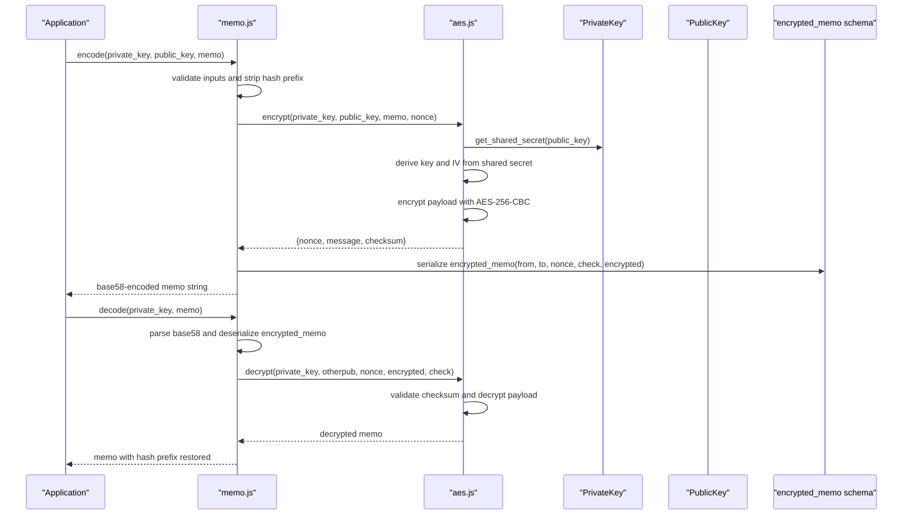
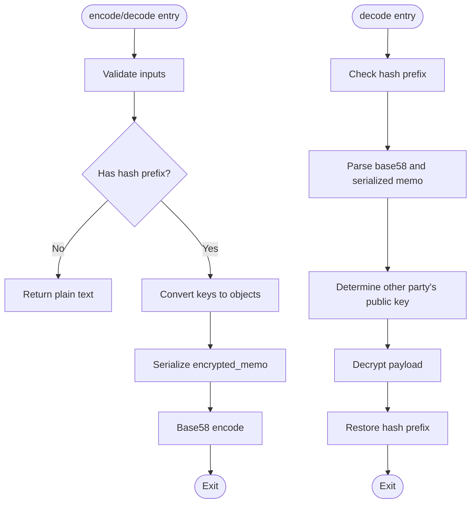
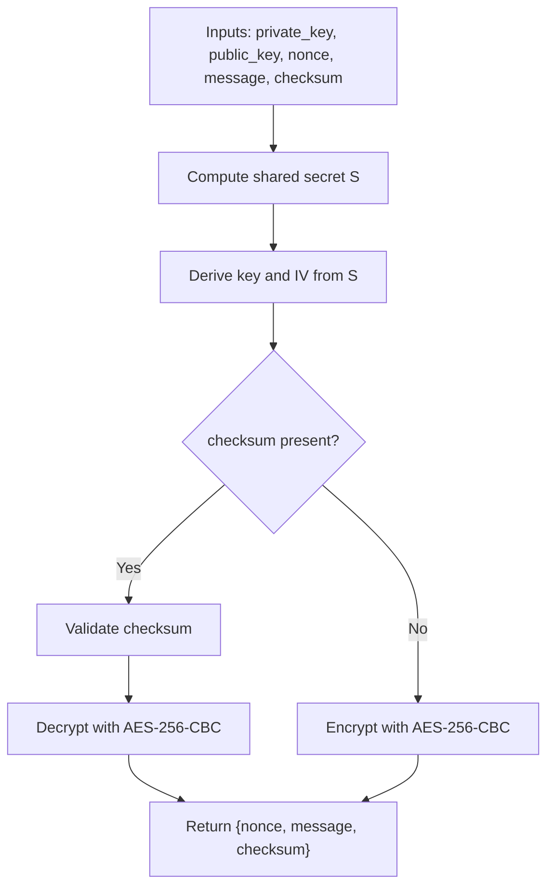
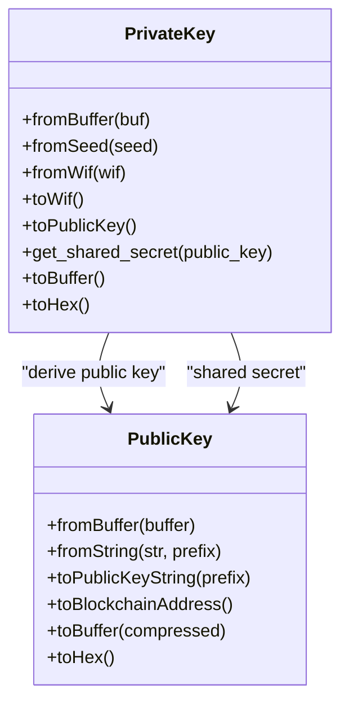
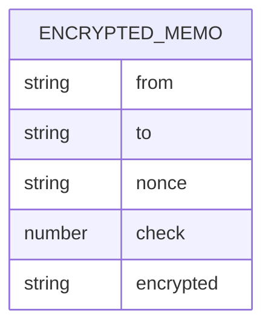
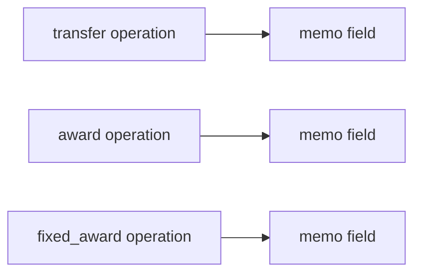
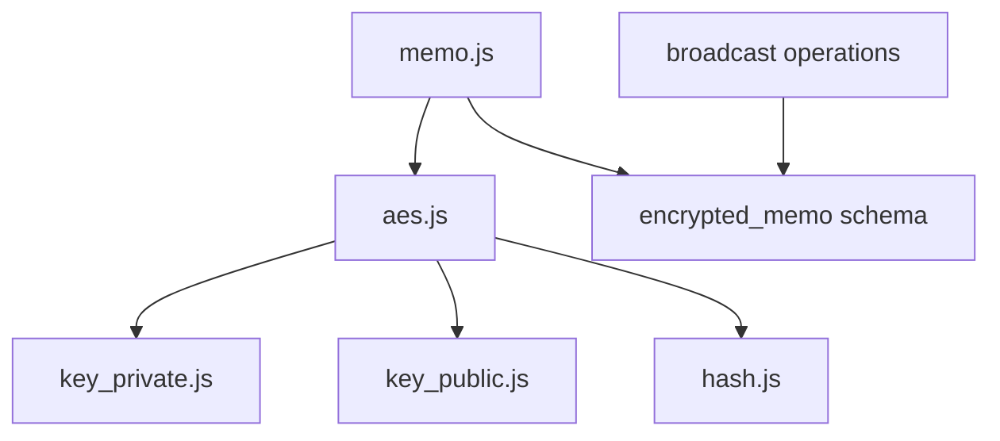

# Memo Encryption

<cite>
**Referenced Files in This Document**
- [memo.js](file://src/auth/memo.js)
- [aes.js](file://src/auth/ecc/src/aes.js)
- [key_private.js](file://src/auth/ecc/src/key_private.js)
- [key_public.js](file://src/auth/ecc/src/key_public.js)
- [hash.js](file://src/auth/ecc/src/hash.js)
- [operations.js](file://src/auth/serializer/src/operations.js)
- [memo.test.js](file://test/memo.test.js)
- [operations.js](file://src/broadcast/operations.js)
</cite>

## Table of Contents
1. [Introduction](#introduction)
2. [Project Structure](#project-structure)
3. [Core Components](#core-components)
4. [Architecture Overview](#architecture-overview)
5. [Detailed Component Analysis](#detailed-component-analysis)
6. [Dependency Analysis](#dependency-analysis)
7. [Performance Considerations](#performance-considerations)
8. [Troubleshooting Guide](#troubleshooting-guide)
9. [Conclusion](#conclusion)
10. [Appendices](#appendices)

## Introduction
This document explains the memo encryption and decryption functionality in the VIZ JavaScript library. It covers the AES-based encryption workflow, key derivation for encrypted memos, nonce handling, and secure message handling. It also documents memo decryption processes, key validation, error handling for malformed memos, and practical examples for encrypting private messages and decrypting received memos. Security considerations, key management for memos, and integration with comment operations are addressed.

## Project Structure
The memo encryption feature spans several modules:
- Memo API: encode/decode functions for encrypted memos
- ECC (Elliptic Curve Cryptography): AES implementation, key derivation, and key utilities
- Serializer: encrypted memo data model definition
- Tests: validation of encryption/decryption behavior
- Broadcast operations: integration points for memo fields in blockchain operations

**Diagram sources**
- [memo.js](file://src/auth/memo.js#L1-L113)
- [aes.js](file://src/auth/ecc/src/aes.js#L1-L181)
- [key_private.js](file://src/auth/ecc/src/key_private.js#L1-L172)
- [key_public.js](file://src/auth/ecc/src/key_public.js#L1-L170)
- [hash.js](file://src/auth/ecc/src/hash.js#L1-L59)
- [operations.js](file://src/auth/serializer/src/operations.js#L83-L91)
- [operations.js](file://src/broadcast/operations.js#L29-L36)

**Section sources**
- [memo.js](file://src/auth/memo.js#L1-L113)
- [aes.js](file://src/auth/ecc/src/aes.js#L1-L181)
- [operations.js](file://src/auth/serializer/src/operations.js#L83-L91)
- [operations.js](file://src/broadcast/operations.js#L29-L36)

## Core Components
- Memo encode/decode API: Provides functions to encrypt and decrypt memo strings prefixed with a hash marker. It validates inputs, converts keys to objects, serializes/deserializes encrypted memo structures, and handles base58 encoding/decoding.
- AES engine: Implements ECIES-style AES-256-CBC encryption/decryption using a shared secret derived from elliptic curve Diffie-Hellman, with HMAC-like checksum validation.
- Key utilities: PrivateKey and PublicKey classes handle key conversion, WIF serialization, shared secret computation, and public key string formats.
- Serializer: Defines the encrypted_memo data model with fields for sender public key, recipient public key, nonce, checksum, and encrypted payload.
- Operation definitions: Transfer and other operations include a memo field, enabling encrypted memos to be included in blockchain transactions.

**Section sources**
- [memo.js](file://src/auth/memo.js#L16-L84)
- [aes.js](file://src/auth/ecc/src/aes.js#L23-L101)
- [key_private.js](file://src/auth/ecc/src/key_private.js#L105-L119)
- [key_public.js](file://src/auth/ecc/src/key_public.js#L86-L100)
- [operations.js](file://src/auth/serializer/src/operations.js#L83-L91)
- [operations.js](file://src/broadcast/operations.js#L29-L36)

## Architecture Overview
The memo encryption workflow integrates the memo API with the AES engine and serializer. The process involves:
- Preparing the memo text with a hash prefix
- Deriving a shared secret from the sender’s private key and recipient’s public key
- Computing an encryption key and IV from the shared secret
- Encrypting the memo payload and generating a checksum
- Serializing the encrypted memo structure and base58-encoding it
- Decryption reverses the process, validating the checksum and reconstructing the original memo

**Diagram sources**
- [memo.js](file://src/auth/memo.js#L56-L84)
- [aes.js](file://src/auth/ecc/src/aes.js#L23-L101)
- [key_private.js](file://src/auth/ecc/src/key_private.js#L105-L119)
- [operations.js](file://src/auth/serializer/src/operations.js#L83-L91)

## Detailed Component Analysis

### Memo Encode/Decode API
- encode: Validates inputs, accepts either WIF or PrivateKey and PublicKey objects, prefixes the memo with a hash, serializes the encrypted memo structure, and base58-encodes the result.
- decode: Validates inputs, checks for hash prefix, decodes base58, deserializes the encrypted memo, determines the other party’s public key, decrypts the payload, and restores the hash prefix.
- Environment check: A self-test ensures encryption/decryption works in the current environment and throws an error if unsupported.

**Diagram sources**
- [memo.js](file://src/auth/memo.js#L16-L84)

**Section sources**
- [memo.js](file://src/auth/memo.js#L16-L84)

### AES Engine (ECIES-style)
- Key derivation: Computes a shared secret using elliptic curve Diffie-Hellman, then hashes it to produce a 512-bit value. Uses the first 32 bytes as the AES key and bytes 32–48 as the initialization vector.
- Checksum: Computes a 32-bit checksum from the encryption key to validate decryption integrity.
- Nonce handling: Generates a unique 64-bit nonce combining timestamp and entropy to prevent reuse of the same key/IV pair.
- Encryption/decryption: Uses AES-256-CBC with deterministic IV derived from the shared secret.

**Diagram sources**
- [aes.js](file://src/auth/ecc/src/aes.js#L45-L101)

**Section sources**
- [aes.js](file://src/auth/ecc/src/aes.js#L23-L101)

### Key Utilities (PrivateKey and PublicKey)
- PrivateKey: Provides WIF serialization/deserialization, shared secret computation with a public key, and helper conversions.
- PublicKey: Handles string and buffer conversions, address generation, and public key string formats.

**Diagram sources**
- [key_private.js](file://src/auth/ecc/src/key_private.js#L105-L119)
- [key_public.js](file://src/auth/ecc/src/key_public.js#L86-L100)

**Section sources**
- [key_private.js](file://src/auth/ecc/src/key_private.js#L105-L119)
- [key_public.js](file://src/auth/ecc/src/key_public.js#L86-L100)

### Serializer: Encrypted Memo Schema
- encrypted_memo defines the structure for serialized encrypted memos: from, to, nonce, check, and encrypted payload. This schema is used to serialize and deserialize memo data during encode/decode.

**Diagram sources**
- [operations.js](file://src/auth/serializer/src/operations.js#L83-L91)

**Section sources**
- [operations.js](file://src/auth/serializer/src/operations.js#L83-L91)

### Integration with Operations
- Transfer operation includes a memo field, enabling encrypted memos to be attached to transfers.
- Other operations define memo fields for award and fixed_award operations, allowing secure messaging in various transaction types.

**Diagram sources**
- [operations.js](file://src/broadcast/operations.js#L29-L36)
- [operations.js](file://src/broadcast/operations.js#L383-L398)

**Section sources**
- [operations.js](file://src/broadcast/operations.js#L29-L36)
- [operations.js](file://src/broadcast/operations.js#L383-L398)

## Dependency Analysis
Memo encryption depends on:
- AES engine for cryptographic operations
- Key utilities for key conversion and shared secret computation
- Serializer for memo data model
- Operation definitions for memo field integration

**Diagram sources**
- [memo.js](file://src/auth/memo.js#L1-L113)
- [aes.js](file://src/auth/ecc/src/aes.js#L1-L181)
- [key_private.js](file://src/auth/ecc/src/key_private.js#L1-L172)
- [key_public.js](file://src/auth/ecc/src/key_public.js#L1-L170)
- [hash.js](file://src/auth/ecc/src/hash.js#L1-L59)
- [operations.js](file://src/auth/serializer/src/operations.js#L83-L91)
- [operations.js](file://src/broadcast/operations.js#L29-L36)

**Section sources**
- [memo.js](file://src/auth/memo.js#L1-L113)
- [aes.js](file://src/auth/ecc/src/aes.js#L1-L181)
- [operations.js](file://src/auth/serializer/src/operations.js#L83-L91)
- [operations.js](file://src/broadcast/operations.js#L29-L36)

## Performance Considerations
- AES-256-CBC is efficient and widely supported. The primary cost is the elliptic curve shared secret computation and hashing.
- Nonce uniqueness prevents IV reuse, which is critical for security and avoids performance penalties from collision handling.
- Base58 encoding increases payload size slightly but is negligible compared to the benefits of compact representation.

## Troubleshooting Guide
Common issues and resolutions:
- Unsupported environment: The memo module performs a self-test and throws an error if encryption fails. Ensure the runtime supports the required cryptographic operations.
- Invalid key or checksum mismatch: During decryption, if the computed checksum does not match the stored checksum, an error is thrown indicating an invalid key.
- Malformed memo: If the memo lacks the expected hash prefix or serialization structure, decoding may fail. Ensure the memo is properly base58-encoded and includes the encrypted_memo structure.
- Key format errors: Ensure private keys are provided in WIF format or PrivateKey objects, and public keys are provided as PublicKey objects or strings.

**Section sources**
- [memo.js](file://src/auth/memo.js#L92-L109)
- [aes.js](file://src/auth/ecc/src/aes.js#L93-L96)
- [memo.test.js](file://test/memo.test.js#L1-L38)

## Conclusion
The VIZ JavaScript library provides a robust memo encryption system built on AES-256-CBC with ECIES-style key derivation. The memo encode/decode API integrates seamlessly with the serializer and blockchain operations, enabling secure, encrypted messaging in transfers and other operations. Proper key management, nonce handling, and checksum validation ensure confidentiality and integrity. The included tests validate the workflow and serve as practical examples for developers integrating memo encryption.

## Appendices

### Practical Examples
- Encrypting a private message:
  - Prepare the memo text with a hash prefix.
  - Call the encode function with the sender’s private key and recipient’s public key.
  - Use the returned base58-encoded memo string in a transfer or other operation that supports a memo field.
- Decrypting a received memo:
  - Call the decode function with the recipient’s private key and the received memo string.
  - The function returns the original memo text with the hash prefix restored.
- Secure communication patterns:
  - Always validate that the memo is encrypted (starts with a hash) before attempting to decode.
  - Ensure the private key used for decryption matches the intended recipient.
  - Store and transmit only the base58-encoded memo string to minimize exposure of raw cryptographic material.

**Section sources**
- [memo.js](file://src/auth/memo.js#L56-L84)
- [memo.test.js](file://test/memo.test.js#L17-L36)