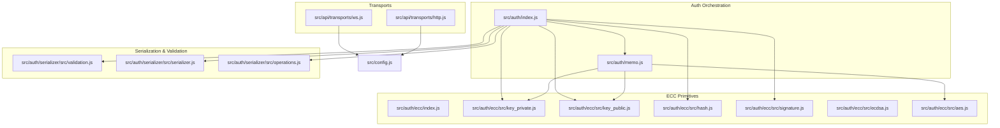
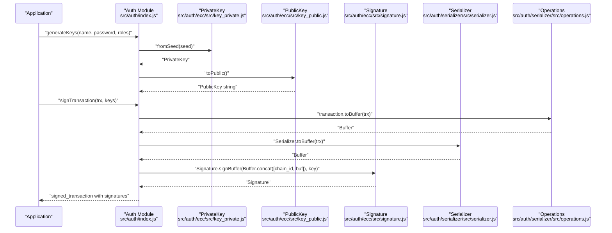
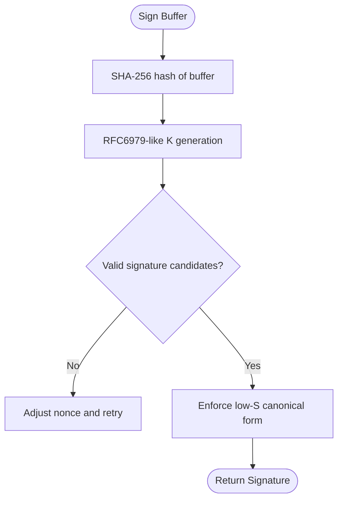
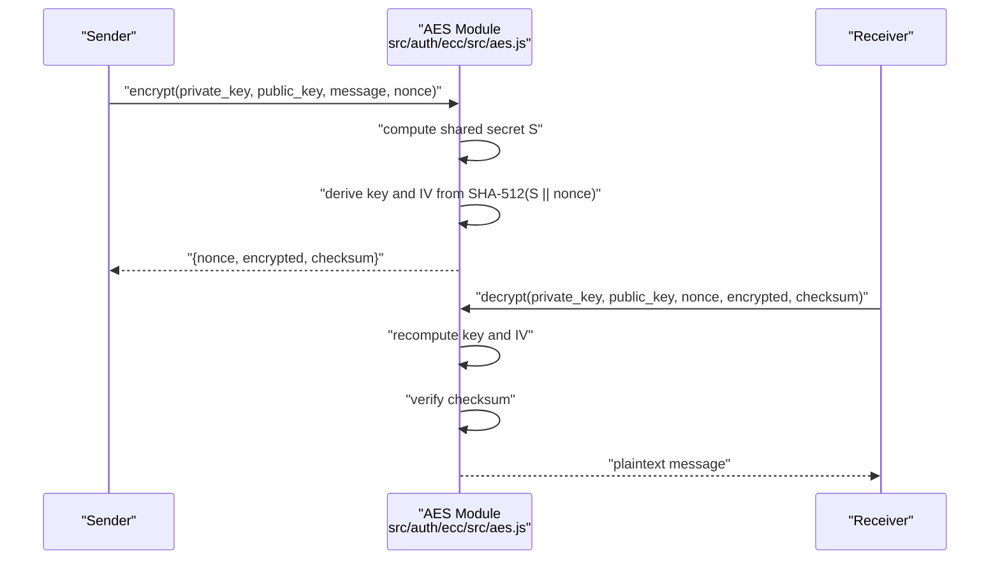
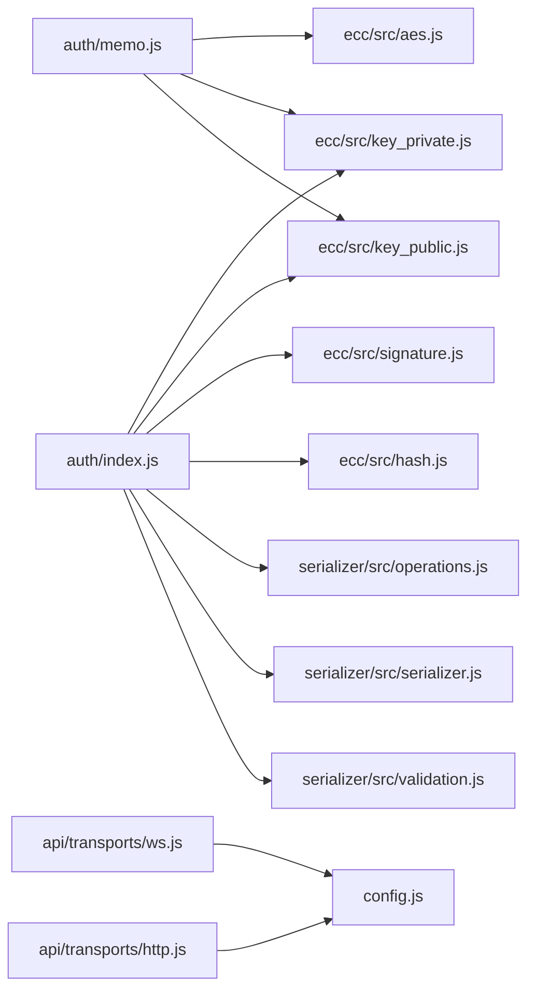

# Security Practices

<cite>
**Referenced Files in This Document**
- [src/auth/index.js](file://src/auth/index.js)
- [src/auth/ecc/index.js](file://src/auth/ecc/index.js)
- [src/auth/ecc/src/key_private.js](file://src/auth/ecc/src/key_private.js)
- [src/auth/ecc/src/key_public.js](file://src/auth/ecc/src/key_public.js)
- [src/auth/ecc/src/hash.js](file://src/auth/ecc/src/hash.js)
- [src/auth/ecc/src/signature.js](file://src/auth/ecc/src/signature.js)
- [src/auth/ecc/src/ecdsa.js](file://src/auth/ecc/src/ecdsa.js)
- [src/auth/ecc/src/aes.js](file://src/auth/ecc/src/aes.js)
- [src/auth/memo.js](file://src/auth/memo.js)
- [src/auth/serializer/src/validation.js](file://src/auth/serializer/src/validation.js)
- [src/auth/serializer/src/serializer.js](file://src/auth/serializer/src/serializer.js)
- [src/auth/serializer/src/operations.js](file://src/auth/serializer/src/operations.js)
- [src/api/transports/ws.js](file://src/api/transports/ws.js)
- [src/api/transports/http.js](file://src/api/transports/http.js)
- [src/utils.js](file://src/utils.js)
- [src/config.js](file://src/config.js)
</cite>

## Table of Contents
1. [Introduction](#introduction)
2. [Project Structure](#project-structure)
3. [Core Components](#core-components)
4. [Architecture Overview](#architecture-overview)
5. [Detailed Component Analysis](#detailed-component-analysis)
6. [Dependency Analysis](#dependency-analysis)
7. [Performance Considerations](#performance-considerations)
8. [Troubleshooting Guide](#troubleshooting-guide)
9. [Conclusion](#conclusion)
10. [Appendices](#appendices)

## Introduction
This document defines comprehensive security practices for the VIZ JavaScript library authentication system. It explains secure key generation methodologies, entropy sources, cryptographic best practices, validation and sanitization procedures, protections against common attacks, secure storage and memory management recommendations, secure transmission practices, and operational guidance for secure application development, threat modeling, audits, incident response, and production deployment checklists.

## Project Structure
The authentication system is organized around:
- Authentication orchestration and transaction signing
- Elliptic Curve Cryptography primitives (ECDSA, key derivation, hashing)
- AES-based memo encryption/decryption
- Transaction serialization and validation
- Transport layer for secure communication

**Diagram sources**
- [src/auth/index.js](file://src/auth/index.js#L1-L133)
- [src/auth/memo.js](file://src/auth/memo.js#L1-L113)
- [src/auth/ecc/index.js](file://src/auth/ecc/index.js#L1-L13)
- [src/auth/ecc/src/key_private.js](file://src/auth/ecc/src/key_private.js#L1-L172)
- [src/auth/ecc/src/key_public.js](file://src/auth/ecc/src/key_public.js#L1-L170)
- [src/auth/ecc/src/hash.js](file://src/auth/ecc/src/hash.js#L1-L59)
- [src/auth/ecc/src/signature.js](file://src/auth/ecc/src/signature.js#L1-L163)
- [src/auth/ecc/src/ecdsa.js](file://src/auth/ecc/src/ecdsa.js#L1-L219)
- [src/auth/ecc/src/aes.js](file://src/auth/ecc/src/aes.js#L1-L181)
- [src/auth/serializer/src/validation.js](file://src/auth/serializer/src/validation.js#L1-L288)
- [src/auth/serializer/src/serializer.js](file://src/auth/serializer/src/serializer.js#L1-L195)
- [src/auth/serializer/src/operations.js](file://src/auth/serializer/src/operations.js#L1-L922)
- [src/api/transports/ws.js](file://src/api/transports/ws.js#L1-L136)
- [src/api/transports/http.js](file://src/api/transports/http.js#L1-L53)
- [src/config.js](file://src/config.js#L1-L10)

**Section sources**
- [src/auth/index.js](file://src/auth/index.js#L1-L133)
- [src/auth/ecc/index.js](file://src/auth/ecc/index.js#L1-L13)
- [src/auth/memo.js](file://src/auth/memo.js#L1-L113)
- [src/auth/serializer/src/validation.js](file://src/auth/serializer/src/validation.js#L1-L288)
- [src/auth/serializer/src/serializer.js](file://src/auth/serializer/src/serializer.js#L1-L195)
- [src/auth/serializer/src/operations.js](file://src/auth/serializer/src/operations.js#L1-L922)
- [src/api/transports/ws.js](file://src/api/transports/ws.js#L1-L136)
- [src/api/transports/http.js](file://src/api/transports/http.js#L1-L53)
- [src/config.js](file://src/config.js#L1-L10)

## Core Components
- Authentication orchestration: key derivation, WIF conversion, verification, and transaction signing.
- ECC primitives: deterministic ECDSA signatures, key derivation, hashing, and public key operations.
- AES memo encryption: ephemeral shared secrets, nonces, and checksum validation.
- Serialization and validation: strict type checks and safe numeric conversions.
- Transports: WebSocket and HTTP transport with connection lifecycle and error handling.

Key security-relevant responsibilities:
- Secure key generation via deterministic seeds and SHA-256 hashing.
- Deterministic nonce generation for ECDSA and AES to avoid weak randomness.
- Strict validation of inputs and serialized structures.
- Secure transport configuration and error propagation.

**Section sources**
- [src/auth/index.js](file://src/auth/index.js#L19-L130)
- [src/auth/ecc/src/key_private.js](file://src/auth/ecc/src/key_private.js#L34-L81)
- [src/auth/ecc/src/signature.js](file://src/auth/ecc/src/signature.js#L62-L98)
- [src/auth/ecc/src/ecdsa.js](file://src/auth/ecc/src/ecdsa.js#L9-L63)
- [src/auth/ecc/src/aes.js](file://src/auth/ecc/src/aes.js#L23-L101)
- [src/auth/serializer/src/validation.js](file://src/auth/serializer/src/validation.js#L29-L287)
- [src/api/transports/ws.js](file://src/api/transports/ws.js#L27-L48)
- [src/api/transports/http.js](file://src/api/transports/http.js#L17-L41)

## Architecture Overview
End-to-end signing and memo encryption pipeline:

**Diagram sources**
- [src/auth/index.js](file://src/auth/index.js#L34-L130)
- [src/auth/ecc/src/key_private.js](file://src/auth/ecc/src/key_private.js#L34-L81)
- [src/auth/ecc/src/key_public.js](file://src/auth/ecc/src/key_public.js#L96-L100)
- [src/auth/ecc/src/signature.js](file://src/auth/ecc/src/signature.js#L62-L98)
- [src/auth/serializer/src/serializer.js](file://src/auth/serializer/src/serializer.js#L184-L192)
- [src/auth/serializer/src/operations.js](file://src/auth/serializer/src/operations.js#L73-L81)

## Detailed Component Analysis

### Authentication Orchestration
- Key derivation: Uses a deterministic seed built from name, role, and password, hashed with SHA-256, then mapped to curve scalar to derive private keys. Public keys are derived from private keys and formatted with checksummed addresses.
- WIF handling: Validates WIF checksums and supports conversion to/from WIF and public keys.
- Transaction signing: Concatenates chain ID and serialized transaction buffer, signs with ECDSA, and returns a signed transaction with appended signatures.

Security considerations:
- Seed composition must avoid predictable patterns; ensure name and role are controlled inputs.
- WIF validation prevents malformed keys from being used.
- Transaction signing requires the correct chain ID to prevent cross-chain replay.

**Section sources**
- [src/auth/index.js](file://src/auth/index.js#L34-L130)

### Elliptic Curve Digital Signature Algorithm (ECDSA)
- Deterministic nonce generation using HMAC-SHA256 with RFC6979-style K-value derivation.
- Canonical signature enforcement to reduce malleability.
- Recovery parameter calculation and public key recovery from signatures.

Security considerations:
- Nonce derivation ensures deterministic signatures without compromising security.
- Canonical S-values reduce signature malleability.
- Public key recovery avoids storing uncompressed points unnecessarily.

**Diagram sources**
- [src/auth/ecc/src/ecdsa.js](file://src/auth/ecc/src/ecdsa.js#L9-L63)
- [src/auth/ecc/src/signature.js](file://src/auth/ecc/src/signature.js#L72-L98)

**Section sources**
- [src/auth/ecc/src/ecdsa.js](file://src/auth/ecc/src/ecdsa.js#L65-L95)
- [src/auth/ecc/src/signature.js](file://src/auth/ecc/src/signature.js#L62-L98)

### Private Key Management
- Seed-based key derivation using SHA-256.
- WIF import/export with version-byte and checksum validation.
- Shared secret computation for ECIES-style encryption.
- Child key derivation for hierarchical key management.

Security considerations:
- Private key buffers are handled as 32-byte values; ensure zeroization after use where applicable.
- WIF checksum validation prevents accidental corruption.
- Shared secret uses SHA-512 to derive a 512-bit key for AES-256-CBC.

**Section sources**
- [src/auth/ecc/src/key_private.js](file://src/auth/ecc/src/key_private.js#L21-L81)
- [src/auth/ecc/src/key_private.js](file://src/auth/ecc/src/key_private.js#L105-L119)

### Public Key Operations
- Encoding/decoding of public keys in compressed/uncompressed forms.
- Blockchain address derivation using SHA-512 and RIPEMD-160.
- String representation with configurable address prefixes and checksum validation.

Security considerations:
- Address validation includes RIPEMD-160 checksum verification.
- Compressed encoding reduces size and improves performance.

**Section sources**
- [src/auth/ecc/src/key_public.js](file://src/auth/ecc/src/key_public.js#L22-L100)

### Hash Functions and Utilities
- SHA-1, SHA-256, SHA-512, HMAC-SHA256, and RIPEMD-160.
- Used for key derivation, checksums, and shared secret computation.

Security considerations:
- SHA-256 is used for deterministic key derivation.
- RIPEMD-160 is used for address checksums.

**Section sources**
- [src/auth/ecc/src/hash.js](file://src/auth/ecc/src/hash.js#L8-L34)

### AES Memo Encryption
- Ephemeral shared secret computed from private/public keys.
- Unique nonce generation using time + entropy to prevent reuse.
- Checksum validation to detect key mismatches during decryption.

Security considerations:
- Nonces are 64-bit unsigned integers constructed from current time and entropy.
- Decryption validates a checksum derived from the encryption key to detect tampering or wrong keys.

**Diagram sources**
- [src/auth/ecc/src/aes.js](file://src/auth/ecc/src/aes.js#L23-L101)
- [src/auth/memo.js](file://src/auth/memo.js#L16-L84)

**Section sources**
- [src/auth/ecc/src/aes.js](file://src/auth/ecc/src/aes.js#L161-L173)
- [src/auth/memo.js](file://src/auth/memo.js#L92-L109)

### Transaction Serialization and Validation
- Serializer converts typed objects to buffers and vice versa.
- Validation enforces types, ranges, and formats for operation fields.
- Operations define transaction and signed_transaction structures with explicit sizes.

Security considerations:
- Strict type validation prevents malformed data from entering the signing pipeline.
- Numeric overflow checks protect against unsafe conversions.

**Section sources**
- [src/auth/serializer/src/serializer.js](file://src/auth/serializer/src/serializer.js#L17-L192)
- [src/auth/serializer/src/validation.js](file://src/auth/serializer/src/validation.js#L29-L287)
- [src/auth/serializer/src/operations.js](file://src/auth/serializer/src/operations.js#L73-L125)

### Transport Security
- WebSocket transport supports both Node.js and browser environments.
- HTTP transport uses cross-fetch with JSON-RPC semantics and error propagation.
- Both transports rely on configuration for endpoint selection.

Security considerations:
- Ensure endpoints use TLS (wss:// and https://) in production.
- Validate and sanitize any user-provided endpoint URLs.
- Handle connection errors and close events to avoid resource leaks.

**Section sources**
- [src/api/transports/ws.js](file://src/api/transports/ws.js#L7-L14)
- [src/api/transports/ws.js](file://src/api/transports/ws.js#L34-L46)
- [src/api/transports/http.js](file://src/api/transports/http.js#L17-L41)
- [src/config.js](file://src/config.js#L1-L10)

## Dependency Analysis

**Diagram sources**
- [src/auth/index.js](file://src/auth/index.js#L1-L11)
- [src/auth/memo.js](file://src/auth/memo.js#L1-L7)
- [src/api/transports/ws.js](file://src/api/transports/ws.js#L1-L5)
- [src/api/transports/http.js](file://src/api/transports/http.js#L1-L5)
- [src/config.js](file://src/config.js#L1-L10)

**Section sources**
- [src/auth/index.js](file://src/auth/index.js#L1-L11)
- [src/auth/memo.js](file://src/auth/memo.js#L1-L7)
- [src/api/transports/ws.js](file://src/api/transports/ws.js#L1-L5)
- [src/api/transports/http.js](file://src/api/transports/http.js#L1-L5)
- [src/config.js](file://src/config.js#L1-L10)

## Performance Considerations
- ECDSA signature generation uses deterministic nonce derivation; occasional retries are logged but bounded.
- AES encryption/decryption uses CBC mode with 256-bit keys; ensure hardware acceleration is available in browsers.
- Serialization performance benefits from preallocated ByteBuffer capacity; avoid excessive allocations in hot paths.
- Transport batching and connection reuse improve throughput; handle backpressure and timeouts.

[No sources needed since this section provides general guidance]

## Troubleshooting Guide
Common issues and mitigations:
- Invalid WIF checksum: occurs when version byte or checksum mismatch is detected during WIF parsing.
- Transaction signing failures: verify chain ID matches network, and ensure transaction serialization is correct.
- Memo decryption errors: confirm correct private/public key pair and that the checksum matches the derived key.
- Transport errors: inspect WebSocket open/close/error events and HTTP status codes; ensure TLS endpoints.

Operational checks:
- Validate account names and operation fields using provided validators.
- Monitor logs for repeated nonce warnings during signature generation.
- Verify transport connectivity and error payloads.

**Section sources**
- [src/auth/ecc/src/key_private.js](file://src/auth/ecc/src/key_private.js#L55-L70)
- [src/auth/ecc/src/signature.js](file://src/auth/ecc/src/signature.js#L72-L98)
- [src/auth/ecc/src/aes.js](file://src/auth/ecc/src/aes.js#L93-L96)
- [src/api/transports/ws.js](file://src/api/transports/ws.js#L96-L101)
- [src/api/transports/http.js](file://src/api/transports/http.js#L27-L41)
- [src/auth/serializer/src/validation.js](file://src/auth/serializer/src/validation.js#L35-L40)

## Conclusion
The VIZ JavaScript library’s authentication system integrates deterministic key derivation, secure ECDSA signatures, validated serialization, and AES-based memo encryption. By following the security practices outlined here—ensuring strong entropy, validating inputs, using secure transports, and managing keys carefully—applications can achieve robust security in production environments.

[No sources needed since this section summarizes without analyzing specific files]

## Appendices

### Secure Key Generation Methodologies
- Use deterministic seeds derived from strong secrets (name, role, password) hashed with SHA-256.
- Avoid predictable combinations; ensure role and password are sufficiently random.
- Store private keys only in memory during signing; export only as WIF when necessary.

**Section sources**
- [src/auth/index.js](file://src/auth/index.js#L34-L49)
- [src/auth/ecc/src/key_private.js](file://src/auth/ecc/src/key_private.js#L34-L40)

### Entropy Sources and Nonces
- ECDSA nonce generation uses HMAC-SHA256 with iterative refinement to produce canonical signatures.
- AES memo nonce is a 64-bit value combining timestamp and entropy to prevent reuse.

**Section sources**
- [src/auth/ecc/src/ecdsa.js](file://src/auth/ecc/src/ecdsa.js#L9-L63)
- [src/auth/ecc/src/aes.js](file://src/auth/ecc/src/aes.js#L161-L173)

### Cryptographic Best Practices
- Use SHA-256 for key derivation and RIPEMD-160 for address checksums.
- Enforce low-S canonical signatures to prevent malleability.
- Validate all inputs and serialized structures before signing.

**Section sources**
- [src/auth/ecc/src/hash.js](file://src/auth/ecc/src/hash.js#L16-L34)
- [src/auth/ecc/src/signature.js](file://src/auth/ecc/src/signature.js#L88-L98)
- [src/auth/serializer/src/validation.js](file://src/auth/serializer/src/validation.js#L29-L121)

### Security Validation and Input Sanitization
- Validate required fields, types, and numeric ranges.
- Reject empty or malformed values early in the pipeline.
- Use serializers to ensure consistent binary representation.

**Section sources**
- [src/auth/serializer/src/validation.js](file://src/auth/serializer/src/validation.js#L35-L121)
- [src/auth/serializer/src/serializer.js](file://src/auth/serializer/src/serializer.js#L17-L77)

### Protection Against Common Attacks
- Replay attack prevention: include chain ID in signed data.
- Malleability resistance: enforce low-S signatures.
- Key compromise detection: memo checksum validation and WIF checksum verification.

**Section sources**
- [src/auth/index.js](file://src/auth/index.js#L113-L127)
- [src/auth/ecc/src/signature.js](file://src/auth/ecc/src/signature.js#L88-L98)
- [src/auth/ecc/src/aes.js](file://src/auth/ecc/src/aes.js#L93-L96)
- [src/auth/ecc/src/key_private.js](file://src/auth/ecc/src/key_private.js#L55-L70)

### Secure Key Storage and Memory Management
- Keep private keys in memory only during signing; avoid persisting raw secrets.
- Export only WIF when necessary; treat WIF as sensitive as private keys.
- Zeroize buffers after use where feasible.

**Section sources**
- [src/auth/ecc/src/key_private.js](file://src/auth/ecc/src/key_private.js#L72-L81)

### Secure Transmission Practices
- Use TLS-enabled endpoints (wss:// and https://).
- Validate endpoint configuration and reject unexpected schemes.
- Handle transport errors and reconnections gracefully.

**Section sources**
- [src/api/transports/ws.js](file://src/api/transports/ws.js#L34-L46)
- [src/api/transports/http.js](file://src/api/transports/http.js#L17-L41)
- [src/config.js](file://src/config.js#L1-L10)

### Secure Application Development Guidelines
- Threat model: assume attackers can observe traffic, modify messages, and inject malicious data.
- Defense-in-depth: combine input validation, signature verification, and transport security.
- Least privilege: derive keys per-role and limit exposure.

**Section sources**
- [src/auth/index.js](file://src/auth/index.js#L56-L63)
- [src/auth/serializer/src/validation.js](file://src/auth/serializer/src/validation.js#L29-L121)

### Security Audit Procedures
- Review key derivation and WIF handling for correctness and error handling.
- Validate signature verification and memo decryption flows.
- Inspect transport configuration and error propagation.

**Section sources**
- [src/auth/ecc/src/key_private.js](file://src/auth/ecc/src/key_private.js#L55-L70)
- [src/auth/ecc/src/signature.js](file://src/auth/ecc/src/signature.js#L110-L121)
- [src/auth/ecc/src/aes.js](file://src/auth/ecc/src/aes.js#L93-L101)
- [src/api/transports/ws.js](file://src/api/transports/ws.js#L96-L101)
- [src/api/transports/http.js](file://src/api/transports/http.js#L27-L41)

### Incident Response Protocols
- Detect replay attempts via chain ID mismatches.
- Investigate signature malleability or canonical form violations.
- Monitor memo decryption failures for key rotation needs.

**Section sources**
- [src/auth/index.js](file://src/auth/index.js#L113-L127)
- [src/auth/ecc/src/signature.js](file://src/auth/ecc/src/signature.js#L88-L98)
- [src/auth/ecc/src/aes.js](file://src/auth/ecc/src/aes.js#L93-L96)

### Production Deployment Checklist
- Configure TLS endpoints and validate certificates.
- Enforce input validation and numeric overflow checks.
- Use deterministic seeds and secure nonces; log warnings for repeated attempts.
- Rotate keys per role and minimize exposure of private keys.
- Monitor transport health and error rates.

**Section sources**
- [src/api/transports/ws.js](file://src/api/transports/ws.js#L34-L46)
- [src/auth/serializer/src/validation.js](file://src/auth/serializer/src/validation.js#L227-L287)
- [src/auth/ecc/src/ecdsa.js](file://src/auth/ecc/src/ecdsa.js#L94-L95)
- [src/auth/index.js](file://src/auth/index.js#L56-L63)