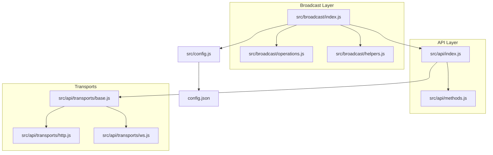
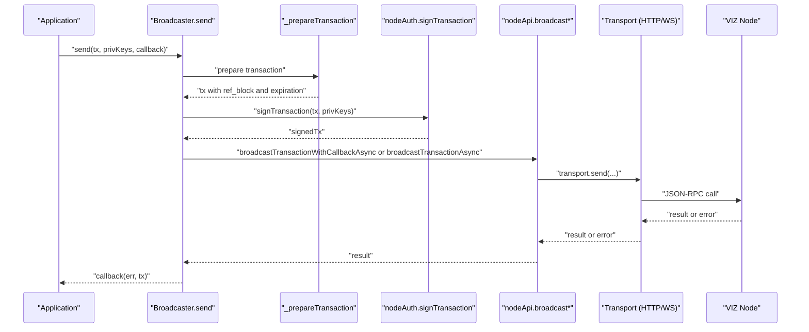
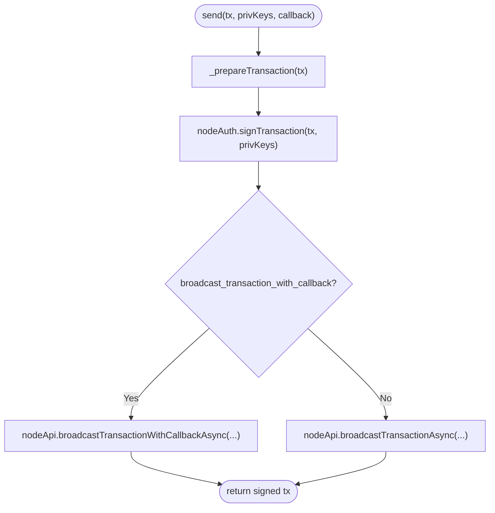
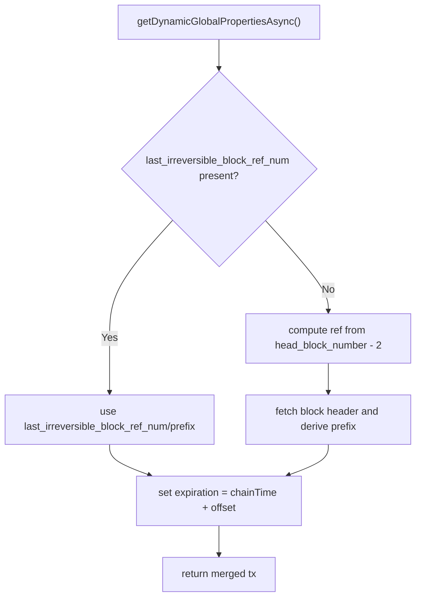
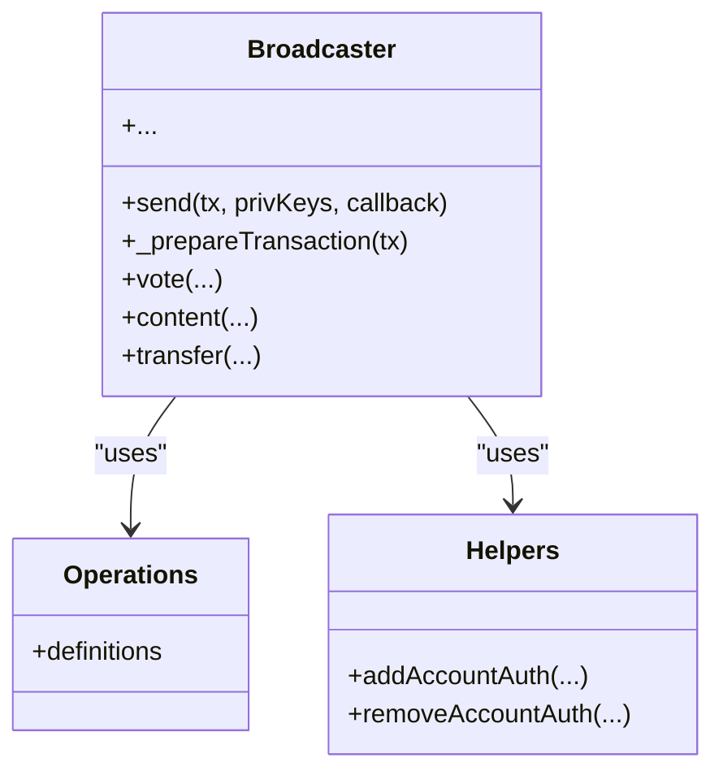
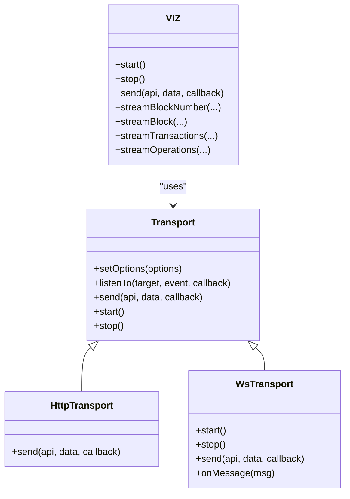
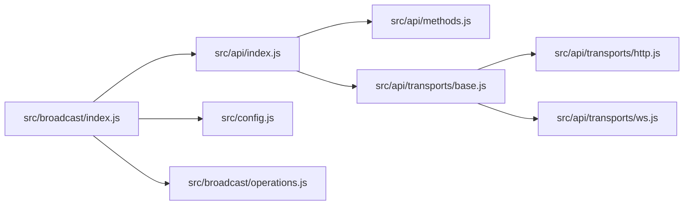

# Network Broadcasting

<cite>
**Referenced Files in This Document**
- [src/broadcast/index.js](file://src/broadcast/index.js)
- [src/broadcast/helpers.js](file://src/broadcast/helpers.js)
- [src/broadcast/operations.js](file://src/broadcast/operations.js)
- [src/api/index.js](file://src/api/index.js)
- [src/api/methods.js](file://src/api/methods.js)
- [src/api/transports/base.js](file://src/api/transports/base.js)
- [src/api/transports/http.js](file://src/api/transports/http.js)
- [src/api/transports/ws.js](file://src/api/transports/ws.js)
- [src/config.js](file://src/config.js)
- [config.json](file://config.json)
- [test/broadcast.test.js](file://test/broadcast.test.js)
- [examples/broadcast.html](file://examples/broadcast.html)
</cite>

## Table of Contents
1. [Introduction](#introduction)
2. [Project Structure](#project-structure)
3. [Core Components](#core-components)
4. [Architecture Overview](#architecture-overview)
5. [Detailed Component Analysis](#detailed-component-analysis)
6. [Dependency Analysis](#dependency-analysis)
7. [Performance Considerations](#performance-considerations)
8. [Troubleshooting Guide](#troubleshooting-guide)
9. [Conclusion](#conclusion)
10. [Appendices](#appendices)

## Introduction
This document explains the network broadcasting functionality in the VIZ JavaScript library. It focuses on how transactions are prepared, signed, and broadcast to the network, how broadcast modes are selected, and how callbacks and promises are handled. It also documents the differences between broadcast modes, error handling patterns, response processing, network configuration options, and practical examples for successful broadcasts, error scenarios, and monitoring broadcast status.

## Project Structure
The broadcasting feature spans several modules:
- Broadcast orchestration and generation: src/broadcast/index.js, src/broadcast/operations.js
- Helpers for account authority operations: src/broadcast/helpers.js
- API client and method registry: src/api/index.js, src/api/methods.js
- Transport layer (HTTP/WebSocket): src/api/transports/base.js, src/api/transports/http.js, src/api/transports/ws.js
- Configuration: src/config.js, config.json
- Tests and examples: test/broadcast.test.js, examples/broadcast.html

**Diagram sources**
- [src/broadcast/index.js](file://src/broadcast/index.js#L1-L137)
- [src/broadcast/operations.js](file://src/broadcast/operations.js#L1-L475)
- [src/broadcast/helpers.js](file://src/broadcast/helpers.js#L1-L82)
- [src/api/index.js](file://src/api/index.js#L1-L271)
- [src/api/methods.js](file://src/api/methods.js#L1-L475)
- [src/api/transports/base.js](file://src/api/transports/base.js#L1-L34)
- [src/api/transports/http.js](file://src/api/transports/http.js#L1-L53)
- [src/api/transports/ws.js](file://src/api/transports/ws.js#L1-L136)
- [src/config.js](file://src/config.js#L1-L10)
- [config.json](file://config.json#L1-L7)

**Section sources**
- [src/broadcast/index.js](file://src/broadcast/index.js#L1-L137)
- [src/api/index.js](file://src/api/index.js#L1-L271)
- [src/api/transports/base.js](file://src/api/transports/base.js#L1-L34)

## Core Components
- Broadcaster.send: Central method that signs a transaction and broadcasts it via either synchronous or callback-enabled broadcast APIs depending on configuration.
- Transaction preparation: _prepareTransaction fetches dynamic global properties, sets expiration, and computes reference block fields using either the last irreversible block or a recent block header.
- Operation wrappers: Generated methods (e.g., vote, content, transfer) wrap Broadcaster.send with operation-specific parameters and metadata handling.
- API client: VIZ class manages transport selection, request lifecycle, and streaming utilities.
- Transports: HTTP and WebSocket transports implement request/response handling, connection lifecycle, and error propagation.
- Configuration: Global config controls the broadcast mode and network endpoint.

Key responsibilities:
- Signing and broadcasting: src/broadcast/index.js
- Operation definitions: src/broadcast/operations.js
- Account authority helpers: src/broadcast/helpers.js
- API method registry and transport wiring: src/api/index.js, src/api/methods.js
- Transport implementations: src/api/transports/http.js, src/api/transports/ws.js
- Configuration: src/config.js, config.json

**Section sources**
- [src/broadcast/index.js](file://src/broadcast/index.js#L24-L84)
- [src/broadcast/operations.js](file://src/broadcast/operations.js#L1-L475)
- [src/api/index.js](file://src/api/index.js#L21-L236)
- [src/api/methods.js](file://src/api/methods.js#L366-L379)
- [src/api/transports/http.js](file://src/api/transports/http.js#L43-L52)
- [src/api/transports/ws.js](file://src/api/transports/ws.js#L18-L94)
- [src/config.js](file://src/config.js#L1-L10)
- [config.json](file://config.json#L1-L7)

## Architecture Overview
The broadcast pipeline integrates transaction preparation, signing, and network broadcast through the configured transport. The mode selection is controlled by a configuration flag that chooses between synchronous and callback-enabled broadcast methods.

**Diagram sources**
- [src/broadcast/index.js](file://src/broadcast/index.js#L24-L47)
- [src/api/methods.js](file://src/api/methods.js#L366-L379)
- [src/api/transports/http.js](file://src/api/transports/http.js#L43-L52)
- [src/api/transports/ws.js](file://src/api/transports/ws.js#L64-L94)

## Detailed Component Analysis

### Broadcaster.send and Mode Selection
- Purpose: Prepare, sign, and broadcast a transaction. Selects broadcast mode based on configuration.
- Mode selection:
  - If the configuration flag for callback-enabled broadcast is true, it uses the callback-enabled broadcast method; otherwise, it uses the synchronous broadcast method.
- Callback handling:
  - Returns a promise that is converted to Node-style callback semantics using a promisification utility.
- Transaction preparation:
  - Fetches dynamic global properties and sets expiration and reference block fields.
  - Uses the last irreversible block when available; otherwise derives reference block from a recent block header.

**Diagram sources**
- [src/broadcast/index.js](file://src/broadcast/index.js#L24-L47)
- [src/config.js](file://src/config.js#L5-L5)
- [config.json](file://config.json#L5-L5)

**Section sources**
- [src/broadcast/index.js](file://src/broadcast/index.js#L24-L47)
- [src/broadcast/index.js](file://src/broadcast/index.js#L49-L84)
- [src/config.js](file://src/config.js#L5-L5)
- [config.json](file://config.json#L5-L5)

### Transaction Preparation (_prepareTransaction)
- Retrieves dynamic global properties to compute chain time and expiration.
- Sets reference block fields:
  - If last irreversible block reference is available, uses it.
  - Otherwise, computes reference from a block header two behind the head block.
- Applies expiration as a small offset from chain time.

**Diagram sources**
- [src/broadcast/index.js](file://src/broadcast/index.js#L49-L84)

**Section sources**
- [src/broadcast/index.js](file://src/broadcast/index.js#L49-L84)

### Operation Wrappers and Helpers
- Generated wrappers:
  - For each operation definition, Broadcaster generates methods that assemble the operation object and call Broadcaster.send.
  - Handles optional metadata serialization and permlink derivation for content operations.
- Helpers:
  - Utilities to add/remove account authorities and update account authorities atomically.

**Diagram sources**
- [src/broadcast/index.js](file://src/broadcast/index.js#L88-L129)
- [src/broadcast/operations.js](file://src/broadcast/operations.js#L1-L475)
- [src/broadcast/helpers.js](file://src/broadcast/helpers.js#L5-L81)

**Section sources**
- [src/broadcast/index.js](file://src/broadcast/index.js#L88-L129)
- [src/broadcast/operations.js](file://src/broadcast/operations.js#L1-L475)
- [src/broadcast/helpers.js](file://src/broadcast/helpers.js#L5-L81)

### API Client and Transport Layer
- VIZ API client:
  - Manages transport selection based on URL scheme (HTTP/WS).
  - Provides request lifecycle hooks and streaming utilities.
- HTTP transport:
  - JSON-RPC over HTTP using cross-fetch.
  - Parses errors and returns results.
- WebSocket transport:
  - Maintains connection state, tracks in-flight requests, and handles messages.
  - Emits performance metrics and propagates errors consistently.

**Diagram sources**
- [src/api/index.js](file://src/api/index.js#L21-L236)
- [src/api/transports/base.js](file://src/api/transports/base.js#L4-L31)
- [src/api/transports/http.js](file://src/api/transports/http.js#L43-L52)
- [src/api/transports/ws.js](file://src/api/transports/ws.js#L18-L94)

**Section sources**
- [src/api/index.js](file://src/api/index.js#L34-L62)
- [src/api/index.js](file://src/api/index.js#L98-L119)
- [src/api/transports/http.js](file://src/api/transports/http.js#L17-L41)
- [src/api/transports/http.js](file://src/api/transports/http.js#L43-L52)
- [src/api/transports/ws.js](file://src/api/transports/ws.js#L64-L94)
- [src/api/transports/ws.js](file://src/api/transports/ws.js#L111-L134)

### Broadcast Method Definitions
- The API method registry defines broadcast methods under the network broadcast API.
- Two primary broadcast methods are used by the broadcaster:
  - Synchronous broadcast
  - Callback-enabled broadcast

These are consumed by Broadcaster.send to choose the appropriate mode.

**Section sources**
- [src/api/methods.js](file://src/api/methods.js#L366-L379)

### Configuration Options
- broadcast_transaction_with_callback: Controls whether to use callback-enabled broadcast.
- websocket: Endpoint URL for transport selection.
- address_prefix and chain_id: Chain identifiers used elsewhere in the library.

**Section sources**
- [src/config.js](file://src/config.js#L5-L5)
- [config.json](file://config.json#L1-L7)

## Dependency Analysis
The broadcaster depends on:
- API client for dynamic properties and block retrieval
- Authentication module for signing
- Configuration for mode selection
- Transport layer for network communication

**Diagram sources**
- [src/broadcast/index.js](file://src/broadcast/index.js#L1-L12)
- [src/api/index.js](file://src/api/index.js#L1-L10)
- [src/api/methods.js](file://src/api/methods.js#L1-L475)
- [src/api/transports/base.js](file://src/api/transports/base.js#L1-L34)
- [src/api/transports/http.js](file://src/api/transports/http.js#L1-L53)
- [src/api/transports/ws.js](file://src/api/transports/ws.js#L1-L136)

**Section sources**
- [src/broadcast/index.js](file://src/broadcast/index.js#L1-L12)
- [src/api/index.js](file://src/api/index.js#L1-L10)

## Performance Considerations
- Transport selection:
  - WebSocket transport supports persistent connections and lower latency for streaming and frequent requests.
  - HTTP transport is simpler but incurs overhead per request.
- Request batching and concurrency:
  - The API client maintains in-flight counters and request maps to track outstanding calls.
- Monitoring:
  - Both transports emit performance events for tracked methods, enabling observability.

[No sources needed since this section provides general guidance]

## Troubleshooting Guide
Common issues and resolutions:
- Incorrect transport URL:
  - Ensure the websocket configuration matches the intended protocol (HTTP/WS).
- Missing or invalid private key:
  - Verify the private key corresponds to the required role for the operation.
- Expiration or reference block errors:
  - Confirm the transaction expiration is reasonable and reference block fields are derived from recent blocks.
- Callback vs. promise usage:
  - The broadcaster returns a promise that can be converted to Node-style callbacks; ensure consistent handling.
- Transport errors:
  - WebSocket errors propagate to pending requests; reconnect and retry as needed.

**Section sources**
- [src/api/transports/ws.js](file://src/api/transports/ws.js#L96-L109)
- [src/api/transports/http.js](file://src/api/transports/http.js#L27-L41)
- [src/broadcast/index.js](file://src/broadcast/index.js#L24-L47)

## Conclusion
The VIZ JavaScript library’s broadcasting subsystem provides a robust, configurable mechanism to prepare, sign, and broadcast transactions. Mode selection is controlled by configuration, while the transport layer abstracts HTTP and WebSocket communications. Operation wrappers simplify constructing transactions for common actions, and helpers support account authority management. Proper configuration and understanding of broadcast modes enable reliable and observable transaction submission.

[No sources needed since this section summarizes without analyzing specific files]

## Appendices

### Practical Examples

- Successful broadcast with callback:
  - Demonstrates voting with a posting key and handling the result via callback.
  - Reference: [examples/broadcast.html](file://examples/broadcast.html#L15-L25)

- Successful broadcast with promise:
  - Demonstrates content creation using asynchronous methods.
  - Reference: [test/broadcast.test.js](file://test/broadcast.test.js#L75-L98)

- Custom JSON broadcast:
  - Demonstrates broadcasting custom JSON operations with required authorities.
  - Reference: [examples/broadcast.html](file://examples/broadcast.html#L74-L83)

- Error scenario:
  - Typical error propagation from transport and API layers.
  - Reference: [src/api/transports/http.js](file://src/api/transports/http.js#L27-L41), [src/api/transports/ws.js](file://src/api/transports/ws.js#L111-L134)

- Monitoring broadcast status:
  - Use callback-enabled broadcast mode to receive confirmation callbacks when enabled via configuration.
  - Reference: [src/broadcast/index.js](file://src/broadcast/index.js#L41-L43), [config.json](file://config.json#L5-L5)

### API and Method References
- Broadcast methods:
  - Synchronous broadcast: [src/api/methods.js](file://src/api/methods.js#L366-L379)
  - Callback-enabled broadcast: [src/api/methods.js](file://src/api/methods.js#L370-L374)

- Transport methods:
  - HTTP: [src/api/transports/http.js](file://src/api/transports/http.js#L43-L52)
  - WebSocket: [src/api/transports/ws.js](file://src/api/transports/ws.js#L64-L94)

- Configuration:
  - [src/config.js](file://src/config.js#L5-L5), [config.json](file://config.json#L5-L5)