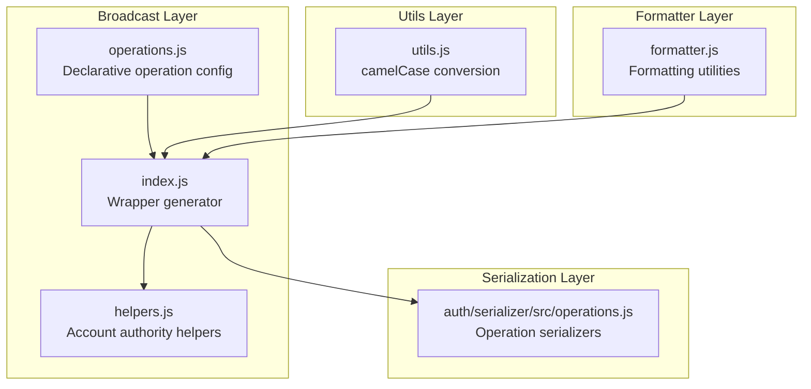
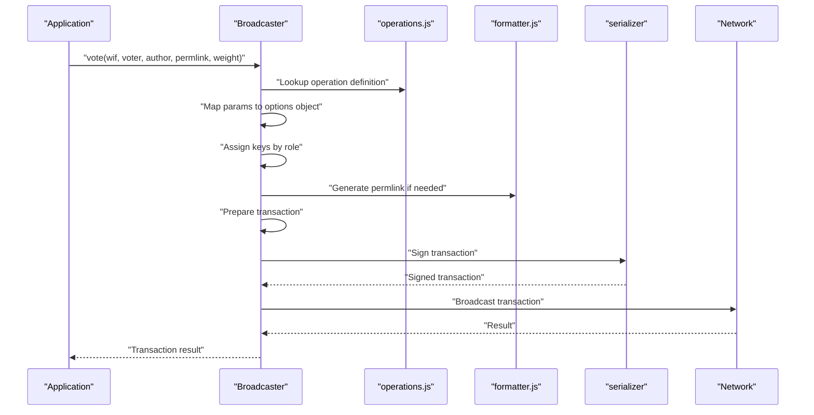
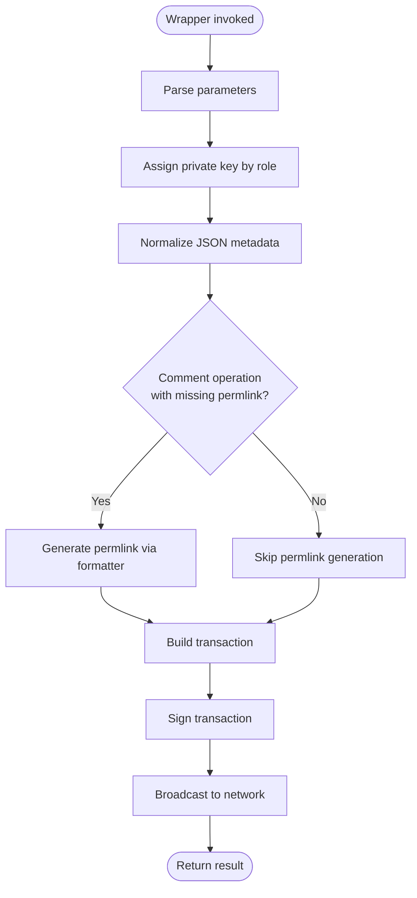
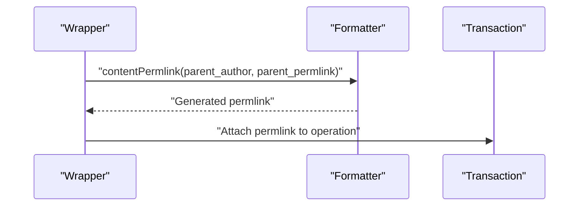
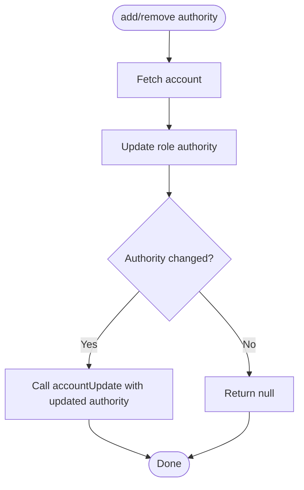
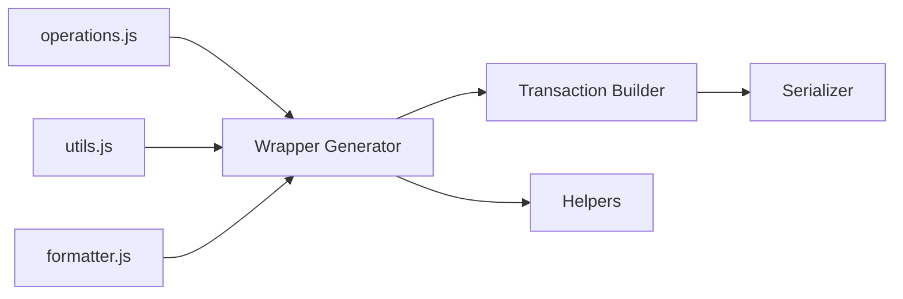

# Operation Construction

<cite>
**Referenced Files in This Document**
- [src/broadcast/operations.js](file://src/broadcast/operations.js)
- [src/broadcast/index.js](file://src/broadcast/index.js)
- [src/broadcast/helpers.js](file://src/broadcast/helpers.js)
- [src/formatter.js](file://src/formatter.js)
- [src/utils.js](file://src/utils.js)
- [src/auth/serializer/src/operations.js](file://src/auth/serializer/src/operations.js)
- [test/broadcast.test.js](file://test/broadcast.test.js)
- [examples/broadcast.html](file://examples/broadcast.html)
</cite>

## Table of Contents
1. [Introduction](#introduction)
2. [Project Structure](#project-structure)
3. [Core Components](#core-components)
4. [Architecture Overview](#architecture-overview)
5. [Detailed Component Analysis](#detailed-component-analysis)
6. [Dependency Analysis](#dependency-analysis)
7. [Performance Considerations](#performance-considerations)
8. [Troubleshooting Guide](#troubleshooting-guide)
9. [Conclusion](#conclusion)
10. [Appendices](#appendices)

## Introduction
This document explains how the broadcast system constructs and wraps operations for submission to the blockchain. It covers the operations configuration, automatic wrapper generation, parameter mapping, metadata handling, camelCase conversion for operation names, role-based key assignment, and permlink generation for comments. It also demonstrates how to construct different operation types, handle optional parameters, and integrate with the formatter system for content operations.

## Project Structure
The broadcast system is organized around a declarative configuration that defines supported operations, their parameters, and authorization roles. The runtime generates specialized wrapper functions that validate and assemble transactions, sign them, and broadcast them to the network.

**Diagram sources**
- [src/broadcast/operations.js](file://src/broadcast/operations.js#L1-L475)
- [src/broadcast/index.js](file://src/broadcast/index.js#L1-L137)
- [src/broadcast/helpers.js](file://src/broadcast/helpers.js#L1-L82)
- [src/formatter.js](file://src/formatter.js#L1-L87)
- [src/utils.js](file://src/utils.js#L1-L348)
- [src/auth/serializer/src/operations.js](file://src/auth/serializer/src/operations.js#L1-L922)

**Section sources**
- [src/broadcast/operations.js](file://src/broadcast/operations.js#L1-L475)
- [src/broadcast/index.js](file://src/broadcast/index.js#L1-L137)
- [src/broadcast/helpers.js](file://src/broadcast/helpers.js#L1-L82)
- [src/formatter.js](file://src/formatter.js#L1-L87)
- [src/utils.js](file://src/utils.js#L1-L348)
- [src/auth/serializer/src/operations.js](file://src/auth/serializer/src/operations.js#L1-L922)

## Core Components
- Operations configuration: Defines operation names, parameter lists, and required roles.
- Wrapper generator: Reads the configuration and creates convenience functions for each operation.
- Formatter: Provides utilities like permlink generation for content operations.
- Utils: Supplies camelCase conversion for operation names.
- Helpers: Adds and removes account authorities for delegated posting.
- Serialization: Defines operation schemas used by the underlying protocol.

**Section sources**
- [src/broadcast/operations.js](file://src/broadcast/operations.js#L1-L475)
- [src/broadcast/index.js](file://src/broadcast/index.js#L86-L137)
- [src/formatter.js](file://src/formatter.js#L69-L76)
- [src/utils.js](file://src/utils.js#L4-L8)
- [src/broadcast/helpers.js](file://src/broadcast/helpers.js#L5-L82)
- [src/auth/serializer/src/operations.js](file://src/auth/serializer/src/operations.js#L172-L195)

## Architecture Overview
The broadcast system builds wrappers around a small set of operations. Each wrapper:
- Converts the operation name to camelCase.
- Accepts either positional arguments or an options object.
- Automatically sets required keys based on roles.
- Applies metadata transformations (e.g., JSON metadata serialization).
- Generates permlinks for comment-like operations when missing.
- Prepares and signs the transaction, then broadcasts it.

**Diagram sources**
- [src/broadcast/index.js](file://src/broadcast/index.js#L88-L129)
- [src/broadcast/operations.js](file://src/broadcast/operations.js#L1-L475)
- [src/formatter.js](file://src/formatter.js#L69-L76)
- [src/auth/serializer/src/operations.js](file://src/auth/serializer/src/operations.js#L116-L125)

## Detailed Component Analysis

### Operations Configuration
The configuration file enumerates supported operations with:
- operation: The snake_case operation name used in the protocol.
- params: Ordered parameter names expected by the operation.
- roles: Authorization roles required to sign the operation.

Examples include voting, content creation, transfers, and governance operations.

Key characteristics:
- Parameter ordering determines positional argument mapping.
- Roles drive automatic key assignment in wrapper generation.
- Some operations imply special handling (e.g., comment permlink generation).

**Section sources**
- [src/broadcast/operations.js](file://src/broadcast/operations.js#L1-L475)

### Automatic Wrapper Generation
The wrapper generator reads the configuration and produces:
- operationName: camelCase version of the operation name.
- operationNameWith: Accepts an options object and optional callback.
- operationName: Accepts positional arguments and converts them to an options object.

Behavior highlights:
- Role-based key assignment: Uses the first role as the key name for signing.
- JSON metadata normalization: Serializes objects to strings.
- Comment permlink generation: When parent_author and parent_permlink are present and permlink is missing, a permlink is generated using the formatter.

**Diagram sources**
- [src/broadcast/index.js](file://src/broadcast/index.js#L88-L129)
- [src/formatter.js](file://src/formatter.js#L69-L76)

**Section sources**
- [src/broadcast/index.js](file://src/broadcast/index.js#L88-L129)

### Parameter Mapping and Validation
- Positional mapping: The wrapper maps arguments to parameter names in order.
- Options object: operationNameWith accepts an options object directly.
- Validation: The configuration itself defines required parameters. The wrapper enforces presence by building the options object from arguments or passed options.

Optional parameters:
- Handled by passing undefined or omitting from the options object.
- The underlying serializer handles optional fields according to the operation schema.

**Section sources**
- [src/broadcast/index.js](file://src/broadcast/index.js#L119-L128)
- [src/broadcast/operations.js](file://src/broadcast/operations.js#L1-L475)

### Metadata Handling
- JSON metadata normalization: Objects are serialized to strings before inclusion in the operation payload.
- Extensions: The wrapper sets an empty extensions array by default, which can be overridden in operationNameWith.

**Section sources**
- [src/broadcast/index.js](file://src/broadcast/index.js#L104-L116)

### CamelCase Conversion for Operation Names
- The generator converts snake_case operation names to camelCase for method naming.
- Example: "content" becomes "content", "transfer_to_vesting" becomes "transferToVesting".

**Section sources**
- [src/utils.js](file://src/utils.js#L4-L8)
- [src/broadcast/index.js](file://src/broadcast/index.js#L90)

### Role-Based Key Assignment
- The wrapper assigns the private key under the first role listed in the configuration.
- This enables operations requiring posting, active, or master authority to be signed appropriately.

**Section sources**
- [src/broadcast/index.js](file://src/broadcast/index.js#L101-L103)
- [src/broadcast/operations.js](file://src/broadcast/operations.js#L1-L475)

### Permlink Generation for Comments
- For operations that include parent_author and parent_permlink, the wrapper can automatically generate a permlink if none is provided.
- The formatter constructs a deterministic permlink using the parent author/permlink and a timestamp.

**Diagram sources**
- [src/broadcast/index.js](file://src/broadcast/index.js#L112-L114)
- [src/formatter.js](file://src/formatter.js#L69-L76)

**Section sources**
- [src/broadcast/index.js](file://src/broadcast/index.js#L93-L95)
- [src/broadcast/index.js](file://src/broadcast/index.js#L112-L114)
- [src/formatter.js](file://src/formatter.js#L69-L76)

### Operation-Specific Helper Functions
- Account authority helpers: addAccountAuth and removeAccountAuth update account authorities for a given role and resubmit an account_update operation.

**Diagram sources**
- [src/broadcast/helpers.js](file://src/broadcast/helpers.js#L6-L80)

**Section sources**
- [src/broadcast/helpers.js](file://src/broadcast/helpers.js#L5-L82)

### Constructing Different Operation Types
- Voting: Pass voter, author, permlink, and weight. The wrapper maps these to the options object and signs with the posting key.
- Content: Pass parent_author, parent_permlink, author, permlink, title, body, and optional json_metadata. If permlink is omitted for comment-like operations, it is generated automatically.
- Transfer: Pass from, to, amount, and memo.
- Governance: Operations like custom, proposal_create/update/delete, and account_update follow the same wrapper pattern.

Integration with formatter:
- For content operations, the formatter’s contentPermlink is used to generate permlinks when missing.

**Section sources**
- [src/broadcast/index.js](file://src/broadcast/index.js#L119-L128)
- [src/broadcast/index.js](file://src/broadcast/index.js#L112-L114)
- [src/formatter.js](file://src/formatter.js#L69-L76)
- [test/broadcast.test.js](file://test/broadcast.test.js#L16-L31)
- [examples/broadcast.html](file://examples/broadcast.html#L15-L60)

### Handling Optional Parameters
- Optional parameters are omitted from the options object or passed as undefined.
- The underlying serializer handles optional fields according to the operation schema.

**Section sources**
- [src/broadcast/index.js](file://src/broadcast/index.js#L122-L125)
- [src/auth/serializer/src/operations.js](file://src/auth/serializer/src/operations.js#L172-L195)

### Integrating with the Formatter System
- The formatter provides contentPermlink for comment-like operations.
- JSON metadata is normalized to strings before inclusion in operations.

**Section sources**
- [src/broadcast/index.js](file://src/broadcast/index.js#L109-L111)
- [src/broadcast/index.js](file://src/broadcast/index.js#L112-L114)
- [src/formatter.js](file://src/formatter.js#L69-L76)

## Dependency Analysis
The broadcast layer depends on:
- Configuration for operation definitions.
- Utils for camelCase conversion.
- Formatter for permlink generation.
- Serializer for transaction signing and structure.
- Helpers for account authority management.

**Diagram sources**
- [src/broadcast/operations.js](file://src/broadcast/operations.js#L1-L475)
- [src/broadcast/index.js](file://src/broadcast/index.js#L88-L129)
- [src/utils.js](file://src/utils.js#L4-L8)
- [src/formatter.js](file://src/formatter.js#L69-L76)
- [src/auth/serializer/src/operations.js](file://src/auth/serializer/src/operations.js#L116-L125)

**Section sources**
- [src/broadcast/index.js](file://src/broadcast/index.js#L1-L137)
- [src/broadcast/operations.js](file://src/broadcast/operations.js#L1-L475)
- [src/utils.js](file://src/utils.js#L4-L8)
- [src/formatter.js](file://src/formatter.js#L69-L76)
- [src/auth/serializer/src/operations.js](file://src/auth/serializer/src/operations.js#L116-L125)

## Performance Considerations
- Wrapper generation is static and occurs once at load time, minimizing runtime overhead.
- Transaction preparation fetches dynamic global properties and optionally a block header; caching or reusing these values can reduce latency.
- JSON metadata serialization is performed only when needed.

[No sources needed since this section provides general guidance]

## Troubleshooting Guide
Common issues and resolutions:
- Missing permlink for comment-like operations: Ensure parent_author and parent_permlink are provided so the formatter can generate a permlink.
- Incorrect parameter order: Use the options object form (operationNameWith) to avoid positional mapping errors.
- Role mismatch: Verify the operation’s roles match the provided key’s role.
- JSON metadata format: Provide a string or an object that serializes to a valid JSON string.

**Section sources**
- [src/broadcast/index.js](file://src/broadcast/index.js#L112-L114)
- [src/broadcast/index.js](file://src/broadcast/index.js#L122-L125)
- [src/broadcast/operations.js](file://src/broadcast/operations.js#L1-L475)

## Conclusion
The broadcast system’s declarative configuration and automatic wrapper generation provide a clean, consistent interface for constructing and submitting blockchain operations. By leveraging camelCase conversion, role-based key assignment, and formatter-driven permlink generation, it simplifies operation construction while maintaining flexibility for optional parameters and metadata.

[No sources needed since this section summarizes without analyzing specific files]

## Appendices

### Appendix A: Example Workflows
- Voting: Use the vote wrapper with posting key and positional parameters.
- Content: Use the content wrapper; omit permlink to auto-generate it.
- Custom JSON: Use the custom wrapper with required authorities and JSON payload.

**Section sources**
- [test/broadcast.test.js](file://test/broadcast.test.js#L54-L120)
- [examples/broadcast.html](file://examples/broadcast.html#L15-L103)