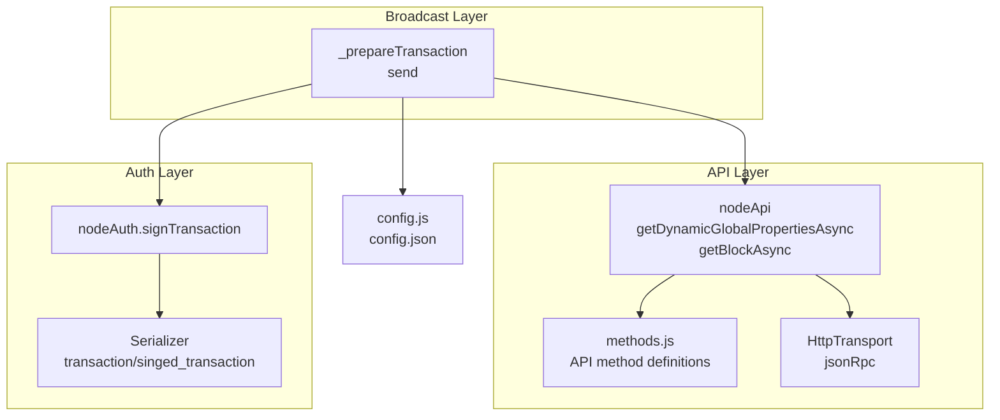
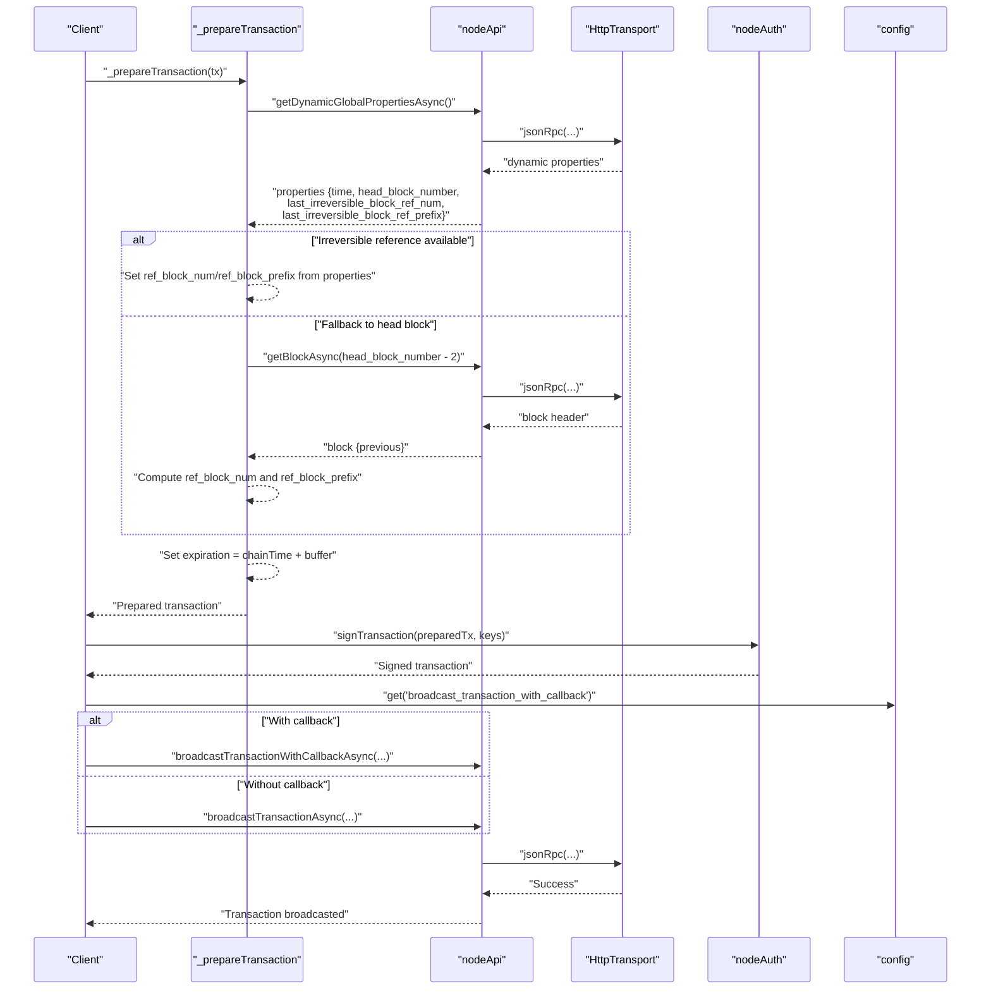
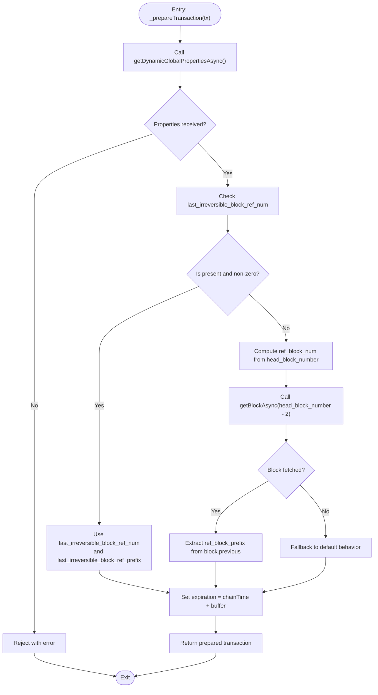
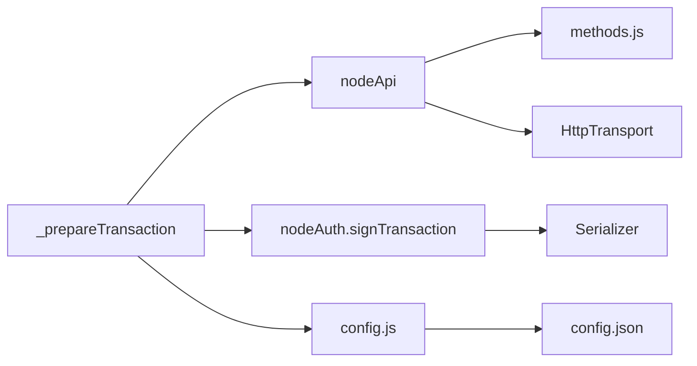

# Transaction Preparation

<cite>
**Referenced Files in This Document**
- [src/broadcast/index.js](file://src/broadcast/index.js)
- [src/broadcast/operations.js](file://src/broadcast/operations.js)
- [src/api/methods.js](file://src/api/methods.js)
- [src/api/index.js](file://src/api/index.js)
- [src/api/transports/http.js](file://src/api/transports/http.js)
- [src/auth/index.js](file://src/auth/index.js)
- [src/auth/serializer/src/operations.js](file://src/auth/serializer/src/operations.js)
- [src/config.js](file://src/config.js)
- [config.json](file://config.json)
- [test/broadcast.test.js](file://test/broadcast.test.js)
</cite>

## Table of Contents
1. [Introduction](#introduction)
2. [Project Structure](#project-structure)
3. [Core Components](#core-components)
4. [Architecture Overview](#architecture-overview)
5. [Detailed Component Analysis](#detailed-component-analysis)
6. [Dependency Analysis](#dependency-analysis)
7. [Performance Considerations](#performance-considerations)
8. [Troubleshooting Guide](#troubleshooting-guide)
9. [Conclusion](#conclusion)

## Introduction
This document explains the transaction preparation functionality in the VIZ broadcast system with a focus on the `_prepareTransaction` method. It covers dynamic global properties retrieval, block reference number assignment, automatic blockchain state detection, irreversible block handling, fallback mechanisms, transaction expiration calculation, chain date synchronization, and buffer handling for block prefix extraction. Practical examples, error scenarios, and performance considerations are included for different blockchain states.

## Project Structure
The broadcast system is composed of:
- Broadcast layer: orchestrates transaction preparation, signing, and broadcasting
- API layer: exposes blockchain methods and transports
- Authentication layer: handles transaction signing and key management
- Configuration: centralizes runtime settings

**Diagram sources**
- [src/broadcast/index.js](file://src/broadcast/index.js#L49-L84)
- [src/api/index.js](file://src/api/index.js#L98-L119)
- [src/api/methods.js](file://src/api/methods.js#L183-L189)
- [src/api/transports/http.js](file://src/api/transports/http.js#L17-L52)
- [src/auth/index.js](file://src/auth/index.js#L107-L130)
- [src/auth/serializer/src/operations.js](file://src/auth/serializer/src/operations.js#L73-L125)
- [src/config.js](file://src/config.js#L1-L10)
- [config.json](file://config.json#L1-L7)

**Section sources**
- [src/broadcast/index.js](file://src/broadcast/index.js#L1-L137)
- [src/api/index.js](file://src/api/index.js#L1-L271)
- [src/api/methods.js](file://src/api/methods.js#L1-L435)
- [src/api/transports/http.js](file://src/api/transports/http.js#L1-L53)
- [src/auth/index.js](file://src/auth/index.js#L1-L133)
- [src/auth/serializer/src/operations.js](file://src/auth/serializer/src/operations.js#L1-L200)
- [src/config.js](file://src/config.js#L1-L10)
- [config.json](file://config.json#L1-L7)

## Core Components
- Broadcast module: provides the `_prepareTransaction` method and the public `send` flow. It integrates with the API layer for dynamic global properties and block retrieval, and with the auth layer for signing.
- API module: exposes methods like `getDynamicGlobalPropertiesAsync` and `getBlockAsync`, and manages transports (HTTP/WebSocket).
- Auth module: signs transactions using chain ID and private keys, producing signed transactions.
- Serializer: defines transaction and signed_transaction structures used during signing and broadcasting.
- Configuration: holds runtime settings such as the websocket URL and broadcast behavior.

**Section sources**
- [src/broadcast/index.js](file://src/broadcast/index.js#L16-L137)
- [src/api/index.js](file://src/api/index.js#L21-L271)
- [src/auth/index.js](file://src/auth/index.js#L107-L130)
- [src/auth/serializer/src/operations.js](file://src/auth/serializer/src/operations.js#L73-L125)
- [src/config.js](file://src/config.js#L1-L10)

## Architecture Overview
The transaction preparation pipeline:
1. Retrieve dynamic global properties to synchronize with the chain time and determine the best block reference strategy.
2. If irreversible block reference is available, use it; otherwise, compute a reference from the head block with a fallback mechanism.
3. Assign expiration based on the synchronized chain time plus a fixed buffer.
4. Sign the prepared transaction with the provided private keys.
5. Broadcast the signed transaction via the configured transport.

**Diagram sources**
- [src/broadcast/index.js](file://src/broadcast/index.js#L49-L84)
- [src/api/index.js](file://src/api/index.js#L98-L119)
- [src/api/methods.js](file://src/api/methods.js#L163-L189)
- [src/api/transports/http.js](file://src/api/transports/http.js#L17-L52)
- [src/auth/index.js](file://src/auth/index.js#L107-L130)
- [src/config.js](file://src/config.js#L1-L10)
- [config.json](file://config.json#L1-L7)

## Detailed Component Analysis

### _prepareTransaction Method Implementation
The `_prepareTransaction` method performs the following steps:
- Retrieves dynamic global properties to obtain the chain time and block metadata.
- Detects blockchain state:
  - If `last_irreversible_block_ref_num` is present and non-zero, use it as the reference.
  - Otherwise, compute a reference from the head block with a fallback.
- Computes the reference block number and prefix:
  - Reference block number is derived from the head block number minus a fixed offset and masked to 16-bit range.
  - Reference block prefix is extracted from the previous block’s ID using a 32-bit little-endian read at a specific offset.
- Sets expiration:
  - Expiration is computed as the chain time plus a fixed buffer (typically a small number of minutes).
- Returns the prepared transaction augmented with reference fields and expiration.

**Diagram sources**
- [src/broadcast/index.js](file://src/broadcast/index.js#L49-L84)
- [src/api/methods.js](file://src/api/methods.js#L183-L189)

**Section sources**
- [src/broadcast/index.js](file://src/broadcast/index.js#L49-L84)

### Dynamic Global Properties Retrieval
- The method calls `getDynamicGlobalPropertiesAsync()` to obtain:
  - Chain time (`time`) for synchronization.
  - Head block number (`head_block_number`) for computing references.
  - Last irreversible block reference fields (`last_irreversible_block_ref_num`, `last_irreversible_block_ref_prefix`) for immediate use when available.
- These properties are essential for accurate reference assignment and expiration calculation.

**Section sources**
- [src/broadcast/index.js](file://src/broadcast/index.js#L50-L54)
- [src/api/methods.js](file://src/api/methods.js#L183-L189)

### Block Reference Number Assignment
- Irreversible reference path:
  - If `last_irreversible_block_ref_num` is available and non-zero, the method sets:
    - `ref_block_num` to the irreversible reference number.
    - `ref_block_prefix` to the corresponding prefix.
- Fallback path:
  - If no irreversible reference is available, the method:
    - Computes `ref_block_num` as `(head_block_number - 3) & 0xFFFF`.
    - Retrieves the block at `head_block_number - 2` and extracts `ref_block_prefix` from the previous block ID using a 32-bit little-endian read at a specific offset.
- This ensures transactions remain valid even when the chain is not immediately producing irreversible blocks.

**Section sources**
- [src/broadcast/index.js](file://src/broadcast/index.js#L56-L82)

### Automatic Blockchain State Detection and Fallback Mechanisms
- State detection:
  - The method checks for the presence and validity of `last_irreversible_block_ref_num`. If present and non-zero, it prioritizes the irreversible reference.
- Fallback:
  - If the irreversible reference is unavailable, the method falls back to computing a reference from the head block, retrieving the appropriate block header and extracting the prefix.
- This design ensures robustness across different network conditions and chain states.

**Section sources**
- [src/broadcast/index.js](file://src/broadcast/index.js#L56-L82)

### Transaction Expiration Calculation and Chain Date Synchronization
- Chain date synchronization:
  - The chain time is parsed from the dynamic properties and used as the baseline for expiration.
- Expiration calculation:
  - Expiration is set as the chain time plus a fixed buffer (e.g., a small number of minutes).
- This guarantees that the transaction remains valid for a short period after preparation while preventing indefinite validity.

**Section sources**
- [src/broadcast/index.js](file://src/broadcast/index.js#L54-L66)
- [src/broadcast/index.js](file://src/broadcast/index.js#L76-L79)

### Buffer Handling for Block Prefix Extraction
- The method extracts the reference block prefix from the previous block ID by reading a 32-bit unsigned integer in little-endian order at a specific offset.
- This ensures the prefix aligns with the blockchain’s expected format for transaction references.

**Section sources**
- [src/broadcast/index.js](file://src/broadcast/index.js#L75)

### Practical Examples of Transaction Preparation Workflows
- Preparing a vote transaction:
  - The broadcast layer generates a specialized operation wrapper that constructs the transaction with the required fields and then calls `_prepareTransaction`.
  - After preparation, the transaction is signed and broadcast.
- Broadcasting with callback:
  - The configuration controls whether to use synchronous or callback-based broadcasting. The broadcast layer conditionally selects the appropriate API method.

**Section sources**
- [src/broadcast/index.js](file://src/broadcast/index.js#L97-L129)
- [src/broadcast/index.js](file://src/broadcast/index.js#L24-L47)
- [src/broadcast/operations.js](file://src/broadcast/operations.js#L1-L475)
- [test/broadcast.test.js](file://test/broadcast.test.js#L33-L52)
- [test/broadcast.test.js](file://test/broadcast.test.js#L75-L120)

### Error Scenarios and Resilience
- Missing irreversible reference:
  - The method gracefully falls back to computing a reference from the head block and retrieving the block header.
- Network failures:
  - API calls may fail; the broadcast flow relies on promises and should propagate errors appropriately.
- Invalid or missing properties:
  - The method checks for the presence of required fields and applies fallback logic when necessary.

**Section sources**
- [src/broadcast/index.js](file://src/broadcast/index.js#L56-L82)
- [src/api/index.js](file://src/api/index.js#L98-L119)

### Signing and Broadcasting Integration
- Signing:
  - The prepared transaction is passed to the authentication layer for signing using the chain ID and provided private keys.
- Broadcasting:
  - The broadcast layer selects the appropriate API method based on configuration and sends the signed transaction via the configured transport.

**Section sources**
- [src/broadcast/index.js](file://src/broadcast/index.js#L31-L44)
- [src/auth/index.js](file://src/auth/index.js#L107-L130)
- [src/config.js](file://src/config.js#L1-L10)
- [config.json](file://config.json#L1-L7)

## Dependency Analysis
The transaction preparation process depends on:
- API methods for dynamic properties and block retrieval.
- HTTP transport for JSON-RPC requests.
- Authentication for signing.
- Configuration for transport selection and broadcast behavior.

**Diagram sources**
- [src/broadcast/index.js](file://src/broadcast/index.js#L49-L84)
- [src/api/index.js](file://src/api/index.js#L98-L119)
- [src/api/methods.js](file://src/api/methods.js#L183-L189)
- [src/api/transports/http.js](file://src/api/transports/http.js#L17-L52)
- [src/auth/index.js](file://src/auth/index.js#L107-L130)
- [src/auth/serializer/src/operations.js](file://src/auth/serializer/src/operations.js#L73-L125)
- [src/config.js](file://src/config.js#L1-L10)
- [config.json](file://config.json#L1-L7)

**Section sources**
- [src/broadcast/index.js](file://src/broadcast/index.js#L49-L84)
- [src/api/index.js](file://src/api/index.js#L98-L119)
- [src/api/methods.js](file://src/api/methods.js#L183-L189)
- [src/api/transports/http.js](file://src/api/transports/http.js#L17-L52)
- [src/auth/index.js](file://src/auth/index.js#L107-L130)
- [src/auth/serializer/src/operations.js](file://src/auth/serializer/src/operations.js#L73-L125)
- [src/config.js](file://src/config.js#L1-L10)
- [config.json](file://config.json#L1-L7)

## Performance Considerations
- Minimizing API calls:
  - Prefer using the irreversible reference when available to avoid an extra block retrieval.
- Batch operations:
  - Group multiple operations into a single transaction to reduce overhead.
- Transport selection:
  - Use HTTP for environments where WebSocket is not feasible; ensure the endpoint is reliable.
- Expiration buffer:
  - Keep the expiration buffer small to prevent stale transactions while allowing sufficient time for signing and broadcasting.
- Serialization overhead:
  - Reuse prepared transactions when possible and avoid unnecessary re-serialization.

[No sources needed since this section provides general guidance]

## Troubleshooting Guide
- Transactions rejected due to invalid reference:
  - Verify that the reference block number and prefix are correctly computed from the chain state.
- Expiration errors:
  - Ensure the chain time is synchronized and the expiration buffer is adequate.
- Broadcasting failures:
  - Check the transport configuration and network connectivity; confirm the endpoint URL is correct.
- Signing issues:
  - Confirm that the chain ID matches the target network and that private keys are valid.

**Section sources**
- [src/broadcast/index.js](file://src/broadcast/index.js#L49-L84)
- [src/api/index.js](file://src/api/index.js#L98-L119)
- [src/auth/index.js](file://src/auth/index.js#L107-L130)
- [src/config.js](file://src/config.js#L1-L10)
- [config.json](file://config.json#L1-L7)

## Conclusion
The `_prepareTransaction` method provides a robust, state-aware mechanism for preparing VIZ transactions. By leveraging dynamic global properties, detecting irreversible block availability, and applying fallback logic, it ensures transactions remain valid across varying blockchain conditions. Proper configuration, signing, and broadcasting integrate seamlessly to deliver a reliable end-to-end workflow.