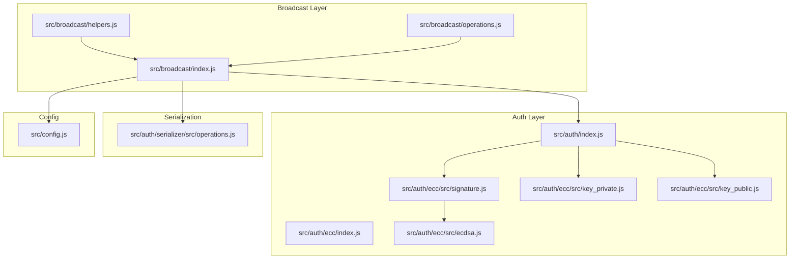
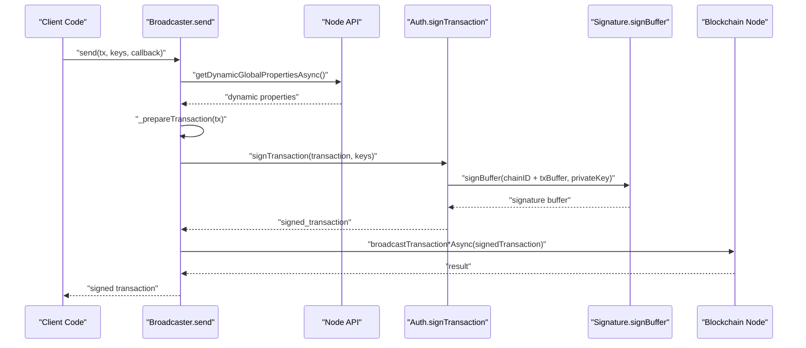
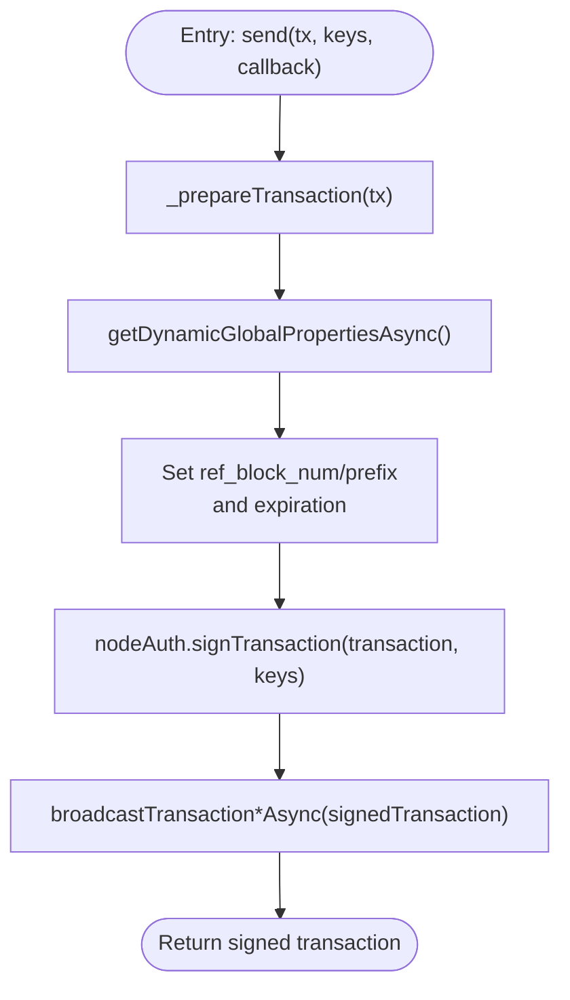
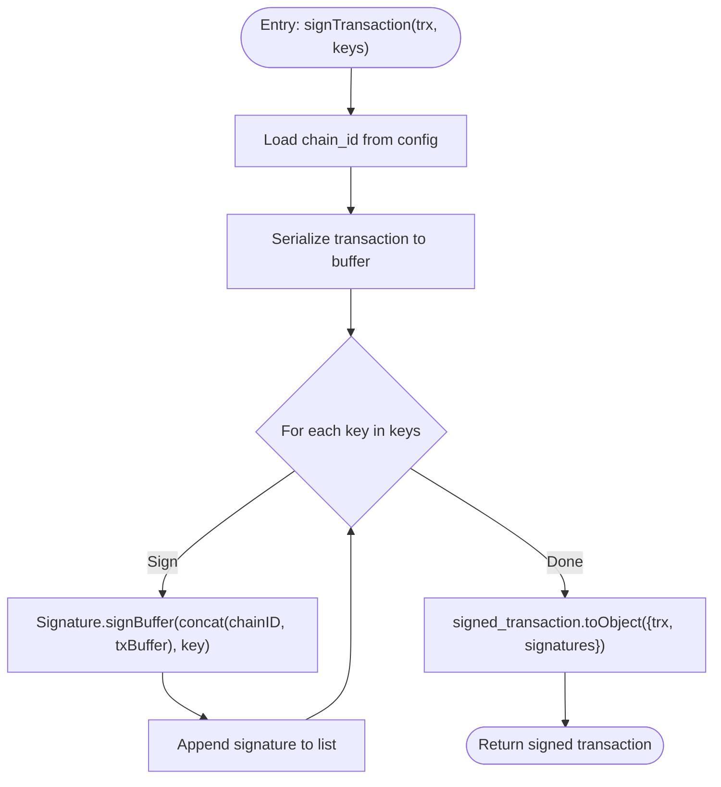
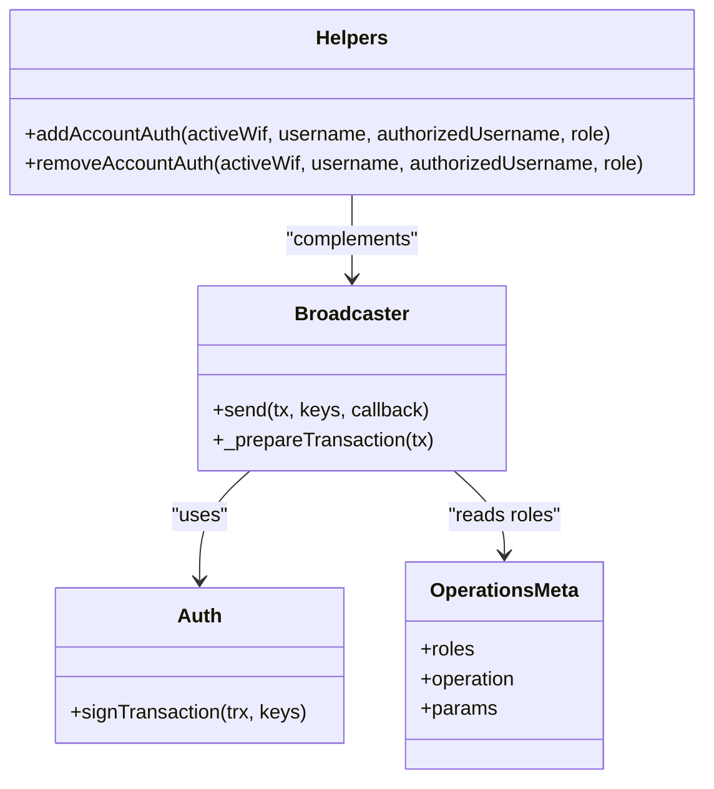
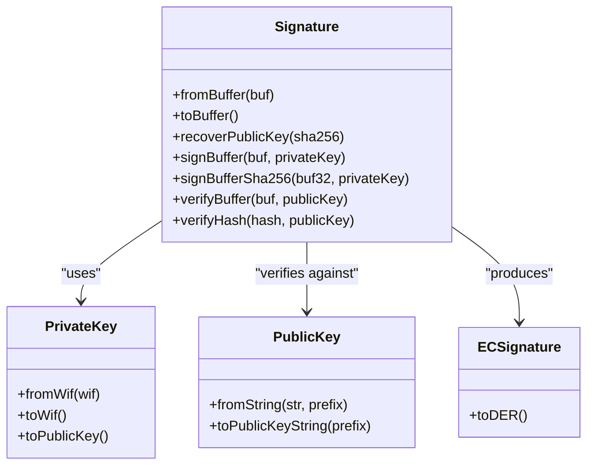
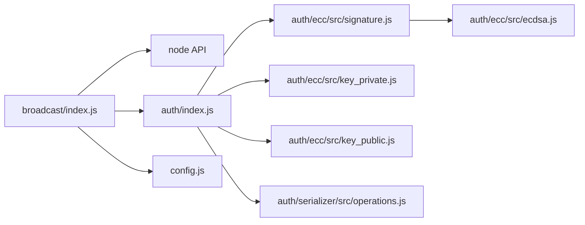

# Transaction Signing

<cite>
**Referenced Files in This Document**
- [broadcast/index.js](file://src/broadcast/index.js)
- [broadcast/operations.js](file://src/broadcast/operations.js)
- [broadcast/helpers.js](file://src/broadcast/helpers.js)
- [auth/index.js](file://src/auth/index.js)
- [auth/ecc/index.js](file://src/auth/ecc/index.js)
- [auth/ecc/src/signature.js](file://src/auth/ecc/src/signature.js)
- [auth/ecc/src/key_private.js](file://src/auth/ecc/src/key_private.js)
- [auth/ecc/src/key_public.js](file://src/auth/ecc/src/key_public.js)
- [auth/ecc/src/ecdsa.js](file://src/auth/ecc/src/ecdsa.js)
- [auth/serializer/src/operations.js](file://src/auth/serializer/src/operations.js)
- [config.js](file://src/config.js)
- [test/broadcast.test.js](file://test/broadcast.test.js)
- [examples/broadcast.html](file://examples/broadcast.html)
- [README.md](file://README.md)
</cite>

## Table of Contents
1. [Introduction](#introduction)
2. [Project Structure](#project-structure)
3. [Core Components](#core-components)
4. [Architecture Overview](#architecture-overview)
5. [Detailed Component Analysis](#detailed-component-analysis)
6. [Dependency Analysis](#dependency-analysis)
7. [Performance Considerations](#performance-considerations)
8. [Troubleshooting Guide](#troubleshooting-guide)
9. [Conclusion](#conclusion)
10. [Appendices](#appendices)

## Introduction
This document explains the transaction signing processes in the VIZ broadcast system. It covers how the broadcaster integrates with the authentication module, how private keys are handled, and how cryptographic signing is performed. It documents the signTransaction workflow, key role assignment, and multi-signature support. It also includes error handling for invalid keys and signature validation, along with security considerations. Practical examples demonstrate signing with different key types, batch signing operations, and debugging signature-related issues.

## Project Structure
The transaction signing pipeline spans three primary areas:
- Broadcasting: constructs transactions, injects chain metadata, and signs/broadcasts them.
- Authentication: generates keys, validates WIF, and performs cryptographic signing.
- Serialization: defines transaction and signed transaction structures for encoding and hashing.



**Diagram sources**
- [broadcast/index.js](file://src/broadcast/index.js#L1-L137)
- [broadcast/operations.js](file://src/broadcast/operations.js#L1-L475)
- [broadcast/helpers.js](file://src/broadcast/helpers.js#L1-L82)
- [auth/index.js](file://src/auth/index.js#L1-L133)
- [auth/ecc/index.js](file://src/auth/ecc/index.js#L1-L13)
- [auth/ecc/src/signature.js](file://src/auth/ecc/src/signature.js#L1-L163)
- [auth/ecc/src/key_private.js](file://src/auth/ecc/src/key_private.js#L1-L172)
- [auth/ecc/src/key_public.js](file://src/auth/ecc/src/key_public.js#L1-L170)
- [auth/ecc/src/ecdsa.js](file://src/auth/ecc/src/ecdsa.js#L1-L219)
- [auth/serializer/src/operations.js](file://src/auth/serializer/src/operations.js#L73-L125)
- [config.js](file://src/config.js#L1-L10)

**Section sources**
- [broadcast/index.js](file://src/broadcast/index.js#L1-L137)
- [auth/index.js](file://src/auth/index.js#L1-L133)
- [auth/serializer/src/operations.js](file://src/auth/serializer/src/operations.js#L73-L125)

## Core Components
- Broadcaster.send: orchestrates transaction preparation, signing via the authentication module, and broadcasting to the node.
- Auth.signTransaction: computes signatures over the serialized transaction using the configured chain ID and provided private keys.
- Serializer transaction/singed_transaction: defines the wire format for transactions and signed transactions, ensuring deterministic hashing.
- Key management: WIF generation, validation, and conversion between WIF and public keys.

Key responsibilities:
- Transaction preparation: fetches dynamic global properties, sets reference block and expiration.
- Signing: iterates over provided keys, signs the typed transaction buffer with the chain ID prefix.
- Broadcasting: sends the signed transaction to the node via configured transport.

**Section sources**
- [broadcast/index.js](file://src/broadcast/index.js#L24-L84)
- [auth/index.js](file://src/auth/index.js#L107-L130)
- [auth/serializer/src/operations.js](file://src/auth/serializer/src/operations.js#L73-L125)

## Architecture Overview
The signing workflow integrates the broadcast layer with the authentication and serialization layers.



**Diagram sources**
- [broadcast/index.js](file://src/broadcast/index.js#L24-L47)
- [auth/index.js](file://src/auth/index.js#L107-L130)
- [auth/ecc/src/signature.js](file://src/auth/ecc/src/signature.js#L62-L98)
- [auth/serializer/src/operations.js](file://src/auth/serializer/src/operations.js#L73-L125)

## Detailed Component Analysis

### Broadcaster.send and Transaction Preparation
- Prepares transaction by fetching dynamic global properties and setting reference block and expiration.
- Signs the prepared transaction using the authentication module’s signTransaction.
- Broadcasts the signed transaction via configured transport.



**Diagram sources**
- [broadcast/index.js](file://src/broadcast/index.js#L24-L84)

**Section sources**
- [broadcast/index.js](file://src/broadcast/index.js#L24-L84)

### Auth.signTransaction Workflow
- Reads the chain ID from configuration and serializes the transaction to a buffer.
- Iterates over provided keys, signs the concatenated chain ID + transaction buffer, and accumulates signatures.
- Returns a signed transaction object with the collected signatures.



**Diagram sources**
- [auth/index.js](file://src/auth/index.js#L107-L130)
- [auth/ecc/src/signature.js](file://src/auth/ecc/src/signature.js#L62-L98)
- [auth/serializer/src/operations.js](file://src/auth/serializer/src/operations.js#L73-L125)

**Section sources**
- [auth/index.js](file://src/auth/index.js#L107-L130)
- [auth/ecc/src/signature.js](file://src/auth/ecc/src/signature.js#L62-L98)

### Multi-Signature Support and Key Role Assignment
- The broadcast layer supports multiple keys passed to signTransaction.
- Operations metadata includes roles (e.g., active, master, regular) that guide which key to supply for signing.
- The helpers module demonstrates adding/removing account authorities for delegated signing scenarios.



**Diagram sources**
- [broadcast/index.js](file://src/broadcast/index.js#L89-L129)
- [broadcast/operations.js](file://src/broadcast/operations.js#L1-L475)
- [broadcast/helpers.js](file://src/broadcast/helpers.js#L6-L80)
- [auth/index.js](file://src/auth/index.js#L107-L130)

**Section sources**
- [broadcast/index.js](file://src/broadcast/index.js#L89-L129)
- [broadcast/operations.js](file://src/broadcast/operations.js#L1-L475)
- [broadcast/helpers.js](file://src/broadcast/helpers.js#L6-L80)

### Cryptographic Signing Internals
- Signature.signBufferSha256 enforces a 32-byte hash input and uses deterministic nonce generation.
- The signing process ensures canonical signature format and derives recovery parameter for public key recovery.
- Verification uses ECDSA with proper range checks and curve validation.



**Diagram sources**
- [auth/ecc/src/signature.js](file://src/auth/ecc/src/signature.js#L9-L163)
- [auth/ecc/src/key_private.js](file://src/auth/ecc/src/key_private.js#L13-L172)
- [auth/ecc/src/key_public.js](file://src/auth/ecc/src/key_public.js#L13-L170)
- [auth/ecc/src/ecdsa.js](file://src/auth/ecc/src/ecdsa.js#L65-L137)

**Section sources**
- [auth/ecc/src/signature.js](file://src/auth/ecc/src/signature.js#L62-L121)
- [auth/ecc/src/key_private.js](file://src/auth/ecc/src/key_private.js#L55-L81)
- [auth/ecc/src/key_public.js](file://src/auth/ecc/src/key_public.js#L86-L100)
- [auth/ecc/src/ecdsa.js](file://src/auth/ecc/src/ecdsa.js#L65-L137)

### Transaction and Signed Transaction Structures
- transaction: defines ref_block_num, ref_block_prefix, expiration, operations, and extensions.
- signed_transaction: extends transaction with a signatures array of 65-byte signature buffers.

```mermaid
erDiagram
TRANSACTION {
uint16 ref_block_num
uint32 ref_block_prefix
time_point_sec expiration
array~operation~ operations
set future_extensions extensions
}
SIGNED_TRANSACTION {
uint16 ref_block_num
uint32 ref_block_prefix
time_point_sec expiration
array~operation~ operations
set future_extensions extensions
array~bytes65~ signatures
}
SIGNED_TRANSACTION }o--|| TRANSACTION : "includes"
```

**Diagram sources**
- [auth/serializer/src/operations.js](file://src/auth/serializer/src/operations.js#L73-L125)

**Section sources**
- [auth/serializer/src/operations.js](file://src/auth/serializer/src/operations.js#L73-L125)

## Dependency Analysis
- Broadcaster depends on:
  - Node API for dynamic properties and broadcasting.
  - Auth.signTransaction for cryptographic signing.
  - Serializer transaction/singed_transaction for deterministic hashing.
  - Config for chain ID and broadcast behavior.
- Auth depends on:
  - ECC primitives (Signature, PrivateKey, PublicKey).
  - Serializer transaction for buffer serialization.
  - Config for address prefix and chain ID.



**Diagram sources**
- [broadcast/index.js](file://src/broadcast/index.js#L1-L15)
- [auth/index.js](file://src/auth/index.js#L1-L16)
- [auth/ecc/src/signature.js](file://src/auth/ecc/src/signature.js#L1-L8)
- [auth/ecc/src/key_private.js](file://src/auth/ecc/src/key_private.js#L1-L8)
- [auth/ecc/src/key_public.js](file://src/auth/ecc/src/key_public.js#L1-L8)
- [auth/serializer/src/operations.js](file://src/auth/serializer/src/operations.js#L73-L81)
- [config.js](file://src/config.js#L1-L10)

**Section sources**
- [broadcast/index.js](file://src/broadcast/index.js#L1-L15)
- [auth/index.js](file://src/auth/index.js#L1-L16)

## Performance Considerations
- Deterministic nonce generation avoids retries in most cases; however, the signing loop includes a retry mechanism to produce canonical signatures. This can increase latency under rare conditions.
- Batch signing: pass multiple keys to signTransaction to accumulate multiple signatures efficiently in a single pass.
- Avoid unnecessary re-serialization: reuse the prepared transaction object to prevent redundant serialization costs.

[No sources needed since this section provides general guidance]

## Troubleshooting Guide
Common issues and resolutions:
- Invalid WIF or mismatched public key:
  - Validate WIF using Auth.isWif and Auth.wifIsValid.
  - Ensure the private key corresponds to the intended public key.
- Signature verification failures:
  - Confirm the chain ID matches the network configuration.
  - Verify the transaction buffer serialization aligns with the node’s expectations.
- Missing or incorrect roles:
  - Ensure the operation’s roles match the supplied keys.
  - Use helpers to manage account authorities when delegating signing permissions.
- Debugging signature-related issues:
  - Enable debug logging around signing and broadcasting.
  - Inspect the raw transaction buffer and signatures to confirm correctness.

Practical references:
- Transaction preparation and signing lifecycle: [broadcast/index.js](file://src/broadcast/index.js#L24-L84)
- Signing implementation and signature format: [auth/index.js](file://src/auth/index.js#L107-L130), [auth/ecc/src/signature.js](file://src/auth/ecc/src/signature.js#L62-L98)
- Key validation utilities: [auth/index.js](file://src/auth/index.js#L65-L101)
- Authority management helpers: [broadcast/helpers.js](file://src/broadcast/helpers.js#L6-L80)
- Example usage patterns: [examples/broadcast.html](file://examples/broadcast.html#L15-L103), [README.md](file://README.md#L55-L64)

**Section sources**
- [broadcast/index.js](file://src/broadcast/index.js#L24-L84)
- [auth/index.js](file://src/auth/index.js#L65-L101)
- [auth/ecc/src/signature.js](file://src/auth/ecc/src/signature.js#L62-L98)
- [broadcast/helpers.js](file://src/broadcast/helpers.js#L6-L80)
- [examples/broadcast.html](file://examples/broadcast.html#L15-L103)
- [README.md](file://README.md#L55-L64)

## Conclusion
The VIZ broadcast system integrates tightly with the authentication and serialization layers to securely sign and broadcast transactions. By leveraging deterministic signing, role-aware key assignment, and multi-signature support, applications can reliably transact on the VIZ blockchain. Proper configuration of chain ID, careful key handling, and robust error checking are essential for secure and reliable operation.

[No sources needed since this section summarizes without analyzing specific files]

## Appendices

### Practical Examples

- Signing with a single key (regular):
  - Use the generated WIF for the desired role and call the appropriate broadcast method.
  - Reference: [examples/broadcast.html](file://examples/broadcast.html#L15-L25), [README.md](file://README.md#L55-L64)

- Batch signing with multiple keys:
  - Supply multiple keys to signTransaction to collect multiple signatures in one pass.
  - Reference: [auth/index.js](file://src/auth/index.js#L107-L130)

- Delegated signing with account authorities:
  - Add or remove authorized accounts for a given role using helpers.
  - Reference: [broadcast/helpers.js](file://src/broadcast/helpers.js#L6-L80)

- Verifying signatures:
  - Use Signature.verifyHash or Signature.verifyBuffer to validate signatures against public keys.
  - Reference: [auth/ecc/src/signature.js](file://src/auth/ecc/src/signature.js#L115-L121)

**Section sources**
- [examples/broadcast.html](file://examples/broadcast.html#L15-L103)
- [README.md](file://README.md#L55-L64)
- [auth/index.js](file://src/auth/index.js#L107-L130)
- [broadcast/helpers.js](file://src/broadcast/helpers.js#L6-L80)
- [auth/ecc/src/signature.js](file://src/auth/ecc/src/signature.js#L115-L121)