# Data Serialization

<cite>
**Referenced Files in This Document**
- [serializer.js](file://src/auth/serializer/src/serializer.js)
- [types.js](file://src/auth/serializer/src/types.js)
- [operations.js](file://src/auth/serializer/src/operations.js)
- [ChainTypes.js](file://src/auth/serializer/src/ChainTypes.js)
- [object_id.js](file://src/auth/serializer/src/object_id.js)
- [number_utils.js](file://src/auth/serializer/src/number_utils.js)
- [validation.js](file://src/auth/serializer/src/validation.js)
- [fast_parser.js](file://src/auth/serializer/src/fast_parser.js)
- [error_with_cause.js](file://src/auth/serializer/src/error_with_cause.js)
- [template.js](file://src/auth/serializer/src/template.js)
- [index.js](file://src/auth/serializer/index.js)
- [README.md](file://src/auth/serializer/README.md)
- [all_types.js](file://test/all_types.js)
- [types_test.js](file://test/types_test.js)
</cite>

## Table of Contents
1. [Introduction](#introduction)
2. [Project Structure](#project-structure)
3. [Core Components](#core-components)
4. [Architecture Overview](#architecture-overview)
5. [Detailed Component Analysis](#detailed-component-analysis)
6. [Dependency Analysis](#dependency-analysis)
7. [Performance Considerations](#performance-considerations)
8. [Troubleshooting Guide](#troubleshooting-guide)
9. [Conclusion](#conclusion)
10. [Appendices](#appendices)

## Introduction
This document explains the data serialization system used by VIZ blockchain communications. It covers the custom serialization protocol, type definitions, object templates, and validation mechanisms. You will learn how blockchain objects are encoded and decoded, how field validation rules are applied, and how JavaScript objects relate to blockchain data structures. The guide includes examples of serializing/deserializing complex objects, understanding wire formats, debugging serialization issues, performance considerations, and extensibility patterns.

## Project Structure
The serialization subsystem resides under src/auth/serializer and exposes a small API surface via index.js. The core building blocks are:
- Serializer: a generic encoder/decoder for named operation templates
- Types: low-level type definitions for primitives, containers, and blockchain-specific types
- Operations: higher-level operation templates composed from Types
- Utilities: validation, object IDs, fast parsing, number conversions, and error handling

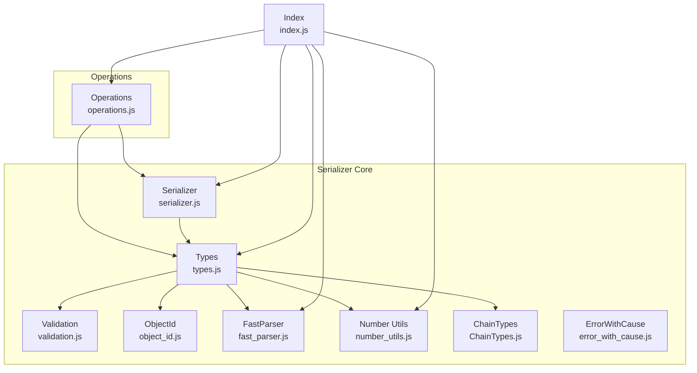

**Diagram sources**
- [index.js](file://src/auth/serializer/index.js#L1-L20)
- [serializer.js](file://src/auth/serializer/src/serializer.js#L1-L195)
- [types.js](file://src/auth/serializer/src/types.js#L1-L953)
- [operations.js](file://src/auth/serializer/src/operations.js#L1-L922)
- [ChainTypes.js](file://src/auth/serializer/src/ChainTypes.js#L1-L84)
- [object_id.js](file://src/auth/serializer/src/object_id.js#L1-L66)
- [number_utils.js](file://src/auth/serializer/src/number_utils.js#L1-L54)
- [validation.js](file://src/auth/serializer/src/validation.js#L1-L288)
- [fast_parser.js](file://src/auth/serializer/src/fast_parser.js#L1-L58)
- [error_with_cause.js](file://src/auth/serializer/src/error_with_cause.js#L1-L27)

**Section sources**
- [index.js](file://src/auth/serializer/index.js#L1-L20)
- [README.md](file://src/auth/serializer/README.md#L1-L14)

## Core Components
- Serializer: Provides fromByteBuffer, appendByteBuffer, fromObject, toObject, toHex, toBuffer, toByteBuffer, and comparison helpers. It iterates over a template’s keys and delegates encoding/decoding to the associated type.
- Types: Defines all primitive and composite types (uint8/16/32/64, int64, string, bytes, bool, array, set, map, fixed_array, optional, static_variant, time_point_sec, public_key, address, vote_id, object_id_type, protocol_id_type, asset). Each type implements fromByteBuffer, appendByteBuffer, fromObject, toObject, and often compare and validate helpers.
- Operations: Declares concrete operation templates (e.g., transfer, vote, account_update, signed_transaction, block_header, etc.) built from Types and nested templates.
- Validation: Enforces required fields, numeric ranges, safe integer bounds, and object ID formats.
- ObjectId: Encodes/decodes compact object IDs from 64-bit packed values.
- FastParser: Optimized helpers for public key, address RIPEMD-160, and timestamps.
- Number Utils: Precision-aware conversions for asset-like amounts.
- ChainTypes: Operation and object type enumerations.
- ErrorWithCause: Nests errors with contextual messages.

**Section sources**
- [serializer.js](file://src/auth/serializer/src/serializer.js#L6-L195)
- [types.js](file://src/auth/serializer/src/types.js#L1-L953)
- [operations.js](file://src/auth/serializer/src/operations.js#L1-L922)
- [validation.js](file://src/auth/serializer/src/validation.js#L1-L288)
- [object_id.js](file://src/auth/serializer/src/object_id.js#L1-L66)
- [fast_parser.js](file://src/auth/serializer/src/fast_parser.js#L1-L58)
- [number_utils.js](file://src/auth/serializer/src/number_utils.js#L1-L54)
- [ChainTypes.js](file://src/auth/serializer/src/ChainTypes.js#L1-L84)
- [error_with_cause.js](file://src/auth/serializer/src/error_with_cause.js#L1-L27)

## Architecture Overview
The system is a layered pipeline:
- Templates define the shape of blockchain objects (e.g., operations, blocks).
- Types define how each field is encoded/decoded.
- Validation ensures correctness during conversion.
- Utilities optimize hot paths and handle special encodings.

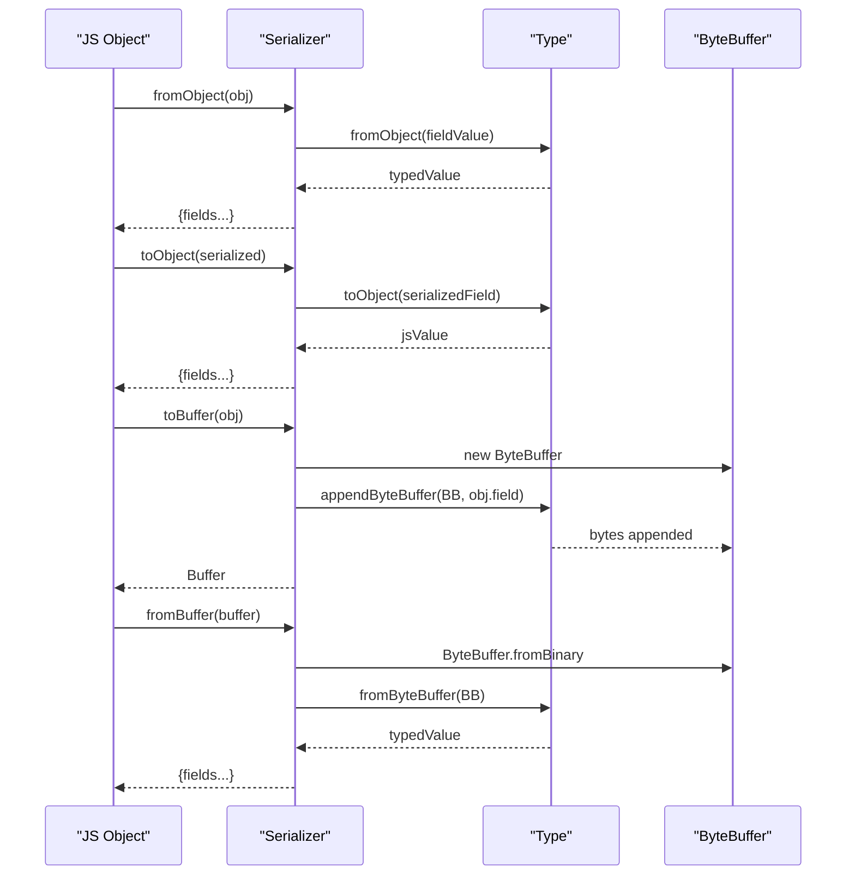

**Diagram sources**
- [serializer.js](file://src/auth/serializer/src/serializer.js#L79-L138)
- [types.js](file://src/auth/serializer/src/types.js#L30-L69)

## Detailed Component Analysis

### Serializer
- Responsibilities:
  - Iterate template keys and dispatch to type handlers.
  - Encode/decode to/from ByteBuffer, Buffer, and hex.
  - Provide comparison for sorting arrays of operations.
  - Debugging aids via hex dumps and structured error reporting.
- Key methods:
  - fromByteBuffer: reads fields in order and returns a JS object.
  - appendByteBuffer: writes fields in order to a buffer.
  - fromObject/toObject: round-trip conversions with debug flags.
  - toHex/toBuffer/toByteBuffer: convenience for transport.
  - compare: compares by first key using type-specific comparator.

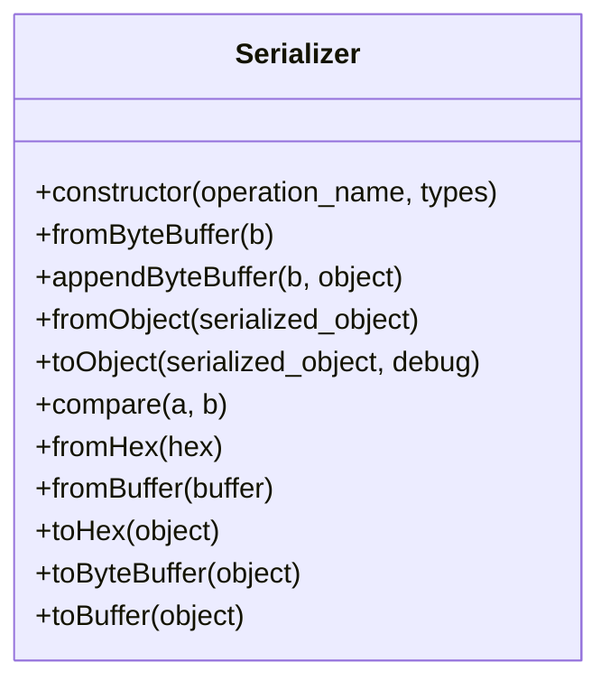

**Diagram sources**
- [serializer.js](file://src/auth/serializer/src/serializer.js#L6-L195)

**Section sources**
- [serializer.js](file://src/auth/serializer/src/serializer.js#L6-L195)

### Types
- Primitive types: uint8/16/32, int16, int64, uint64, bool, string, string_binary, bytes(size), time_point_sec.
- Collections: array(inner), set(inner), map(key,value), fixed_array(count, inner).
- Optional wrapper: optional(inner).
- Polymorphism: static_variant([ops...]) stores a tagged variant with a type discriminator.
- Blockchain-specific:
  - asset: amount + precision + symbol, encoded as 64-bit amount + 8-bit precision + 6-byte symbol.
  - public_key/address: optimized via FastParser.
  - vote_id: packed 32-bit type:id.
  - object_id_type: compact 64-bit packed space.type.instance.
  - protocol_id_type(name): resolves human-readable IDs to varint32.
- Validation hooks: each type enforces ranges, presence, and formats.

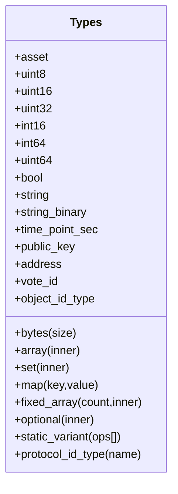

**Diagram sources**
- [types.js](file://src/auth/serializer/src/types.js#L30-L953)

**Section sources**
- [types.js](file://src/auth/serializer/src/types.js#L30-L953)

### Operations
- Declares concrete operation templates (e.g., vote, content, transfer, account_update, signed_transaction, block_header, etc.).
- Uses static_variant to embed polymorphic operations inside arrays and sets.
- Demonstrates composition of primitives, collections, and nested serializers.

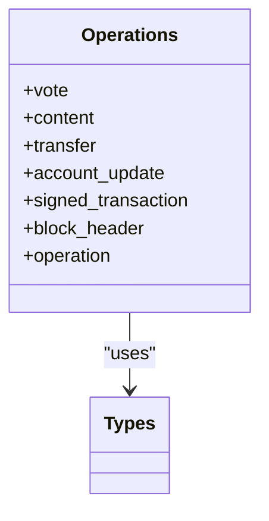

**Diagram sources**
- [operations.js](file://src/auth/serializer/src/operations.js#L60-L922)

**Section sources**
- [operations.js](file://src/auth/serializer/src/operations.js#L1-L922)

### Validation
- Enforces required fields, numeric ranges, safe integer bounds, and object ID formats.
- Converts strings to Long safely and checks overflow conditions.
- Validates object type formats and extracts instances.

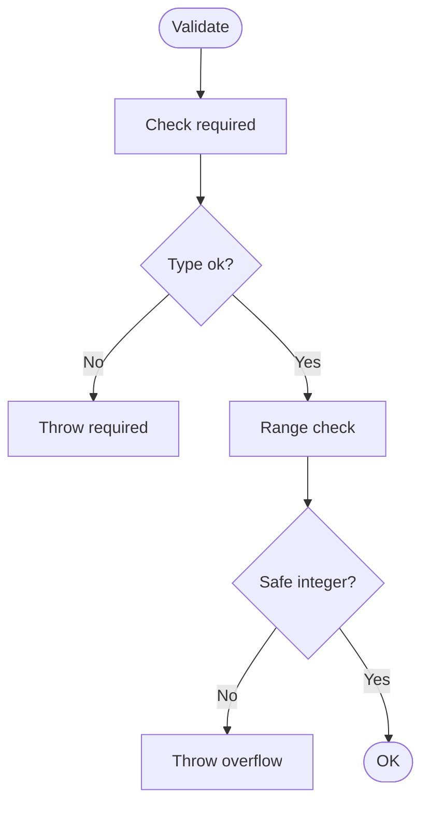

**Diagram sources**
- [validation.js](file://src/auth/serializer/src/validation.js#L35-L156)

**Section sources**
- [validation.js](file://src/auth/serializer/src/validation.js#L1-L288)

### ObjectId
- Encodes/decodes compact object IDs from 64-bit packed values.
- Parses human-readable forms and validates instance digits.

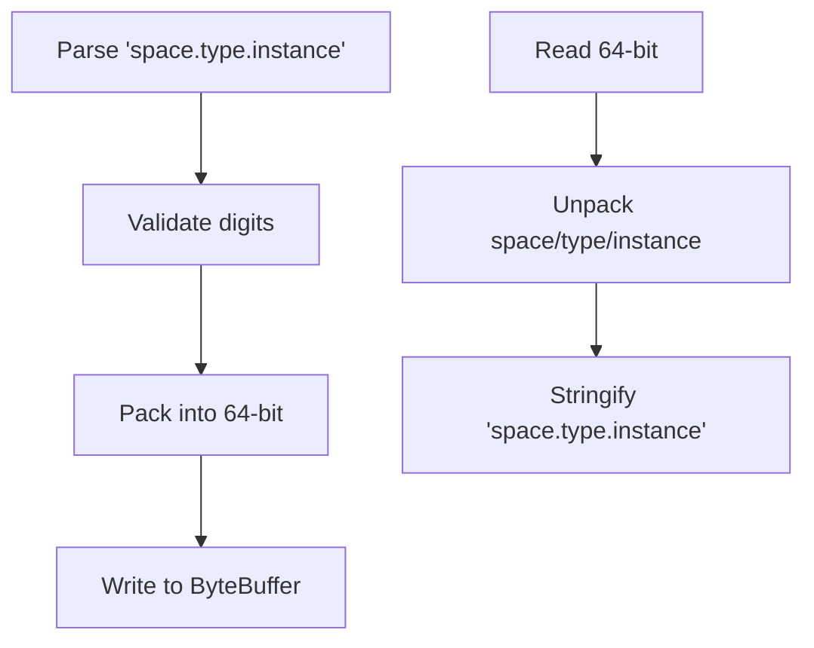

**Diagram sources**
- [object_id.js](file://src/auth/serializer/src/object_id.js#L19-L62)

**Section sources**
- [object_id.js](file://src/auth/serializer/src/object_id.js#L1-L66)

### FastParser
- Optimized helpers for public_key, address RIPEMD-160, and time_point_sec.
- Reduces overhead by avoiding intermediate allocations when writing.

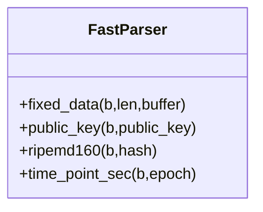

**Diagram sources**
- [fast_parser.js](file://src/auth/serializer/src/fast_parser.js#L3-L55)

**Section sources**
- [fast_parser.js](file://src/auth/serializer/src/fast_parser.js#L1-L58)

### Number Utils
- Precision-aware conversions for implied decimals in assets.
- Ensures proper padding and decimal alignment.

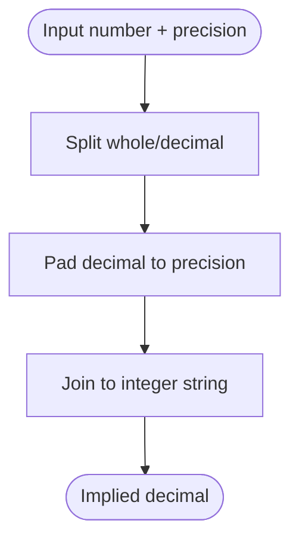

**Diagram sources**
- [number_utils.js](file://src/auth/serializer/src/number_utils.js#L10-L53)

**Section sources**
- [number_utils.js](file://src/auth/serializer/src/number_utils.js#L1-L54)

### ChainTypes
- Enumerations for reserved spaces and operation IDs.
- Used by protocol_id_type and object_id_type.

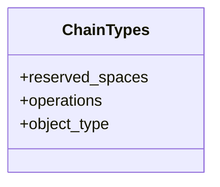

**Diagram sources**
- [ChainTypes.js](file://src/auth/serializer/src/ChainTypes.js#L7-L84)

**Section sources**
- [ChainTypes.js](file://src/auth/serializer/src/ChainTypes.js#L1-L84)

### ErrorWithCause
- Nests errors with contextual messages and stacks for easier debugging.

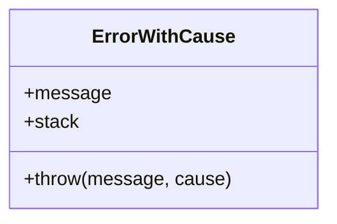

**Diagram sources**
- [error_with_cause.js](file://src/auth/serializer/src/error_with_cause.js#L2-L24)

**Section sources**
- [error_with_cause.js](file://src/auth/serializer/src/error_with_cause.js#L1-L27)

### Template Utility
- Generates JSON examples for operation templates with defaults and annotations.

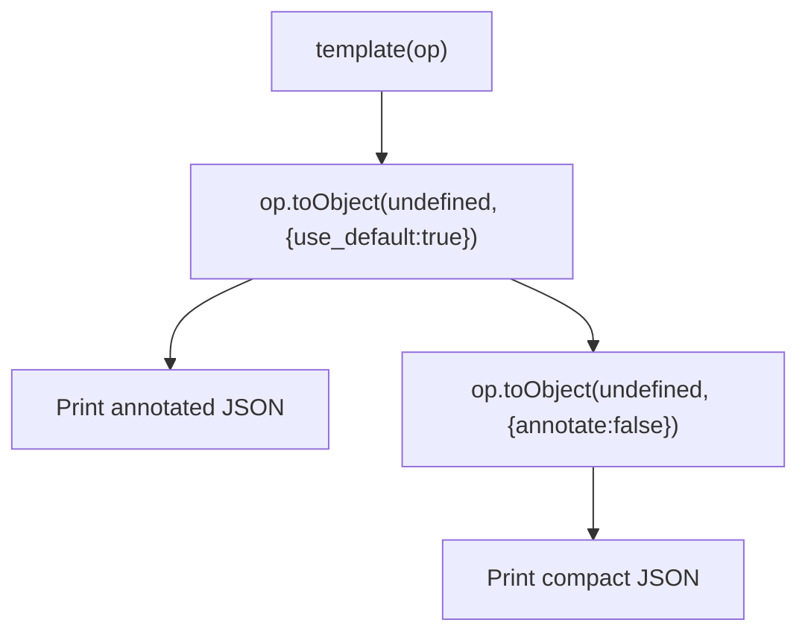

**Diagram sources**
- [template.js](file://src/auth/serializer/src/template.js#L3-L16)

**Section sources**
- [template.js](file://src/auth/serializer/src/template.js#L1-L17)

## Dependency Analysis
- Serializer depends on Types and ErrorWithCause.
- Types depend on Validation, ObjectId, FastParser, Number Utils, and ChainTypes.
- Operations depend on Serializer and Types, and compose static_variant.
- Index aggregates and exports the public API.

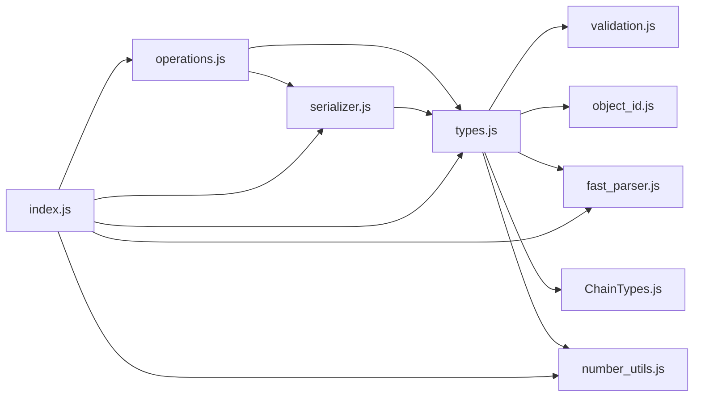

**Diagram sources**
- [index.js](file://src/auth/serializer/index.js#L1-L20)
- [serializer.js](file://src/auth/serializer/src/serializer.js#L1-L15)
- [types.js](file://src/auth/serializer/src/types.js#L1-L14)
- [operations.js](file://src/auth/serializer/src/operations.js#L20-L52)

**Section sources**
- [index.js](file://src/auth/serializer/index.js#L1-L20)
- [serializer.js](file://src/auth/serializer/src/serializer.js#L1-L15)
- [types.js](file://src/auth/serializer/src/types.js#L1-L14)
- [operations.js](file://src/auth/serializer/src/operations.js#L20-L52)

## Performance Considerations
- Sorting and deduplication:
  - Sets and maps enforce uniqueness and deterministic ordering, which adds CPU cost. Prefer smaller sets and avoid unnecessary duplicates.
- Varints:
  - Variable-length integers are efficient for small numbers but can inflate size for large ones. Keep counters and IDs within typical ranges.
- ByteBuffer reuse:
  - The Serializer copies buffers at the end; avoid excessive intermediate allocations when building large structures.
- FastParser:
  - Public keys and hashes are handled efficiently via fixed-size helpers to minimize copying.
- Hex dumps:
  - Enabling hex dump prints can help debugging but adds significant I/O overhead; disable in production.

[No sources needed since this section provides general guidance]

## Troubleshooting Guide
Common issues and resolutions:
- Required field missing:
  - Validation throws a required error. Ensure all required fields are present in the JS object.
- Range or overflow:
  - Numeric types enforce ranges and safe integer bounds. Use string representations for large numbers and ensure precision matches asset expectations.
- Duplicate entries in sets/maps:
  - Sets and maps reject duplicates. Normalize inputs to unique values before serialization.
- Invalid object ID format:
  - Ensure IDs follow the "space.type.instance" pattern and that instance is numeric.
- Unexpected type in static_variant:
  - Verify the operation tag matches the intended variant and that the payload conforms to the corresponding template.
- Debugging wire format:
  - Use Serializer.toHex or enable hex dump to inspect per-field encodings. Compare expected vs. actual hex to locate mismatches.
- Round-trip mismatches:
  - Use toObject with debug flags to normalize values and compare canonical forms.

**Section sources**
- [validation.js](file://src/auth/serializer/src/validation.js#L35-L156)
- [types.js](file://src/auth/serializer/src/types.js#L436-L498)
- [types.js](file://src/auth/serializer/src/types.js#L800-L877)
- [serializer.js](file://src/auth/serializer/src/serializer.js#L26-L50)

## Conclusion
The VIZ serialization system provides a robust, extensible framework for encoding and decoding blockchain data. By composing primitive and composite types, applying strict validation, and offering efficient parsing utilities, it ensures reliable interop between JavaScript applications and the VIZ network. Following the patterns documented here enables developers to serialize complex objects, debug wire formats, and extend the system with new types and operations.

[No sources needed since this section summarizes without analyzing specific files]

## Appendices

### Wire Format Examples and Best Practices
- Asset encoding:
  - Amount stored as 64-bit integer with implied precision; symbol stored as uppercase ASCII with trailing null padding.
- Public key/address:
  - Public keys are 33-byte compressed SEC format; addresses are RIPEMD-160 hashes of public keys.
- Vote ID:
  - Packed 32-bit value combining type and id; ensure both fit within allowed ranges.
- Object ID:
  - 64-bit packed value; ensure instance is numeric and within limits.
- Timestamps:
  - Stored as seconds since epoch; accept Date objects, Unix seconds, or ISO strings ending in Z.
- Collections:
  - Arrays and sets are varint-sized; maps are varint-sized pairs. Ensure uniqueness for sets/maps.

**Section sources**
- [types.js](file://src/auth/serializer/src/types.js#L30-L69)
- [types.js](file://src/auth/serializer/src/types.js#L879-L937)
- [types.js](file://src/auth/serializer/src/types.js#L633-L680)
- [object_id.js](file://src/auth/serializer/src/object_id.js#L19-L62)
- [types.js](file://src/auth/serializer/src/types.js#L391-L433)

### Extensibility Patterns
- Adding a new primitive type:
  - Define fromByteBuffer, appendByteBuffer, fromObject, toObject, and optionally compare/validate.
- Adding a new operation:
  - Compose existing types into a Serializer template; register it in operations.js.
- Extending static_variant:
  - Add new operation templates and update the static_variant list in the containing type or operation.
- Custom validation:
  - Use validation helpers to enforce domain-specific constraints before encoding.

**Section sources**
- [types.js](file://src/auth/serializer/src/types.js#L725-L797)
- [operations.js](file://src/auth/serializer/src/operations.js#L849-L914)

### Example Workflows

#### Serializing a Transfer Operation
- Build a JS object matching the transfer template.
- Call Serializer.toBuffer or Serializer.toHex.
- Inspect hex dump if needed to verify field encodings.

**Section sources**
- [operations.js](file://src/auth/serializer/src/operations.js#L197-L204)
- [serializer.js](file://src/auth/serializer/src/serializer.js#L184-L192)

#### Deserializing a Block Header
- Obtain raw bytes or hex.
- Call Serializer.fromBuffer or Serializer.fromHex.
- Convert to JS object with Serializer.toObject for inspection.

**Section sources**
- [operations.js](file://src/auth/serializer/src/operations.js#L143-L155)
- [serializer.js](file://src/auth/serializer/src/serializer.js#L168-L176)

#### Generating a Template Example
- Use the template utility to print a fully populated example with defaults and annotations.

**Section sources**
- [template.js](file://src/auth/serializer/src/template.js#L3-L16)

### Test References
- Comprehensive type coverage and sorting behavior:
  - [all_types.js](file://test/all_types.js#L23-L63)
  - [types_test.js](file://test/types_test.js#L31-L71)

**Section sources**
- [all_types.js](file://test/all_types.js#L1-L115)
- [types_test.js](file://test/types_test.js#L1-L141)