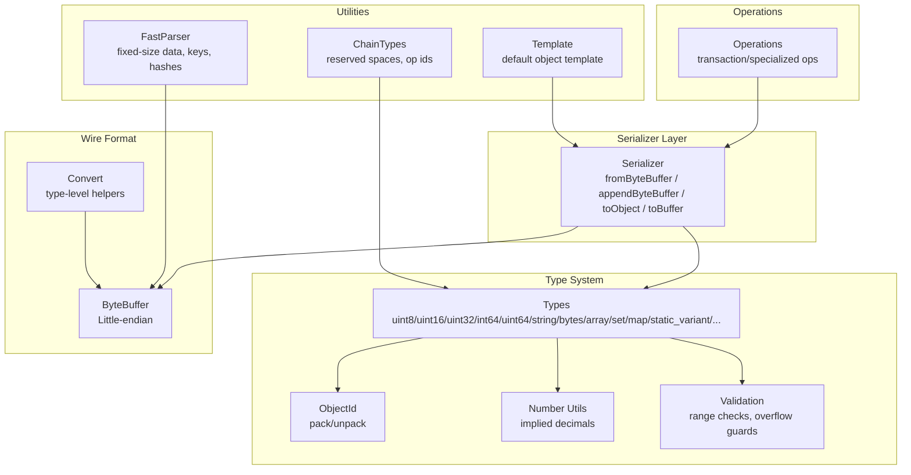
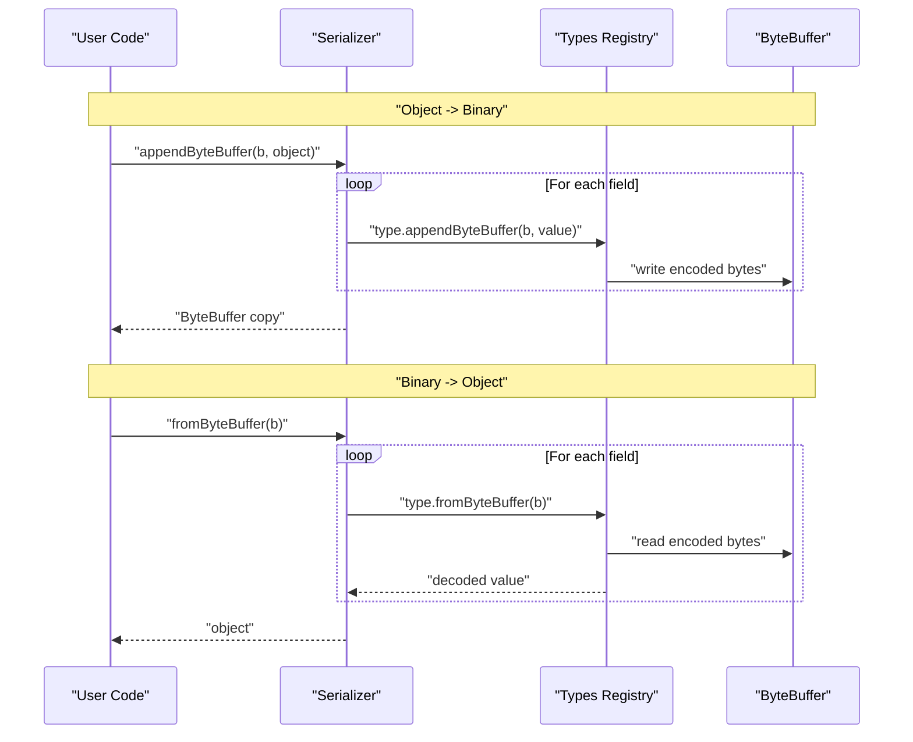
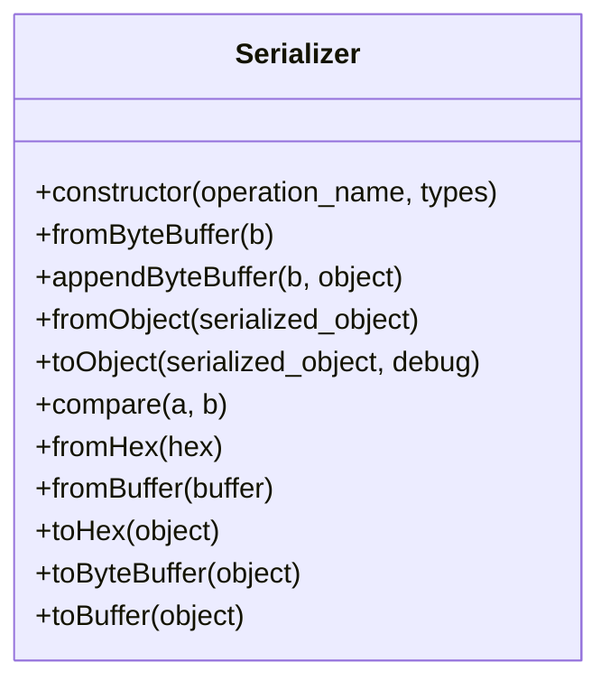
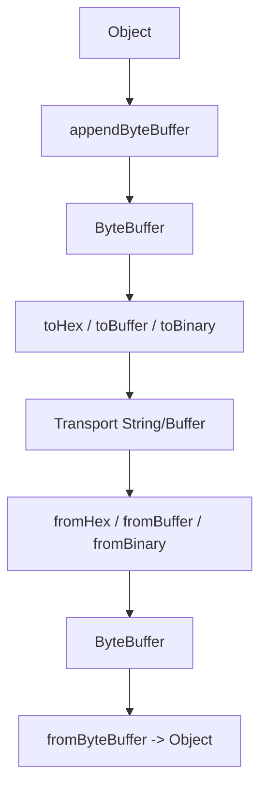
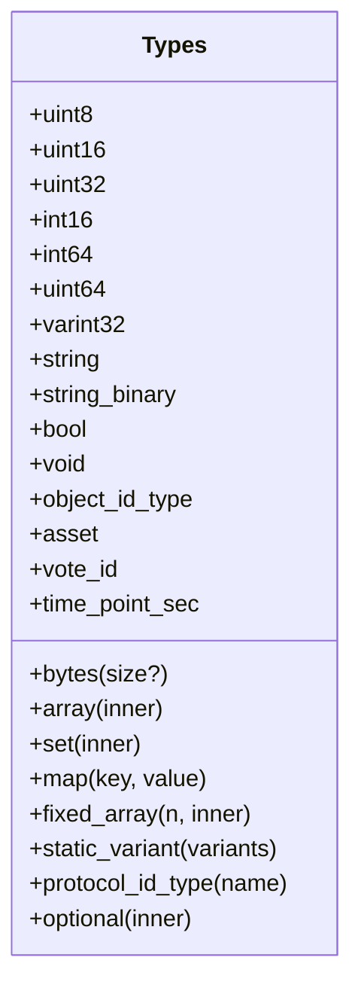
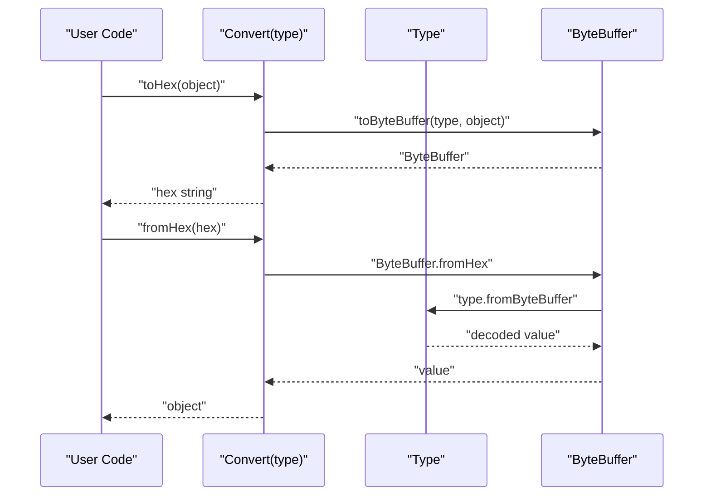
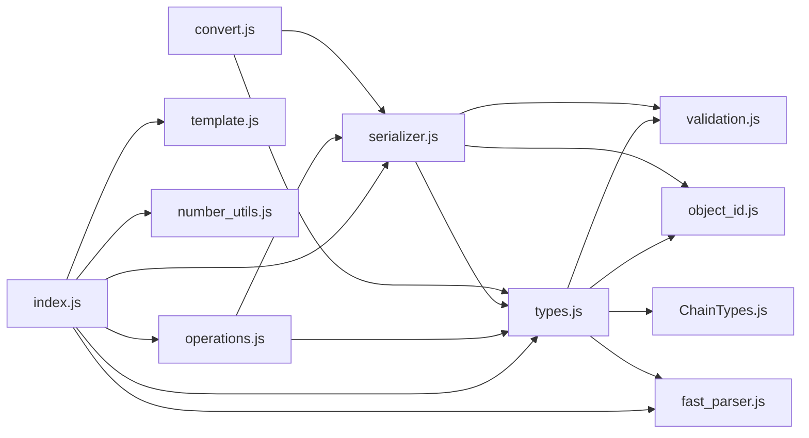

# Encoding & Decoding

<cite>
**Referenced Files in This Document**
- [serializer.js](file://src/auth/serializer/src/serializer.js)
- [types.js](file://src/auth/serializer/src/types.js)
- [convert.js](file://src/auth/serializer/src/convert.js)
- [number_utils.js](file://src/auth/serializer/src/number_utils.js)
- [validation.js](file://src/auth/serializer/src/validation.js)
- [object_id.js](file://src/auth/serializer/src/object_id.js)
- [fast_parser.js](file://src/auth/serializer/src/fast_parser.js)
- [operations.js](file://src/auth/serializer/src/operations.js)
- [ChainTypes.js](file://src/auth/serializer/src/ChainTypes.js)
- [template.js](file://src/auth/serializer/src/template.js)
- [index.js](file://src/auth/serializer/index.js)
- [all_types.js](file://test/all_types.js)
- [types_test.js](file://test/types_test.js)
- [README.md](file://src/auth/serializer/README.md)
</cite>

## Table of Contents
1. [Introduction](#introduction)
2. [Project Structure](#project-structure)
3. [Core Components](#core-components)
4. [Architecture Overview](#architecture-overview)
5. [Detailed Component Analysis](#detailed-component-analysis)
6. [Dependency Analysis](#dependency-analysis)
7. [Performance Considerations](#performance-considerations)
8. [Troubleshooting Guide](#troubleshooting-guide)
9. [Conclusion](#conclusion)
10. [Appendices](#appendices)

## Introduction
This document explains the encoding and decoding subsystem responsible for binary serialization and deserialization of blockchain operations and data structures. It focuses on the Serializer class, low-level type encoders, ByteBuffer integration, wire format conversion, and practical usage patterns. It also covers performance, memory management, debugging, edge cases, error recovery, and interoperability between hex, buffer, and object representations.

## Project Structure
The serialization subsystem resides under src/auth/serializer and exposes a small public surface via src/auth/serializer/index.js. The core logic is organized into:
- Serializer: high-level orchestration for object-to-binary and binary-to-object conversions
- Types: low-level encoders/decoders for primitive and composite types
- Operations: pre-built serializers for blockchain operations
- Utilities: validation, number conversion, object ID packing/unpacking, fast parser helpers
- Helpers: conversion wrappers and templates

**Diagram sources**
- [serializer.js](file://src/auth/serializer/src/serializer.js#L1-L195)
- [types.js](file://src/auth/serializer/src/types.js#L1-L953)
- [convert.js](file://src/auth/serializer/src/convert.js#L1-L40)
- [number_utils.js](file://src/auth/serializer/src/number_utils.js#L1-L54)
- [validation.js](file://src/auth/serializer/src/validation.js#L1-L288)
- [object_id.js](file://src/auth/serializer/src/object_id.js#L1-L66)
- [fast_parser.js](file://src/auth/serializer/src/fast_parser.js#L1-L58)
- [operations.js](file://src/auth/serializer/src/operations.js#L1-L922)
- [ChainTypes.js](file://src/auth/serializer/src/ChainTypes.js#L1-L84)
- [template.js](file://src/auth/serializer/src/template.js#L1-L17)

**Section sources**
- [index.js](file://src/auth/serializer/index.js#L1-L20)
- [README.md](file://src/auth/serializer/README.md#L1-L14)

## Core Components
- Serializer: orchestrates field-by-field encoding/decoding using a type map, supports hex, buffer, and object conversions, and provides comparison helpers for sorting.
- Types: a registry of encoders/decoders for primitives and composites, including arrays, sets, maps, static variants, object IDs, and specialized types like asset and vote_id.
- Operations: ready-made serializers for blockchain operations (e.g., transaction, signed_transaction, vote, transfer).
- Convert: convenience wrapper around a single type to convert between hex, buffer, and object forms.
- Validation: range checks, overflow guards, and object type parsing.
- Number Utils: implied decimal conversion for asset-like amounts.
- ObjectId: pack/unpack of compact object identifiers.
- FastParser: helpers for fixed-size data, public keys, RIPEMD-160 hashes, and timestamps.
- Template: prints a default-filled object representation for inspection.

**Section sources**
- [serializer.js](file://src/auth/serializer/src/serializer.js#L1-L195)
- [types.js](file://src/auth/serializer/src/types.js#L1-L953)
- [operations.js](file://src/auth/serializer/src/operations.js#L1-L922)
- [convert.js](file://src/auth/serializer/src/convert.js#L1-L40)
- [validation.js](file://src/auth/serializer/src/validation.js#L1-L288)
- [number_utils.js](file://src/auth/serializer/src/number_utils.js#L1-L54)
- [object_id.js](file://src/auth/serializer/src/object_id.js#L1-L66)
- [fast_parser.js](file://src/auth/serializer/src/fast_parser.js#L1-L58)
- [template.js](file://src/auth/serializer/src/template.js#L1-L17)

## Architecture Overview
The system converts between three representations:
- Object form: JavaScript objects with typed fields
- Binary form: little-endian ByteBuffer streams
- Hex/Binary strings: transport-friendly representations

**Diagram sources**
- [serializer.js](file://src/auth/serializer/src/serializer.js#L17-L77)
- [types.js](file://src/auth/serializer/src/types.js#L31-L69)

## Detailed Component Analysis

### Serializer Class
Responsibilities:
- Field iteration using a type map
- Binary reading/writing via ByteBuffer
- Object conversion and reverse conversion
- Hex and Buffer convenience methods
- Sorting comparator for ordered collections

Key methods and behaviors:
- fromByteBuffer: iterates fields, delegates to type-specific decoders, supports hex dump mode for debugging
- appendByteBuffer: iterates fields, delegates to type-specific encoders
- fromObject/toObject: round-trip conversions with optional defaults and annotations
- toHex/toBuffer/toByteBuffer: convenience converters
- compare: compares by first key using type comparator or hex string comparison for buffers

**Diagram sources**
- [serializer.js](file://src/auth/serializer/src/serializer.js#L6-L195)

**Section sources**
- [serializer.js](file://src/auth/serializer/src/serializer.js#L6-L195)

### ByteBuffer Integration
- Little-endian byte order is used consistently
- Offsets are advanced by each read/write operation
- Copying is performed to produce immutable views for output
- Optional hex dumping prints raw field bytes for diagnostics

Practical implications:
- Endianness must be preserved across systems
- Offset tracking ensures deterministic reads/writes
- Hex dumps aid debugging complex nested structures

**Section sources**
- [serializer.js](file://src/auth/serializer/src/serializer.js#L168-L192)

### Wire Format Conversion
- Hex ↔ Binary ↔ Object conversions are supported
- Convert wrapper provides a type-scoped interface for conversions
- toByteBuffer uses a fresh ByteBuffer and copies the result

**Diagram sources**
- [convert.js](file://src/auth/serializer/src/convert.js#L3-L39)
- [serializer.js](file://src/auth/serializer/src/serializer.js#L168-L192)

**Section sources**
- [convert.js](file://src/auth/serializer/src/convert.js#L1-L40)
- [serializer.js](file://src/auth/serializer/src/serializer.js#L168-L192)

### Encoding Methods for Data Types
The Types registry defines encoders/decoders for:
- Numeric primitives: uint8, uint16, uint32, int16, int64, uint64, varint32
- Strings and binary blobs: string, string_binary, bytes(size?)
- Booleans, void placeholders
- Collections: array(inner), set(inner), map(key, value), fixed_array(n, inner)
- Discriminated unions: static_variant(variants)
- Object identifiers: protocol_id_type(name), object_id_type
- Specialized types: asset, vote_id, time_point_sec, optional(inner)

Each type implements:
- fromByteBuffer(b): read and decode
- appendByteBuffer(b, object): write encoded bytes
- fromObject(object): coerce/validate input
- toObject(object, debug): convert to user-facing representation

**Diagram sources**
- [types.js](file://src/auth/serializer/src/types.js#L30-L953)

**Section sources**
- [types.js](file://src/auth/serializer/src/types.js#L30-L953)

### Decoding Procedures and Format Compatibility
- Decoders advance ByteBuffer offsets deterministically
- Variable-length encodings (strings, varints, arrays) are self-describing
- Asset amounts use implied decimal precision; conversion utilities handle string ↔ numeric ↔ encoded forms
- Object IDs are packed as 64-bit integers with space/type/instance semantics
- Vote IDs combine type and id into a packed 32-bit value

Compatibility considerations:
- Little-endian ordering must be preserved
- String encodings use varint-prefixed UTF-8
- Fixed-size bytes types require explicit length or fixed width
- Static variants include a type discriminator

**Section sources**
- [types.js](file://src/auth/serializer/src/types.js#L30-L953)
- [number_utils.js](file://src/auth/serializer/src/number_utils.js#L10-L53)
- [object_id.js](file://src/auth/serializer/src/object_id.js#L39-L62)

### Examples: Serializing Complex Objects
- Round-trip conversions: object → buffer → object preserve semantic equivalence
- Mixed representations: hex ↔ object conversions validated in tests
- Nested structures: arrays, sets, maps, and static variants are supported

Example scenarios (paths only):
- Complex object round-trip: [all_types.js](file://test/all_types.js#L74-L100)
- Hex ↔ buffer ↔ object conversions: [all_types.js](file://test/all_types.js#L87-L95)
- Template generation: [template.js](file://src/auth/serializer/src/template.js#L3-L16)

**Section sources**
- [all_types.js](file://test/all_types.js#L65-L115)
- [template.js](file://src/auth/serializer/src/template.js#L1-L17)

### Handling Binary Data
- bytes(size?): variable-length or fixed-length binary blobs
- string_binary: varint-prefixed binary string
- fixed_array(n, inner): fixed-width sequences
- FastParser helpers: fixed-size data, public keys, RIPEMD-160 hashes, timestamps

Guidelines:
- Prefer bytes(size?) for fixed-width binary fields
- Use string_binary for variable-length textual binary payloads
- Validate lengths and avoid exceeding declared sizes

**Section sources**
- [types.js](file://src/auth/serializer/src/types.js#L266-L304)
- [types.js](file://src/auth/serializer/src/types.js#L243-L264)
- [fast_parser.js](file://src/auth/serializer/src/fast_parser.js#L5-L54)

### Converting Between Representations
- Hex: toHex/fromHex using ByteBuffer.fromHex/toHex
- Buffer: toBuffer/fromBuffer using ByteBuffer.toBinary/toBinary
- Object: toObject/fromObject with optional defaults and annotations

**Diagram sources**
- [convert.js](file://src/auth/serializer/src/convert.js#L3-L39)
- [types.js](file://src/auth/serializer/src/types.js#L30-L69)

**Section sources**
- [convert.js](file://src/auth/serializer/src/convert.js#L1-L40)
- [serializer.js](file://src/auth/serializer/src/serializer.js#L168-L192)

## Dependency Analysis
High-level dependencies:
- Serializer depends on Types and ByteBuffer
- Types depend on Validation, ObjectId, ChainTypes, and FastParser
- Operations depend on Serializer and Types
- Convert depends on Types and ByteBuffer
- Public index exports Serializer, types, ops, fp, template, number_utils

**Diagram sources**
- [index.js](file://src/auth/serializer/index.js#L1-L20)
- [serializer.js](file://src/auth/serializer/src/serializer.js#L1-L15)
- [types.js](file://src/auth/serializer/src/types.js#L1-L14)
- [operations.js](file://src/auth/serializer/src/operations.js#L20-L52)
- [convert.js](file://src/auth/serializer/src/convert.js#L1-L3)

**Section sources**
- [index.js](file://src/auth/serializer/index.js#L1-L20)
- [operations.js](file://src/auth/serializer/src/operations.js#L20-L52)

## Performance Considerations
- Minimize allocations: reuse ByteBuffer instances when feasible; the current implementation creates a new ByteBuffer per conversion and copies the result
- Prefer fixed-size types for hot paths: bytes(size?) avoids varint overhead
- Avoid unnecessary conversions: batch operations when possible
- Use hex dump sparingly: it incurs extra copying and logging
- Leverage sorting helpers: sets/maps/static variants may sort inputs; ensure stable ordering to reduce variance
- Validate early: use fromObject to normalize inputs before encoding

[No sources needed since this section provides general guidance]

## Troubleshooting Guide
Common issues and remedies:
- Out-of-range values: Validation throws on invalid ranges; ensure numeric bounds are respected
- Overflow on 64-bit values: Validation enforces safe integer ranges; use string representations for large numbers
- Duplicate entries in sets/maps: Validation rejects duplicates; ensure uniqueness before encoding
- Incorrect endianness: Ensure ByteBuffer is configured for little-endian
- Improper asset precision: Use implied decimal conversion utilities to match expected precision
- Object ID format: Must match reserved space/type/instance; validation parses and verifies formats
- Static variant type id: Ensure discriminator matches registered variant index

Debugging tips:
- Enable hex dump mode to inspect raw field bytes during decode
- Use template to generate default-filled objects for inspection
- Compare round-trips: object → buffer → object should be equivalent

**Section sources**
- [validation.js](file://src/auth/serializer/src/validation.js#L149-L286)
- [types_test.js](file://test/types_test.js#L11-L71)
- [README.md](file://src/auth/serializer/README.md#L8-L13)
- [template.js](file://src/auth/serializer/src/template.js#L3-L16)

## Conclusion
The serialization subsystem provides a robust, extensible framework for encoding and decoding blockchain data. Its design separates concerns between high-level orchestration (Serializer), low-level encoding (Types), and utilities (Validation, ObjectId, Number Utils). By leveraging ByteBuffer’s little-endian semantics and self-describing encodings, it achieves compatibility across hex, buffer, and object representations. Following the performance and troubleshooting guidance helps maintain correctness and efficiency in production environments.

[No sources needed since this section summarizes without analyzing specific files]

## Appendices

### Appendix A: Example Workflows

- Serialize an operation to hex:
  - Build a signed_transaction object
  - Call toHex on the signed_transaction serializer
  - Paths: [operations.js](file://src/auth/serializer/src/operations.js#L116-L125), [serializer.js](file://src/auth/serializer/src/serializer.js#L178-L182)

- Deserialize hex to object:
  - Call fromHex on the signed_transaction serializer
  - Paths: [operations.js](file://src/auth/serializer/src/operations.js#L116-L125), [serializer.js](file://src/auth/serializer/src/serializer.js#L168-L171)

- Convert between buffer and object:
  - Use toBuffer/fromBuffer and toObject/fromObject
  - Paths: [serializer.js](file://src/auth/serializer/src/serializer.js#L190-L192), [all_types.js](file://test/all_types.js#L87-L100)

- Inspect default object structure:
  - Use template to print default-filled object
  - Path: [template.js](file://src/auth/serializer/src/template.js#L3-L16)

**Section sources**
- [operations.js](file://src/auth/serializer/src/operations.js#L116-L125)
- [serializer.js](file://src/auth/serializer/src/serializer.js#L168-L192)
- [all_types.js](file://test/all_types.js#L87-L100)
- [template.js](file://src/auth/serializer/src/template.js#L1-L17)