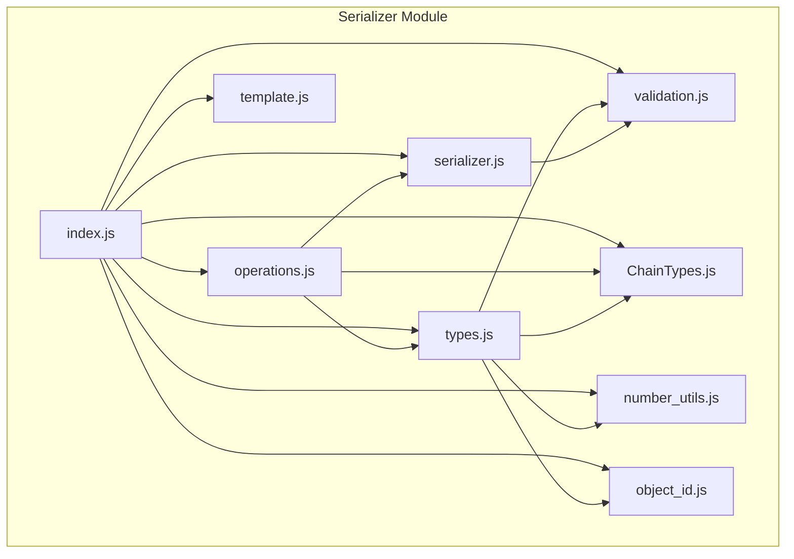
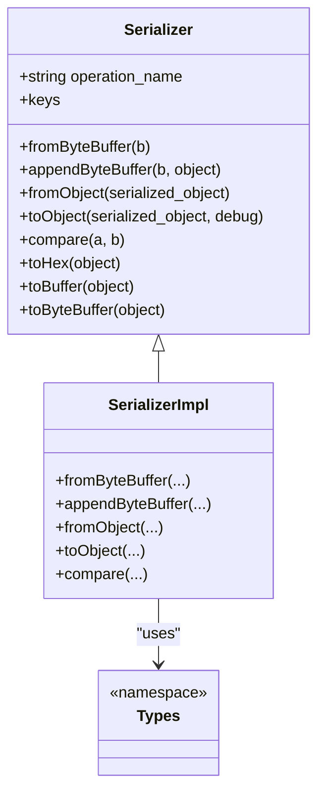
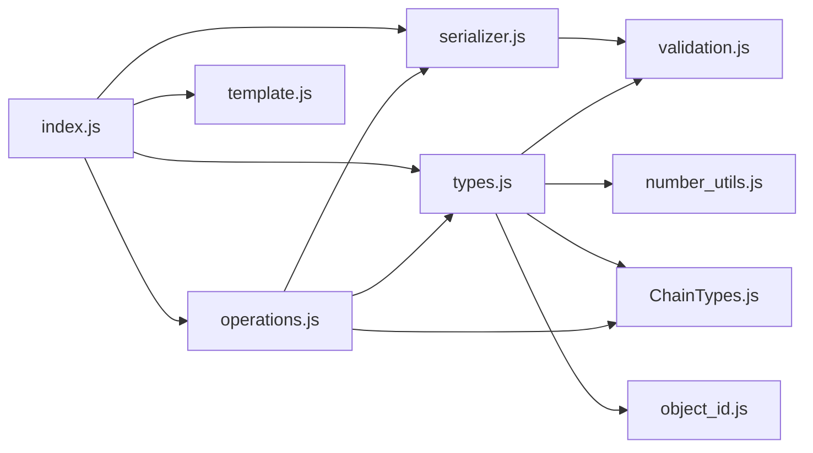
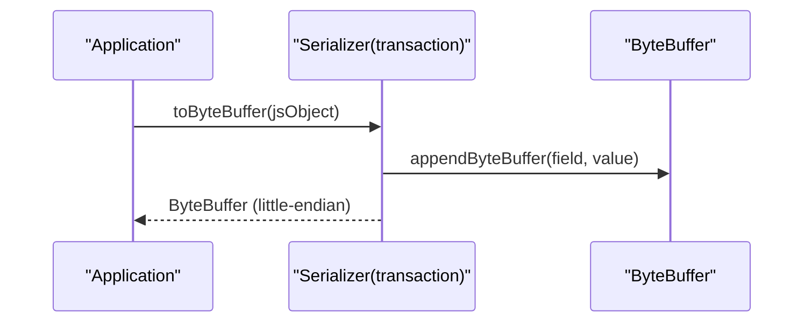
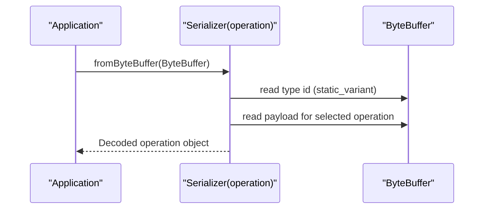
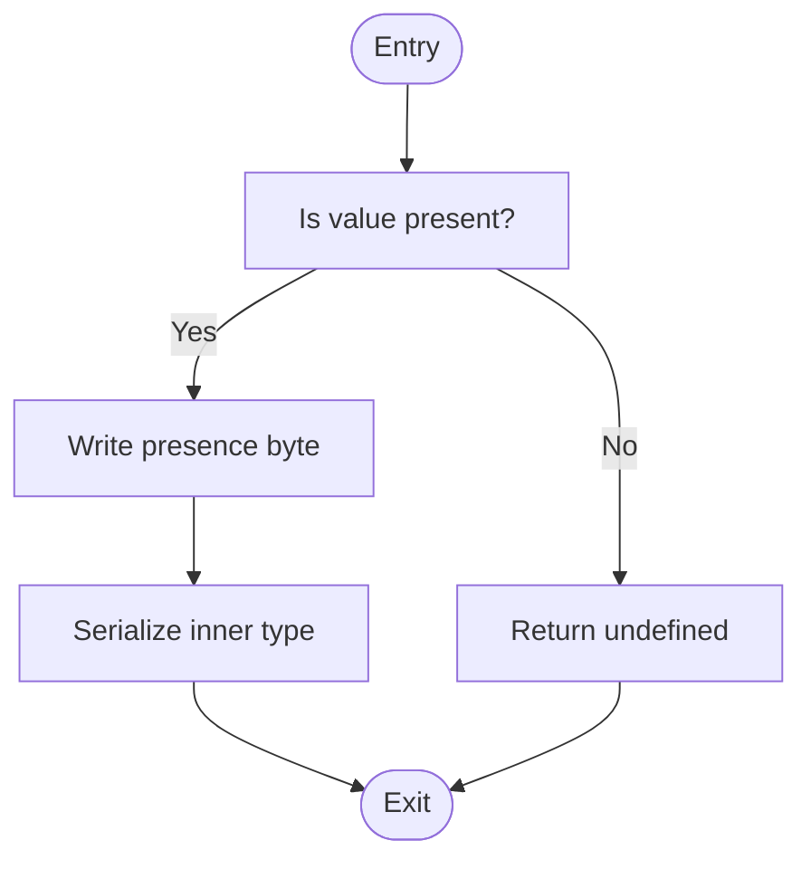

# Object Templates

<cite>
**Referenced Files in This Document**
- [serializer.js](file://src/auth/serializer/src/serializer.js)
- [types.js](file://src/auth/serializer/src/types.js)
- [operations.js](file://src/auth/serializer/src/operations.js)
- [template.js](file://src/auth/serializer/src/template.js)
- [validation.js](file://src/auth/serializer/src/validation.js)
- [ChainTypes.js](file://src/auth/serializer/src/ChainTypes.js)
- [number_utils.js](file://src/auth/serializer/src/number_utils.js)
- [object_id.js](file://src/auth/serializer/src/object_id.js)
- [index.js](file://src/auth/serializer/index.js)
- [operations_test.js](file://test/operations_test.js)
</cite>

## Table of Contents
1. [Introduction](#introduction)
2. [Project Structure](#project-structure)
3. [Core Components](#core-components)
4. [Architecture Overview](#architecture-overview)
5. [Detailed Component Analysis](#detailed-component-analysis)
6. [Dependency Analysis](#dependency-analysis)
7. [Performance Considerations](#performance-considerations)
8. [Troubleshooting Guide](#troubleshooting-guide)
9. [Conclusion](#conclusion)
10. [Appendices](#appendices)

## Introduction
This document explains the object template system used to define blockchain message structures in the library. It covers how templates are defined, field ordering, optional field handling, and template inheritance via static variants. It also documents how JavaScript objects are mapped to blockchain wire formats, template validation, dynamic template generation, and practical strategies for debugging, serialization performance, and versioning.

## Project Structure
The template system lives under the serializer module. Key parts:
- Serializer: orchestrates serialization/deserialization and exposes to/from object conversions and hex/buffer helpers.
- Types: low-level encoders/decoders for primitives and composites (arrays, sets, maps, optionals, static variants, fixed arrays, and IDs).
- Operations: high-level templates for blockchain messages (transactions, signed transactions, blocks, and operations).
- Utilities: validation, chain types, number utilities, and object ID helpers.
- Index: public API surface exposing Serializer, types, ops, template helper, and number utilities.

**Diagram sources**
- [index.js](file://src/auth/serializer/index.js#L1-L20)
- [serializer.js](file://src/auth/serializer/src/serializer.js#L1-L195)
- [types.js](file://src/auth/serializer/src/types.js#L1-L953)
- [operations.js](file://src/auth/serializer/src/operations.js#L1-L922)
- [template.js](file://src/auth/serializer/src/template.js#L1-L17)
- [validation.js](file://src/auth/serializer/src/validation.js#L1-L288)
- [ChainTypes.js](file://src/auth/serializer/src/ChainTypes.js#L1-L84)
- [number_utils.js](file://src/auth/serializer/src/number_utils.js#L1-L54)
- [object_id.js](file://src/auth/serializer/src/object_id.js#L1-L66)

**Section sources**
- [index.js](file://src/auth/serializer/index.js#L1-L20)

## Core Components
- Serializer: Provides fromByteBuffer, appendByteBuffer, fromObject, toObject, comparison, and convenience toHex/toBuffer/toByteBuffer. It iterates fields in the order of keys supplied at construction.
- Types: Encoders/decoders for primitives and composites. Includes validation helpers and specializations for assets, strings, bytes, arrays, sets, maps, fixed arrays, ids, votes, and optional wrappers.
- Operations: High-level templates for blockchain constructs such as transactions, signed transactions, blocks, and operations. Uses Serializer to define nested structures and static variants for polymorphic operations.
- Template Helper: Generates human-readable and copy-pasteable JSON examples from templates.
- Validation: Range checks, type assertions, overflow guards, and object ID parsing/formatting.
- Chain Types: Operation and object type mappings.
- Number Utils: Implied decimal conversion for assets.
- Object ID: Parsing and packing of compact object identifiers.

**Section sources**
- [serializer.js](file://src/auth/serializer/src/serializer.js#L6-L195)
- [types.js](file://src/auth/serializer/src/types.js#L1-L953)
- [operations.js](file://src/auth/serializer/src/operations.js#L1-L922)
- [template.js](file://src/auth/serializer/src/template.js#L1-L17)
- [validation.js](file://src/auth/serializer/src/validation.js#L1-L288)
- [ChainTypes.js](file://src/auth/serializer/src/ChainTypes.js#L1-L84)
- [number_utils.js](file://src/auth/serializer/src/number_utils.js#L1-L54)
- [object_id.js](file://src/auth/serializer/src/object_id.js#L1-L66)

## Architecture Overview
Templates are composed of:
- Field definitions keyed by field names in a specific order.
- Type descriptors that implement fromByteBuffer, appendByteBuffer, fromObject, toObject, and optionally compare.
- Optional fields via the optional wrapper.
- Polymorphic operations via static_variant.
- Nested templates built from lower-level types.

**Diagram sources**
- [serializer.js](file://src/auth/serializer/src/serializer.js#L6-L195)
- [types.js](file://src/auth/serializer/src/types.js#L1-L953)

## Detailed Component Analysis

### Template Definition Syntax and Field Ordering
- Templates are created by instantiating Serializer with an operation name and a types object whose keys define field order. The Serializer iterates fields in the order of Object.keys(types).
- Example templates include transaction, signed_transaction, block_header, signed_block_header, and many operations.

Key characteristics:
- Field order is explicit and preserved during serialization/deserialization.
- Nested templates reuse lower-level types and other templates.

Examples of templates:
- Transaction template: defines reference block info, expiration, operations array, and extensions.
- Signed transaction template: adds signatures to a transaction.
- Block header templates: define block metadata and extension variants.
- Operation templates: define operation-specific fields (e.g., vote, transfer, account_update).

**Section sources**
- [operations.js](file://src/auth/serializer/src/operations.js#L73-L81)
- [operations.js](file://src/auth/serializer/src/operations.js#L116-L125)
- [operations.js](file://src/auth/serializer/src/operations.js#L143-L170)
- [operations.js](file://src/auth/serializer/src/operations.js#L172-L204)
- [operations.js](file://src/auth/serializer/src/operations.js#L229-L238)

### Optional Field Handling
- The optional wrapper serializes a presence byte followed by the underlying type. When absent, it yields undefined.
- toObject can annotate optional fields for readability when debug.annotate is enabled.

Behavior highlights:
- appendByteBuffer writes 1/0 for presence and delegates to the inner type when present.
- toObject returns undefined unless use_default is true, and can annotate with __optional.

**Section sources**
- [types.js](file://src/auth/serializer/src/types.js#L682-L723)

### Template Inheritance and Polymorphism
- Static variant enables polymorphic operation selection by writing a type index followed by the corresponding operation’s payload.
- The operation template is a static_variant over all defined operations; its st_operations array is populated at the end of the generated code.

Practical impact:
- Serialization writes a varint type id, then the payload.
- Deserialization reads the type id and dispatches to the matching operation.

**Section sources**
- [types.js](file://src/auth/serializer/src/types.js#L725-L797)
- [operations.js](file://src/auth/serializer/src/operations.js#L48-L52)
- [operations.js](file://src/auth/serializer/src/operations.js#L849-L914)

### Mapping JavaScript Objects to Blockchain Wire Formats
- fromObject converts JS values to internal representations using each type’s fromObject.
- appendByteBuffer writes the canonical wire format using little-endian buffers.
- toObject converts back to JS values, optionally applying defaults and annotations.

Validation and normalization:
- Types perform range checks, type assertions, and conversions (e.g., asset implied decimals, object id parsing).

**Section sources**
- [serializer.js](file://src/auth/serializer/src/serializer.js#L79-L138)
- [types.js](file://src/auth/serializer/src/types.js#L30-L69)
- [types.js](file://src/auth/serializer/src/types.js#L207-L222)
- [types.js](file://src/auth/serializer/src/types.js#L559-L597)
- [types.js](file://src/auth/serializer/src/types.js#L604-L631)
- [types.js](file://src/auth/serializer/src/types.js#L633-L680)
- [types.js](file://src/auth/serializer/src/types.js#L682-L723)

### Template Validation
- Validation helpers enforce requiredness, numeric ranges, safe integer bounds, and object id formats.
- Types rely on validation to ensure correctness before writing to buffers.

Common validations:
- require_range for numeric bounds.
- no_overflow53/no_overflow64 for safe numeric conversion.
- require_object_type/get_instance for object id formats.

**Section sources**
- [validation.js](file://src/auth/serializer/src/validation.js#L35-L156)
- [validation.js](file://src/auth/serializer/src/validation.js#L174-L224)
- [types.js](file://src/auth/serializer/src/types.js#L30-L69)
- [types.js](file://src/auth/serializer/src/types.js#L207-L222)
- [types.js](file://src/auth/serializer/src/types.js#L559-L597)
- [types.js](file://src/auth/serializer/src/types.js#L604-L631)

### Dynamic Template Generation
- The operations module dynamically composes templates from reusable types and other templates.
- Polymorphic operation lists are assembled programmatically at the end of the file.

Highlights:
- Templates reference other templates (e.g., authority inside account_update).
- Static variants aggregate multiple operation templates.

**Section sources**
- [operations.js](file://src/auth/serializer/src/operations.js#L60-L91)
- [operations.js](file://src/auth/serializer/src/operations.js#L229-L238)
- [operations.js](file://src/auth/serializer/src/operations.js#L849-L914)

### Examples of Operation Templates, Transaction Templates, and Custom Object Templates
- Operation templates: vote, transfer, account_update, proposal_create/update/delete, and many others.
- Transaction templates: transaction, signed_transaction, block_header, signed_block_header.
- Custom object templates: authority, beneficiaries, and versioned chain properties.

These templates demonstrate:
- Primitive fields (strings, numbers, booleans).
- Composite fields (arrays, sets, maps).
- Optional fields.
- Nested templates.
- Static variants for polymorphism.

**Section sources**
- [operations.js](file://src/auth/serializer/src/operations.js#L172-L204)
- [operations.js](file://src/auth/serializer/src/operations.js#L229-L238)
- [operations.js](file://src/auth/serializer/src/operations.js#L422-L448)
- [operations.js](file://src/auth/serializer/src/operations.js#L703-L713)

### Template Debugging and Example Generation
- The template helper prints two forms of example JSON:
  - With defaults and annotations for readability.
  - Compact JSON for copy-paste.
- Tests iterate all operation templates and validate toObject with use_default and annotate flags.

**Section sources**
- [template.js](file://src/auth/serializer/src/template.js#L1-L17)
- [operations_test.js](file://test/operations_test.js#L7-L26)

### Serialization Performance Optimization
- Pre-sorted collections: Arrays and sets are sorted deterministically before serialization to ensure canonical ordering.
- Varints: Efficient variable-length integers for sizes and numeric types.
- Little-endian buffers: Consistent endianness for wire compatibility.
- Hex dump mode: Optional environment-based hex dumping for debugging and inspection.

Recommendations:
- Keep field order stable to avoid re-sorting costs.
- Prefer varint types for counts and indices.
- Use sets for deduplicated collections to leverage validation and sorting.

**Section sources**
- [types.js](file://src/auth/serializer/src/types.js#L343-L389)
- [types.js](file://src/auth/serializer/src/types.js#L435-L499)
- [serializer.js](file://src/auth/serializer/src/serializer.js#L14-L14)
- [serializer.js](file://src/auth/serializer/src/serializer.js#L118-L131)

### Template Versioning Strategies
- Static variants enable adding new operation variants without changing existing wire formats.
- Versioned chain properties use static_variant to evolve parameters over time.
- Operation IDs are mapped centrally for consistent indexing.

Best practices:
- Add new variants at the end of static_variant lists.
- Maintain backward-compatible field additions using optional wrappers.
- Use versioned containers (e.g., versioned_chain_properties_update) to encapsulate changes.

**Section sources**
- [types.js](file://src/auth/serializer/src/types.js#L725-L797)
- [operations.js](file://src/auth/serializer/src/operations.js#L703-L713)
- [ChainTypes.js](file://src/auth/serializer/src/ChainTypes.js#L13-L78)

## Dependency Analysis
The following diagram shows key dependencies among components involved in template composition and serialization.

**Diagram sources**
- [operations.js](file://src/auth/serializer/src/operations.js#L1-L922)
- [serializer.js](file://src/auth/serializer/src/serializer.js#L1-L195)
- [types.js](file://src/auth/serializer/src/types.js#L1-L953)
- [validation.js](file://src/auth/serializer/src/validation.js#L1-L288)
- [ChainTypes.js](file://src/auth/serializer/src/ChainTypes.js#L1-L84)
- [number_utils.js](file://src/auth/serializer/src/number_utils.js#L1-L54)
- [object_id.js](file://src/auth/serializer/src/object_id.js#L1-L66)
- [index.js](file://src/auth/serializer/index.js#L1-L20)

**Section sources**
- [operations.js](file://src/auth/serializer/src/operations.js#L1-L922)
- [serializer.js](file://src/auth/serializer/src/serializer.js#L1-L195)
- [types.js](file://src/auth/serializer/src/types.js#L1-L953)
- [validation.js](file://src/auth/serializer/src/validation.js#L1-L288)
- [ChainTypes.js](file://src/auth/serializer/src/ChainTypes.js#L1-L84)
- [number_utils.js](file://src/auth/serializer/src/number_utils.js#L1-L54)
- [object_id.js](file://src/auth/serializer/src/object_id.js#L1-L66)
- [index.js](file://src/auth/serializer/index.js#L1-L20)

## Performance Considerations
- Canonical ordering: Arrays and sets are sorted deterministically to ensure consistent hashing and signatures.
- Varint encoding: Reduces wire size for counts and small integers.
- Minimal allocations: Reuse ByteBuffers and avoid intermediate copies when possible.
- Debug overhead: Hex dump mode and verbose logs should be disabled in production.

[No sources needed since this section provides general guidance]

## Troubleshooting Guide
Common issues and remedies:
- Missing or extra fields: Ensure the template keys match the expected structure. Serializer iterates fields in key order.
- Invalid numeric ranges: Use validation helpers to constrain values before serialization.
- Object ID format errors: Ensure object IDs follow the reserved_space.type.instance pattern.
- Asset formatting: Use implied decimal utilities to format amounts with correct precision.
- Optional fields: Remember that missing optional fields serialize as absent; use debug.use_default to populate defaults for example generation.

**Section sources**
- [validation.js](file://src/auth/serializer/src/validation.js#L35-L156)
- [validation.js](file://src/auth/serializer/src/validation.js#L174-L224)
- [number_utils.js](file://src/auth/serializer/src/number_utils.js#L10-L53)
- [object_id.js](file://src/auth/serializer/src/object_id.js#L19-L37)
- [template.js](file://src/auth/serializer/src/template.js#L1-L17)

## Conclusion
The object template system provides a robust, extensible framework for defining blockchain message structures. By composing primitive and composite types, enforcing validation, and supporting polymorphism via static variants, it ensures deterministic serialization and clear debugging workflows. Following the recommended practices for field ordering, optional handling, and versioning will help maintain compatibility and performance across upgrades.

[No sources needed since this section summarizes without analyzing specific files]

## Appendices

### Appendix A: Example Workflows

#### Workflow: Serializing a Transaction

**Diagram sources**
- [serializer.js](file://src/auth/serializer/src/serializer.js#L184-L192)
- [operations.js](file://src/auth/serializer/src/operations.js#L73-L81)

#### Workflow: Deserializing an Operation

**Diagram sources**
- [types.js](file://src/auth/serializer/src/types.js#L745-L756)
- [operations.js](file://src/auth/serializer/src/operations.js#L849-L914)

### Appendix B: Optional Field Flow

**Diagram sources**
- [types.js](file://src/auth/serializer/src/types.js#L682-L723)