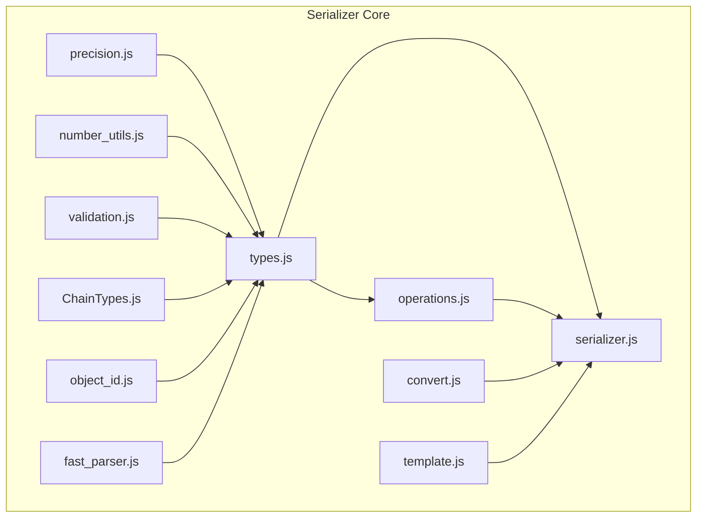
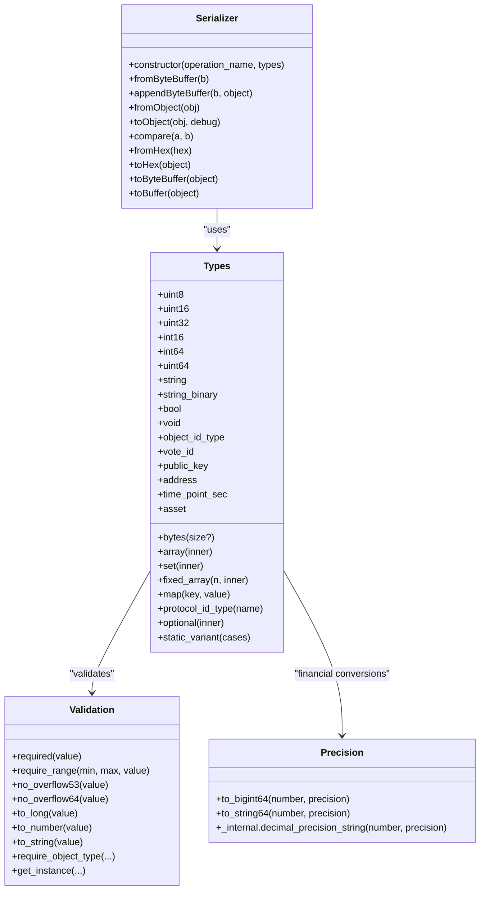
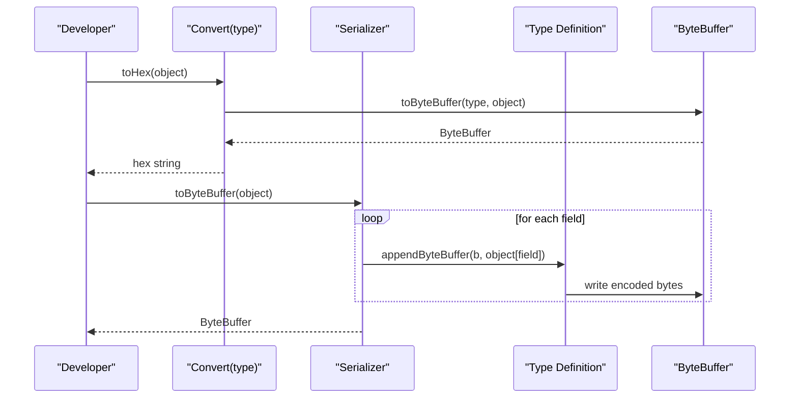
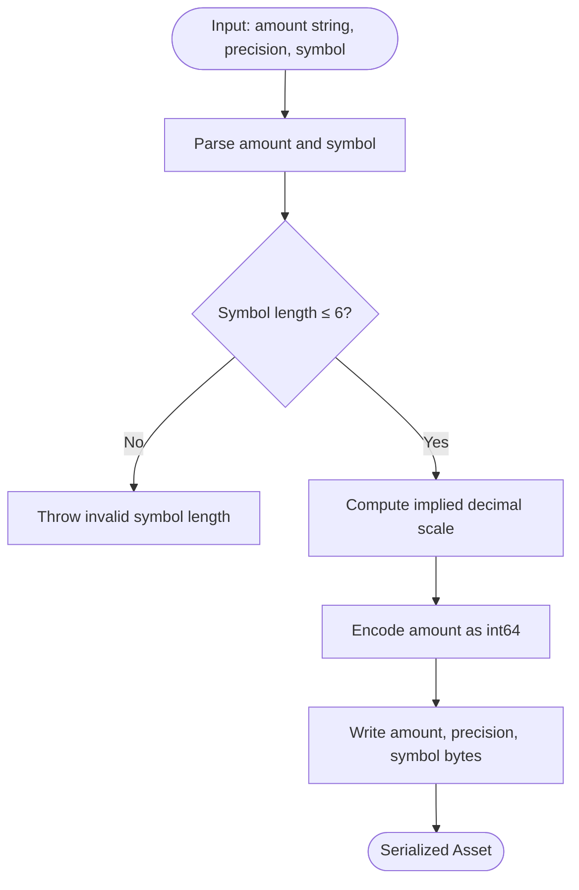
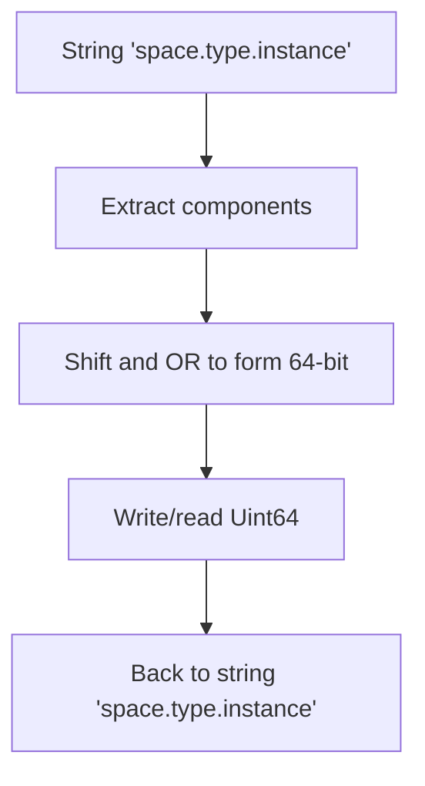
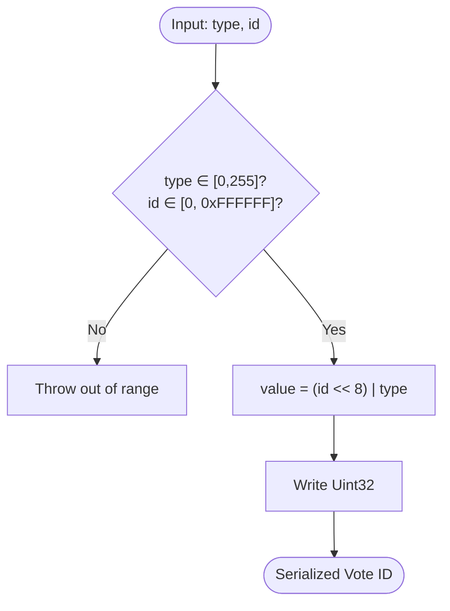
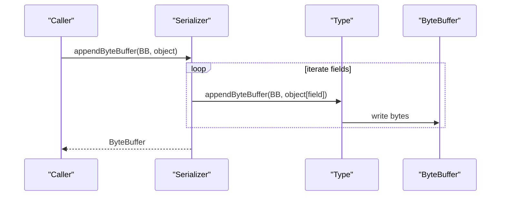
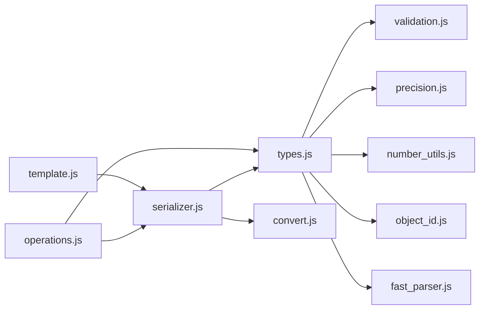

# Type System

<cite>
**Referenced Files in This Document**
- [ChainTypes.js](file://src/auth/serializer/src/ChainTypes.js)
- [types.js](file://src/auth/serializer/src/types.js)
- [precision.js](file://src/auth/serializer/src/precision.js)
- [number_utils.js](file://src/auth/serializer/src/number_utils.js)
- [validation.js](file://src/auth/serializer/src/validation.js)
- [serializer.js](file://src/auth/serializer/src/serializer.js)
- [convert.js](file://src/auth/serializer/src/convert.js)
- [object_id.js](file://src/auth/serializer/src/object_id.js)
- [fast_parser.js](file://src/auth/serializer/src/fast_parser.js)
- [operations.js](file://src/auth/serializer/src/operations.js)
- [template.js](file://src/auth/serializer/src/template.js)
- [types_test.js](file://test/types_test.js)
- [all_types.js](file://test/all_types.js)
</cite>

## Table of Contents
1. [Introduction](#introduction)
2. [Project Structure](#project-structure)
3. [Core Components](#core-components)
4. [Architecture Overview](#architecture-overview)
5. [Detailed Component Analysis](#detailed-component-analysis)
6. [Dependency Analysis](#dependency-analysis)
7. [Performance Considerations](#performance-considerations)
8. [Troubleshooting Guide](#troubleshooting-guide)
9. [Conclusion](#conclusion)
10. [Appendices](#appendices)

## Introduction
This document explains the VIZ blockchain type system used for serialization and deserialization of on-chain data. It covers fundamental data types, precision handling for financial amounts, numeric conversions, validation rules, sorting semantics, and extensibility patterns. It also documents how serializers transform JavaScript objects into compact binary representations suitable for blockchain operations and how type safety and overflow protections are enforced.

## Project Structure
The type system is implemented under the serializer module. Key files include:
- Type definitions and builders for primitives, arrays, sets, maps, and complex types
- Precision utilities for asset-like numeric values
- Validation helpers for safe numeric conversions and bounds checking
- Serializers for converting between JS objects and binary buffers
- Specialized types such as object IDs, public keys, addresses, and vote IDs
- Operations that compose types into blockchain structures

**Diagram sources**
- [types.js](file://src/auth/serializer/src/types.js#L1-L953)
- [serializer.js](file://src/auth/serializer/src/serializer.js#L1-L195)
- [convert.js](file://src/auth/serializer/src/convert.js#L1-L40)
- [precision.js](file://src/auth/serializer/src/precision.js#L1-L86)
- [number_utils.js](file://src/auth/serializer/src/number_utils.js#L1-L54)
- [validation.js](file://src/auth/serializer/src/validation.js#L1-L288)
- [ChainTypes.js](file://src/auth/serializer/src/ChainTypes.js#L1-L84)
- [object_id.js](file://src/auth/serializer/src/object_id.js#L1-L66)
- [fast_parser.js](file://src/auth/serializer/src/fast_parser.js#L1-L58)
- [operations.js](file://src/auth/serializer/src/operations.js#L1-L922)
- [template.js](file://src/auth/serializer/src/template.js#L1-L17)

**Section sources**
- [types.js](file://src/auth/serializer/src/types.js#L1-L953)
- [serializer.js](file://src/auth/serializer/src/serializer.js#L1-L195)
- [operations.js](file://src/auth/serializer/src/operations.js#L1-L922)

## Core Components
- Primitive types: integers, booleans, strings, bytes, variable-length integers, and time points
- Collection types: arrays, sets, fixed arrays, and maps
- Complex types: object IDs, protocol IDs, vote IDs, public keys, addresses, and assets
- Numeric utilities: implied decimal conversions and precision handling for financial amounts
- Validation helpers: safe numeric conversions, overflow checks, and range enforcement
- Serialization engine: a generic serializer that applies type-specific encoders/decoders
- Operation templates: predefined serializers for blockchain operations

Examples of usage are demonstrated in tests and operation definitions.

**Section sources**
- [types.js](file://src/auth/serializer/src/types.js#L30-L69)
- [types.js](file://src/auth/serializer/src/types.js#L71-L222)
- [types.js](file://src/auth/serializer/src/types.js#L224-L341)
- [types.js](file://src/auth/serializer/src/types.js#L343-L389)
- [types.js](file://src/auth/serializer/src/types.js#L391-L433)
- [types.js](file://src/auth/serializer/src/types.js#L435-L555)
- [types.js](file://src/auth/serializer/src/types.js#L559-L631)
- [types.js](file://src/auth/serializer/src/types.js#L633-L680)
- [types.js](file://src/auth/serializer/src/types.js#L682-L723)
- [types.js](file://src/auth/serializer/src/types.js#L725-L797)
- [types.js](file://src/auth/serializer/src/types.js#L799-L877)
- [types.js](file://src/auth/serializer/src/types.js#L879-L953)
- [precision.js](file://src/auth/serializer/src/precision.js#L1-L86)
- [number_utils.js](file://src/auth/serializer/src/number_utils.js#L1-L54)
- [validation.js](file://src/auth/serializer/src/validation.js#L1-L288)
- [serializer.js](file://src/auth/serializer/src/serializer.js#L1-L195)
- [operations.js](file://src/auth/serializer/src/operations.js#L1-L922)
- [types_test.js](file://test/types_test.js#L1-L141)
- [all_types.js](file://test/all_types.js#L1-L115)

## Architecture Overview
The type system is composed of:
- Type builders that define how to encode/decode values
- A generic Serializer that iterates over a type specification and applies the appropriate encoder/decoder
- Validation and numeric utilities ensuring correctness and preventing overflow
- Specialized parsers for cryptographic primitives and object IDs

**Diagram sources**
- [serializer.js](file://src/auth/serializer/src/serializer.js#L1-L195)
- [types.js](file://src/auth/serializer/src/types.js#L1-L953)
- [validation.js](file://src/auth/serializer/src/validation.js#L1-L288)
- [precision.js](file://src/auth/serializer/src/precision.js#L1-L86)

## Detailed Component Analysis

### Primitive Types and Collections
- Integers: uint8, uint16, uint32, int16, int64, uint64 with range validation and conversion helpers
- Strings and bytes: UTF-8 strings, binary strings, and typed byte buffers
- Booleans and void placeholders
- Collections: arrays, sets (with uniqueness and sorting), fixed arrays, and maps (with key uniqueness and sorting)
- Optional wrapper for nullable fields
- Static variant for tagged unions of operations

These types define three methods per field:
- fromByteBuffer(b): decode from a ByteBuffer
- appendByteBuffer(b, object): encode to a ByteBuffer
- fromObject(object)/toObject(object, debug): convert between JS values and serialized form

Sorting behavior is applied consistently for sets and maps to ensure deterministic serialization.

**Section sources**
- [types.js](file://src/auth/serializer/src/types.js#L71-L222)
- [types.js](file://src/auth/serializer/src/types.js#L224-L341)
- [types.js](file://src/auth/serializer/src/types.js#L343-L389)
- [types.js](file://src/auth/serializer/src/types.js#L435-L555)
- [types.js](file://src/auth/serializer/src/types.js#L725-L797)
- [types.js](file://src/auth/serializer/src/types.js#L799-L877)
- [types.js](file://src/auth/serializer/src/types.js#L941-L952)

### Complex Types
- Object IDs: composite identifiers packed into a 64-bit integer; parsed from human-readable strings and serialized efficiently
- Protocol ID types: typed identifiers bound to reserved spaces and object types
- Vote IDs: composite type combining a type and an ID with bit packing/unpacking
- Public keys and addresses: cryptographic primitives with fast parser support and string conversions
- Time points: seconds-since-epoch timestamps normalized to uint32 internally
- Asset: amount plus symbol with implied decimal precision; conversion utilities ensure correct scaling

Precision handling for assets is implemented via implied decimal arithmetic and validated against 64-bit boundaries.

**Section sources**
- [types.js](file://src/auth/serializer/src/types.js#L559-L631)
- [types.js](file://src/auth/serializer/src/types.js#L633-L680)
- [types.js](file://src/auth/serializer/src/types.js#L879-L937)
- [types.js](file://src/auth/serializer/src/types.js#L391-L433)
- [types.js](file://src/auth/serializer/src/types.js#L30-L69)
- [object_id.js](file://src/auth/serializer/src/object_id.js#L1-L66)
- [precision.js](file://src/auth/serializer/src/precision.js#L1-L86)
- [number_utils.js](file://src/auth/serializer/src/number_utils.js#L1-L54)

### Validation and Numeric Utilities
Validation enforces:
- Required presence of values
- Range checks for integer types
- Safe numeric conversions with overflow detection for 53-bit and 64-bit domains
- String/number/Long conversions with explicit error messages
- Object type and instance extraction for protocol/implementation IDs

Numeric utilities provide:
- Implied decimal conversion for financial amounts
- Decimal precision string computation with trimming and padding
- Safe conversion to/from 64-bit integers with overflow checks

**Section sources**
- [validation.js](file://src/auth/serializer/src/validation.js#L1-L288)
- [precision.js](file://src/auth/serializer/src/precision.js#L1-L86)
- [number_utils.js](file://src/auth/serializer/src/number_utils.js#L1-L54)

### Serialization Engine
The Serializer class orchestrates:
- Iterating over a type specification to encode/decode fields
- Capturing and reporting detailed errors with field names and offsets
- Converting between hex, binary buffers, and JS objects
- Deterministic ordering via comparison functions for sortable types

It supports:
- fromByteBuffer and appendByteBuffer for binary I/O
- fromObject and toObject for developer-friendly conversions
- Helper methods toHex/toBuffer/toByteBuffer for interoperability

**Section sources**
- [serializer.js](file://src/auth/serializer/src/serializer.js#L1-L195)

### Type Registration and Extensibility
- Types are registered as named fields in a types object passed to Serializer
- New primitive or complex types can be added by implementing the three methods (fromByteBuffer, appendByteBuffer, fromObject/toObject)
- Collection types (array/set/map/static_variant) are factory functions that accept inner types
- Object IDs and protocol IDs integrate with ChainTypes to maintain semantic correctness
- Operations are defined as Serializer instances that compose existing types

Extensibility patterns:
- Add a new type definition in types.js
- Reference it in a Serializer for a specific operation
- Use Convert helpers to test round-trip conversions

**Section sources**
- [types.js](file://src/auth/serializer/src/types.js#L1-L953)
- [operations.js](file://src/auth/serializer/src/operations.js#L1-L922)
- [ChainTypes.js](file://src/auth/serializer/src/ChainTypes.js#L1-L84)
- [convert.js](file://src/auth/serializer/src/convert.js#L1-L40)

### Examples and Usage Patterns
- Primitive types: uint8, uint16, uint32, int16, int64, uint64, string, bytes, bool
- Complex types: asset, public_key, address, object_id_type, protocol_id_type, vote_id, time_point_sec
- Collections: array, set, fixed_array, map, optional, static_variant
- Operations: transaction, signed_transaction, block_header, and many domain operations

Round-trip testing ensures correctness across conversions and buffers.

**Section sources**
- [all_types.js](file://test/all_types.js#L1-L115)
- [types_test.js](file://test/types_test.js#L1-L141)
- [operations.js](file://src/auth/serializer/src/operations.js#L1-L922)

## Architecture Overview

**Diagram sources**
- [convert.js](file://src/auth/serializer/src/convert.js#L1-L40)
- [serializer.js](file://src/auth/serializer/src/serializer.js#L184-L188)
- [types.js](file://src/auth/serializer/src/types.js#L1-L953)

## Detailed Component Analysis

### Asset Type and Precision Handling
Asset values combine an amount and a symbol with implied decimal precision. The amount is stored as a 64-bit integer scaled by the precision, and the symbol is stored as a compact representation.

**Diagram sources**
- [types.js](file://src/auth/serializer/src/types.js#L30-L69)
- [precision.js](file://src/auth/serializer/src/precision.js#L14-L31)
- [number_utils.js](file://src/auth/serializer/src/number_utils.js#L10-L53)

**Section sources**
- [types.js](file://src/auth/serializer/src/types.js#L30-L69)
- [precision.js](file://src/auth/serializer/src/precision.js#L1-L86)
- [number_utils.js](file://src/auth/serializer/src/number_utils.js#L1-L54)

### Object ID Encoding
Object IDs pack space, type, and instance into a single 64-bit value. They support conversion from string to packed long and back.

**Diagram sources**
- [object_id.js](file://src/auth/serializer/src/object_id.js#L19-L62)
- [types.js](file://src/auth/serializer/src/types.js#L604-L631)

**Section sources**
- [object_id.js](file://src/auth/serializer/src/object_id.js#L1-L66)
- [types.js](file://src/auth/serializer/src/types.js#L604-L631)

### Vote ID Bit Packing
Vote IDs combine a type and an ID into a packed 32-bit value with dedicated masks.

**Diagram sources**
- [types.js](file://src/auth/serializer/src/types.js#L633-L680)

**Section sources**
- [types.js](file://src/auth/serializer/src/types.js#L633-L680)

### Serialization Pipeline
The Serializer applies type-specific encoders/decoders to produce deterministic binary output.

**Diagram sources**
- [serializer.js](file://src/auth/serializer/src/serializer.js#L59-L77)
- [types.js](file://src/auth/serializer/src/types.js#L1-L953)

**Section sources**
- [serializer.js](file://src/auth/serializer/src/serializer.js#L1-L195)
- [types.js](file://src/auth/serializer/src/types.js#L1-L953)

## Dependency Analysis

**Diagram sources**
- [types.js](file://src/auth/serializer/src/types.js#L1-L953)
- [validation.js](file://src/auth/serializer/src/validation.js#L1-L288)
- [precision.js](file://src/auth/serializer/src/precision.js#L1-L86)
- [number_utils.js](file://src/auth/serializer/src/number_utils.js#L1-L54)
- [object_id.js](file://src/auth/serializer/src/object_id.js#L1-L66)
- [fast_parser.js](file://src/auth/serializer/src/fast_parser.js#L1-L58)
- [serializer.js](file://src/auth/serializer/src/serializer.js#L1-L195)
- [convert.js](file://src/auth/serializer/src/convert.js#L1-L40)
- [operations.js](file://src/auth/serializer/src/operations.js#L1-L922)
- [template.js](file://src/auth/serializer/src/template.js#L1-L17)

**Section sources**
- [types.js](file://src/auth/serializer/src/types.js#L1-L953)
- [serializer.js](file://src/auth/serializer/src/serializer.js#L1-L195)
- [operations.js](file://src/auth/serializer/src/operations.js#L1-L922)

## Performance Considerations
- Variable-length integers and strings are encoded with varints to minimize size
- Fixed-size types (uint8/uint16/uint32/int64/uint64) avoid overhead but require strict bounds
- Sorting for sets/maps ensures canonical order, which is essential for deterministic hashing/signing
- Fast parser shortcuts reduce overhead for cryptographic primitives
- Use of 64-bit integers prevents precision loss for large financial amounts

[No sources needed since this section provides general guidance]

## Troubleshooting Guide
Common issues and remedies:
- Out-of-range errors: Ensure integer values fit within declared ranges; use validation helpers
- Overflow errors: Large numbers must be handled as strings to prevent precision loss; use 64-bit conversion helpers
- Duplicate entries in sets/maps: These are rejected during validation; deduplicate before serialization
- Invalid object IDs: Must match the reserved space/type pattern; use provided helpers to parse/format
- Precision mismatches: Verify implied decimal scaling and precision alignment for assets

**Section sources**
- [validation.js](file://src/auth/serializer/src/validation.js#L149-L178)
- [validation.js](file://src/auth/serializer/src/validation.js#L249-L286)
- [types.js](file://src/auth/serializer/src/types.js#L435-L499)
- [types.js](file://src/auth/serializer/src/types.js#L799-L877)
- [object_id.js](file://src/auth/serializer/src/object_id.js#L27-L36)

## Conclusion
The VIZ type system provides a robust, extensible foundation for blockchain serialization. It enforces type safety, handles financial precision carefully, and offers deterministic encoding for cryptographic signatures. By composing primitive and complex types, developers can build secure and efficient blockchain operations while maintaining compatibility and readability.

[No sources needed since this section summarizes without analyzing specific files]

## Appendices

### Type Safety Measures
- Range checks for integer types
- Overflow detection for 53-bit and 64-bit domains
- Strict validation for object IDs and protocol types
- Implied decimal arithmetic for assets with precision-aware conversions

**Section sources**
- [validation.js](file://src/auth/serializer/src/validation.js#L149-L178)
- [validation.js](file://src/auth/serializer/src/validation.js#L249-L286)
- [precision.js](file://src/auth/serializer/src/precision.js#L14-L31)
- [number_utils.js](file://src/auth/serializer/src/number_utils.js#L10-L53)

### Dynamic Type Creation and Extensibility
- Add new types by implementing the standard methods and registering them in a Serializer
- Use factory types (array, set, map, static_variant) to compose complex structures
- Extend operations by referencing new or existing types in Serializer definitions

**Section sources**
- [types.js](file://src/auth/serializer/src/types.js#L343-L389)
- [types.js](file://src/auth/serializer/src/types.js#L725-L797)
- [operations.js](file://src/auth/serializer/src/operations.js#L55-L58)

### Example Workflows
- Converting an object to hex and back using Convert helpers
- Building a transaction with operations and serializing to buffer
- Using templates to generate default-filled operation structures

**Section sources**
- [convert.js](file://src/auth/serializer/src/convert.js#L1-L40)
- [all_types.js](file://test/all_types.js#L65-L114)
- [template.js](file://src/auth/serializer/src/template.js#L1-L17)