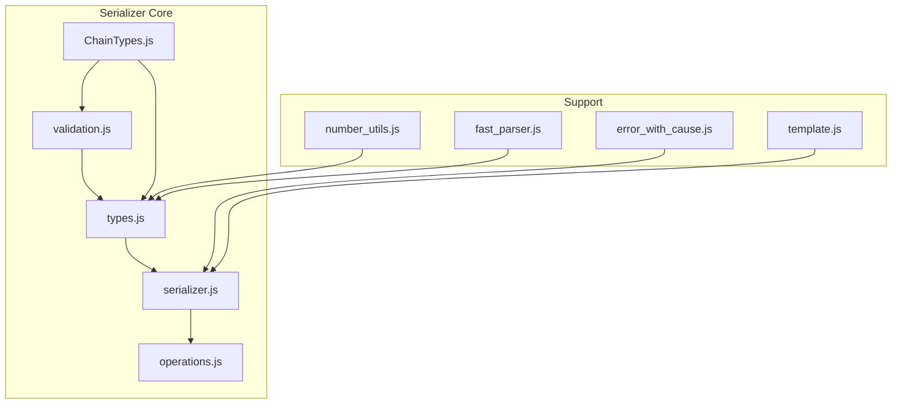
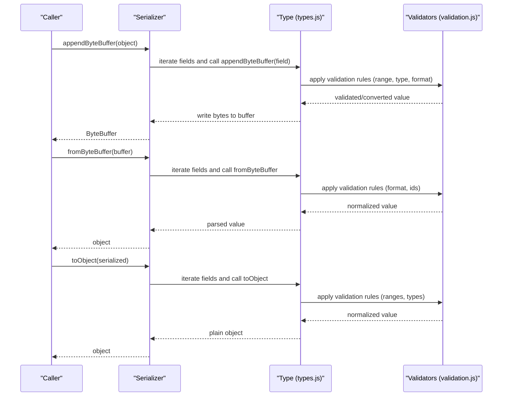
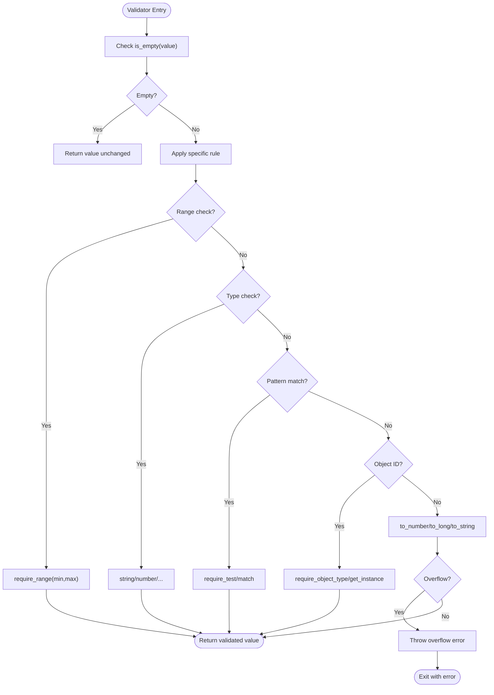
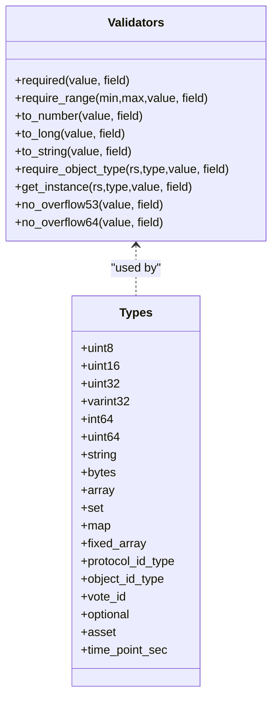
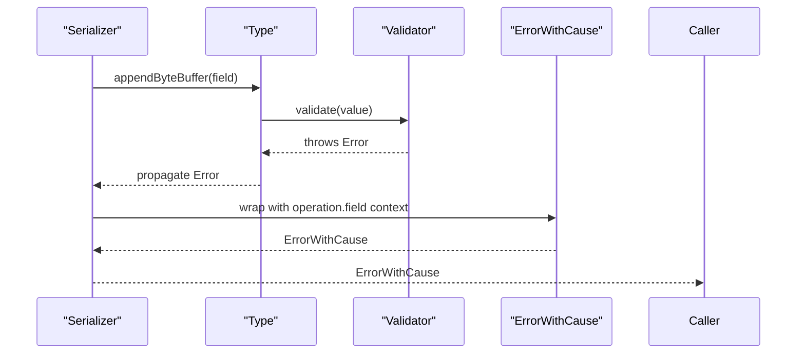
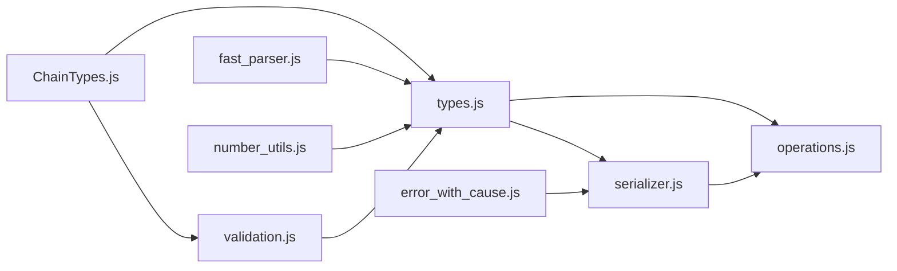
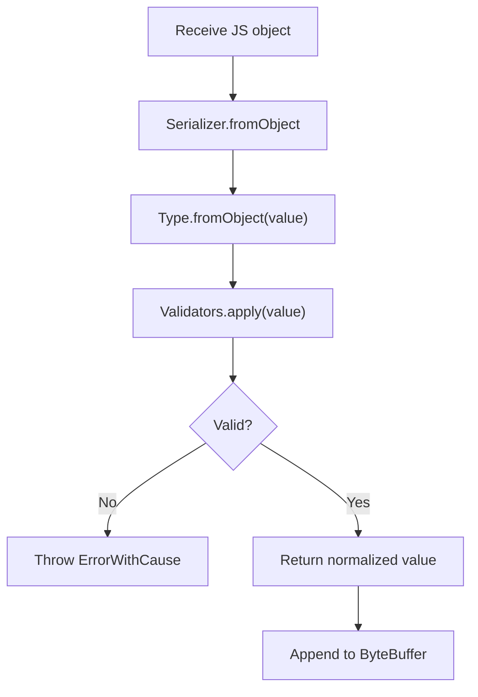

# Validation Rules

<cite>
**Referenced Files in This Document**
- [validation.js](file://src/auth/serializer/src/validation.js)
- [types.js](file://src/auth/serializer/src/types.js)
- [serializer.js](file://src/auth/serializer/src/serializer.js)
- [operations.js](file://src/auth/serializer/src/operations.js)
- [ChainTypes.js](file://src/auth/serializer/src/ChainTypes.js)
- [error_with_cause.js](file://src/auth/serializer/src/error_with_cause.js)
- [number_utils.js](file://src/auth/serializer/src/number_utils.js)
- [fast_parser.js](file://src/auth/serializer/src/fast_parser.js)
- [template.js](file://src/auth/serializer/src/template.js)
- [index.js](file://src/auth/serializer/index.js)
- [types_test.js](file://test/types_test.js)
- [all_types.js](file://test/all_types.js)
</cite>

## Table of Contents
1. [Introduction](#introduction)
2. [Project Structure](#project-structure)
3. [Core Components](#core-components)
4. [Architecture Overview](#architecture-overview)
5. [Detailed Component Analysis](#detailed-component-analysis)
6. [Dependency Analysis](#dependency-analysis)
7. [Performance Considerations](#performance-considerations)
8. [Troubleshooting Guide](#troubleshooting-guide)
9. [Conclusion](#conclusion)
10. [Appendices](#appendices)

## Introduction
This document explains the validation system that ensures data integrity during serialization in the Viz JavaScript library. It covers validation rule definitions, constraint checking, error handling mechanisms, and the validation pipeline. It also documents built-in validators, how to create custom validators, performance considerations, examples of input validation and business rule enforcement, error reporting, debugging techniques, common failure modes, and best practices for maintaining data consistency across the blockchain network.

## Project Structure
The validation system lives primarily under the serializer module. At a high level:
- validation.js defines low-level validators for primitive and structured types.
- types.js defines concrete serializers for each type, invoking validation rules during append/fromObject/toObject.
- operations.js composes higher-level operations from basic types and validators.
- serializer.js orchestrates the end-to-end serialization pipeline and wraps errors with context.
- ChainTypes.js enumerates protocol-specific identifiers used by validators.
- Supporting modules include error_with_cause.js, number_utils.js, fast_parser.js, and template.js.

**Diagram sources**
- [validation.js](file://src/auth/serializer/src/validation.js#L29-L288)
- [types.js](file://src/auth/serializer/src/types.js#L1-L953)
- [serializer.js](file://src/auth/serializer/src/serializer.js#L1-L195)
- [operations.js](file://src/auth/serializer/src/operations.js#L1-L922)
- [ChainTypes.js](file://src/auth/serializer/src/ChainTypes.js#L1-L84)
- [error_with_cause.js](file://src/auth/serializer/src/error_with_cause.js#L1-L27)
- [number_utils.js](file://src/auth/serializer/src/number_utils.js#L1-L54)
- [fast_parser.js](file://src/auth/serializer/src/fast_parser.js#L1-L58)
- [template.js](file://src/auth/serializer/src/template.js#L1-L17)

**Section sources**
- [index.js](file://src/auth/serializer/index.js#L1-L20)
- [validation.js](file://src/auth/serializer/src/validation.js#L29-L288)
- [types.js](file://src/auth/serializer/src/types.js#L1-L953)
- [serializer.js](file://src/auth/serializer/src/serializer.js#L1-L195)
- [operations.js](file://src/auth/serializer/src/operations.js#L1-L922)
- [ChainTypes.js](file://src/auth/serializer/src/ChainTypes.js#L1-L84)
- [error_with_cause.js](file://src/auth/serializer/src/error_with_cause.js#L1-L27)
- [number_utils.js](file://src/auth/serializer/src/number_utils.js#L1-L54)
- [fast_parser.js](file://src/auth/serializer/src/fast_parser.js#L1-L58)
- [template.js](file://src/auth/serializer/src/template.js#L1-L17)

## Core Components
- Validation rules: Centralized in validation.js, providing type checks, numeric conversions, overflow guards, and object-id parsing/formatting.
- Type serializers: Defined in types.js, each type’s appendByteBuffer/fromObject/toObject invokes validation rules.
- Operation serializers: Composed in operations.js from types.js, enforcing business constraints via type-level validators.
- Serialization pipeline: Implemented in serializer.js, which iterates fields, calls type serializers, and wraps exceptions with contextual messages.
- Error handling: error_with_cause.js provides nested error reporting to aid debugging.
- Utilities: number_utils.js handles implied decimal conversions; fast_parser.js provides optimized parsing for fixed-size data; template.js prints example JSON templates.

**Section sources**
- [validation.js](file://src/auth/serializer/src/validation.js#L29-L288)
- [types.js](file://src/auth/serializer/src/types.js#L1-L953)
- [operations.js](file://src/auth/serializer/src/operations.js#L1-L922)
- [serializer.js](file://src/auth/serializer/src/serializer.js#L1-L195)
- [error_with_cause.js](file://src/auth/serializer/src/error_with_cause.js#L1-L27)
- [number_utils.js](file://src/auth/serializer/src/number_utils.js#L1-L54)
- [fast_parser.js](file://src/auth/serializer/src/fast_parser.js#L1-L58)
- [template.js](file://src/auth/serializer/src/template.js#L1-L17)

## Architecture Overview
The validation pipeline runs during three phases:
- fromByteBuffer: reads raw bytes and reconstructs objects, applying type-specific validators.
- appendByteBuffer: converts JS objects to byte buffers, validating and normalizing values.
- toObject: converts serialized data back to plain objects, ensuring consistent representation.

**Diagram sources**
- [serializer.js](file://src/auth/serializer/src/serializer.js#L17-L138)
- [types.js](file://src/auth/serializer/src/types.js#L31-L953)
- [validation.js](file://src/auth/serializer/src/validation.js#L29-L288)

## Detailed Component Analysis

### Validation Rule Definitions (validation.js)
- Empty handling: Many validators skip validation for null/undefined except required.
- Primitive checks: string, number, whole_number, unsigned.
- Numeric conversion: to_number, to_long, to_string with overflow guards.
- Range checks: require_range with bounds validation.
- Pattern matching: require_test and require_match for regex validation.
- Object ID parsing: require_object_type, get_instance, require_relative_type, get_relative_instance, require_protocol_type, get_protocol_instance, get_protocol_type, get_protocol_type_name, require_implementation_type, get_implementation_instance.
- Overflow protection: no_overflow53 and no_overflow64 for safe numeric conversions.
- Protocol constants: MAX_SAFE_INT/MIN_SAFE_INT define safe 53-bit numeric limits.

**Diagram sources**
- [validation.js](file://src/auth/serializer/src/validation.js#L31-L286)

**Section sources**
- [validation.js](file://src/auth/serializer/src/validation.js#L29-L288)

### Constraint Checking in Type Serializers (types.js)
- Range constraints: uint8/uint16/uint32/varint32 use require_range to enforce bounds.
- Required fields: int64, string, bytes, array, set, map, static_variant, time_point_sec enforce presence and format.
- Numeric safety: asset uses number_utils for implied decimals; int64/uint64 rely on to_long and unsigned conversion.
- Object IDs: protocol_id_type, object_id_type, vote_id parse and validate identifiers.
- Optional fields: optional wraps underlying types and serializes null/undefined as a flag.
- Collections: array, set, map, fixed_array sort and deduplicate items where applicable.

**Diagram sources**
- [validation.js](file://src/auth/serializer/src/validation.js#L29-L288)
- [types.js](file://src/auth/serializer/src/types.js#L30-L953)

**Section sources**
- [types.js](file://src/auth/serializer/src/types.js#L30-L953)

### Error Handling Mechanisms (error_with_cause.js and serializer.js)
- Nested error reporting: ErrorWithCause augments messages with cause and stack traces.
- Serializer wrapping: serializer.js catches exceptions during fromByteBuffer/fromObject/toObject and throws with operation.field context.
- Debug printing: HEX_DUMP enables hex dumps of fields for inspection.

**Diagram sources**
- [serializer.js](file://src/auth/serializer/src/serializer.js#L17-L138)
- [error_with_cause.js](file://src/auth/serializer/src/error_with_cause.js#L1-L27)

**Section sources**
- [error_with_cause.js](file://src/auth/serializer/src/error_with_cause.js#L1-L27)
- [serializer.js](file://src/auth/serializer/src/serializer.js#L17-L138)

### Validation Pipeline Orchestration (serializer.js)
- Iteration: Serializers iterate keys and call type methods in order.
- fromByteBuffer: reads bytes, applies type parsing, and validates.
- appendByteBuffer: writes bytes, converting JS values to wire format.
- toObject: reconstructs plain objects, normalizing types and applying validation.
- Comparison: compare method uses first field comparator or hex-string comparison for buffers.

**Section sources**
- [serializer.js](file://src/auth/serializer/src/serializer.js#L17-L164)

### Built-in Validators and Business Rule Enforcement (operations.js)
- Operations compose types to enforce business rules:
  - vote: enforces weight range and string fields.
  - content: enforces metadata length and JSON formatting.
  - transfer/transfer_to_vesting/withdraw_vesting: enforce asset amounts and memo constraints.
  - authority/account_update: enforce nested structures and thresholds.
  - chain_properties_update/versioned_chain_properties_update: enforce versioned property sets.
  - committee operations: enforce request IDs, votes, and payouts.
  - paid subscription operations: enforce periods, amounts, and renewal flags.
- Static variants: operation.st_operations enumerate all operation types and their fields.

**Section sources**
- [operations.js](file://src/auth/serializer/src/operations.js#L73-L914)

### Protocol Object ID Validation (ChainTypes.js and validation.js)
- Reserved spaces: relative_protocol_ids, protocol_ids, implementation_ids.
- Object type mapping: operations and object_type enums define canonical IDs.
- Validators: require_object_type/get_instance extract instance numbers from formatted IDs.

**Section sources**
- [ChainTypes.js](file://src/auth/serializer/src/ChainTypes.js#L7-L84)
- [validation.js](file://src/auth/serializer/src/validation.js#L158-L224)

### Number Utilities and Precision (number_utils.js)
- Implied decimal conversion: toImpliedDecimal/fromImpliedDecimal handle precision and padding.
- Assertions: guard against invalid formats and excessive decimal digits.
- Safe numeric limits: align with no_overflow53/no_overflow64.

**Section sources**
- [number_utils.js](file://src/auth/serializer/src/number_utils.js#L10-L53)

### Fast Parser Utilities (fast_parser.js)
- Fixed-size data: public_key, ripemd160, time_point_sec parsing/writing.
- Optimizations: avoid intermediate copies where possible.

**Section sources**
- [fast_parser.js](file://src/auth/serializer/src/fast_parser.js#L3-L57)

### Template Generation (template.js)
- Generates example JSON with default values and annotations for debugging.

**Section sources**
- [template.js](file://src/auth/serializer/src/template.js#L1-L17)

## Dependency Analysis
- validation.js is a pure function library imported by types.js and indirectly by operations.js.
- types.js depends on validation.js, ChainTypes.js, fast_parser.js, number_utils.js, and ecc types.
- operations.js depends on types.js and serializer.js.
- serializer.js depends on error_with_cause.js and ByteBuffer.
- Tests exercise validation via types_test.js and all_types.js.

**Diagram sources**
- [validation.js](file://src/auth/serializer/src/validation.js#L1-L288)
- [types.js](file://src/auth/serializer/src/types.js#L1-L953)
- [serializer.js](file://src/auth/serializer/src/serializer.js#L1-L195)
- [operations.js](file://src/auth/serializer/src/operations.js#L1-L922)
- [ChainTypes.js](file://src/auth/serializer/src/ChainTypes.js#L1-L84)
- [error_with_cause.js](file://src/auth/serializer/src/error_with_cause.js#L1-L27)
- [fast_parser.js](file://src/auth/serializer/src/fast_parser.js#L1-L58)
- [number_utils.js](file://src/auth/serializer/src/number_utils.js#L1-L54)

**Section sources**
- [types.js](file://src/auth/serializer/src/types.js#L1-L953)
- [operations.js](file://src/auth/serializer/src/operations.js#L1-L922)
- [serializer.js](file://src/auth/serializer/src/serializer.js#L1-L195)
- [validation.js](file://src/auth/serializer/src/validation.js#L1-L288)
- [ChainTypes.js](file://src/auth/serializer/src/ChainTypes.js#L1-L84)
- [error_with_cause.js](file://src/auth/serializer/src/error_with_cause.js#L1-L27)
- [fast_parser.js](file://src/auth/serializer/src/fast_parser.js#L1-L58)
- [number_utils.js](file://src/auth/serializer/src/number_utils.js#L1-L54)

## Performance Considerations
- Prefer to_number/to_long once per value; avoid repeated conversions.
- Use HEX_DUMP judiciously; it adds overhead by printing hex dumps.
- Sorting collections (array/set/map/static_variant) incurs O(n log n) cost; minimize unnecessary sorting.
- Avoid redundant regex matching; cache compiled patterns if reused frequently.
- Use fast_parser for fixed-size primitives to reduce overhead.
- Keep numeric conversions within safe ranges to prevent overflow checks.

[No sources needed since this section provides general guidance]

## Troubleshooting Guide
Common validation failures and remedies:
- Required field missing: Ensure all required fields are present before serialization.
- Out-of-range values: Clamp values to declared ranges (e.g., uint8/uint16/uint32/varint32).
- Invalid object ID format: Use require_object_type or protocol_id_type helpers to format IDs correctly.
- Overflow errors: Use to_long and no_overflow64 for 64-bit values; use no_overflow53 for 53-bit safe numbers.
- Duplicate entries in set/map: Remove duplicates prior to serialization; serializers will reject duplicates.
- Incorrect asset precision: Use number_utils toImpliedDecimal/fromImpliedDecimal to normalize amounts.
- Date/time parsing: Ensure time_point_sec is a number of seconds since epoch or ISO string ending with Z.

Debugging techniques:
- Enable HEX_DUMP to inspect per-field hex dumps during serialization.
- Use template to generate example JSON with defaults and annotations.
- Wrap calls with try/catch and inspect ErrorWithCause messages for nested causes.
- Run tests that exercise edge cases (e.g., types_test.js and all_types.js).

**Section sources**
- [types_test.js](file://test/types_test.js#L11-L141)
- [all_types.js](file://test/all_types.js#L65-L115)
- [serializer.js](file://src/auth/serializer/src/serializer.js#L26-L49)
- [template.js](file://src/auth/serializer/src/template.js#L1-L17)
- [error_with_cause.js](file://src/auth/serializer/src/error_with_cause.js#L18-L23)

## Conclusion
The validation system integrates tightly with the serializer pipeline to ensure data integrity across the wire. Built-in validators enforce type correctness, numeric safety, and protocol-specific object IDs. The pipeline’s error handling provides actionable diagnostics, while utilities and tests help maintain robustness. Following the best practices outlined here will help preserve consistency across the blockchain network.

[No sources needed since this section summarizes without analyzing specific files]

## Appendices

### Example Workflows

#### Input Validation Workflow

**Diagram sources**
- [serializer.js](file://src/auth/serializer/src/serializer.js#L79-L99)
- [types.js](file://src/auth/serializer/src/types.js#L149-L167)
- [validation.js](file://src/auth/serializer/src/validation.js#L149-L156)

#### Business Rule Enforcement (Transfer)
- Amount must be a valid asset string with implied decimals.
- Memo must be a string.
- From/To must be non-empty strings.
- Enforced by asset and string serializers and require_range for weights.

**Section sources**
- [types.js](file://src/auth/serializer/src/types.js#L30-L69)
- [operations.js](file://src/auth/serializer/src/operations.js#L197-L212)

### Best Practices for Data Consistency
- Always validate inputs before serialization.
- Use protocol_id_type helpers to ensure consistent object IDs.
- Normalize numeric values with number_utils to avoid precision drift.
- Keep operations deterministic by sorting sets/maps and arrays where required.
- Add unit tests covering boundary conditions and error paths.

[No sources needed since this section provides general guidance]