# Examples & Tutorials

<cite>
**Referenced Files in This Document**
- [README.md](file://README.md)
- [package.json](file://package.json)
- [src/index.js](file://src/index.js)
- [src/api/index.js](file://src/api/index.js)
- [src/api/methods.js](file://src/api/methods.js)
- [src/api/transports/index.js](file://src/api/transports/index.js)
- [src/api/transports/http.js](file://src/api/transports/http.js)
- [src/api/transports/ws.js](file://src/api/transports/ws.js)
- [src/broadcast/index.js](file://src/broadcast/index.js)
- [src/broadcast/operations.js](file://src/broadcast/operations.js)
- [src/auth/index.js](file://src/auth/index.js)
- [src/formatter.js](file://src/formatter.js)
- [src/utils.js](file://src/utils.js)
- [src/config.js](file://src/config.js)
- [examples/index.html](file://examples/index.html)
- [examples/stream.html](file://examples/stream.html)
- [examples/broadcast.html](file://examples/broadcast.html)
- [examples/server.js](file://examples/server.js)
- [examples/test-vote.js](file://examples/test-vote.js)
- [examples/get-post-content.js](file://examples/get-post-content.js)
</cite>

## Table of Contents
1. [Introduction](#introduction)
2. [Project Structure](#project-structure)
3. [Core Components](#core-components)
4. [Architecture Overview](#architecture-overview)
5. [Detailed Component Analysis](#detailed-component-analysis)
6. [Dependency Analysis](#dependency-analysis)
7. [Performance Considerations](#performance-considerations)
8. [Troubleshooting Guide](#troubleshooting-guide)
9. [Conclusion](#conclusion)
10. [Appendices](#appendices)

## Introduction
This document provides practical, step-by-step examples and tutorials for the VIZ JavaScript library. It covers browser-based and Node.js usage, common scenarios such as account management, voting operations, content creation, and real-time streaming. You will learn how to set up the library, configure transports, integrate with the VIZ blockchain APIs, sign and broadcast transactions, and handle errors. Production best practices, performance tips, and troubleshooting guidance are included.

## Project Structure
The VIZ JavaScript library exposes a modular API with clear separation of concerns:
- API client: Provides methods to query blockchain state and subscribe to streams.
- Authentication: Handles key derivation, WIF conversion, and transaction signing.
- Broadcasting: Prepares, signs, and broadcasts transactions via configured transport.
- Formatter: Offers helpers for amounts, permlinks, and account valuation.
- Utilities: Includes validation, custom protocol helpers, and convenience functions.
- Transports: HTTP and WebSocket transports for API communication.
- Config: Centralized configuration for endpoints and chain parameters.

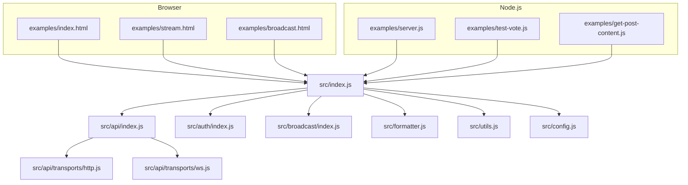

**Diagram sources**
- [src/index.js](file://src/index.js#L1-L20)
- [src/api/index.js](file://src/api/index.js#L1-L271)
- [src/api/transports/index.js](file://src/api/transports/index.js#L1-L8)
- [src/api/transports/http.js](file://src/api/transports/http.js)
- [src/api/transports/ws.js](file://src/api/transports/ws.js)
- [src/auth/index.js](file://src/auth/index.js#L1-L133)
- [src/broadcast/index.js](file://src/broadcast/index.js#L1-L137)
- [src/formatter.js](file://src/formatter.js#L1-L87)
- [src/utils.js](file://src/utils.js#L1-L348)
- [src/config.js](file://src/config.js#L1-L10)
- [examples/index.html](file://examples/index.html#L1-L23)
- [examples/stream.html](file://examples/stream.html#L1-L19)
- [examples/broadcast.html](file://examples/broadcast.html#L1-L108)
- [examples/server.js](file://examples/server.js#L1-L34)
- [examples/test-vote.js](file://examples/test-vote.js#L1-L19)
- [examples/get-post-content.js](file://examples/get-post-content.js#L1-L5)

**Section sources**
- [README.md](file://README.md#L1-L81)
- [package.json](file://package.json#L1-L84)
- [src/index.js](file://src/index.js#L1-L20)

## Core Components
- API client: Exposes generated methods from the method catalog and supports streaming operations, blocks, and transactions.
- Authentication: Derives keys from usernames and passwords, validates WIF, converts to public keys, and signs transactions.
- Broadcasting: Prepares transactions with chain metadata, signs with private keys, and broadcasts via configured transport.
- Formatter: Provides helpers for permlink generation, amount formatting, and account value estimation.
- Utilities: Account name validation, custom protocol helpers (voice*), and AES-based encoding utilities.
- Transports: HTTP and WebSocket transports selected dynamically based on configuration.
- Config: Global getter/setter for transport URLs and chain parameters.

**Section sources**
- [src/api/index.js](file://src/api/index.js#L1-L271)
- [src/api/methods.js](file://src/api/methods.js#L1-L435)
- [src/auth/index.js](file://src/auth/index.js#L1-L133)
- [src/broadcast/index.js](file://src/broadcast/index.js#L1-L137)
- [src/formatter.js](file://src/formatter.js#L1-L87)
- [src/utils.js](file://src/utils.js#L1-L348)
- [src/api/transports/index.js](file://src/api/transports/index.js#L1-L8)
- [src/config.js](file://src/config.js#L1-L10)

## Architecture Overview
The library composes a singleton API client that dynamically selects an HTTP or WebSocket transport based on configuration. Methods are generated from a method catalog and exposed on the API client. Broadcasting wraps transaction preparation, signing, and broadcasting through the API.

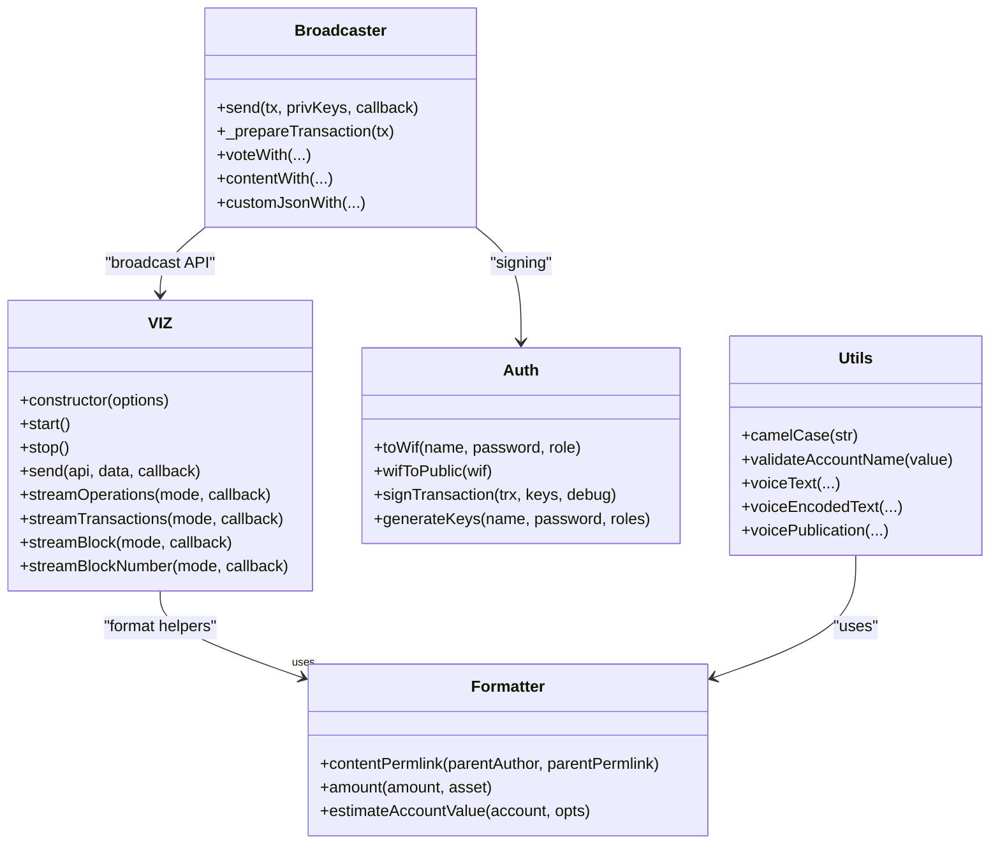

**Diagram sources**
- [src/api/index.js](file://src/api/index.js#L21-L236)
- [src/broadcast/index.js](file://src/broadcast/index.js#L16-L137)
- [src/auth/index.js](file://src/auth/index.js#L13-L133)
- [src/formatter.js](file://src/formatter.js#L4-L87)
- [src/utils.js](file://src/utils.js#L3-L47)

## Detailed Component Analysis

### Browser Setup and Basic Queries
- Load the built library from the distribution folder.
- Configure the WebSocket endpoint via configuration.
- Call API methods to fetch configuration, accounts, and counts.

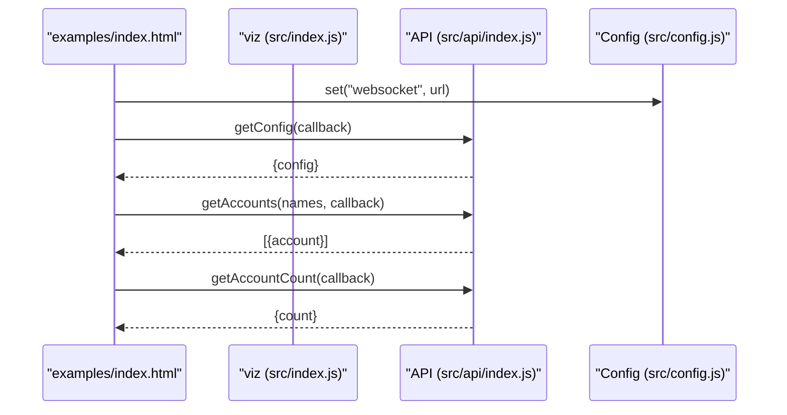

**Diagram sources**
- [examples/index.html](file://examples/index.html#L9-L20)
- [src/index.js](file://src/index.js#L1-L20)
- [src/api/index.js](file://src/api/index.js#L52-L62)
- [src/config.js](file://src/config.js#L5-L8)

**Section sources**
- [examples/index.html](file://examples/index.html#L1-L23)
- [README.md](file://README.md#L16-L25)

### Real-Time Streaming in the Browser
- Use the streaming API to receive live operations.
- The API internally manages transport selection and event emission.

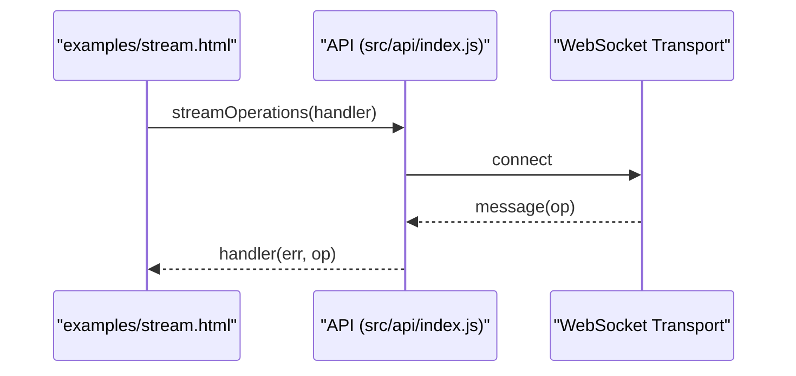

**Diagram sources**
- [examples/stream.html](file://examples/stream.html#L10-L15)
- [src/api/index.js](file://src/api/index.js#L216-L235)
- [src/api/transports/ws.js](file://src/api/transports/ws.js)

**Section sources**
- [examples/stream.html](file://examples/stream.html#L1-L19)
- [src/api/index.js](file://src/api/index.js#L121-L191)

### Voting Operations (Node.js)
- Derive a posting key from username and password.
- Broadcast a vote operation with the derived key.

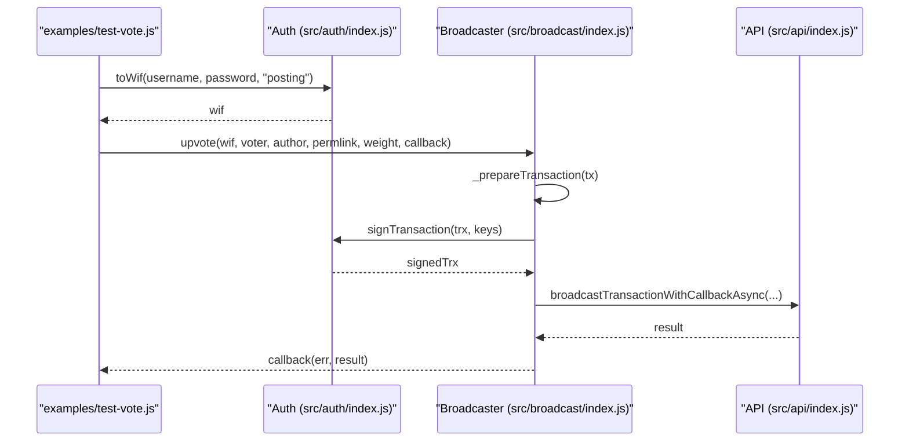

**Diagram sources**
- [examples/test-vote.js](file://examples/test-vote.js#L1-L19)
- [src/auth/index.js](file://src/auth/index.js#L81-L101)
- [src/broadcast/index.js](file://src/broadcast/index.js#L24-L47)
- [src/api/index.js](file://src/api/index.js#L34-L42)

**Section sources**
- [examples/test-vote.js](file://examples/test-vote.js#L1-L19)
- [README.md](file://README.md#L55-L64)

### Content Creation and Broadcasting (Browser)
- Demonstrate broadcasting a vote, a comment (content), a post, and follow/unfollow via custom_json.

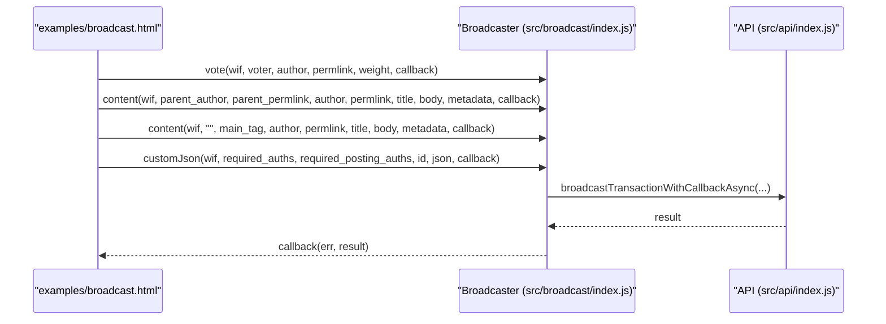

**Diagram sources**
- [examples/broadcast.html](file://examples/broadcast.html#L15-L103)
- [src/broadcast/index.js](file://src/broadcast/index.js#L97-L129)
- [src/api/index.js](file://src/api/index.js#L40-L46)

**Section sources**
- [examples/broadcast.html](file://examples/broadcast.html#L1-L108)

### Node.js Server Usage
- Use the library in a Node.js script to query account data, state, followers, following, and stream operations.

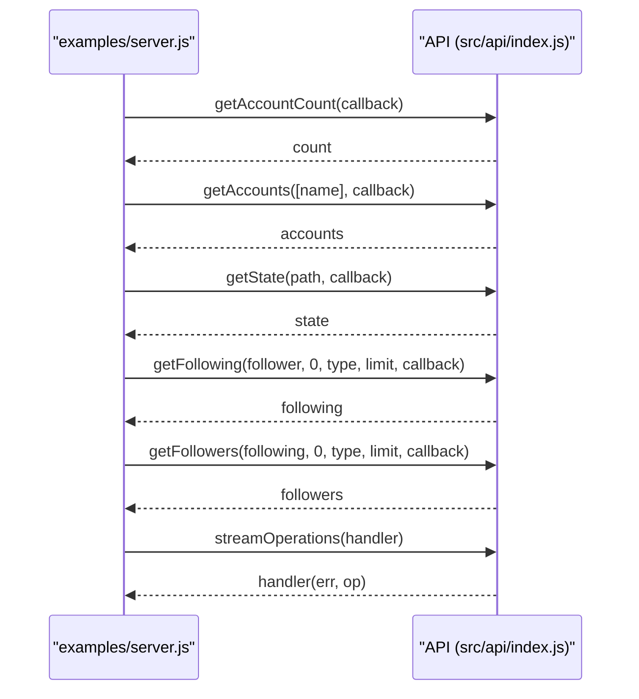

**Diagram sources**
- [examples/server.js](file://examples/server.js#L3-L33)
- [src/api/index.js](file://src/api/index.js#L216-L235)

**Section sources**
- [examples/server.js](file://examples/server.js#L1-L34)

### Getting Post Content (Node.js)
- Fetch a single post’s content using an async method.

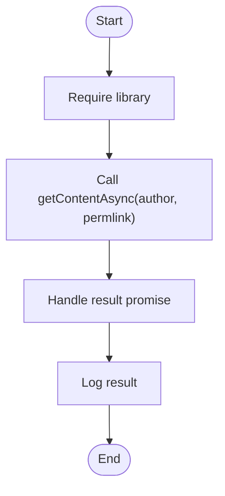

**Diagram sources**
- [examples/get-post-content.js](file://examples/get-post-content.js#L1-L5)

**Section sources**
- [examples/get-post-content.js](file://examples/get-post-content.js#L1-L5)

### Authentication and Transaction Signing
- Convert credentials to WIF, derive public keys, and sign transactions with chain-specific signing.

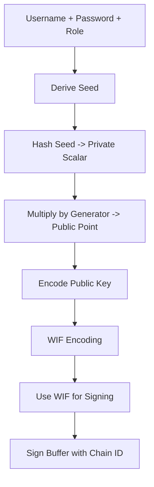

**Diagram sources**
- [src/auth/index.js](file://src/auth/index.js#L34-L101)

**Section sources**
- [src/auth/index.js](file://src/auth/index.js#L1-L133)

### Formatting Helpers
- Generate permlinks, format amounts, and estimate account value.

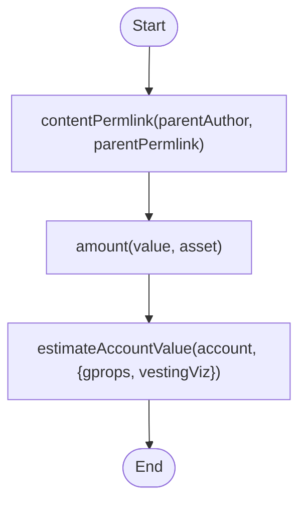

**Diagram sources**
- [src/formatter.js](file://src/formatter.js#L69-L84)

**Section sources**
- [src/formatter.js](file://src/formatter.js#L1-L87)

### Utilities and Validation
- Validate account names, and use voice* helpers for custom protocols.

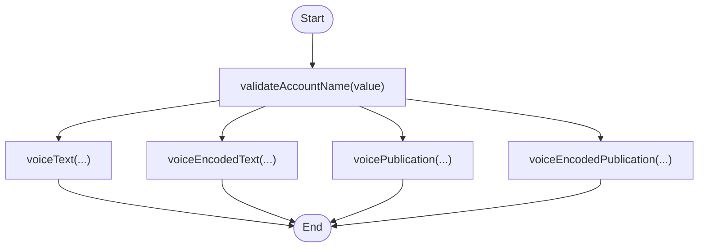

**Diagram sources**
- [src/utils.js](file://src/utils.js#L10-L47)
- [src/utils.js](file://src/utils.js#L84-L206)
- [src/utils.js](file://src/utils.js#L208-L348)

**Section sources**
- [src/utils.js](file://src/utils.js#L1-L348)

## Dependency Analysis
The library exports a central index that aggregates API, auth, broadcast, formatter, memo, AES, config, and utils. The API client depends on transports and configuration. Broadcasting depends on auth and API for signing and broadcasting.

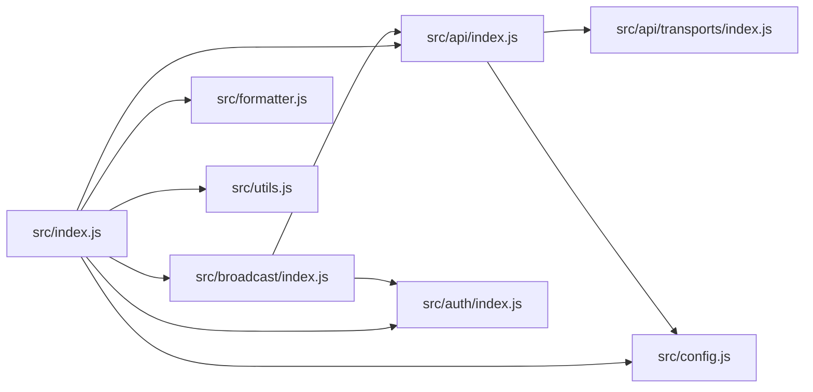

**Diagram sources**
- [src/index.js](file://src/index.js#L1-L20)
- [src/api/index.js](file://src/api/index.js#L1-L271)
- [src/api/transports/index.js](file://src/api/transports/index.js#L1-L8)
- [src/auth/index.js](file://src/auth/index.js#L1-L133)
- [src/broadcast/index.js](file://src/broadcast/index.js#L1-L137)
- [src/formatter.js](file://src/formatter.js#L1-L87)
- [src/utils.js](file://src/utils.js#L1-L348)
- [src/config.js](file://src/config.js#L1-L10)

**Section sources**
- [src/index.js](file://src/index.js#L1-L20)
- [src/api/index.js](file://src/api/index.js#L1-L271)
- [src/api/transports/index.js](file://src/api/transports/index.js#L1-L8)
- [src/auth/index.js](file://src/auth/index.js#L1-L133)
- [src/broadcast/index.js](file://src/broadcast/index.js#L1-L137)
- [src/formatter.js](file://src/formatter.js#L1-L87)
- [src/utils.js](file://src/utils.js#L1-L348)
- [src/config.js](file://src/config.js#L1-L10)

## Performance Considerations
- Prefer WebSocket transport for real-time streaming to reduce latency and overhead compared to polling.
- Batch requests where possible and avoid frequent repeated queries for the same data.
- Use streaming APIs (blocks, transactions, operations) to react to updates efficiently.
- Cache frequently accessed configuration and chain properties locally to minimize round trips.
- Minimize transaction signing overhead by preparing transactions off-band and signing only once.
- Monitor performance metrics emitted by the API client to identify slow endpoints or methods.

[No sources needed since this section provides general guidance]

## Troubleshooting Guide
- Unknown transport URL: Ensure the configured URL matches ws/wss or http/https; otherwise, an error is thrown during transport selection.
- Authentication failures: Verify the derived WIF is valid and corresponds to the account’s posting authority.
- Broadcasting errors: Inspect the error payload attached to the thrown error object for detailed information.
- Network connectivity: Confirm the configured endpoint is reachable and supports the chosen transport.
- Rate limiting: Reduce request frequency and leverage streaming for continuous updates.

**Section sources**
- [src/api/index.js](file://src/api/index.js#L34-L42)
- [src/api/index.js](file://src/api/index.js#L77-L96)
- [README.md](file://README.md#L47-L53)

## Conclusion
This guide demonstrated how to use the VIZ JavaScript library for browser and Node.js environments. You learned how to configure transports, query blockchain data, stream live operations, and broadcast transactions securely. By following the examples and best practices outlined here, you can build robust applications that interact with the VIZ blockchain effectively.

[No sources needed since this section summarizes without analyzing specific files]

## Appendices

### Quick Setup Checklist
- Install the library via npm.
- Choose a transport URL (WebSocket or HTTP) and set it in configuration.
- For Node.js, load the library from the built distribution or lib folder.
- For browsers, include the built script from the distribution folder.

**Section sources**
- [README.md](file://README.md#L11-L14)
- [README.md](file://README.md#L47-L53)
- [package.json](file://package.json#L9-L11)

### API Method Catalog Reference
- The API client generates methods from a centralized catalog. Each entry defines the API namespace, method name, and parameter names. Use the generated methods on the API client to call the blockchain.

**Section sources**
- [src/api/methods.js](file://src/api/methods.js#L1-L435)
- [src/api/index.js](file://src/api/index.js#L238-L262)