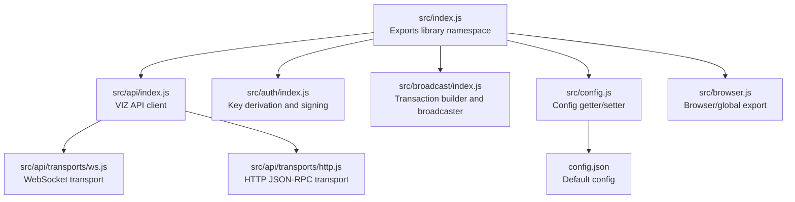
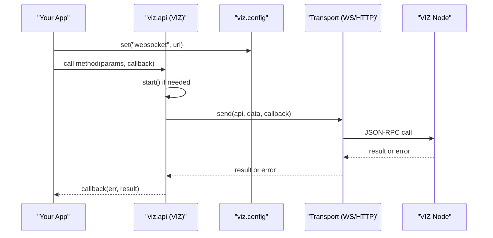
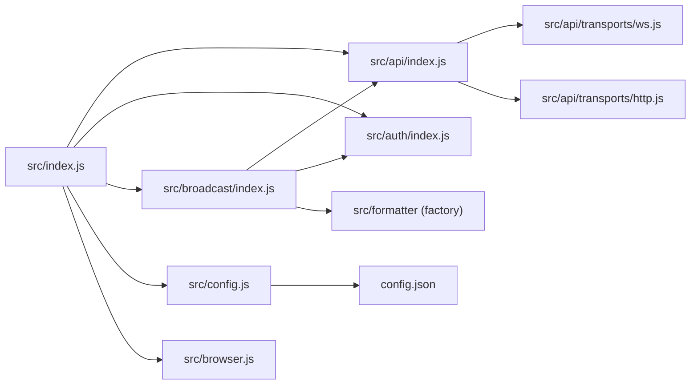

# Getting Started

<cite>
**Referenced Files in This Document**
- [README.md](file://README.md)
- [package.json](file://package.json)
- [src/index.js](file://src/index.js)
- [src/browser.js](file://src/browser.js)
- [src/config.js](file://src/config.js)
- [config.json](file://config.json)
- [src/api/index.js](file://src/api/index.js)
- [src/api/transports/ws.js](file://src/api/transports/ws.js)
- [src/api/transports/http.js](file://src/api/transports/http.js)
- [src/auth/index.js](file://src/auth/index.js)
- [src/broadcast/index.js](file://src/broadcast/index.js)
- [examples/index.html](file://examples/index.html)
- [examples/broadcast.html](file://examples/broadcast.html)
- [examples/server.js](file://examples/server.js)
- [examples/test-vote.js](file://examples/test-vote.js)
</cite>

## Table of Contents
1. [Introduction](#introduction)
2. [Project Structure](#project-structure)
3. [Core Components](#core-components)
4. [Architecture Overview](#architecture-overview)
5. [Detailed Component Analysis](#detailed-component-analysis)
6. [Dependency Analysis](#dependency-analysis)
7. [Performance Considerations](#performance-considerations)
8. [Troubleshooting Guide](#troubleshooting-guide)
9. [Conclusion](#conclusion)
10. [Appendices](#appendices)

## Introduction
This guide helps you quickly install and use the VIZ JavaScript library to connect to the VIZ blockchain, query data, and broadcast transactions. It covers:
- Installing the library via npm and using the CDN
- Basic setup for browsers and Node.js
- Initial configuration (transport selection)
- First API calls (account lookup, state queries)
- Broadcasting transactions (voting, content creation)
- Environment setup, dependency management, and troubleshooting tips

## Project Structure
At a high level, the library exposes a single namespace that groups API access, authentication, broadcasting, configuration, formatting, and utilities. The browser bundle attaches this namespace globally for easy use in HTML pages.

**Diagram sources**
- [src/index.js](file://src/index.js#L1-L20)
- [src/api/index.js](file://src/api/index.js#L1-L271)
- [src/auth/index.js](file://src/auth/index.js#L1-L133)
- [src/broadcast/index.js](file://src/broadcast/index.js#L1-L137)
- [src/config.js](file://src/config.js#L1-L10)
- [src/browser.js](file://src/browser.js#L1-L30)
- [src/api/transports/ws.js](file://src/api/transports/ws.js#L1-L136)
- [src/api/transports/http.js](file://src/api/transports/http.js#L1-L53)
- [config.json](file://config.json#L1-L7)

**Section sources**
- [src/index.js](file://src/index.js#L1-L20)
- [src/browser.js](file://src/browser.js#L1-L30)
- [src/config.js](file://src/config.js#L1-L10)
- [config.json](file://config.json#L1-L7)

## Core Components
- API client: Provides methods to query blockchain state and subscribe to streams. It supports both WebSocket and HTTP transports.
- Authentication: Derives keys, validates WIF, and signs transactions.
- Broadcast: Builds, signs, and broadcasts operations to the blockchain.
- Config: Central place to set transport URL and chain parameters.
- Formatter: Helps construct canonical permlinks and metadata for content operations.
- Browser adapter: Exposes the library globally for browser usage.

Typical usage pattern:
- Configure the transport URL
- Call API methods to fetch data
- Use authentication helpers to sign operations
- Broadcast signed transactions

**Section sources**
- [src/api/index.js](file://src/api/index.js#L21-L271)
- [src/auth/index.js](file://src/auth/index.js#L1-L133)
- [src/broadcast/index.js](file://src/broadcast/index.js#L1-L137)
- [src/config.js](file://src/config.js#L1-L10)
- [src/index.js](file://src/index.js#L1-L20)
- [src/browser.js](file://src/browser.js#L1-L30)

## Architecture Overview
The library routes API calls through a configurable transport. The default transport is selected based on the configured URL. Requests are sent to a VIZ node endpoint and responses are parsed and emitted to callbacks or promises.

**Diagram sources**
- [src/api/index.js](file://src/api/index.js#L52-L119)
- [src/api/transports/ws.js](file://src/api/transports/ws.js#L27-L94)
- [src/api/transports/http.js](file://src/api/transports/http.js#L43-L52)
- [src/config.js](file://src/config.js#L5-L8)

## Detailed Component Analysis

### Installation and Setup

- Install via npm
  - Use the package name and version declared in the repository.
  - See [Installation command](file://README.md#L11-L14).

- Use via CDN in browsers
  - The README lists CDN URLs for the minified bundle.
  - Load the script and use the global namespace in HTML.
  - See [CDN usage example](file://README.md#L16-L25) and [HTML example](file://examples/index.html#L9-L20).

- Node.js usage
  - Require the library and configure the transport URL.
  - See [Server transport examples](file://README.md#L47-L53) and [Node example](file://examples/server.js#L1-L34).

- Browser bundling
  - The library exposes a browser adapter that attaches the namespace to the global object.
  - See [Browser adapter](file://src/browser.js#L10-L29).

**Section sources**
- [README.md](file://README.md#L11-L25)
- [README.md](file://README.md#L47-L53)
- [examples/index.html](file://examples/index.html#L9-L20)
- [examples/server.js](file://examples/server.js#L1-L34)
- [src/browser.js](file://src/browser.js#L10-L29)

### Configuration and Transport Selection

- Default configuration
  - The runtime config reads defaults from a JSON file and exposes get/set.
  - See [Runtime config](file://src/config.js#L1-L10) and [Defaults](file://config.json#L1-L7).

- Selecting transport
  - The API client detects whether the URL is HTTP/HTTPS or WS/WSS and selects the appropriate transport.
  - See [Transport selection](file://src/api/index.js#L34-L42).

- WebSocket transport
  - Creates a WebSocket connection, handles open/error/close, and sends JSON-RPC messages.
  - See [WebSocket transport](file://src/api/transports/ws.js#L18-L136).

- HTTP transport
  - Sends JSON-RPC over HTTP using cross-fetch and parses RPC errors.
  - See [HTTP transport](file://src/api/transports/http.js#L43-L53).

- Example: set transport URL
  - See [Transport configuration examples](file://README.md#L47-L53).

**Section sources**
- [src/config.js](file://src/config.js#L1-L10)
- [config.json](file://config.json#L1-L7)
- [src/api/index.js](file://src/api/index.js#L34-L42)
- [src/api/transports/ws.js](file://src/api/transports/ws.js#L18-L136)
- [src/api/transports/http.js](file://src/api/transports/http.js#L43-L53)
- [README.md](file://README.md#L47-L53)

### Making Your First API Calls

- Account lookup
  - Use the accounts endpoint to fetch account details.
  - See [Account lookup example](file://README.md#L66-L71) and [Node example](file://examples/server.js#L3-L9).

- State queries
  - Retrieve state snapshots for trending or other categories.
  - See [State example](file://examples/server.js#L11-L13).

- Streams
  - Subscribe to blocks, transactions, or operations.
  - See [Stream example](file://examples/server.js#L23-L25).

- Browser usage
  - Load the CDN bundle and call API methods directly.
  - See [Browser example](file://examples/index.html#L11-L19).

**Section sources**
- [README.md](file://README.md#L66-L71)
- [examples/server.js](file://examples/server.js#L3-L13)
- [examples/server.js](file://examples/server.js#L23-L25)
- [examples/index.html](file://examples/index.html#L11-L19)

### Broadcasting Transactions

- Voting
  - Convert account credentials to a posting key (WIF), then broadcast a vote operation.
  - See [Vote example](file://README.md#L56-L64) and [Node vote example](file://examples/test-vote.js#L1-L19).

- Content operations
  - Post or edit content with proper permlink generation and metadata.
  - See [Broadcast page examples](file://examples/broadcast.html#L16-L60).

- Custom JSON
  - Follow/unfollow actions are broadcast as custom JSON operations.
  - See [Custom JSON example](file://examples/broadcast.html#L74-L103).

- Transaction signing and broadcasting
  - The broadcaster prepares transactions, signs them, and submits to the node.
  - See [Broadcast internals](file://src/broadcast/index.js#L24-L84).

- Authentication helpers
  - Derive WIF from username/password/role and validate keys.
  - See [Auth helpers](file://src/auth/index.js#L81-L101).

**Section sources**
- [README.md](file://README.md#L56-L64)
- [examples/test-vote.js](file://examples/test-vote.js#L1-L19)
- [examples/broadcast.html](file://examples/broadcast.html#L16-L103)
- [src/broadcast/index.js](file://src/broadcast/index.js#L24-L84)
- [src/auth/index.js](file://src/auth/index.js#L81-L101)

### Environment Setup and Dependencies

- Node.js
  - Install dependencies and run example scripts.
  - See [Package scripts](file://package.json#L6-L14) and [Example scripts](file://examples/server.js#L1-L34).

- Browser
  - Use the CDN bundle or build a local bundle via the provided build steps.
  - See [Build instructions](file://README.md#L26-L43) and [Browser adapter](file://src/browser.js#L10-L29).

- Transport configuration
  - Set the websocket URL to a VIZ node endpoint.
  - See [Transport configuration](file://README.md#L47-L53).

**Section sources**
- [package.json](file://package.json#L6-L14)
- [README.md](file://README.md#L26-L43)
- [README.md](file://README.md#L47-L53)
- [src/browser.js](file://src/browser.js#L10-L29)

## Dependency Analysis
The library composes several modules and transports. The API client depends on configuration and transports, while broadcasting depends on API and authentication.

**Diagram sources**
- [src/index.js](file://src/index.js#L1-L20)
- [src/api/index.js](file://src/api/index.js#L1-L271)
- [src/auth/index.js](file://src/auth/index.js#L1-L133)
- [src/broadcast/index.js](file://src/broadcast/index.js#L1-L137)
- [src/config.js](file://src/config.js#L1-L10)
- [src/browser.js](file://src/browser.js#L1-L30)
- [src/api/transports/ws.js](file://src/api/transports/ws.js#L1-L136)
- [src/api/transports/http.js](file://src/api/transports/http.js#L1-L53)
- [config.json](file://config.json#L1-L7)

**Section sources**
- [src/index.js](file://src/index.js#L1-L20)
- [src/api/index.js](file://src/api/index.js#L1-L271)
- [src/broadcast/index.js](file://src/broadcast/index.js#L1-L137)
- [src/config.js](file://src/config.js#L1-L10)

## Performance Considerations
- Prefer WebSocket transport for real-time streaming and frequent polling to reduce overhead.
- Batch operations where possible to minimize round trips.
- Use HTTP transport only when WebSocket is unavailable.
- Monitor performance events emitted by the API client for long-running requests.

[No sources needed since this section provides general guidance]

## Troubleshooting Guide
- No transport URL configured
  - Ensure the websocket URL is set before making API calls.
  - See [Transport configuration](file://README.md#L47-L53) and [Config usage](file://src/config.js#L5-L8).

- Connection errors
  - Verify the node endpoint is reachable and supports the chosen transport.
  - See [WebSocket transport lifecycle](file://src/api/transports/ws.js#L27-L62).

- Invalid response ID or RPC errors
  - HTTP transport throws structured RPC errors; inspect the error payload.
  - See [HTTP transport error handling](file://src/api/transports/http.js#L17-L41).

- Authentication failures
  - Confirm the posting WIF matches the account’s posting authority.
  - See [WIF helpers](file://src/auth/index.js#L81-L101).

- Broadcasting issues
  - Ensure transaction expiration and reference block fields are valid.
  - See [Transaction preparation](file://src/broadcast/index.js#L49-L84).

**Section sources**
- [README.md](file://README.md#L47-L53)
- [src/config.js](file://src/config.js#L5-L8)
- [src/api/transports/ws.js](file://src/api/transports/ws.js#L27-L62)
- [src/api/transports/http.js](file://src/api/transports/http.js#L17-L41)
- [src/auth/index.js](file://src/auth/index.js#L81-L101)
- [src/broadcast/index.js](file://src/broadcast/index.js#L49-L84)

## Conclusion
You are ready to integrate the VIZ JavaScript library in your project. Start by installing the library, setting the transport URL, and making your first API calls. For production, prefer secure WebSocket connections, manage credentials carefully, and use the broadcasting helpers to sign and submit transactions.

[No sources needed since this section summarizes without analyzing specific files]

## Appendices

### Quick Start Checklist
- Install the library via npm or load the CDN bundle
- Set the websocket URL to a VIZ node
- Fetch account data or state
- Authenticate and broadcast a vote or content operation
- Observe performance metrics and handle errors

**Section sources**
- [README.md](file://README.md#L11-L25)
- [README.md](file://README.md#L47-L53)
- [README.md](file://README.md#L56-L71)
- [examples/index.html](file://examples/index.html#L9-L20)
- [examples/server.js](file://examples/server.js#L1-L34)
- [examples/broadcast.html](file://examples/broadcast.html#L16-L60)