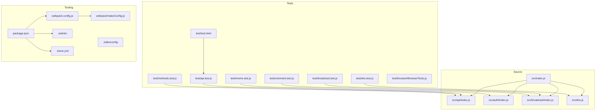
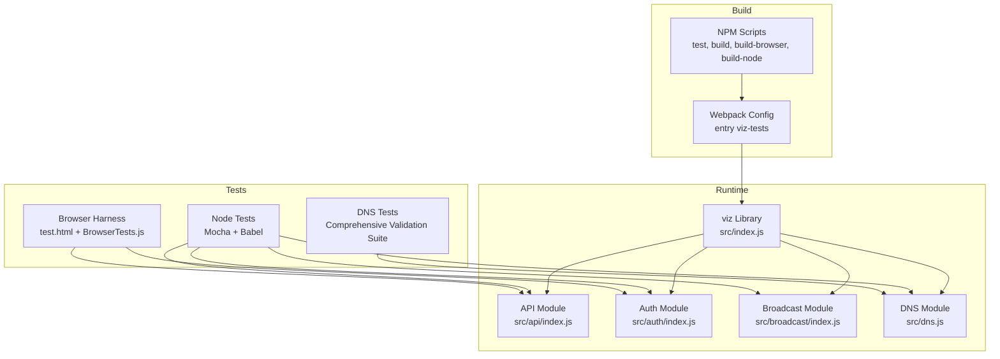
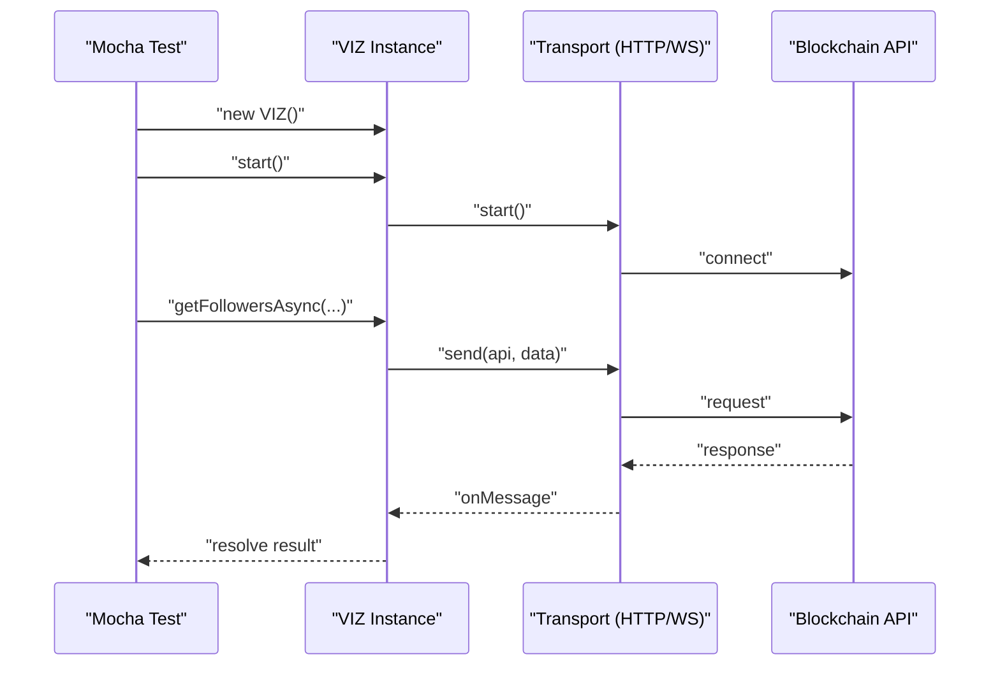
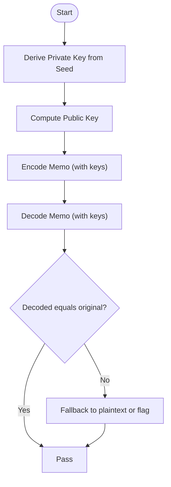
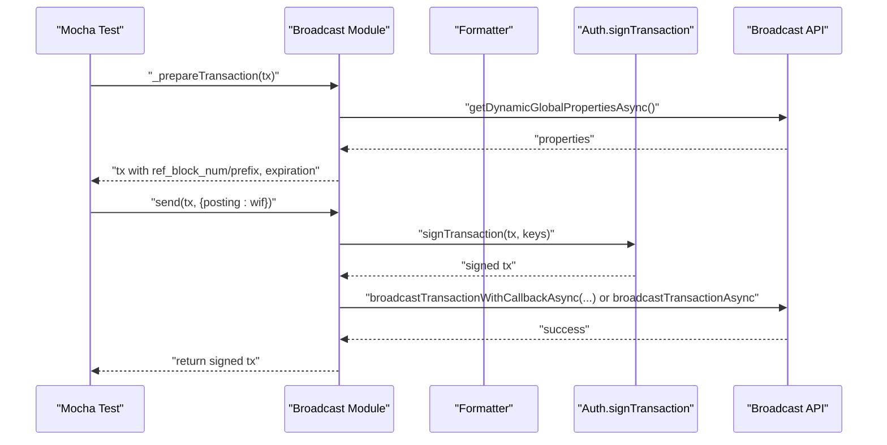
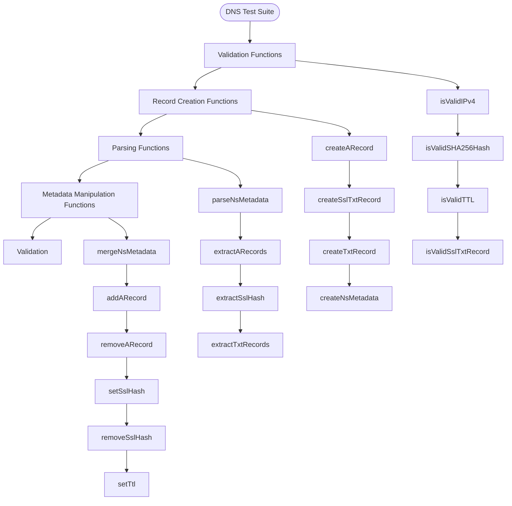
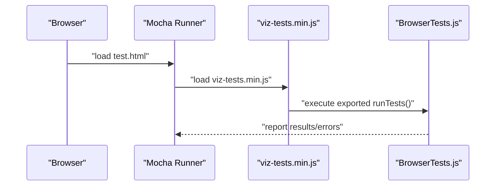
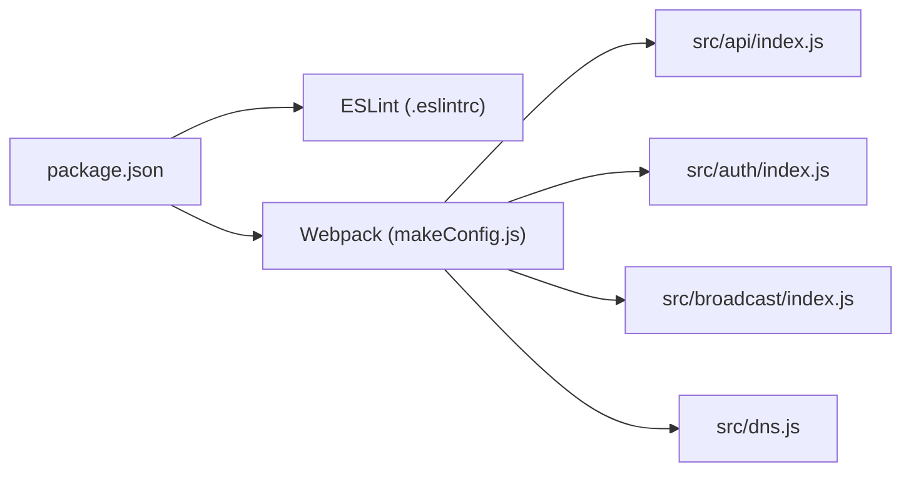

# Testing & Development

<cite>
**Referenced Files in This Document**
- [package.json](file://package.json)
- [.travis.yml](file://.travis.yml)
- [webpack.config.js](file://webpack.config.js)
- [webpack/makeConfig.js](file://webpack/makeConfig.js)
- [.eslintrc](file://.eslintrc)
- [.editorconfig](file://.editorconfig)
- [src/index.js](file://src/index.js)
- [src/api/index.js](file://src/api/index.js)
- [src/auth/index.js](file://src/auth/index.js)
- [src/broadcast/index.js](file://src/broadcast/index.js)
- [src/dns.js](file://src/dns.js)
- [test/test_helper.js](file://test/test_helper.js)
- [test/browser/BrowserTests.js](file://test/browser/BrowserTests.js)
- [test/test.html](file://test/test.html)
- [test/api.test.js](file://test/api.test.js)
- [test/broadcast.test.js](file://test/broadcast.test.js)
- [test/methods.test.js](file://test/methods.test.js)
- [test/memo.test.js](file://test/memo.test.js)
- [test/comment.test.js](file://test/comment.test.js)
- [test/dns.test.js](file://test/dns.test.js)
- [test/test-post.json](file://test/test-post.json)
</cite>

## Update Summary
**Changes Made**
- Added comprehensive DNS module testing documentation covering validation functions, record creation, parsing, metadata manipulation, and validation
- Updated Core Components section to include DNS module functionality
- Enhanced Detailed Component Analysis with DNS-specific testing procedures
- Added DNS module constants and error handling documentation
- Updated Architecture Overview to include DNS module integration

## Table of Contents
1. [Introduction](#introduction)
2. [Project Structure](#project-structure)
3. [Core Components](#core-components)
4. [Architecture Overview](#architecture-overview)
5. [Detailed Component Analysis](#detailed-component-analysis)
6. [Dependency Analysis](#dependency-analysis)
7. [Performance Considerations](#performance-considerations)
8. [Security Testing](#security-testing)
9. [Cross-Browser Compatibility Testing](#cross-browser-compatibility-testing)
10. [Development Workflow](#development-workflow)
11. [Code Quality Standards](#code-quality-standards)
12. [Contribution Guidelines](#contribution-guidelines)
13. [Troubleshooting Guide](#troubleshooting-guide)
14. [Conclusion](#conclusion)

## Introduction
This document provides comprehensive testing and development guidance for the VIZ JavaScript library. It covers the testing framework, unit test structure, browser testing procedures, continuous integration setup, and practical workflows for writing tests against API methods, authentication functions, broadcast operations, and the newly enhanced DNS module functionality. It also includes environment setup, mock data usage, debugging strategies, performance and security testing approaches, and cross-browser compatibility testing.

## Project Structure
The repository is organized around a modular JavaScript library with dedicated test suites and build tooling:
- Source code under src/ exposes the public API surface for API access, authentication, broadcasting, DNS functionality, formatters, and utilities.
- Tests under test/ cover Node.js unit tests, browser-specific tests, and HTML-based test harnesses.
- Build and packaging are handled via Webpack and NPM scripts.

**Diagram sources**
- [src/index.js](file://src/index.js#L1-L22)
- [src/api/index.js](file://src/api/index.js#L1-L271)
- [src/auth/index.js](file://src/auth/index.js#L1-L133)
- [src/broadcast/index.js](file://src/broadcast/index.js#L1-L137)
- [src/dns.js](file://src/dns.js#L1-L575)
- [test/api.test.js](file://test/api.test.js#L1-L202)
- [test/broadcast.test.js](file://test/broadcast.test.js#L1-L154)
- [test/methods.test.js](file://test/methods.test.js#L1-L23)
- [test/memo.test.js](file://test/memo.test.js#L1-L38)
- [test/comment.test.js](file://test/comment.test.js#L1-L62)
- [test/dns.test.js](file://test/dns.test.js#L1-L396)
- [test/browser/BrowserTests.js](file://test/browser/BrowserTests.js#L1-L56)
- [test/test.html](file://test/test.html#L1-L14)
- [webpack.config.js](file://webpack.config.js#L1-L3)
- [webpack/makeConfig.js](file://webpack/makeConfig.js#L1-L100)
- [package.json](file://package.json#L1-L84)
- [.travis.yml](file://.travis.yml#L1-L18)
- [.eslintrc](file://.eslintrc#L1-L27)
- [.editorconfig](file://.editorconfig#L1-L21)

**Section sources**
- [src/index.js](file://src/index.js#L1-L22)
- [webpack.config.js](file://webpack.config.js#L1-L3)
- [webpack/makeConfig.js](file://webpack/makeConfig.js#L1-L100)
- [package.json](file://package.json#L1-L84)
- [.travis.yml](file://.travis.yml#L1-L18)
- [.eslintrc](file://.eslintrc#L1-L27)
- [.editorconfig](file://.editorconfig#L1-L21)

## Core Components
- API client: Provides WebSocket/HTTP transport abstraction, streaming utilities, and generated API methods. See [src/api/index.js](file://src/api/index.js#L1-L271).
- Authentication: Handles key derivation, WIF conversion, public key validation, and transaction signing. See [src/auth/index.js](file://src/auth/index.js#L1-L133).
- Broadcast: Prepares transactions, signs them, and broadcasts to the network. See [src/broadcast/index.js](file://src/broadcast/index.js#L1-L137).
- DNS Module: Comprehensive DNS nameserver helpers for managing A and TXT records in VIZ blockchain account metadata. See [src/dns.js](file://src/dns.js#L1-L575).
- Public facade: Exposes the library's public API surface including DNS functionality. See [src/index.js](file://src/index.js#L1-L22).

Key testing coverage areas:
- API methods and reconnection behavior: [test/api.test.js](file://test/api.test.js#L1-L202)
- Broadcast operations and transaction preparation: [test/broadcast.test.js](file://test/broadcast.test.js#L1-L154), [test/comment.test.js](file://test/comment.test.js#L1-L62)
- Generated methods completeness: [test/methods.test.js](file://test/methods.test.js#L1-L23)
- Memo encryption/decryption: [test/memo.test.js](file://test/memo.test.js#L1-L38)
- DNS module functionality: [test/dns.test.js](file://test/dns.test.js#L1-L396)
- Browser crypto tests: [test/browser/BrowserTests.js](file://test/browser/BrowserTests.js#L1-L56)

**Section sources**
- [src/api/index.js](file://src/api/index.js#L1-L271)
- [src/auth/index.js](file://src/auth/index.js#L1-L133)
- [src/broadcast/index.js](file://src/broadcast/index.js#L1-L137)
- [src/dns.js](file://src/dns.js#L1-L575)
- [src/index.js](file://src/index.js#L1-L22)
- [test/api.test.js](file://test/api.test.js#L1-L202)
- [test/broadcast.test.js](file://test/broadcast.test.js#L1-L154)
- [test/methods.test.js](file://test/methods.test.js#L1-L23)
- [test/memo.test.js](file://test/memo.test.js#L1-L38)
- [test/comment.test.js](file://test/comment.test.js#L1-L62)
- [test/dns.test.js](file://test/dns.test.js#L1-L396)
- [test/browser/BrowserTests.js](file://test/browser/BrowserTests.js#L1-L56)

## Architecture Overview
The testing architecture integrates Node.js unit tests with a browser test harness. Webpack bundles the library and test suite for browser execution.

**Diagram sources**
- [package.json](file://package.json#L6-L13)
- [webpack.config.js](file://webpack.config.js#L1-L3)
- [webpack/makeConfig.js](file://webpack/makeConfig.js#L67-L89)
- [src/index.js](file://src/index.js#L1-L22)
- [src/api/index.js](file://src/api/index.js#L1-L271)
- [src/auth/index.js](file://src/auth/index.js#L1-L133)
- [src/broadcast/index.js](file://src/broadcast/index.js#L1-L137)
- [src/dns.js](file://src/dns.js#L1-L575)
- [test/test.html](file://test/test.html#L1-L14)
- [test/browser/BrowserTests.js](file://test/browser/BrowserTests.js#L1-L56)
- [test/dns.test.js](file://test/dns.test.js#L1-L396)

## Detailed Component Analysis

### API Testing
- Purpose: Validate API connectivity, method generation, streaming, and reconnection behavior.
- Key aspects:
  - Transport selection and lazy connection opening.
  - Streaming block/transaction/operation streams.
  - Reconnection logic on WebSocket close events.
  - Async method coverage and listener cleanup.

**Diagram sources**
- [test/api.test.js](file://test/api.test.js#L14-L29)
- [test/api.test.js](file://test/api.test.js#L42-L78)
- [test/api.test.js](file://test/api.test.js#L80-L166)
- [test/api.test.js](file://test/api.test.js#L168-L200)
- [src/api/index.js](file://src/api/index.js#L52-L62)
- [src/api/index.js](file://src/api/index.js#L98-L119)

**Section sources**
- [test/api.test.js](file://test/api.test.js#L1-L202)
- [src/api/index.js](file://src/api/index.js#L1-L271)

### Authentication and Memo Encryption Testing
- Purpose: Verify key derivation, WIF handling, public key parsing, and memo encryption/decryption.
- Key aspects:
  - Private/public key pair generation and WIF round-trips.
  - Memo encryption with known inputs and expected outputs.
  - Error handling for unsupported memo encryption scenarios.

**Diagram sources**
- [test/memo.test.js](file://test/memo.test.js#L6-L36)
- [src/auth/index.js](file://src/auth/index.js#L56-L101)

**Section sources**
- [test/memo.test.js](file://test/memo.test.js#L1-L38)
- [src/auth/index.js](file://src/auth/index.js#L1-L133)

### Broadcast Operations Testing
- Purpose: Validate transaction preparation, signing, and broadcasting for operations like vote, transfer, and content with beneficiaries.
- Key aspects:
  - Transaction patching with dynamic global properties.
  - Signing with posting WIF and callback/promise variants.
  - Content operations with permlink generation and metadata.

**Diagram sources**
- [test/broadcast.test.js](file://test/broadcast.test.js#L33-L52)
- [test/broadcast.test.js](file://test/broadcast.test.js#L75-L120)
- [test/comment.test.js](file://test/comment.test.js#L19-L60)
- [src/broadcast/index.js](file://src/broadcast/index.js#L49-L84)
- [src/broadcast/index.js](file://src/broadcast/index.js#L24-L47)

**Section sources**
- [test/broadcast.test.js](file://test/broadcast.test.js#L1-L154)
- [test/comment.test.js](file://test/comment.test.js#L1-L62)
- [src/broadcast/index.js](file://src/broadcast/index.js#L1-L137)

### DNS Module Testing
- Purpose: Comprehensive validation of DNS nameserver helpers for managing A and TXT records in VIZ blockchain account metadata.
- Key aspects:
  - IPv4 address validation and SHA256 hash validation.
  - Record creation functions for A records and SSL TXT records.
  - Metadata parsing and extraction utilities.
  - Metadata manipulation functions for adding/removing records.
  - Validation of NS metadata structure and error handling.

**Updated** Added comprehensive DNS module testing coverage with over 300 lines of test validation for all helper functions, edge cases, and error conditions.

**Diagram sources**
- [test/dns.test.js](file://test/dns.test.js#L8-L396)
- [src/dns.js](file://src/dns.js#L25-L575)

**Section sources**
- [test/dns.test.js](file://test/dns.test.js#L1-L396)
- [src/dns.js](file://src/dns.js#L1-L575)

### Browser Testing Procedures
- Purpose: Run browser-side crypto and encoding tests in a real browser environment.
- Setup:
  - Webpack bundles a test bundle named viz-tests.
  - The HTML harness loads Mocha and runs the test bundle.
  - Browser tests exercise ECC key generation, WIF parsing, and memo encryption/decryption.

**Diagram sources**
- [test/test.html](file://test/test.html#L1-L14)
- [webpack/makeConfig.js](file://webpack/makeConfig.js#L67-L70)
- [test/browser/BrowserTests.js](file://test/browser/BrowserTests.js#L8-L56)

**Section sources**
- [test/test.html](file://test/test.html#L1-L14)
- [webpack/makeConfig.js](file://webpack/makeConfig.js#L1-L100)
- [test/browser/BrowserTests.js](file://test/browser/BrowserTests.js#L1-L56)

## Dependency Analysis
- Test runner and transpilation:
  - Mocha is configured via NPM scripts and Babel registration.
  - ESLint enforces style and correctness rules across Node, browser, and Mocha environments.
- Build-time dependencies:
  - Webpack bundles the library and test suite; production builds enable minification and deduplication.
- Runtime dependencies:
  - Bluebird for promises, cross-fetch for HTTP transport, debug for logging, and others for cryptography and serialization.

**Diagram sources**
- [package.json](file://package.json#L56-L75)
- [.eslintrc](file://.eslintrc#L1-L27)
- [webpack/makeConfig.js](file://webpack/makeConfig.js#L1-L100)
- [src/api/index.js](file://src/api/index.js#L1-L271)
- [src/auth/index.js](file://src/auth/index.js#L1-L133)
- [src/broadcast/index.js](file://src/broadcast/index.js#L1-L137)
- [src/dns.js](file://src/dns.js#L1-L575)

**Section sources**
- [package.json](file://package.json#L1-L84)
- [.eslintrc](file://.eslintrc#L1-L27)
- [webpack/makeConfig.js](file://webpack/makeConfig.js#L1-L100)

## Performance Considerations
- Streaming APIs:
  - The API module provides streaming utilities for block number, blocks, transactions, and operations. Tests validate that streams emit expected properties and can be released cleanly.
- Transaction preparation:
  - Broadcasting prepares transactions using dynamic global properties and block references. Tests ensure the presence of required fields and signatures.
- DNS module operations:
  - DNS metadata parsing and validation operations are optimized for performance with regex-based validation and efficient array filtering.
- Recommendations:
  - Use timeouts and resource cleanup in long-running streams.
  - Batch operations where appropriate to reduce network overhead.
  - Monitor performance metrics emitted by the API client during tests.
  - Optimize DNS metadata operations by caching validated results where appropriate.

**Section sources**
- [src/api/index.js](file://src/api/index.js#L121-L235)
- [test/api.test.js](file://test/api.test.js#L80-L166)
- [src/broadcast/index.js](file://src/broadcast/index.js#L49-L84)
- [test/broadcast.test.js](file://test/broadcast.test.js#L33-L52)
- [src/dns.js](file://src/dns.js#L19-L74)
- [test/dns.test.js](file://test/dns.test.js#L1-L396)

## Security Testing
- Key handling:
  - Validate WIF validity and public key derivation.
  - Ensure memo encryption/decryption works with provided keys and falls back gracefully when unsupported.
- Transaction signing:
  - Confirm that signing produces valid signatures and that broadcast methods return signed transactions with required fields.
- DNS security validation:
  - Validate IPv4 addresses and SHA256 hashes to prevent injection attacks.
  - Ensure TXT record length validation prevents buffer overflow scenarios.
  - Test error handling for malformed DNS metadata to prevent crashes.
- Recommendations:
  - Use deterministic seeds and known-good test vectors for cryptographic routines.
  - Avoid logging secrets; mask sensitive data in test logs.
  - Prefer environment variables for credentials in integration-style tests.
  - Implement comprehensive input sanitization for DNS metadata operations.

**Section sources**
- [src/auth/index.js](file://src/auth/index.js#L65-L101)
- [test/memo.test.js](file://test/memo.test.js#L6-L36)
- [src/broadcast/index.js](file://src/broadcast/index.js#L107-L130)
- [test/broadcast.test.js](file://test/broadcast.test.js#L75-L120)
- [src/dns.js](file://src/dns.js#L19-L74)
- [test/dns.test.js](file://test/dns.test.js#L1-L396)

## Cross-Browser Compatibility Testing
- Browser harness:
  - The browser test suite executes in a real browser using the bundled viz-tests.min.js and the Mocha HTML harness.
- Practical steps:
  - Build the browser bundle and open the test page in target browsers.
  - Observe console output and error reporting from the browser test runner.
- Notes:
  - The library declares browser-specific shims in package.json to disable Node-only modules in the browser bundle.
- DNS compatibility considerations:
  - DNS module operations rely on standard JavaScript APIs and should be compatible across modern browsers.
  - Regex validation functions are supported in all major browsers.

**Section sources**
- [test/test.html](file://test/test.html#L1-L14)
- [webpack/makeConfig.js](file://webpack/makeConfig.js#L67-L70)
- [test/browser/BrowserTests.js](file://test/browser/BrowserTests.js#L1-L56)
- [package.json](file://package.json#L15-L18)
- [src/dns.js](file://src/dns.js#L19-L74)

## Development Workflow
- Local setup:
  - Install dependencies and build artifacts using NPM scripts.
  - Run unit tests with Mocha and Babel transpilation.
- Writing tests:
  - Place new tests under test/ following existing patterns.
  - Use async/await or callbacks consistently.
  - Leverage helper assertions and stubs where applicable.
  - For DNS module testing, follow the established pattern of validation, creation, parsing, and manipulation functions.
- Running subsets:
  - Use NPM script aliases to run focused test suites (e.g., auth-related tests).
  - Run DNS-specific tests using: `npm test -- --grep 'DNS Helpers'`
- Continuous integration:
  - Travis CI runs tests on multiple Node.js versions and caches dependencies.

**Section sources**
- [package.json](file://package.json#L6-L13)
- [.travis.yml](file://.travis.yml#L1-L18)

## Code Quality Standards
- Linting:
  - ESLint configuration targets ES6 modules, Node, browser, and Mocha environments with warnings for unused variables and unreachable code.
- Formatting:
  - EditorConfig enforces consistent indentation and line endings.
- Style expectations:
  - Prefer const/let, avoid unreachable code, and follow module boundaries.
- DNS module standards:
  - Comprehensive test coverage with validation functions, error handling, and edge case testing.
  - Consistent error message formatting and validation patterns.

**Section sources**
- [.eslintrc](file://.eslintrc#L1-L27)
- [.editorconfig](file://.editorconfig#L1-L21)

## Contribution Guidelines
- Testing requirements:
  - Add unit tests for new features and bug fixes.
  - Include browser tests for crypto-related functionality.
  - For DNS module contributions, ensure comprehensive test coverage following the established pattern.
- Pull requests:
  - Ensure tests pass locally and in CI.
  - Keep diffs minimal and focused.
  - Include DNS module tests for any DNS-related functionality changes.
- Documentation:
  - Update inline documentation and examples where relevant.
  - Add test coverage for new DNS module functions following the existing test structure.

## Troubleshooting Guide
- Test environment setup:
  - Ensure Node.js and dependencies are installed.
  - Use NPM scripts to run tests; verify Mocha and Babel are available.
- Mock data usage:
  - Utilize provided fixtures (e.g., test-post.json) to validate API responses.
  - For DNS testing, use the established test patterns and validation scenarios.
- Debugging test failures:
  - Enable debug logging in the API client to inspect request/response timing and errors.
  - Inspect browser test console for stack traces and error messages.
  - Stub transports selectively to simulate network conditions in unit tests.
- DNS-specific debugging:
  - Use the comprehensive validation functions to identify specific failure points.
  - Test individual DNS helper functions in isolation to pinpoint issues.
  - Leverage the extensive error messages in DNS validation functions.

**Section sources**
- [test/test_helper.js](file://test/test_helper.js#L1-L19)
- [test/test-post.json](file://test/test-post.json#L1-L14)
- [src/api/index.js](file://src/api/index.js#L12-L15)
- [test/browser/BrowserTests.js](file://test/browser/BrowserTests.js#L10-L22)
- [test/dns.test.js](file://test/dns.test.js#L1-L396)

## Conclusion
This guide consolidates testing and development practices for the VIZ JavaScript library, now enhanced with comprehensive DNS module testing. By leveraging the existing Mocha-based Node tests, browser harness, and Webpack build pipeline, contributors can confidently add new features, fix bugs, and maintain high-quality code. The addition of over 300 lines of DNS module test coverage ensures robust validation of all helper functions, edge cases, and error conditions. Adhering to linting standards, using mock data, following the outlined workflows, and maintaining comprehensive test coverage ensures reliable and secure integrations with the VIZ blockchain and DNS functionality.