# Utilities & Helpers

<cite>
**Referenced Files in This Document**
- [src/index.js](file://src/index.js)
- [src/browser.js](file://src/browser.js)
- [src/config.js](file://src/config.js)
- [config.json](file://config.json)
- [src/utils.js](file://src/utils.js)
- [src/broadcast/helpers.js](file://src/broadcast/helpers.js)
- [src/formatter.js](file://src/formatter.js)
- [src/dns.js](file://src/dns.js)
- [src/auth/serializer/src/number_utils.js](file://src/auth/serializer/src/number_utils.js)
- [src/auth/ecc/src/key_utils.js](file://src/auth/ecc/src/key_utils.js)
- [src/auth/ecc/src/address.js](file://src/auth/ecc/src/address.js)
- [test/number_utils.js](file://test/number_utils.js)
- [test/Crypto.js](file://test/Crypto.js)
- [test/dns.test.js](file://test/dns.test.js)
- [examples/get-post-content.js](file://examples/get-post-content.js)
</cite>

## Update Summary
**Changes Made**
- Added comprehensive DNS Nameserver module documentation covering validation, record creation, parsing, and metadata manipulation
- Updated project structure to include DNS module integration
- Enhanced core components section to reflect new decentralized domain name resolution capabilities
- Added practical DNS usage examples and integration patterns
- Updated browser export to include DNS module for browser environments

## Table of Contents
1. [Introduction](#introduction)
2. [Project Structure](#project-structure)
3. [Core Components](#core-components)
4. [Architecture Overview](#architecture-overview)
5. [Detailed Component Analysis](#detailed-component-analysis)
6. [DNS Nameserver Module](#dns-nameserver-module)
7. [Dependency Analysis](#dependency-analysis)
8. [Performance Considerations](#performance-considerations)
9. [Troubleshooting Guide](#troubleshooting-guide)
10. [Conclusion](#conclusion)
11. [Appendices](#appendices)

## Introduction
This document describes the utility functions and helper modules in the VIZ JavaScript library with a focus on:
- Formatting utilities for currency display, numeric conversions, and string processing
- Configuration management and environment detection
- Browser compatibility helpers
- **New**: DNS Nameserver module for decentralized domain name resolution
- Practical usage patterns, performance tips, and cross-platform considerations
- Guidelines for extending utilities consistently across Node.js and browser environments

## Project Structure
The utilities and helpers are organized under the src directory and integrated via module exports and environment-aware entry points. The primary modules covered here are:
- Configuration and environment exposure
- Numeric formatting and currency helpers
- String processing and content helpers
- Broadcast helpers for authority management
- Number utilities for implied decimals
- Cryptographic key utilities and address helpers
- **New**: DNS Nameserver module for decentralized domain resolution

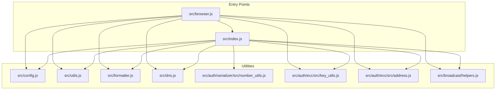

**Diagram sources**
- [src/index.js](file://src/index.js#L1-L22)
- [src/browser.js](file://src/browser.js#L1-L30)
- [src/config.js](file://src/config.js#L1-L10)
- [src/utils.js](file://src/utils.js#L1-L348)
- [src/formatter.js](file://src/formatter.js#L1-L87)
- [src/dns.js](file://src/dns.js#L1-L575)
- [src/auth/serializer/src/number_utils.js](file://src/auth/serializer/src/number_utils.js#L1-L54)
- [src/auth/ecc/src/key_utils.js](file://src/auth/ecc/src/key_utils.js#L1-L89)
- [src/auth/ecc/src/address.js](file://src/auth/ecc/src/address.js#L1-L57)
- [src/broadcast/helpers.js](file://src/broadcast/helpers.js#L1-L82)

**Section sources**
- [src/index.js](file://src/index.js#L1-L22)
- [src/browser.js](file://src/browser.js#L1-L30)

## Core Components
- Configuration management: centralized getters/setters backed by a JSON configuration file
- Environment detection and globals: exposes a unified viz object in both browser and Node.js contexts
- Formatting utilities: currency-like formatting, numeric estimations, suggested passwords, and content permlinks
- Numeric utilities: conversion between implied decimals and formatted strings
- String processing: camelCase conversion and validation helpers
- Broadcast helpers: account authority management helpers
- Cryptographic helpers: entropy collection, random key generation, and address encoding/decoding
- **New**: DNS Nameserver helpers: validation functions, record creation, parsing, and metadata manipulation for decentralized domain resolution

**Section sources**
- [src/config.js](file://src/config.js#L1-L10)
- [config.json](file://config.json#L1-L7)
- [src/browser.js](file://src/browser.js#L1-L30)
- [src/formatter.js](file://src/formatter.js#L1-L87)
- [src/auth/serializer/src/number_utils.js](file://src/auth/serializer/src/number_utils.js#L1-L54)
- [src/utils.js](file://src/utils.js#L1-L348)
- [src/broadcast/helpers.js](file://src/broadcast/helpers.js#L1-L82)
- [src/auth/ecc/src/key_utils.js](file://src/auth/ecc/src/key_utils.js#L1-L89)
- [src/auth/ecc/src/address.js](file://src/auth/ecc/src/address.js#L1-L57)
- [src/dns.js](file://src/dns.js#L1-L575)

## Architecture Overview
The library exposes a cohesive API surface through two entry points:
- Node.js: src/index.js exports the entire suite including the new DNS module
- Browser: src/browser.js wraps the Node exports and attaches to window/global

Formatting utilities are provided by a factory that receives the API client, enabling dynamic property retrieval and estimation functions. Numeric and cryptographic utilities are standalone modules designed for reuse across modules. The DNS module integrates seamlessly with the existing architecture for decentralized domain name resolution.

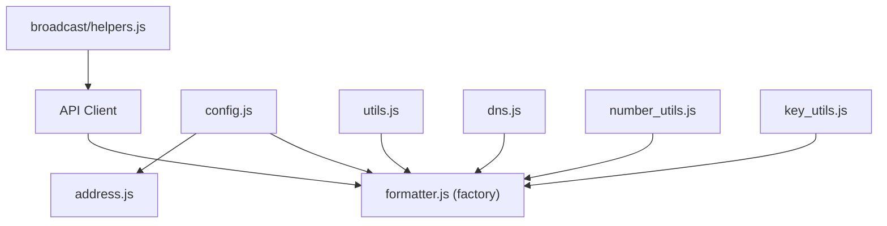

**Diagram sources**
- [src/formatter.js](file://src/formatter.js#L1-L87)
- [src/config.js](file://src/config.js#L1-L10)
- [src/auth/serializer/src/number_utils.js](file://src/auth/serializer/src/number_utils.js#L1-L54)
- [src/auth/ecc/src/key_utils.js](file://src/auth/ecc/src/key_utils.js#L1-L89)
- [src/auth/ecc/src/address.js](file://src/auth/ecc/src/address.js#L1-L57)
- [src/broadcast/helpers.js](file://src/broadcast/helpers.js#L1-L82)
- [src/dns.js](file://src/dns.js#L1-L575)

## Detailed Component Analysis

### Configuration Management
- Purpose: centralize runtime configuration with simple get/set accessors
- Behavior: loads defaults from config.json and exposes functions to retrieve or update values
- Usage pattern: import config and call get(key) or set(key, value)

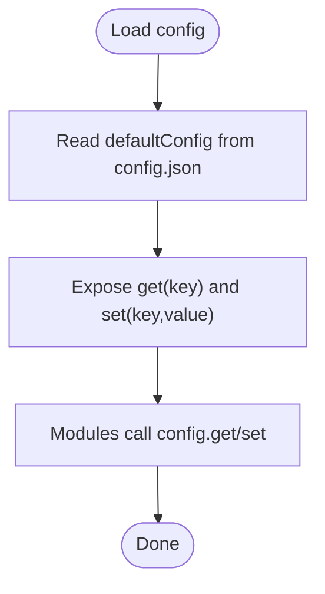

**Diagram sources**
- [src/config.js](file://src/config.js#L1-L10)
- [config.json](file://config.json#L1-L7)

**Section sources**
- [src/config.js](file://src/config.js#L1-L10)
- [config.json](file://config.json#L1-L7)

### Environment Detection and Global Exposure
- Purpose: ensure the library is usable in both browser and Node.js
- Behavior: creates a viz object containing all modules and attaches it to window/global when available
- Cross-platform: guards typeof window and typeof global to avoid errors in non-browser/non-node environments
- **Updated**: Now includes DNS module in browser exports

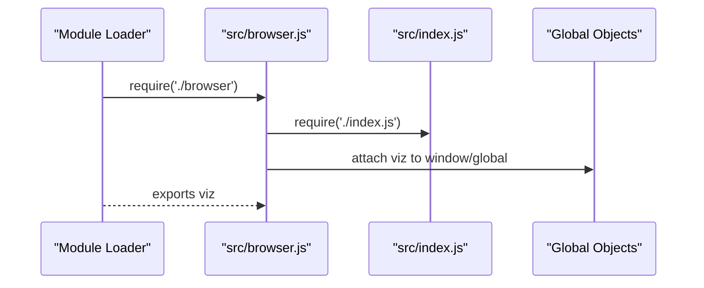

**Diagram sources**
- [src/browser.js](file://src/browser.js#L1-L30)
- [src/index.js](file://src/index.js#L1-L22)

**Section sources**
- [src/browser.js](file://src/browser.js#L1-L30)
- [src/index.js](file://src/index.js#L1-L22)

### Formatting Utilities (Currency, Numbers, Strings)
- Currency-like formatting: adds thousands separators to numeric strings
- Numeric estimations: computes account value using vesting shares and global props
- Password suggestion: generates a random WIF-derived password
- Content permlink generation: builds deterministic permlinks with timestamps
- Amount formatting: appends asset suffix to amounts
- String processing: camelCase conversion and account name validation

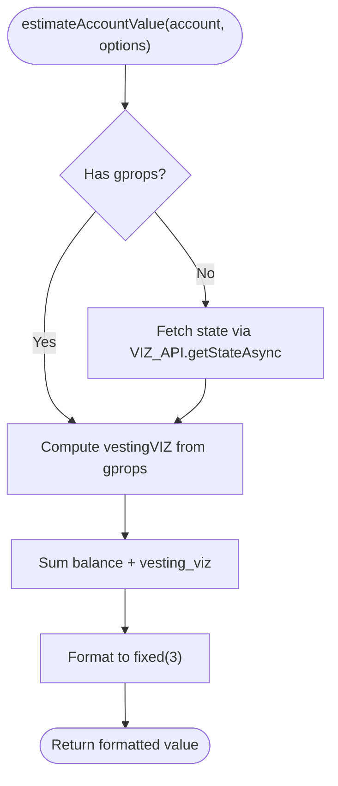

**Diagram sources**
- [src/formatter.js](file://src/formatter.js#L19-L49)

**Section sources**
- [src/formatter.js](file://src/formatter.js#L1-L87)
- [src/utils.js](file://src/utils.js#L10-L47)

### Numeric Utilities (Implied Decimals)
- Purpose: convert between human-readable numbers and implied-decimal strings for asset precision
- Functions: toImpliedDecimal(number, precision), fromImpliedDecimal(number, precision)
- Validation: strict assertions for overflow, invalid formats, and precision limits

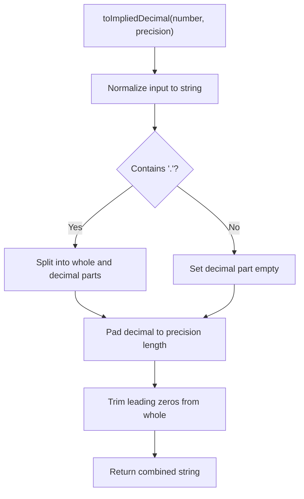

**Diagram sources**
- [src/auth/serializer/src/number_utils.js](file://src/auth/serializer/src/number_utils.js#L10-L35)

**Section sources**
- [src/auth/serializer/src/number_utils.js](file://src/auth/serializer/src/number_utils.js#L1-L54)
- [test/number_utils.js](file://test/number_utils.js#L1-L29)

### String Processing and Validation
- camelCase conversion: transforms snake_case identifiers to camelCase
- Account name validation: enforces naming rules for segmented account names

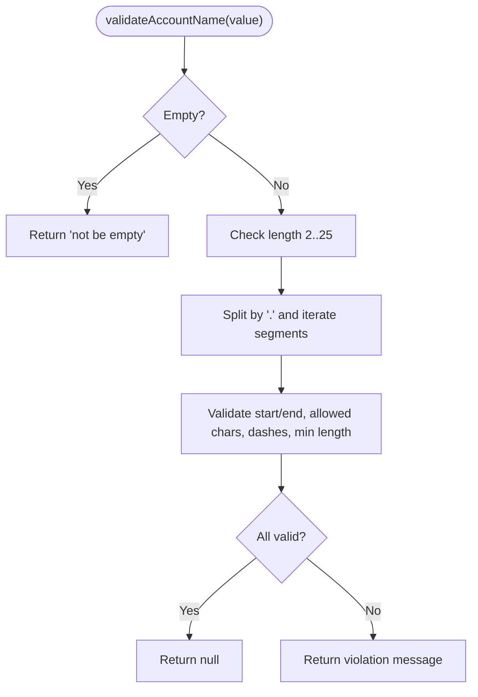

**Diagram sources**
- [src/utils.js](file://src/utils.js#L10-L47)

**Section sources**
- [src/utils.js](file://src/utils.js#L1-L8)

### Broadcast Helpers (Authority Management)
- Purpose: add/remove authorized accounts to a user's authority structures
- Behavior: fetch account, update account_auths, and issue account_update transaction via broadcaster

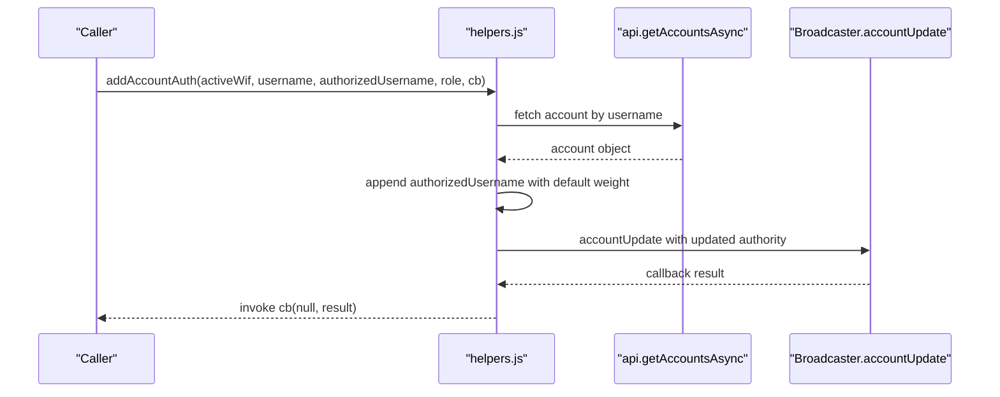

**Diagram sources**
- [src/broadcast/helpers.js](file://src/broadcast/helpers.js#L6-L41)

**Section sources**
- [src/broadcast/helpers.js](file://src/broadcast/helpers.js#L1-L82)

### Cryptographic Helpers (Entropy, Keys, Addresses)
- Entropy and randomness: collects browser entropy, hashes buffers, and produces 32-byte random keys
- Address encoding/decoding: validates prefixes, decodes base58, and verifies checksums

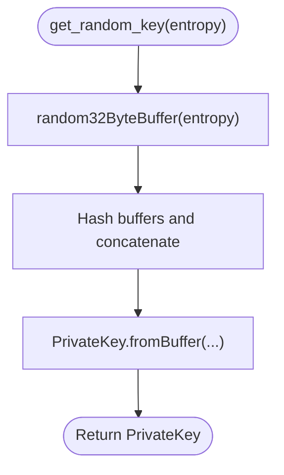

**Diagram sources**
- [src/auth/ecc/src/key_utils.js](file://src/auth/ecc/src/key_utils.js#L29-L55)

**Section sources**
- [src/auth/ecc/src/key_utils.js](file://src/auth/ecc/src/key_utils.js#L1-L89)
- [src/auth/ecc/src/address.js](file://src/auth/ecc/src/address.js#L1-L57)

### Voice Utilities (Content Publishing)
- Purpose: helpers for publishing text, encoded text, publications, and related operations
- Features: previous sequence handling, optional reply/share, optional beneficiaries, passphrase-based encryption
- Notes: integrates with API and broadcast modules to submit custom operations

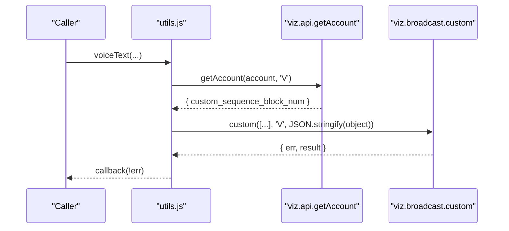

**Diagram sources**
- [src/utils.js](file://src/utils.js#L84-L127)

**Section sources**
- [src/utils.js](file://src/utils.js#L49-L206)

## DNS Nameserver Module

**New Section**: The VIZ DNS Nameserver module provides comprehensive support for decentralized domain name resolution on the VIZ blockchain. It enables storing and managing DNS records (A and TXT) within account metadata, facilitating human-readable domain names for blockchain applications.

### Core Functionality
The DNS module offers four main categories of functionality:

#### Validation Functions
- `isValidIPv4(ipv4)`: Validates IPv4 address format using regex pattern matching
- `isValidSHA256Hash(hash)`: Validates SHA256 hexadecimal hash strings (exactly 64 hex characters)
- `isValidTTL(ttl)`: Validates time-to-live values (positive integers)
- `isValidTxtRecord(txt)`: Validates TXT record values (1-256 characters)
- `isValidSslTxtRecord(txt)`: Specialized validator for SSL certificate hash records

#### Record Creation Functions
- `createARecord(ipv4)`: Creates A record tuples for IPv4 address resolution
- `createSslTxtRecord(hash)`: Creates SSL certificate hash TXT records
- `createTxtRecord(value)`: Creates generic TXT record tuples
- `createNsMetadata(options)`: Creates complete NS metadata objects with TTL support

#### Parsing and Extraction Functions
- `parseNsMetadata(jsonMetadata)`: Parses NS metadata from JSON strings or objects
- `extractARecords(jsonMetadata)`: Extracts all IPv4 addresses from NS records
- `extractSslHash(jsonMetadata)`: Extracts SSL certificate hash from TXT records
- `extractTxtRecords(jsonMetadata)`: Extracts all TXT record values
- `extractTtl(jsonMetadata)`: Extracts TTL value with default fallback
- `getNsSummary(jsonMetadata)`: Provides comprehensive record summary
- `hasNsRecords(jsonMetadata)`: Checks for presence of NS records

#### Metadata Manipulation Functions
- `mergeNsMetadata(existingMetadata, nsData)`: Merges NS data into existing metadata
- `removeNsMetadata(existingMetadata)`: Removes NS data from metadata
- `addARecord(jsonMetadata, ipv4)`: Adds A record to existing metadata
- `removeARecord(jsonMetadata, ipv4)`: Removes specific A record
- `setSslHash(jsonMetadata, hash)`: Sets or updates SSL hash
- `removeSslHash(jsonMetadata)`: Removes SSL hash record
- `setTtl(jsonMetadata, ttl)`: Updates TTL value
- `validateNsMetadata(nsData)`: Comprehensive metadata validation

### Constants and Configuration
The module defines several important constants:
- `DEFAULT_TTL`: 28800 seconds (8 hours) default TTL
- `MAX_TXT_LENGTH`: 256 character limit for TXT records
- `SHA256_HEX_LENGTH`: 64 character length for SHA256 hashes

### Usage Examples

#### Creating DNS Records
```javascript
const viz = require('viz-js-lib');

// Create A records for domain resolution
const nsMetadata = viz.dns.createNsMetadata({
  aRecords: ['188.120.231.153', '192.168.1.100'],
  sslHash: '4a4613daef37cbc5c4a5156cd7b24ea2e6ee2e5f1e7461262a2df2b63cbf17e2',
  ttl: 28800
});

// Parse existing metadata
const parsed = viz.dns.parseNsMetadata(account.json_metadata);
const aRecords = viz.dns.extractARecords(parsed);
const sslHash = viz.dns.extractSslHash(parsed);
```

#### Validating DNS Data
```javascript
// Validate individual components
const isValidIP = viz.dns.isValidIPv4('188.120.231.153');
const isValidSSL = viz.dns.isValidSslTxtRecord('ssl=4a4613daef37cbc5c4a5156cd7b24ea2e6ee2e5f1e7461262a2df2b63cbf17e2');
const isValidTTL = viz.dns.isValidTTL(28800);

// Validate complete metadata structure
const validation = viz.dns.validateNsMetadata(nsMetadata);
```

#### Managing DNS Metadata
```javascript
// Add A record to existing metadata
const updatedMetadata = viz.dns.addARecord(existingMetadata, '10.0.0.1');

// Set SSL hash
const sslMetadata = viz.dns.setSslHash(updatedMetadata, 'new_hash_value');

// Remove SSL hash
const cleanMetadata = viz.dns.removeSslHash(sslMetadata);

// Update TTL
const ttlUpdated = viz.dns.setTtl(cleanMetadata, 3600);
```

### Integration with VIZ Blockchain
The DNS module integrates seamlessly with VIZ blockchain operations:
- Stores DNS records in account `json_metadata` field
- Uses NS (Nameserver) record format compatible with VIZ standards
- Supports TTL (Time-To-Live) for record expiration
- Enables SSL certificate hash verification for secure connections
- Provides backward compatibility with existing account metadata

**Section sources**
- [src/dns.js](file://src/dns.js#L1-L575)
- [test/dns.test.js](file://test/dns.test.js#L1-L396)

## Dependency Analysis
Utilities depend on configuration, API clients, and cryptographic primitives. The formatter module depends on the API client to fetch global properties for estimations. The broadcast helpers depend on the API to retrieve account data and on the broadcaster to submit transactions. The DNS module operates independently but integrates with the existing module ecosystem.

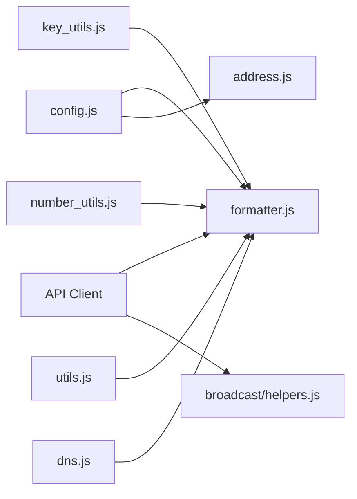

**Diagram sources**
- [src/config.js](file://src/config.js#L1-L10)
- [src/formatter.js](file://src/formatter.js#L1-L87)
- [src/auth/serializer/src/number_utils.js](file://src/auth/serializer/src/number_utils.js#L1-L54)
- [src/auth/ecc/src/key_utils.js](file://src/auth/ecc/src/key_utils.js#L1-L89)
- [src/auth/ecc/src/address.js](file://src/auth/ecc/src/address.js#L1-L57)
- [src/broadcast/helpers.js](file://src/broadcast/helpers.js#L1-L82)
- [src/utils.js](file://src/utils.js#L1-L348)
- [src/dns.js](file://src/dns.js#L1-L575)

**Section sources**
- [src/formatter.js](file://src/formatter.js#L1-L87)
- [src/broadcast/helpers.js](file://src/broadcast/helpers.js#L1-L82)
- [src/utils.js](file://src/utils.js#L1-L348)
- [src/dns.js](file://src/dns.js#L1-L575)

## Performance Considerations
- Prefer precomputed or cached global properties when estimating account values to reduce API calls
- Avoid repeated JSON parsing/stringification in tight loops; reuse parsed objects where possible
- Use toImpliedDecimal/fromImpliedDecimal for precise asset arithmetic to prevent floating-point drift
- Minimize DOM-dependent entropy gathering in headless environments; fallback to hashing in Node.js
- Batch broadcast operations when adding/removing multiple authorities to reduce network overhead
- **New**: Cache DNS validation results for frequently accessed domains to improve performance
- **New**: Use TTL values strategically to balance freshness with reduced metadata updates

## Troubleshooting Guide
- Configuration not applied: verify config.json exists and config.get/set are invoked after module load
- Formatting errors: ensure numeric inputs are strings or numbers within safe integer bounds before conversion
- Authority updates failing: confirm account exists, authority structure is valid, and weights are set appropriately
- Entropy issues: ensure sufficient browser entropy is available; fallback hashing occurs automatically
- Address validation failures: check prefix matches configured address_prefix and checksum verification passes
- **New**: DNS validation failures: verify IPv4 addresses match regex pattern, SHA256 hashes are exactly 64 hex characters, and TTL values are positive integers
- **New**: Metadata parsing errors: ensure JSON metadata is properly formatted and contains required `ns` array and `ttl` fields
- **New**: SSL hash validation: remember that SSL hashes are automatically lowercased when created

**Section sources**
- [src/config.js](file://src/config.js#L1-L10)
- [src/auth/serializer/src/number_utils.js](file://src/auth/serializer/src/number_utils.js#L1-L54)
- [src/broadcast/helpers.js](file://src/broadcast/helpers.js#L1-L82)
- [src/auth/ecc/src/key_utils.js](file://src/auth/ecc/src/key_utils.js#L66-L86)
- [src/auth/ecc/src/address.js](file://src/auth/ecc/src/address.js#L19-L30)
- [src/dns.js](file://src/dns.js#L1-L575)

## Conclusion
The VIZ JavaScript library provides a robust set of utilities spanning configuration, formatting, numeric precision, string processing, broadcasting, cryptography, and now decentralized domain name resolution. The new DNS Nameserver module enhances the library's capabilities for blockchain-based applications requiring human-readable domain names. These modules are designed for cross-platform use and integrate cleanly with the API and broadcast layers. Following the patterns and guidelines outlined here ensures consistent behavior and maintainability across environments.

## Appendices

### Practical Examples and Integration Patterns
- Using formatter utilities:
  - Estimate account value: call the estimation function with an account object and optional global properties
  - Generate a suggested password: use the password creation utility for secure, WIF-derived credentials
  - Format amounts: append asset suffixes and apply thousand separators for display
- Numeric conversions:
  - Convert amounts to implied decimals before broadcasting operations
  - Convert back to human-readable form for display
- String processing:
  - Normalize identifiers using camelCase conversion
  - Validate account names before registration or delegation
- Broadcasting authority changes:
  - Use helper functions to add or remove authorized accounts safely
- Environment usage:
  - In Node.js, require the main index module
  - In browsers, include the browser entry to expose the viz object globally
- **New**: DNS Nameserver usage:
  - Create DNS metadata for account registration: use `createNsMetadata()` with A records and optional SSL hash
  - Validate DNS data before submission: use validation functions for IP addresses, hashes, and TTL values
  - Parse existing DNS records: use `parseNsMetadata()` to extract A records and SSL hashes from account metadata
  - Manage DNS metadata: use manipulation functions to add, remove, or update DNS records
  - Integrate with blockchain operations: store DNS metadata in account `json_metadata` field for decentralized domain resolution

**Section sources**
- [src/formatter.js](file://src/formatter.js#L19-L85)
- [src/auth/serializer/src/number_utils.js](file://src/auth/serializer/src/number_utils.js#L10-L53)
- [src/utils.js](file://src/utils.js#L10-L127)
- [src/broadcast/helpers.js](file://src/broadcast/helpers.js#L6-L81)
- [src/index.js](file://src/index.js#L1-L22)
- [src/browser.js](file://src/browser.js#L1-L30)
- [src/dns.js](file://src/dns.js#L1-L575)
- [examples/get-post-content.js](file://examples/get-post-content.js#L1-L5)